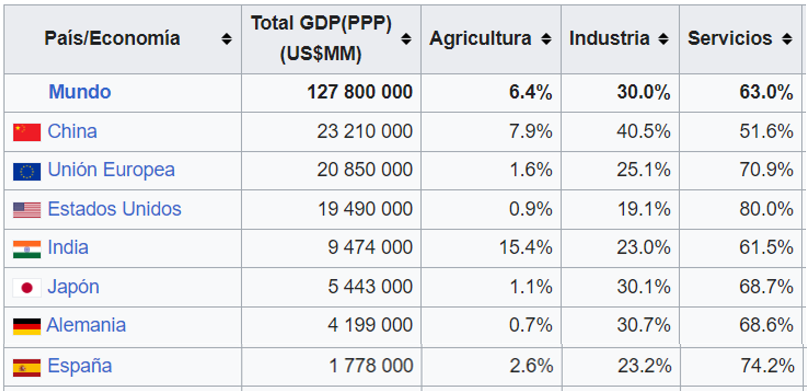
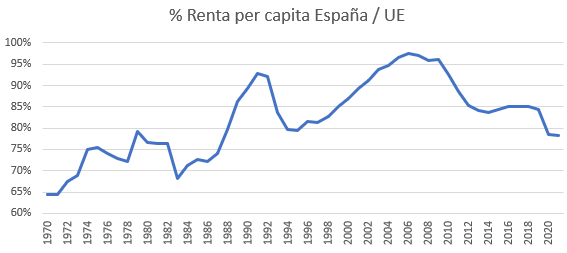
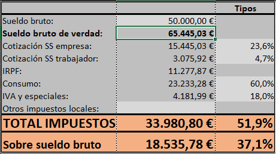
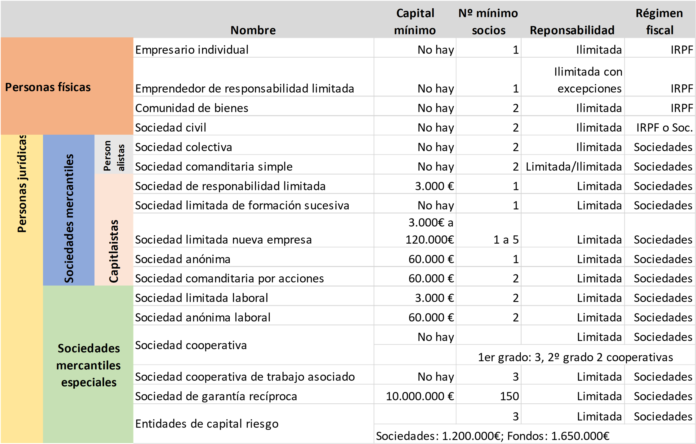

# Introducción {#sec-intro}


<!-- ::: columns -->
<!-- ::: {.column width="10%"} -->
<!-- ::: -->
<!-- ::: {.column width="80%"} -->
<!--  -->
<!-- ::: -->
<!-- ::: {.column width="10%"} -->
<!-- ::: -->
<!-- ::: -->


Todos los capítulos de este libro versan sobre una disciplina dentro de las ciencias sociales que llamamos **economía**. Como puede esperarse, se trata de una vastísima área de conocimiento que se divide en múltiples ramas y sub-ramas. 

En este capítulo vamos a proceder de lo general a lo concreto de forma que empezaremos por definiciones de un conjunto de conceptos básicos. Muchos de ellos resultarán familiares incluso a los lectores más alejados de la disciplina económica.

Otra tarea importante es definir qué entendemos por economía, así como ver su extensión y naturaleza como disciplina científica.

En el aspecto más concreto, también trataremos ciertos temas relacionados con el empresario y la empresa, los tipos que hay y los criterios para clasificarlas. Acabaremos mostrando las características generales del parque empresarial español en la actualidad.

## Definiciones previas

Es conveniente comenzar definiendo adecuadamente una serie de conceptos básicos que estarán presentes en el resto del libro. Podría haber muchos más, obviamente, pero nos vamos a ceñir a los más importantes.

Un **agente económico** es toda persona física o jurídica que participa en algún tipo de actividad económica. Los principales son:

-   **Familias** (u hogares) son aquellos agentes privados que consumen bienes y servicios y ofrecen factores de producción.
-   **Empresas**, son aquellas entidades que producen bienes y servicios y consumen factores de producción con el fin de generar beneficios. Para que una organización se considere empresa tiene que tener ánimo de lucro. El **Empresario** es la persona física que dirige y gestiona una empresa con la finalidad de generar valor privado y/o social. Normalmente, los autónomos (que son personas físicas) también se consideran empresas.
-   **Sector público** es el conjunto de organismos e instituciones gestionados directa o indirectamente por el **Estado**. En España tienen múltiples niveles:
    -   Administración central, constituida mayormente por el Estado.
    -   Comunidades Autónomas, que son los organismos regionales.
    -   Corporaciones locales, entre los que se encuentran las diputaciones, ayuntamientos y cabildos.
    -   En paralelo con todos los anteriores se encuentra la Seguridad Social, que abarca a todo el territorio nacional.

Los objetos sobre los que los agentes van a tomar decisiones en la economía son:

-   **Bienes** económicos son entidades físicas que reportan utilidad a quienes las usan o las consumen, tienen valor económico y se valoran en unidades monetarias. Los bienes libres son aquellos que no tienen valor económico.
-   **Servicios** son las actividades o bienes inmateriales que satisfacen necesidades de quienes los consumen.
-   **Factores de producción** son bienes o servicios que no se destinan al consumo final sino a la producción de otros bienes o servicios. Tradicionalmente se dividen en tres grandes grupos:
    -   **Recursos naturales**: son todos los recursos que ofrece la naturaleza y no son producidos por el hombre. Tierras, minas, agua, fuentes de energía renovables y no renovables, etc.
    -   **Trabajo**: intervención del ser humano en los procesos de producción. Se considera que tiene tanto una dimensión *objetiva*, es como un factor de producción más que se intercambia por una remuneración, como *subjetiva*, es el ser humano el que lo realiza y esto hace que sea un factor muy singular. La singularidad radica en la dignidad del ser humano en comparación con los demás seres vivos o inertes.
    -   **Capital**: son todos los bienes físicos que sirven para producir otros bienes y no son recursos naturales. Por lo general, son bienes producidos por el ser humano. Maquinaria, edificios y demás construcciones, herramientas, etc.

::: callout-tip
## Más factores de producción

Estos tres grupos de factores son los que se han considerado tradicionalmente. Algunos economistas incluyen la **tecnología** y/o la **capacidad empresarial** como factores de producción adicionales, aunque podrían quedar englobados en el capital o en el trabajo, respectivamente.
:::

::: callout-important
## Importante

A menudo se considera la cantidad de recursos naturales como una medida de la riqueza de un país. Sin duda que contribuye a ello. Pero, demasiado a menudo resulta que países con menos recursos naturales disfrutan de niveles de desarrollo y bienestar muy por encima. Esto se debe a que se aprovechan de forma mucho más eficiente los demás factores de producción.
:::

Actividades económicas genéricas son:

-   **Producir**: elaborar bienes o proveer servicios mediante la combinación de factores de producción en un proceso de producción.
-   **Distribuir**: hacer llegar al mercado objetivo los bienes y servicios producidos. Normalmente lo realizan empresas en las que no hay un proceso de producción o transformación específico.
-   **Consumir**: usar, disfrutar o servirse de bienes o servicios económicos. En el proceso el bien deja de existir.
-   **Ahorrar**: guardar una parte de los ingresos corrientes absteniéndose de utilizarlos para el consumo. Un sistema financiero desarrollado perimitirá que dicho ahorro o una parte se materialice como inversión.
-   **Invertir**: renunciar a consumo presente por la esperanza de un consumo mayor futuro. Toda inversión conlleva una **rentabilidad**, es decir, se espera que lo que conseguimos en el futuro sea mayor que lo que dispone en la actualidad, si no raramente se renunciaría a consumo presente. La inversión también comporta un **riesgo**, es decir, la posibilidad de perder en lugar de ganar o de que la rentabilidad sea negativa.

Para una mejor comprensión de las actividades económicas, a menudo se dividen por **sectores** económicos:

-   El **sector primario** se refiere a las actividades agrícolas, ganaderas, pesqueras, mineras y la silvicultura.
-   El **sector secundario** comprende la industria y la construcción, que se caracterizan por la transformación de materias primas mediante procesos de producción.
-   El **sector terciario** genera servicios para satisfacer las necesidades de la población. comprende las actividades de transporte, distribución, turismo, entretenimiento, finanzas, etc.

::: callout-tip
## Más sectores

Más recientemente hay autores que han incorporado a la clasificación el **sector cuaternario** relacionado con las actividades de la economía del conocimiento, e incluso **quinario**, pero ambos se pueden englobar en el sector de los servicios.
:::

La importancia de cada sector en la economía global suele ser un indicador del desarrollo de los países. Un país es más desarrollado cuanto menor cantidad de recursos se concentra en el sector primario en favor, sobre todo, del sector servicios. La @fig-porPIB muestra los porcentajes de los sectores sobre el total del PIB para algunos países.

[{#fig-porPIB}](https://es.wikipedia.org/wiki/Anexo:Pa%C3%ADses_por_PIB_seg%C3%BAn_composici%C3%B3n_del_sector){target="_blank"}

Hay otros dos conceptos relacionados con todo lo anterior que es necesario tener claros y saber diferenciar desde el principio. A menudo se utilizan como sinónimos, pero son radicalmente diferentes:

-   **Riqueza** o **patrimonio** es el conjunto de bienes materiales o inmateriales que posee una persona física o jurídica o un colectivo. Normalmente se poseen a largo plazo y suelen producir alguna utilidad a quien los posee. Dicha utilidad puede ser en forma de de rendimiento económico o no. Ejemplos típicos son los inmuebles, vehículos, muebles, máquinas, herramientas, objetos de arte, joyas, dinero ahorrado, activos financieros (acciones, bonos, fondos de inversión, ...), deudas que nos deben (privada o pública), etc. 

-   **Renta**: son todos los ingresos corrientes de cualquier naturaleza que recibe una persona física o jurídica. A menudo se reciben periódicamente y son la remuneración de elementos del patrimonio o de factores de producción. Ejemplos: salarios, alquileres, intereses, incrementos patrimoniales, becas, ingresos por ventas, participación en los beneficios de empresas (dividendos), etc.

::: callout-important
## Riqueza no es dinero

A menudo se confunde la riqueza con la renta utilizándolos como sinónimos. Pero tampoco se debe confundir riqueza con dinero, cosa que sucede a menudo en el lenguaje habitual. El dinero nace solo como un medio de cambio, la riqueza está constituida por todos los bienes propiedad de personas físicas o jurídicas. La confusión puede venir porque una parte de la riqueza sí es dinero líquido, al ser el dinero además depósito de valor. Cualquier lector puede ver que si la riqueza fuera dinero, aquella se podría incrementando arbitrariamente imprimiendo billetes, cosa que resulta engañoso a todas luces.
:::

::: callout-tip
## Renta per capita

La renta per capita es la renta de un país dividida por el número de habitantes. Se trata de una renta media que podrían obtener todos los habitantes con un reparto absolutamente igualitario de la renta. Es una medida útil para realizar comparaciones internacionales, sobre todo si se hace con países similares en sus características. Por ejemplo, en la @fig-perCAP se muestra el porcentaje de la renta per capita española frente a la media de la Unión Europea. Se puede ver cómo estamos sistemáticamente por debajo de la media y se acusan algunos periodos de fuerte acercamiento a Europa, a la vez que las crisis nos alejan de ella. Así pasa en la crisis a partir de 1992, de 2008 y la pandemia del COVID. Desde 2008 las economías sufrieron una crisis financiera que no se había visto en mucho tiempo, con quiebras de empresas gigantescas y países. Sin embargo, parece que a la media de la UE les ha ido mejor. Pulsando en la imagen puedes obtener más información sobre la renta per capita de distintos países.

[{#fig-perCAP}](https://data.worldbank.org/indicator/NY.GDP.PCAP.CD?locations=ES){target="_blank"}
:::

Los **impuestos** son la participación de forma coactiva y legal del sector público en la renta y riqueza de los agentes económicos. Es un privilegio que se reservan los estados del que ningún otro agente económico puede disfrutar. Pueden ser de dos tipos:

-   **Directos**: gravan las manifestaciones directas de renta y riqueza y se se calculan como un porcentaje (tipo impositivo) sobre el monto total de dicha renta y riqueza (base imponible). Los principales en España son el Impuesto sobre la Renta de las Personas Físicas (IRPF), Impuesto de Sociedades, Impuesto sobre la renta de no residentes, Impuesto de Sucesiones y Donaciones, el Impuesto sobre el Patrimonio, Impuesto sobre Bienes Inmuebles (IBI), Impuesto sobre Actividades Económicas (IAE), Impuesto sobre el Incremento del Valor de los Terrenos (o plusvalías). Las **cotizaciones sociales** no reciben el estatus de impuesto directo, pero en la práctica muchos economistas lo consideran un impuesto sobre el trabajo.
-   **Indirectos**: gravan las manifestaciones indirectas de renta y riqueza (el consumo) y se suelen calcular como un porcentaje del precio de venta de los artículos gravados. Los principales son el Impuesto sobre el Valor Añadido (IVA), Impuesto sobre Transmisiones Patrimoniales y Actos Jurídicos Documentados, Impuestos sobre Vehículos de Tracción Mecánica, impuestos especiales (hidrocarburos, electricidad, alcohol, tabaco, ecológicos, etc.).

La **renta disponible** es la renta que tienen los agentes para gastar como consideren oportuno (también la pueden ahorrar o invertir) una vez que se han deducido los impuestos directos y las cotizaciones sociales y se ha añadido las subvenciones recibidas. Las **subvenciones** son recursos recibidos de alguna administración pública. No faltan economistas que reclaman que se deduzcan igualmente los impuestos indirectos. El problema aquí estriba en que la cuantía que cada agente paga por impuestos indirectos depende de su consumo, por lo que su determinación es complicada.

::: callout-tip
## Ingresos y gastos del estado español

[En este enlace](https://dondevanmisimpuestos.es/politicas#view=income&year=2022){target="_blank"} puedes ver la distribución de ingresos y gastos del Estado y las Comunidades Autónomas (CCAA) en España para un conjunto de años.

Es necesario ser cautelosos con las cifras, especialmente en aquellos gastos referidos a competencias transferidas a las CCAA (típicamente educación, sanidad, justicia, etc.), porque si se quiere saber el gasto total en esas partidas hay que sumar los gastos de todas las administraciones ([aquí está el gasto de las CCAA](https://dondevanmisimpuestos.es/ccaa/#year=2021){target="_blank"}).
:::

::: callout-tip
## Doble imposición

La doble imposición se produce cuando se grava el mismo hecho imponible varias veces en el mismo periodo de tiempo. Al margen de esta consideración y, aunque técnicamente no sea doble imposición, tiene que tenerse en cuenta que las rentas a menudo se gravan varias veces por distintos impuestos. Aquí van algunos ejemplos:

- El IVA y todos los demás impuestos indirectos gravan el consumo de los hogares, que se paga con la renta disponible de quitar las cotizaciones sociales del empresario y las del trabajador (si son rentas del trabajo), y de los impuestos sobre la renta. 
- Algunos bienes, como todos los sujetos a impuestos especiales están gravados además por el IVA.
- El impuesto sobre el patrimonio o sobre circulación de vehículos, etc. gravan todos los años el mismo hecho imponible.
- Los beneficios de las empresas están gravados por el impuesto sobre la renta. Parte del resultado neto se distribuye a los propietarios, por el que a su vez tendrán que pagar impuesto sobre la renta.

En la @fig-calculadora se muestra el volumen total de impuestos que aproximadamente pagaría un trabajador por cuenta ajena que ingresara 50.000€ al año. Si se tiene en cuenta las contribuciones a la Seguridad Social que paga la empresa y el trabajador, además del impuesto sobre la renta, IVA y demás impuestos, resulta que este trabajador pagaría un 50,1\% de su renta bruta (considerando que las cotizaciones sociales de la empresa son del trabajador) o un 34,7\% sobre el sueldo bruto que se considera habitualmente.

[{#fig-calculadora}]()

```{r echo=FALSE}
xfun::embed_file('calculadoraWEB.xlsx', text = "Puedes hacer simulaciones con distinto nivel de ingresos descargándote esta calculadora.")
```

En el siguiente vídeo tienes una explicación más exhaustiva y algunos ejemplos.

::: columns
::: {.column width="10%"}
:::
::: {.column width="80%"}

:::
::: {.column width="10%"}
:::
:::

<!-- En la siguiente libro Excel tienes una calculadora de impuestos para ver cuántos impuestos pagan las personas físicas y jurídicas realmente en España. -->
<!-- ```{r echo=FALSE} -->
<!-- knitr::include_url('https://docs.google.com/spreadsheets/d/1_H84W1TcplPBqM4Ei4sAzEslEGw1_-5gkWQMO2-UIww/edit?usp=sharing') -->
<!-- ``` -->
:::

Otros conceptos muy importantes que hay que diferenciar desde el principio son los siguientes:

-   **Ingreso** es la ganancia que se recibe por la venta de un bien o servicio. No implica necesariamente una entrada de dinero en caja. El **cobro** de hecho es la entrada de dinero en caja. El ingreso y el cobro no tienen por qué coincidir en el tiempo.
-   **Gasto** es la pérdida que se produce por la compra de bienes o servicios corrientes. No implica necesariamente una salida de dinero en caja. El **pago** de hecho es la salida de dinero en caja. El gasto y el pago no tienen por qué coincidir en el tiempo.
-   La **Inversión** ya se ha descrito anteriormente, pero es conveniente diferenciarla de los gastos, puesto que la inversión supone desembolsos importantes, generalmente a largo plazo, con la finalidad de obtener algún rendimiento futuro o incrementar la capacidad productiva de una empresa.

::: callout-important
## importante
La inversión incrementa la riqueza o patrimonio de quien invierte. Los ingresos y gastos modifican la renta del agente que incurre en ellos.
:::

## La economía como disciplina

Existe una definición clásica de **economía** que ha resistido el paso del tiempo con una gran aceptación y que se la debemos a Lionel Robbins. En 1932 la definía como *la ciencia que estudia la asignación óptima de los recursos escasos de una sociedad a fines alternativos*.

Hay varios elementos importantes en esta definición:

1.  El primero es la **escasez**. Para que un problema sea económico tiene que haber escasez. No tiene sentido preguntarse sobre cómo distribuir el aire que respiramos, puesto que parece que es infinito (se suele decir que es un **bien libre**). La distribución de ese aire sería crucial solo en algún tipo de situación extrema en la que el aire es realmente escaso. 
<!-- Por ejemplo en caso de emergencia en los aviones recomiendan poner primero las mascarillas de oxígeno a uno mismo y después ayudar a los demás. De esta forma nos aseguramos de que realmente podemos ayudar a los demás y no nos convertimos nosotros mismos en un problema. -->

2.  El segundo elemento es la **asignación**, que pretenderá ser **eficiente**. Evidentemente, cuando un bien es escaso, es decir, no se puede producir en la cantidad suficiente que todos conjuntamente desearíamos, se impone una decisión de cómo distribuirlo (simplificando, puesto que también habría que producirlo). La asignación eficiente de recursos se puede definir de muchas formas, pero una un tanto minimalista muy utilizada es la debida a Vilfredo Pareto, por el que se considera que dicha asignación es eficiente cuando no sea posible mejorar a un agente sin perjudicar a otro.

Es importante entender que la escasez no tiene nada que ver con la pobreza y nunca estará resuelto por el progreso económico. Se trata de un problema intrínseco a la naturaleza humana y la noción de economía, y que simplemente significa que las necesidades (entendidas en sentido amplio) son inmensamente superiores a los recursos que hay disponibles para satisfacerlos.

::: callout-tip
## Economía y altruismo

Algunos autores suelen advertir que en esta definición no se diferencia entre necesidades reales como fines u objetivos, y deseos. Las necesidades son aquellas a las que no podemos renunciar, pero los deseos son prescindibles. De forma que dan a entender que la economía entendida de este modo incitaría a asociar la felicidad con consumir más y más. Sin embargo, la definición no tiene nada que ver con esto, como lo demuestra el siguiente ejemplo: la persona menos consumista o más altruista del mundo también tiene este problema de asignación, puesto que tendría que decidir cuánto de sus recursos destina al consumo y cuánto a, por ejemplo, donar a ONGs, e incluso de la parte que destina al altruismo cómo divide entre las distintas ONGs que pueden acoger sus donaciones.
:::

::: callout-tip
## Las matemáticas y la economía

La definición de Robbins es muy cómoda, puesto que tiene una precisión que huele a matemáticas y más en concreto a problemas de optimización puros y duros. De hecho hay ramas dentro de la economía que están altamente matematizadas. Sin embargo, para algunos economistas este enfoque matemático lo llegan a calificar de aberrante y desde luego profundamente erróneo. Nos referimos a que la definición considera que los recursos y los fines están dados, mientras que para algunos economistas no es así, además de que tales fines y medios son difícilmente observables y los datos relevantes para el decisor están modificándose constantemente. Es por esto que estos economistas aportan una definición más imprecisa, pero más ajustada a la realidad (según ellos), que la definirían como *una teoría del comportamiento o de la acción humana*.
:::

### Las ramas de la economía

La economía, como toda disciplina, se divide en ramas o subdisciplinas. Tal subdivisión se puede ver de muchas formas, pero en este libro nos interesa dividirla inicialmente en dos ramas inconmensurables: **economía general** (relacionada con los grados de Economía) y **economía de la empresa** (grados de Administración de Empresas o ADE).

Cada una de estas ramas tiene a su vez un sinfín de sub-ramas. Por ejemplo, sin ánimo de ser exhaustivos, se podrían dividir como se indica en la @tbl-tab1.

```{r tbl-tab1, echo=FALSE}
#| tbl-cap: Ramas de la economía.

table1 = cbind(c("Teoría Económica", "Economía Pública", "Estructura económica",
                 "Historia económica", "Economía Internacional", "Economía cuantitativa",
                 "Economía institucional", "etc."), 
               c("Contabilidad", "Finanzas", "Marketing", "Logística", "Producción", 
                 "Recursos Humanos", "Estrategia", "etc."))
colnames(table1) = c("Economía general", "Economía de la empresa")
knitr::kable(
  head(table1, 8),
  booktabs = TRUE,
  align = "ll",
)
```

Esta división es parcial y muchos autores la harían de otra forma. Las divisiones, como no podía ser de otra forma, no se acaban aquí, puesto que cada especialista de cada una de esas subdisciplinas verían un sinfín de ramificaciones adicionales y no acabaríamos nunca. De momento solo nos interesa una de estas subdivisiones que es dentro de la teoría económica distinguir entre microeconomía y macroeconomía.

La **microeconomía** estudia el comportamiento económico de agentes individuales, mercados aislados o un conjunto amplio de mercados, pero siempre haciendo hincapié en la variables *micro*, especialmente precios y cantidades. Es decir, nos interesa lo que sucede dentro de cada mercado y con cada bien, servicio o factor de producción.

La **macroeconomía** estudia el comportamiento económico de una economía en su conjunto y su interacción con otras con las que está relacionada, sin importar lo que sucede con agentes individuales y sobre la base de variables *macro*, es decir, agregadas. Estas variables son, por ejemplo, el nivel de producción, el empleo, nivel general de precios, déficit público, etc.

Estas disquisiciones nos van a ser útiles en el futuro, para situarnos bien en el espectro de disciplinas, puesto que esta sección junto con los capítulos del 2 a 4 son una introducción a la microeconomía (sobre todo, aunque también aparecen algunas cuestiones de economía de la empresa), mientras que todos los demás, incluyendo este, se inscriben en la economía de la empresa. Queda patente con esto que este libro acaba necesariamente siendo una introducción muy breve a lo que es la economía. Pero abre a la vez un inmenso campo en el que cualquier estudiante interesado puede dedicar el resto de sus días.

### El coste de oportunidad y otras consideraciones clave sobre la economía

Ligado a la definición de economía se encuentra el concepto de **coste de oportunidad**. Se puede definir como valor de la mejor opción no realizada. Es un concepto muy útil para valorar todo aquello que *a priori* no tiene un precio o es muy difícil de valorar en términos monetarios.

Esta definición tiene una carga subjetiva muy grande, puesto que los costes de oportunidad pueden cambiar mucho de un agente a otro. Por ejemplo, asistir a la final de una competición deportiva puede ser un auténtico suplicio para algunas personas, para los que tendrá un coste muy grande, pero será siempre la opción preferida para otras personas, para las cuales el coste de oportunidad será muy pequeño o nulo. En general, ante una situación en la que los agentes se ven abocados a elegir, actuarán minimizando el coste de oportunidad. En el ejemplo, el forofo del deporte asistirá a la competición, mientras que el resto optará por otra opción.

:::{.callout-tip}
## ¿Cuál es el coste de oportunidad de estudiar el grado que has elegido?

::: columns
::: {.column width="10%"}
:::
::: {.column width="80%"}

:::
::: {.column width="10%"}
:::
:::

:::

La utilidad, sin embargo, de este concepto radica en que se pueda eliminar el contenido subjetivo de alguna forma y valorar en unidades monetarias. Por ejemplo, ante varias inversiones excluyentes posibles, el coste de oportunidad de cualquiera de ellas es el valor de la mejor alternativa. Es importante hacer notar que este cálculo puede ser muy complicado, puesto que está envuelto en la incertidumbre del futuro (como veremos en el [Capítulo -@sec-chap6]). No obstante, por complicado que sea, siempre merece la pena realizar una evaluación, porque puede haber sorpresas.

Otro aspecto importante de esta noción es que a menudo se plantean determinadas opciones como las únicas posibles y se alaban todas las bondades sin considerar alternativas. Esto sucede hoy en día en muchos aspectos muy importantes de la economía, como es la selección de fuentes de energía contraponiéndolas al medio ambiente, inversiones públicas alternativas en sanidad, educación, infraestructuras, etc. Solo se habla de una de las opciones y se presentan como un falso dilema en el que la única alternativa tiene un coste de oportunidad infinito, cuando en la realidad nunca es así.

::: callout-tip
## La paradoja de los cristales rotos

Fue enunciada por Frédéric Bastiat. Consiste en que un niño rompe un cristal de una zapatería, tras lo cual se acumulan curiosos ante los lamentos del zapatero. Pero de repente hay una persona (siempre hay listillos) que dice que no hay que lamentarse tanto, puesto que al reparar el cristal el zapatero va a dar trabajo al cristalero y lo que gane se lo gastarán en otros bienes de consumo generando más trabajo y más consumo en otros sectores. Es decir, el gasto inicial del zapatero va a tener un efecto multiplicador en la economía.

¿Estás de acuerdo? ¿Hay algo más que decir?
:::

La economía es una **ciencia social** cuyo objeto de estudio es el comportamiento o la acción humana individual o en relación con los demás agentes. Las ciencias sociales estudian aspectos del comportamiento humano, mientras que las ciencias naturales, empíricas o experimentales estudian el mundo material en algunas de sus facetas. Es evidente que las leyes que gobiernan la materia son más estables a lo largo del tiempo que las leyes que gobiernan el comportamiento económico de los seres humanos. Podríamos decir que los *electrones de la economía* son los seres humanos, ¿cómo sería la física si los electrones tuvieran sentimientos, razón, voluntad, pudieran equivocarse, arrepentirse, ser inconsistentes...?

Otra noción importante es que todas las afirmaciones en la economía se hacen bajo la cláusula **ceteris paribus**, que en latín quiere decir **todo lo demás constante**. En realidad, se trata de una cláusula que está implícita en los razonamientos de cualquier tipo, pero que los economistas se han esforzado por hacer explícito para eliminar equívocos. Está relacionado con el hecho de querer hacer de la economía una disciplina lo más cercana a las ciencias empíricas, donde es posible realizan experimentos de laboratorio.

Un problema de la economía es que no es posible hacer experimentos, al menos tan rigurosos como se hacen en las ciencias empíricas *duras* en laboratorios, como puede ser la física o la química. Un experimento consiste en estudiar la relación de causalidad de unas variables sobre otras. Pero para poder llegar a conclusiones inequívocas, el experimento tiene que estar muy bien diseñado, con el fin de eliminar el efecto de todas las variables adicionales que no son objeto de estudio, manteniéndolas constantes en valores que se consideren adecuados. Por definición un experimento siempre se hace *ceteris paribus*. Es evidente que muchos de tales experimentos tendrán que situar a determinados agentes en un contexto experimental aséptico, que es totalmente ajeno al que se encuentran en la realidad, de forma que las decisiones en tales condiciones serán diferentes a las que expresen en los contextos reales en los que se desenvuelve la actividad económica.

Ha habido experiencias históricas, no experimentos en sentido estricto, que sí cumplen con las condiciones que se exigen a los experimentos de las ciencias duras. Es el caso, por ejemplo, de la división de Alemania después de la II Guerra Mundial en una parte occidental en la que se continuó con un sistema capitalista de producción y una parte oriental de economía socialista. Se trataba de la misma población, con la misma cultura, historia, etc. que se dividió de la noche a la mañana en dos naciones con sistemas radicalmente diferentes con un horizonte temporal infinito. El experimento concluyó con la caída del Muro de Berlín en 1989 después de un amplio periodo en el que la Alemania del este colapsaba y sus habitantes se jugaban la vida para pasar a la parte occidental.

::: panel-tabset
## Resuelve {-}

En mi empresa (de fabricación de vehículos) van a sacar un nuevo modelo, y lo quieren relanzar con una gran campaña publicitaria. Al pasar un año mi jefe me pide que calcule POR SEPARADO el efecto del nuevo modelo y de la campaña sobre las ventas globales de la empresa.

¿Qué le contestarías?

## Solución {-}

Es evidente que no se pueden analizar los dos efectos por separado, se podrá, simplemente estudiar el efecto conjunto de las dos medidas. No se cumple la cláusula *ceteris paribus*.
:::

:::{.callout-tip}
## Experimentos sobre renta básica universal

Un ejemplo paradigmático de intento de experimento completamente erróneo son todos los relacionados con la *renta básica universal*, puesto que las condiciones de los experimentos son radicalmente diferentes a los que se darían en la realidad bajo el supuesto de que se llegara a implantar en algún país. En Cataluña han tenido la mala suerte de que van a ser víctimas de un [experimento en esta dirección](https://presidencia.gencat.cat/es/ambits_d_actuacio/renda-basica-universal/){target="_blank"}.
:::

<!-- :::{.callout-tip} -->
<!-- ## El muro de Berlín -->

<!-- Aquí puedes ver un [vídeo interesante sobre el muro de Berlín](https://www.youtube.com/watch?v=DGmbQzgSpTU&ab_channel=ElLiberal){target="_blank"}. -->
<!-- ::: -->

## Empresario

Ya hemos definido previamente al empresario, como uno de los tipos de agente en la economía que se encarga de la producción de bienes y servicios, a la vez que organiza los factores de producción para tal fin. Es, sin lugar a dudas, una de las piezas clave de cualquier economía, pues suelen ser los motores que están en continua ebullición empujando al sistema a través de sus propias empresas.

El concepto y las funciones del empresario, en realidad, han ido cambiando a lo largo del tiempo, dando lugar a distintas visiones:

-   En el pensamiento clásico y durante la Revolución Industrial el empresario es el capitalista que a través de su utilización consigue un beneficio o rentabilidad como recompensa.
-   Más tarde se define al empresario por su capacidad de incurrir en riesgos en medio de un mundo lleno de incertidumbre. De hecho invierte un capital sin tener certeza sobre su resultado final.
-   Otra visión posterior lo identifica como un innovador, es decir, alguien que está continuamente aplicando a la producción invenciones tecnológicas, comerciales, industriales, etc. con el fin de distinguirse de los demás y conseguir beneficios extraordinarios. A medida que dicho conocimiento se generaliza entre los demás empresarios las ventajas desaparecen y quedan los beneficios normales que se pueden esperar de esa actividad concreta.
-   El crecimiento de las empresas convirtiéndose en grandes corporaciones ha hecho que la complejidad sea tan grande que impiden ser dirigidas por un solo empresario, y pasaría a ser dirigida por un grupo de expertos profesionales (lo que se suele conocer como **tecnoestructura**).
-   La idea actual de empresario es la de creador de oportunidades. El empresario está en continua búsqueda de posibilidades nuevas de negocio, en medio de una complejidad creciente debido a la incertidumbre, la globalización de muchos mercados, el incrementos de competencia, los cambios rápidos tecnológicos, los flujos rápidos de información, cambios políticos, etc.

En realidad el empresario es todo lo anterior y lo que sea cada uno de ellos en realidad depende más en concreto del entorno particular en el que desarrolle su actividad.

## Empresa

### Teorías de la empresa

En línea con las distintas concepciones sobre el empresario se articulan también diversas teorías sobre la empresa, que ha ido sufriendo cambios a medida que iba creciendo y haciéndose más complejo el sistema económico capitalista y las empresas que operan en él. Algunas de estas teorías son:

-   **Teoría neoclásica**: los mercados fijan los precios de bienes, servicios y factores y en ese contexto la empresa lo único que tiene que hacer es combinar los factores de producción para producir bienes y servicios con un objetivo en mente que es la maximización del beneficio. Como ya hemos dicho con anterioridad, esta visión para algunos es muy engañosa, puesto que las condiciones de contorno muchas veces no están dadas, o son difíciles de conocer y además están cambiando continuamente.

-   **Teoría de la agencia**: las empresas se considera como un conjunto de relaciones de agencia en las que el *principal* delega o contrata los servicios del *agente* para que realice tareas en su nombre. La relación principal-agente más habitual es la de los propietarios y directivos en las empresas. Los propietarios encargan la gestión de la empresa a los directivos y controlan sus acciones a través de los órganos de representación de la empresa. A menudo surgen problemas por la disparidad de objetivos entre unos y otros, puesto que los propietarios pueden estar interesados en maximizar la rentabilidad de su inversión, mientras que los directivos pueden buscar su visibilidad, su sueldo, etc. que estará relacionado con el tamaño y la buena imagen de la empresa y no tanto con la rentabilidad.

-   **Teoría de los costes de transacción**: a la hora de comprar cualquier bien o contratar cualquier servicio, la empresa puede decidir realizarlo por sí misma o externalizarlo. Es decir, puede organizar la producción del bien o servicio o puede encargarlo a alguien externo. En el primer caso incurre en costes de organización, mientras que en el segundo tendrá costes de transacción (búsqueda de proveedores, contratación, incertidumbre, etc.). La visión de esta teoría estipula que la empresa decidirá incurrir en costes de transacción cuando sean menores que los de organización.

-   **Teoría social**: la actividad de las empresas, aun teniendo un objetivo puramente económico, tiene consecuencias sociales, por lo que es necesario que incluyan dichos efectos dentro de sus actividades. Algunos incluso propugnan que se contabilicen en un balance social.

-   **Teoría de la empresa como sistema**: la empresa es un conjunto de elementos relacionados entre sí que actúan funcionalmente de forma indivisible para conseguir unos objetivos. Aunque es indivisible desde un punto de vista funcional, sí se puede dividir estructuralmente en partes. Habitualmente se considera a la empresa como un sistema abierto en el sentido de que recibe entradas de su entorno y a él vuelca sus salidas. La ventaja de esta visión es que permite dividir el sistema global en subsistemas atendiendo a distintos criterios. Algunos de estas divisiones son:

    -   Subsistema de *entrada-salida-control*.
    -   Subsistema *humano-material-tecnológico-información*.
    -   Subsistema de flujos *físicos-financieros-información*. El subsistema de flujos físicos estaría a su vez formado por los subsistemas de producción y marketing. El subsistema de flujos financieros estaría integrado por las fuentes de financiación y las inversiones productivas. El subsistema de flujos de información es el de dirección, que actúa sobre los otros dos y formado por los subsistemas de planificación, organización, dirección propiamente dicha o gestión, y control. Como se puede comprobar en el índice, este libro supone una introducción a muchos de estos subsistemas.

### Tipos de empresa

Las empresas se pueden clasificar atendiendo a muchos criterios. Los más habituales son los siguientes:

1.  Sector económico de actividad.
2.  Titularidad del capital:

    -   **Privada**: empresas cuya titularidad es 100% de alguna persona física o jurídica particular.
    -   **Pública**: empresas cuya titularidad es 100% propiedad de algún organismo del sector público.
    -   **Mixta**: tienen participación pública y privada.

3.  Ámbito geográfico:

    -   **Local**: la actividad se restringe a un pueblo o una ciudad.
    -   **Regional**: el marco de actuación es una región dentro de un país.
    -   **Nacional**: operan dentro de un solo país.
    -   **Multinacional**: operan en diversos países.

4.  Por tamaño: en este caso seguimos el criterio de la Unión Europea que las clasifica en **microempresas**, **pequeñas**, **medianas** y **grandes** de acuerdo con el número de empleados, como se indica en la @tbl-tab2. El principal es el número de empleados, pero además para clasificar en cada una de las categorías tiene que cumplirse el criterio de facturación o de volumen de balance de acuerdo con la @tbl-tab2. Las **PYMES** son todas las empresas excluyendo las grandes. Por ejemplo, una empresa con 3 empleados que factura un millón de € y tiene un balance de 3 millones de € es una microempresa, mientras que la misma empresa con una facturación de 6€ sería pequeña. Cualquier empresa con 250 empleados o más es grande, por regla general tendrán también una facturación superior a 50 millones y un balance mayor de 43 millones.

```{r tbl-tab2, echo=FALSE}
#| tbl-cap: Tipos de empresa por tamaño.

table2 = cbind(c("**Microempresa**", "**Pequeña**", "**Mediana**", "**Grande**"),
               c("<  10", "<  50", "< 250", " "),
               c("<=  2", "<= 10", "<= 50", "Todas las demás"),
               c("<=  2", "<= 10", "<= 43", ""))
colnames(table2) = c(" ", "Empleados", "Facturación (Millones €)", "Balance (Millones €)")
knitr::kable(
  head(table2, 8),
  booktabs = TRUE,
  align = "cc",
)
```

5.  Por su forma jurídica:

    -   **Personas físicas**: son las formas de empresa desempeñadas por personas individuales.
    -   **Personas jurídicas**: son las entidades que, sin tener existencia individual física, están sujetas a derechos y obligaciones.
        -   **Sociedades mercantiles**: son aquellas en las que un grupo de personas ponen en común capital en dinero o en especie para desarrollar una actividad, obtener un beneficio y repartirlo entre ellos.
            -   **Personalistas**: lo más importante son las personas, no tanto el capital aportado por ellos.
            -   **Capitalistas**: lo más importante es el capital, sin importar quién lo aporta.
        -   **Sociedades mercantiles especiales**: son sociedades donde el ánimo de lucro pasa a segundo plano en beneficio la satisfacción de alguna necesidad de sus miembros.

La forma jurídica debe ser apropiada para la actividad que se desea realizar y debe elegirse con cuidado, en función de muchas consideraciones. Las más importantes son:

- El capital mínimo a aportar.
- El número mínimo de socios.
- Tipo de responsabilidad: puede ser ilimitada, por la que los socios responden por todo su patrimonio personal; o limitada, en el caso en que solo respondan por la aportación concreta a la sociedad.
- Régimen fiscal: en general habrá que tener en cuenta todos los impuestos, pero el que más influencia tiene es el impuesto sobre la renta. Algunas empresas tributan por el IRPF y otras por el impuesto de sociedades. Debido a que los tipos impositivos son diferentes en uno y otro caso, el gasto en impuestos anual puede variar considerablemente según la forma jurídica.

La @fig-fig3 muestra los tipos de empresa más habituales en la legislación española.

[{#fig-fig3}](http://plataformapyme.es/es-es/herramientas-digitales/Paginas/formas-juridicas.aspx){target="_blank"}

El **empresario individual** son los **autónomos**. Al tener responsabilidad ilimitada, se creó una figura similar limitando la responsabilidad en algunas excepciones (el emprendedor de responsabilidad limitada).

La **comunidad de bienes** es la forma más sencilla de asociación entre autónomos, y se suele constituir cuando la propiedad de un bien o derecho pertenece a varias personas y forma parte de una actividad empresarial realizada en común. La **sociedad civil** es en realidad lo mismo, con la diferencia de que en esta los socios se reúnen para conformar un patrimonio común con sus aportaciones.

En la **sociedad comanditaria** simple algunos socios son colectivos, que aportan capital y trabajo, y otros son comanditarios que solamente aportan capital y su responsabilidad está limitada a su aportación. La **sociedad comanditaria por acciones** tiene el capital dividido en acciones y al menos uno de los socios es colectivo y se encargará de la administración de la sociedad.

En la **sociedad limitada** el capital está dividido en participaciones, en la **sociedad anónima** en acciones. La **sociedad laboral** (tanto limitada como anónima) la mayoría del capital social es propiedad de los trabajadores que prestan sus servicios retribuidos y de forma indefinida. La **sociedad limitada de formación sucesiva** es como la limitada con algunas obligaciones para garantizar una adecuada protección de terceros, como límites a la retribución de socios y administradores o responsabilidad solidaria de los socios en caso de liquidación.

La **cooperativa** es una sociedad constituida por personas que se asocian para realizar actividades empresariales encaminadas a satisfacer sus necesidades económicas y sociales y con estructura democrática. La **cooperativa de trabajo asociado** tiene por objeto proporcionar puestos de trabajo a sus socios.

Las **sociedades de garantía recíproca** son entidades financieras cuyo objeto principal consiste en facilitar el acceso al crédito de las pequeñas y medianas empresas y mejorar sus condiciones de financiación, mediante la prestación de avales ante sus acreedores.

Las **entidades de capital-riesgo** son aquellas cuyas que canalizan financiación de forma directa o indirecta a empresas, maximizan el valor de la empresa generando gestión y asesoramiento profesional, y desinvierten en la misma con el objetivo de aportar elevadas plusvalías para los inversores.

::: callout-tip
## Las empresas en España

En [este enlace puedes encontrar estadísticas interesantes sobre el parque empresarial de España](https://ipyme.org/es-es/Paginas/default.aspx){target="_blank"}. En el informe sobre cifras PYME encontrarás el número de empresas por tamaño, sectores económicos, el empleo generado por tipos de empresa y sector, etc.

::: columns
::: {.column width="10%"}
:::
::: {.column width="80%"}

:::
::: {.column width="10%"}
:::
:::

:::

## Cuestiones y problemas

### Cuestiones y problemas resueltos

::: panel-tabset
##  {-}
1. ¿Pagan lo mismo una persona en paro y una persona ocupada por ver una película?

## Solución   {-}
Si la alternativa a ver la película son no hacer nada para el parado y cobrar unas horas más de trabajo para el ocupado, entonces el coste de oportunidad para el ocupado es mayor.
:::

::: panel-tabset
##  {-}
2. El coste de oportunidad de tomarse unas vacaciones antes de los exámenes es lo que me cuestan dichas vacaciones.

## Solución   {-}
El coste de oportunidad de tomarse unas vacaciones será suspender algún examen (o todos). El coste total será ese coste de oportunidad más los euros que gasto en las vacaciones.
:::

::: panel-tabset
##  {-}
3. Comenta: "La libertad no tiene precio".

## Solución   {-}
La libertad tiene el coste de oportunidad de mantenerse dentro de la ley. 
:::

::: panel-tabset
##  {-}
4. Comenta: "El tiempo es oro".

## Solución   {-}
Efectivamente, el tiempo tiene un coste de oportunidad muy grande, además va creciendo a medida que aumenta la edad.
:::

::: panel-tabset
##  {-}
5. ¿Cuál es el coste de oportunidad del gasto empleado en el Fondo de Inversión Local (parte del Plan E de 2008) para fomentar el empleo en el sector de la construcción?

## Solución   {-}
Los empleos o el bienestar que se podría haber conseguido con los mismos recursos en otros usos.	
:::

::: panel-tabset
##  {-}
6. ¿Cuál es el coste de oportunidad de circular por dirección contraria por una autovía?

## Solución   {-}
Acabar en un hospital o en un tanatorio. Lo relevante aquí es la incertidumbre que envuelve al hecho en sí, se trata de un coste de oportunidad probable. Suponemos que si fuera un coste cierto, nadie tomaría ese riesgo.
:::

::: panel-tabset
##  {-}
7. Comenta: “Para España el sistema descentralizado de las autonomías ha resultado muy exitoso, como lo demuestra el éxito económico y en otras esferas de nuestra sociedad”.

## Solución   {-}
España se ha desarrollado por un conjunto muy amplio de factores, que son perfectamente compatibles con que las Autonomías hayan contribuido positivamente o negativamente.
:::

::: panel-tabset
##  {-}
8. Comenta: “El incremento de las temperaturas desde la Revolución Industrial demuestra que el cambio climático se debe a la acción del hombre”.

## Solución   {-}
El clima depende de infinidad de variables, de las cuales una puede ser la actuación del ser humano, pero no tiene por qué ser la más importante ni la más determinante.
:::

### Cuestiones y problemas propuestos

1. Comenta: “La escasez de recursos implica que tenga que haber gente que pase necesidad”.

2. 	¿Cuál es el coste de oportunidad de los puestos de trabajo creados por las subvenciones concedidas para el desarrollo de energías renovables?

3. Comenta: "Una forma de hacer desaparecer el paro es mediante una reducción de salarios, pero hay otras formas mucho mejores, puesto que en Europa entre 1980 y 2005 las variaciones de salarios y empleo han ido de la mano porque cuando aumentaban los salarios aumentó también el empleo, y cuando se redujeron, bajó".

4. ¿Es el sistema fiscal español *progresivo* en su conjunto? Calcula el porcentaje de renta que paga cada trabajador español en impuestos para niveles de ingresos de 15.000€, 30.000€, 60.000€ y 200.000€ con esta calculadora de impuestos: 

```{r echo=FALSE}
xfun::embed_file('calculadoraWEB.xlsx', text = "        Enlace a calculadora de impuestos.")
```

5. Clasifica las siguientes empresas por su tamaño, donde la facturación y el balance se dan en millones:

::: {#tbl-panel layout-ncol=2}
| Empleados | Facturación | Balance |
|:-----------:|:-------------:|:---------:|
|  5 | 1 | 1 |
| 20 | 1 | 1 |
| 300 | 1 | 1 |
| 5 | 6 | 6 |
| 20 | 6 | 6 |
| 300 | 6 | 6 |

| Empleados | Facturación | Balance |
|:-----------:|:-------------:|:---------:|
| 5 | 20 | 20 |
| 20 | 20 | 20 |
| 80 | 20 | 20 |
| 5 | 80 | 80 |
| 80 | 6 | 50 |
Métricas de varias empresas a clasificar por su tamaño
:::

## **Referencias** {.unnumbered}

Civio (2023). ¿Dónde van mis impuestos? Recuperado el 4 de mayo de 2023. [Enlace](https://dondevanmisimpuestos.es/politicas#view=income&year=2022){target="_blank"}.

Cuervo, A., Vázquez, C.J. (2008), Introducción a la administración de empresas, Thomson Reuters-Civitas.

de Miguel, B., Baixauli, J.J. (2010), Empresa y Economía Industrial, Mc-Graw Hill.

<!-- El Liberal (2022). El Muro de Berlín. [Archivo de vídeo]. YouTube. [Enlace](https://www.youtube.com/watch?v=DGmbQzgSpTU&ab_channel=ElLiberal){target="_blank"}. -->

Garrido, S., Romero, M. (2021), Fundamentos de gestión de empresas, Editorial Universitaria Ramón Areces.

Generalidad de Cataluña (2023). Renta Básica Universal. Recuperado el 4 de mayo de 2023. [Enlace](https://presidencia.gencat.cat/es/ambits_d_actuacio/renda-basica-universal/){target="_blank"}.

Maynar, P. (2007), La economía de la empresa en el espacio de educación superior, Mc-Graw Hill, Madrid, España.

Ministerio de Industria, Comercio y Truismo (2023). Cifras Pyme. Recuperado el 4 de mayo de 2023. [Enlace](http://www.ipyme.org/es-ES/publicaciones/Paginas/estadisticaspyme.aspx){target="_blank"}.

Ministerio de Industria, Comercio y Truismo (2023). Estructura y dinámica empresarial en España. Recuperado el 4 de mayo de 2023. [Enlace](http://www.ipyme.org/es-ES/noticias/Paginas/detallenoticiaN.aspx?itemID=9615){target="_blank"}.

Pedregal, D.J. (2011). Manual de Microeconomía. Todo lo imprescindible para entenderla. Ediciones Lulú. ISBN 978-1-4475-1725-2. [Enlace](https://www.lulu.com/es/shop/diego-jos%C3%A9-pedregal-tercero/microeconom%C3%ADa/paperback/product-16qw7j2n.html?page=1&pageSize=4){target="_blank"}.

Pedregal, D.J. (2011). Manual de Macroeconomía. Todo lo imprescindible para entenderla. Ediciones Lulú. ISBN 978-1-4477-1113-1. [Enlace](https://www.lulu.com/es/shop/diego-jos%C3%A9-pedregal-tercero/macroeconom%C3%ADa/paperback/product-12vngrz8.html?page=1&pageSize=4){target="_blank"}.

Pedregal, D.J.(2016). Economía para ingenieros, Ediciones Lulú. ISBN 978-1-326-73331-5. [Enlace](https://www.lulu.com/es/shop/diego-j-pedregal-tercero/econom%C3%ADa-para-ingenieros/paperback/product-14rgv4m5.html?q=pedregal&page=1&pageSize=4){target="_blank"}.

Pedregal, D.J. (2024). ¿Pagas muchos o pocos impuestos? [Archivo de vídeo]. Youtube. [Enlace](https://www.youtube.com/watch?v=a3a33HZ-KuQ){target="_blank"}.

Pedregal, D.J. (2024). ¿Estudias o trabajas? [Archivo de vídeo]. Youtube. [Enlace](https://www.youtube.com/watch?v=qJHrdXwlaTw){target="_blank"}.

Pedregal, D.J. (2024). Las empresas españolas en pocos gráficos [Archivo de vídeo]. Youtube. [Enlace](https://www.youtube.com/watch?v=w-RaQy01d-0){target="_blank"}.

Trapero, J.R., García, F.P., Pedregal, D.J. (2013). Dirección y Gestión Empresarial. Mcgraw-Hill. [Enlace](https://www.mheducation.es/direccion-y-gestion-empresarial-9788448190385-spain){target="_blank"}.

Wikipedia (2023). Anexo:Países por PIB según composición del sector. Recuperado el 4 de mayo 2023.  [Enlace](https://es.wikipedia.org/wiki/Anexo:Pa%C3%ADses_por_PIB_seg%C3%BAn_composici%C3%B3n_del_sector){target="_blank"}.

World Bank Data (2023). GDP per capita (current US$) - Spain. Recuperado el 4 de mayo de 2023. [Enlace](https://data.worldbank.org/indicator/NY.GDP.PCAP.CD?locations=ES){target="_blank"}.
