# Funcionamiento de los mercados {#sec-chap2}

En este capítulo vamos a estudiar a nivel sencillo el funcionamiento de los mercados, es decir, cómo se forman los precios, sobre todo en el caso idealizado de mercados de competencia perfecta, además de ver qué tipo de mercados existen en el mundo real. Se trata de un capítulo típico de introducción a la microeconomía.

## Introducción

De forma muy general se puede decir que todo sistema económico en la práctica debe dar respuesta a tres cuestiones fundamentales:

  - **¿Qué producir y en qué cantidades?** Se trata de un problema de elección dada la escasez intrínseca en la que nos desenvolvemos los humanos. Si dedicamos recursos a producir una serie de bienes y servicios *necesariamente* renunciamos a otros. ¿Nos interesan los bienes y servicios de primera necesidad o los de lujo? ¿En qué cantidades y proporciones?
  - **¿Cómo producirlo?** Es un problema de organización y de utilización de los factores de producción. ¿Vamos a utilizar mucha fuerza de trabajo y poca tecnología o al revés? ¿Existe una combinación de factores que sea óptima en algún sentido? ¿Vamos a utilizar energía renovable?
  - **¿Para quién producir?** Es un problema de distribución. ¿Cómo se distribuye lo producido? 

::: callout-important
## Simultaneidad de las decisiones

Este vídeo profundiza en el tema de la distribución de la renta y la riqueza.

::: columns
::: {.column width="10%"}
:::
::: {.column width="80%"}

:::
::: {.column width="10%"}
:::
:::

<!-- El desglose de estas preguntas no implica que se resuelvan secuencialmente. Muy al contrario, las tres preguntas se plantean y se resuelven simultáneamente, por lo que la solución a una de ellas está influida por la solución a las demás. Es decir, cuando se decide qué producir a la vez el cómo va implicito y su distribución también; cualquier decisión sobre la distribución puede condicionar las formas de producir y lo que de hecho se produce; etc. A menudo, se abren debates falaces en los que se trata una cuestión con independencia de las demás. Uno muy habitual y especialmente candente es el de la distribución de la renta y riqueza, normalmente abogando por una distribución *más equitativa*, como si lo que se distribuye fuera un producto que está dado y no hay que producirlo. El problema es que la distribución que se decida influye, y mucho, en las otras dos cuestiones. -->
:::

Todas las sociedades de todos los tiempos han dado respuestas de múltiples formas a las preguntas anteriores, dando lugar a tres tipos de **sistemas económicos**:

  - **Economías de mercado**: todas las decisiones las deciden los mercados, es decir, la libre concurrencia de agentes que desean comprar bienes, servicios y factores y otros que desean venderlos. Se trataría de un sistema en el que solo existe un sector privado. El sistema descansa en principios férreos de libertad económica y derechos de propiedad privada.
  - **Economías centralizadas** o **planificadas**: todas las decisiones las toma un organismo central de carácter público, basándose en algún tipo de cálculo económico. Solo existe el sector público. No existe libertad ni derechos de propiedad privada.
  - **Economías mixtas**: algunas decisiones se toman de forma centralizada y otras muchas las toman los mercados. En este caso existirá un sector privado conviviendo con uno público. Las proporciones de uno y otro pueden dar lugar a sistemas con resultados muy diferentes. Existe libertad económica y derecho a la propiedad privada, pero algunas decisiones se toman de forma coactiva.

Estrictamente hablando, todas las economías del mundo actual son mixtas. Se podría hablar de la antigua Unión Soviética como el ejemplo más cercano a una economía centralizada. Sin embargo, se puede decir taxativamente que no hay ni ha habido ninguna economía de mercado pura. Una forma sencilla de ver la importancia del sector público en una economía es calculando el porcentaje del gasto público global sobre el **Producto Interior Bruto** ^[PIB, que es el valor de la producción total de todos los bienes y servicios finales durante un periodo de tiempo.]. Es importante tener en cuenta que mediante el gasto público el Estado organiza amplios aspectos de la vida de los agentes privados, como son la educación, la sanidad, la justicia, etc. Es decir, muchas de las decisiones en esos ámbitos se hurtan al sector privado, pero en ningún sitio está escrito que el sector público gestione *necesariamente* mejor esas facetas de la economía. La @fig-fig1 muestra estas proporciones por países.

<!-- [{#fig-fig1}](https://datosmacro.expansion.com/estado/gasto){target="_blank"} -->

[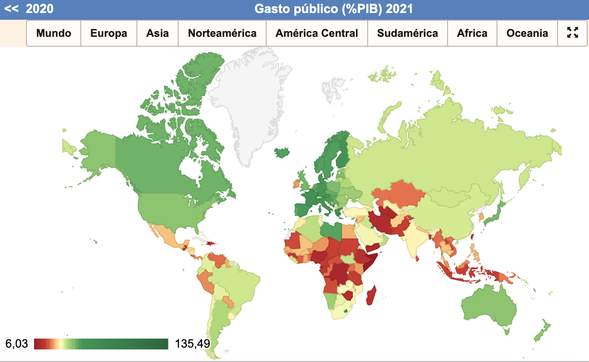{#fig-fig1}](https://datosmacro.expansion.com/estado/gasto){target="_blank"}

<!-- {#fig-fig1} -->
<!-- ```{=html} -->
<!-- <iframe src="https://ourworldindata.org/grapher/historical-gov-spending-gdp" loading="lazy" style="width: 100%; height: 600px; border: 0px none;"></iframe> -->
<!-- ``` -->

<!-- ```{=html} -->
<!-- <iframe src="https://ourworldindata.org/grapher/total-gov-expenditure-gdp-wdi" loading="lazy" style="width: 100%; height: 600px; border: 0px none;"></iframe> -->
<!-- ``` -->

::: callout-important
## Importante

Se puede considerar que el **capitalismo** no es un sistema económico, sino simplemente una fase histórica más desde el punto de vista de la economía (igual que existió la época antigua o medieval). Es decir, el capitalismo *ES* la economía real y es un sistema mixto con sector público y privado, que dista mucho de ser economías puras de mercado, aunque muchas veces se identifican (mal)intencionadamente con él. De hecho, así lo consideran muchos marxistas de muchos tipos, para los que el **socialismo** es la siguiente y última fase que surgirá por superación de las limitaciones del capitalismo. Estos consideran que, puesto que *ya sabemos* que el socialismo es la evolución natural del capitalismo, lo ideal sería adelantar el socialismo por la vía de la revolución.

Lo anterior nos lleva a que en la historia reciente solo ha habido dos sistemas económicos reales: capitalismo y **comunismo** (implantación real del socialismo ideal, con características muy diferentes a lo imaginado). El capitalismo, con muchas variantes, ha sido tremendamente exitoso, mientras que el comunismo ha sido un fracaso sistemático en todos los países donde se ha implantado.

Aparte de lo anterior están todos los sistemas imaginados en las mentes de todo un elenco de personas, que hablan del tema con mayor o menor conocimiento de causa. Aquí se mezclan términos tan variados como anarquismo, anarco-capitalismo, minarquismo, socialdemocracia, economía social de mercado, neoliberalismo, distributismo, keynesanismo, Estado del Bienestar, capitalismo de estado, socialismo libertario, economía tradicional, y un larguísimo etcétera. Se podría decir que hay tantos sistemas económicos pensados como cabezas pensantes.

No falta quien aborda este tema con humor ([aquí](https://www.youtube.com/watch?v=aZJ1F-_kP7U&ab_channel=AcademiaPlay){target="_blank"}), que contrasta con las agrias confrontaciones que a menudo se dan en la realidad.
:::

::: callout-tip
## China

China en la actualidad posee un sistema económico que es muy singular, al tratarse de una economía en gran medida de mercado dentro de un sistema político que es una dictadura comunista. Algunos la califican de capitalismo de estado, mientas que otros la ven como en un estado intermedio a la consecución del socialismo real. En cualquier caso, la economía China ha progresado espectacularmente desde la liberalización de su economía. Queda por ver cómo evoluciona en el futuro, puesto que se está dando un giro hacia más autoritarismo, además de que se da una clamorosa violación de derechos humanos típico de los regímenes comunistas.
:::

::: callout-tip
## Desigualdad

Un problema que cada vez preocupa más es el tema de la distribución de la renta a nivel mundial y dentro de cada economía. Esta es la tercera de las grandes cuestiones que tiene que resolver todas las economías. Se suele medir a través del índice de Gini, que está relacionado con la curva de Lorenz. El índice de Gini toma valores entre cero y cien indicando mayor igualdad cuanto más cercano a cero. 

En el siguiente mapa se pueden ver los índices de Gini de muchos países. Puedes elaborar tus propias conclusiones acerca de la distribución mundial y de la desigualdad relacionada con la pobreza en el mundo.

```{=html}
<iframe src="https://ourworldindata.org/grapher/economic-inequality-gini-index" loading="lazy" style="width: 100%; height: 600px; border: 0px none;"></iframe>
```
:::


<!-- ### Un paréntesis {-} -->

<!-- ****************COMPLETAR -->

<!-- https://ourworldindata.org/economic-growth -->

<!-- Cambiar esto completamente**** con historia -->

<!-- Las economías de mercado y mixtas suelen identificarse con sistemas **capitalistas**, mientras que las planificadas se identificarían con sistemas **socialistas** o **comunistas**, que serían versiones más extremas. ^[Esto tendría muchas matizaciones que se escapan de los objetivos de este libro, por lo que dejamos ahí el argumento.] De forma muy general, la doctrina filosófica que sustenta el capitalismo es el **liberalismo** y la que está detrás del socialismo es el **marxismo**. Solo existen estos dos modelos, lo demás son variaciones del capitalismo -->

<!-- El capitalismo es la evolución natural de la economía histórica... Es decir, no hay socialismo frente a capitalismo, la economía es capitalista solo -->

<!-- Los sistemas socialistas cayeron a partir de 1989, perviven malamente algunos. Capitalistas sacaron pecho, pero el capitalismo hizo aguas en 2008, por lo que hay que tener mucho cuidado con triunfalismos. -->

<!-- Lo siguiente para cuando hablas de capitalismo y socialismo: Un **Sistema económico** es una amalgama de todo lo anterior. Tenemos un sistema económico (además del político y social) y los agentes, el resultado final es la interacción de los mismos. El sistema puede ser perverso, pero si los agentes son buenos dará buenos resultados. Pero si el sistema es sano puede dar lugar a malos resultados con sociedad corrupta. La sociedad corrupta acaba corrompiendo el sisteam. Por tanto lo importante es la sanidad de los agentes.////////////////////////////// -->
<!-- Sistema económico (parte privada y pública) y los agentes con su moral (falta la fuente de la moral, si son individualistas generarán a largo plazo un sistema individualista, etc.) -->

<!-- La evolución histórica ha vinculado capitalismo con democracias y socialismo con dictaduras. Es algo de lo que algunos se quejarían amargamente por su imprecisión, puesto que ha habido dictaduras no marxistas conviviendo con capitalismo (podrías llamarse capitalismo de Estado), mientras que el socialismo teórico propugnaba precisamente la igualdad de todos los agentes en una sola clase social después de una serie de fases, entre las que se encontraba una dictadura. El problema es que el socialismo real se quedó siempre en una fase de dictadura. -->

<!-- Capitalismo lleva poso de filosofía griega, derecho romano, cristianismo, renacimiento e Ilustración que los adanismos no pueden. Socialismo es adanista y libertarianismo es adanismo, pretenden organizar una sociedad completamente y es un disparate. -->

<!-- A pesar de democracia  -->

<!-- China no se sabe cómo clasificarla ¿capitalismo de Estado? ¿Socialimo emergente en una fase inicial? Hay opiniones para todos los gustos, pero lo que no se puede negar es que se trata de un caso muy singular. -->

<!-- ***Este párrafo es del libro McGraw-Hill -->
<!-- El énfasis que a menudo se ha hecho sobre las bondades de la libertad de mercado y la democracia que le sirve de base, ha dado la impresión errónea de que los sistemas de decisión de tipo democrático se aplican a todos los niveles, y esa es una de las razones por las que los sistemas de mercado funcionan. Es más que evidente que esto no es así y no debe ser así, puesto que las jerarquías se multiplican dentro del sistema de libre mercado y de la democracia de forma natural. Basta pensar en la organización de cualquier empresa privada grande o pequeña o cualquier ente público, partidos políticos, muchas asociaciones, etc. Lo importante es que es imprescindible que existan estructuras jerárquicas para que muchas de esas instituciones funcionen, y la organización más igualitaria o más democrática conduciría a la ingobernabilidad de muchas de esas unidades económicas. -->

## El flujo circular de la renta

El flujo circular de la renta es un enfoque elemental para explicar cómo funciona una economía a nivel básico. El esquema se representa en la @fig-fig2.

<!-- [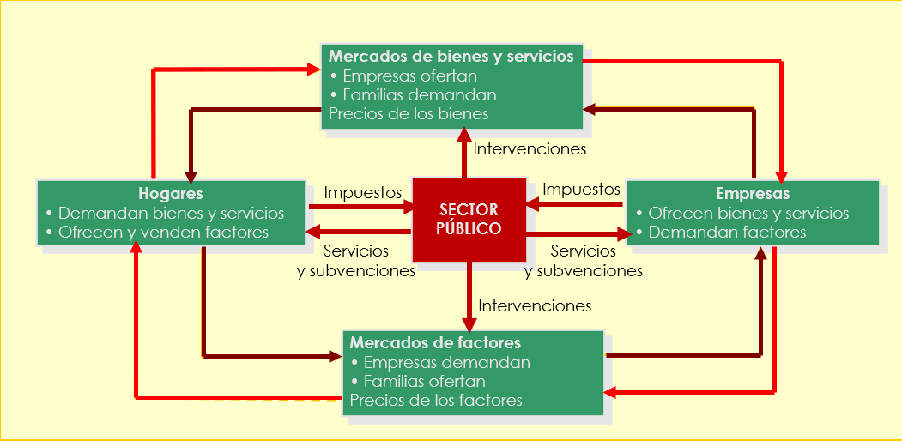{#fig-fig2}](https://docs.google.com/presentation/d/1Th7wbV4FiJQRLCm2WMSU7l86PgDiXvYV/edit?usp=sharing&ouid=106751112112175272147&rtpof=true&sd=true){target="_blank"} -->

{#fig-fig2}

<!-- ```{r echo=FALSE}
knitr::include_url('https://docs.google.com/presentation/d/1Th7wbV4FiJQRLCm2WMSU7l86PgDiXvYV/edit?usp=sharing&ouid=106751112112175272147&rtpof=true&sd=true')
``` -->

Por lo que respecta al sector privado existen dos tipos de agentes con la peculiaridad de que tienen necesidades complementarias. Por un lado están los hogares que demandan o compran bienes y servicios y ofrecen o venden factores de producción. Por otro lado, están los empresarios o empresas que demandan o compran factores de producción y ofrecen o venden bienes y servicios.

Estas necesidades complementarias les condena a entenderse en la práctica, y lo hacen a través de los mercados de bienes y servicios, donde los hogares los demandan y las empresas los ofrecen, y los mercados de factores de producción, demandados por las empresas y ofrecidos por los hogares. Naturalmente, todas estas transacciones se hacen a cambio de contraprestaciones monetarias como se indican en la @fig-fig1. Por ejemplo, a cambio del trabajo, los hogares reciben un salario, etc. Este enfoque hace que se cierre un ciclo real de bienes, servicios y factores, que en la figura se representa con flechas continuas, y otro monetario en sentido contrario, representado por flechas discontinuas.

::: callout-important
## Recuerda

Los hogares demandan bienes y servicios en los mercados de bienes y ofrecen factores de producción en los mercados de factores. Las empresas ofrecen bienes y servicios en los mercados de bienes y demandan factores de producción en los mercados de factores.

Las familias se enfrentan a deseos inconsistentes entre sí, puesto que desearán altas remuneraciones de los factores de producción (por ejemplo altos salarios), y a la vez precios bajos de los bienes y servicios que demandan. Pero son dos cosas imposibles, puesto que factores de producción caros redundarán en precios de bienes y servicios caros, como veremos más adelante.
:::

A este esquema podemos añadir un tercer agente, que es el sector público que realiza acciones propias de los hogares y de las empresas. Pero la forma de financiarse es mediante impuestos coactivos sobre el resto de agentes. Supuestamente devuelven a cambio un monto importante de servicios. Hemos dejado fuera de este esquema el sector exterior, es decir, otras economías con sus propios agentes que se relacionarán con las de esta economía en concreto.

Los mercados son en realidad instituciones que ponen de acuerdo a los agentes con necesidades complementarias, y el mecanismo de ajuste son los precios. Los compradores querrán precios bajos y los vendedores altos. Esa tensión se resolverá si de verdad hay voluntad de entenderse, puesto que todos cederán una parte del precio que desean dependiendo de su poder de negociación para poder realizar la transacción. Es por tanto el mecanismo de los precios el que posibilita los intercambios. A su vez el nivel de precios envía señales a la economía sobre qué bienes, servicios y factores tienen mayor valor para la sociedad.

:::: callout-important
## Errores sobre la demanda y la oferta de trabajo

Hay un error habitual en el lenguaje corriente y en los foros de empleo, pues se suele llamar oferta de trabajo (o de empleo) a lo que en economía más rigurosamente se considera demanda de trabajo. [Compruébalo en este enlace](https://www.infojobs.net/){target="_blank"}.

¡Esto es algo que no debe confundirnos! Los trabajadores (hogares) ofrecen el factor trabajo y las empresas demandan trabajo.
::::

## Tipos de mercados

Los mercados se pueden clasificar de muchas formas, pero una muy habitual y especialmente útil es la que aparecen en la @tbl-tab21, considerando, no sin cierta simplificación que matizaremos después, el número de agentes que actúan por el lado de la demanda y la oferta. Este factor es importante porque, cuanto mayor sea el número de agentes en un lado del mercado, más difícil será que se pongan de acuerdo para influir sobre los precios o sobre cualquier otra condición del mercado. De ahí se sigue que se supone que el precio surgirá más nítidamente de la interacción entre los agentes y no la voluntad de ninguno de ellos en particular o de un grupo.

```{r tbl-tab21, echo=FALSE}
#| tbl-cap: Tipos de mercado por número de agentes.

table1 = rbind(c("Monopolio bilateral", "Monopolio parcial", "Monopolio"),
               c("Monopolio parcial", "Oligopolio bilateral", "Oligopolio"),
               c("Monopsonio", "Oligopsonio", "Competencia perfecta"),
               c(" ", " ", "Competencia monopolista"))
colnames(table1) = c("Un solo demandante", "Pocos demandantes", "Muchos demandantes")
rownames(table1) = c("**Un solo oferente**", "**Pocos oferente**", "**Muchos oferentes**", "")
knitr::kable(
  head(table1, 4),
  booktabs = TRUE,
  align = "cc",
)
```

El caso que más ampliamente vamos a tratar en este capítulo es el de **competencia perfecta**, en el que hay un gran número de agentes por los dos lados del mercado. Es de esperar que en este caso los precios surgirán con más claridad de la interacción de los agentes. En realidad, como veremos en la siguiente sección, hacen falta más condiciones para considerar que un mercado sea de competencia perfecta, algunas de ellas muy restrictivas. Por ello, cuando algunas de esas condiciones adicionales no se cumple se suele hablar de **competencia monopolista**, que es un mercado que se encuentra en muchos casos reales.

Un caso bastante conocido es el de **monopolio** cuando hay muchos agentes por el lado de la demanda que tienen que comprar forzosamente a una sola empresa, que es el monopolio. El caso simétrico es el **monopsonio** o **monopolio de demanda**. El hecho de que haya una sola empresa operando en un mercado da poder de mercado a ese agente para fijar precios o restringir la cantidad que produce, pero ese poder no es totalmente arbitrario. El monopolista puede subir los precios cuanto quiera, pero eso influirá en la cantidad que puede vender, puesto que no puede obligar a los consumidores a comprar su producto, además de que cuanto más suba los precios más probabilidades hay de que surja un competidor que venda más barato y rompa el monopolio.

Un caso bastante habitual en la vida real es el **oligopolio**, que además del número de agentes característico tiene otra peculiaridad, y es que tiene que existir dependencia estratégica entre las empresas. Es decir, la actuación de una empresa mueve a las demás a actuar de forma parecida, a veces degenerando en colusiones espontáneas (los acuerdos explícitos están prohibidos) o en guerras de precios. Aunque el número de agentes es reducido la competencia puede ser feroz por cautivar cuotas crecientes del mercado.

<!-- Índice de Herfindahl???? -->

En el caso de los oligopolios se suele medir el poder de mercado por el índice de Herfindahl (que fue el economista que lo inventó). Llamando $s_i$ a la cuota que cada empresa tiene de un mercado formado por $n$ empresas, el índice es sencillamente

$$
IH=\sum_{i=1}^n s_i^2
$$
En el caso de monopolio, con una sola empresa el índice es 1, que indicará máxima concentración y poder de mercado. En el extremo opuesto tendremos competencia perfecta con muchas empresas y cada una de ellas con una porción pequeña del mercado, lo que hace que el índice tienda a cero. Por tanto, cuanto más cerca está el índice de 1 mayor es el poder de mercado.

Si suponemos que el mercado está igualmente repartido entre todas las empresas el índice tiende a cero a medida que aumenta el número de empresas, indicando que el poder se reduce cuantas más empresas compiten en el mercado. Con el mismo número de empresas, cuanto más desigual es el reparto mayor es el índice, lo que implica que el poder es mayor cuanto más desigualmente repartido está el mercado.

::: panel-tabset
## Resuelve {-}

Un oligopolio pasa de tener dos empresas con un 70% y 30% de cuotas de mercado a cuatro empresas con un reparto equilibrado. ¿Cómo varía el IH?

## Solución {-}

El índice inicial es $IH_1=0,7^2+0,3^2=0,58$ y el final $IH_2=4 \times 0,25^2=0,25$. El poder de mercado se ha reducido considerablemente.
:::

::: callout-important
## Poder de mercado

Se suelen identificar los mercados monopolísticos u oligopolísticos como mercados en los que la competencia es reducida por el escaso número de empresas. Sin embargo, esto no suele ser el caso siempre que sean empresas privadas y haya posibilidades de entrada de nuevas empresas. En realidad se suelen dar situaciones de competencia feroz (véase el sector financiero, la automoción, teleconmunicaciones, venta *on-line*, etc.) y ninguna empresa está libre de quebrar, como sucedió con algunos gigantes como Kodak, Blockbuster, Nokia, Olivetti, etc.

Los que sí tienen asegurada su existencia son los monopolios públicos o los privados que son apoyados por el sector público. En esos casos juegan con la ventaja competitiva de que se pueden financiar por otras vías alternativas, como son los impuestos.
:::

:::: panel-tabset
## Resuelve {-}

Especifica qué tipo de mercados son los siguientes:

  - Productos agrícolas.
  - Talleres que suministra productos elaborados a una sola empresa.
  - Electricidad.
  - Taxis de una ciudad.
  - Distribución de alimentos.
  - Telecomunicaciones.
  - Transporte ferroviario.
  - Farmacias en una ciudad.
  - Transporte por carretera.
  - Negociación sindicatos - patronal.
  - Automoción.
  - Servicios financieros (bancos, cajas de ahorro, cooperativas de crédito).
  - El servicio de aguas de una ciudad.
  - La Bolsa de valores.

## Solución {-}

Especifica qué tipo de mercados son los siguientes:

  - Productos agrícolas: competencia perfecta.
  - Talleres que suministra productos elaborados a una sola empresa: monopsonio.
  - Electricidad: oligopolio bilateral.
  - Taxis de una ciudad: monopolio.
  - Distribución de alimentos: competencia perfecta o competencia monopolista el pequeño comercio, oligopolio los supermercados e hipermercados.
  - Telecomunicaciones: oligopolio.
  - Transporte ferroviario: monopolio.
  - Farmacias en una ciudad: monopolio.
  - Transporte por carretera: oligopolio.
  - Negociación sindicatos - patronal: monopolio bilateral.
  - Automoción: oligopolio.
  - Servicios financieros (bancos, cajas de ahorro, cooperativas de crédito): oligopolio.
  - El servicio de aguas de una ciudad: monopolio.
  - La Bolsa de valores: competencia perfecta (o monopolista).

::::

::: callout-tip
## El índice de Herfindahl de las cajas españolas

Partiendo de la información en el enlace sobre el proceso de fusión de las cajas que se llevó a cabo para para paliar los efectos de la crisis de 2008 en el sistema financiero español, se puede calcular el índice de Herfindahl antes y después de la oleada de fusiones. Según la información mostrada, el sector pasó de 41 cajas con dos de ellas dominando al resto (Caja Madrid y la Caixa) a tan solo 11 (en las que seguían dominando los bancos Bankia y CaixaBank). Esto motivó que el índice subiera de 0,078 a 0,155.

El 12 de noviembre de 2021 se culminó la fusión de las antiguas cajas más grandes, Bankia y CaixaBank, en un banco que acumula algo más del 50% del mercado inicial de las cajas. El índice escaló hasta 0,281. Es evidente que la concentración ha crecido considerablemente en el sector.

<!-- [Enlace a información sobre las cajas españolas.](https://docs.google.com/presentation/d/e/2PACX-1vSjGDyKBboWJz4B0moxjYzOYfxPqt2QwjrgMQnhGY1h5g_1GPGtxIDboH1cIUedOhX3kyapYI5P1aPJ/pub?start=false&loop=false&delayms=3000){target="_blank"} -->

[Enlace a información sobre las cajas españolas.](IHcajas.html){target="_blank"}
:::

## Mercados de bienes y servicios de competencia perfecta

Ya hemos definido los mercados de competencia perfecta. Sin embargo, es necesario definirlo con mayor precisión. Diremos que un mercado es de competencia perfecta cuando cumpla las siguientes condiciones: 

1. Elevado número de demandantes y oferentes. Esta condición asegura que ninguno de ellos individualmente o en grupo pueda influir sobre las condiciones de mercado.
2. No es posible diferenciar el producto mediante marcas. Se trata de productos genéricos.
3. La información sobre los precios y todas las condiciones del mercado es perfecta y además conocidas por todos los agentes. Esto permitirá que cualquier información relevante se transmita rápidamente al mercado y dicha información se incorpore rápidamente a los precios. De esta forma, los precios siempre son un buen indicador de las condiciones de mercado.
4. Hay libre entrada y salida de agentes en el mercado. El consumidor que desee dejar de comprar un bien puede hacerlo sin ninguna restricción. Lo mismo sucede con las empresas, no hay ninguna restricción para que cualquier empresario se cambie de sector o deje de producir.

::: callout-important
## Importante

Para que un mercado se considere de competencia perfecta debe cumplir *TODAS* las condiciones simultáneamente. Queda claro, por tanto, que los mercados en los que no se cumple alguna de ellas serán de competencia imperfecta. En realidad, se trata de condiciones tan fuertes y tan ideales que dejan a la competencia perfecta como un marco teórico ideal que nos sirve para ver cómo reaccionarían los mercados en esas condiciones. Es como si consideráramos las cuestiones económicas que nos vamos a plantear en condiciones de laboratorio. Por tanto, estrictamente hablando no hay ningún mercado real que cumpla con todas estas restricciones.
:::

Como ya se ha dicho, para que existan los mercados se requiere que haya demandantes y oferentes con necesidades complementarias. En lo que sigue vamos a estudiar los determinantes de las funciones de demanda y oferta y cómo la interacción entre ellas lleva a la determinación de los precios y cantidades de equilibrio.

### Demanda

La **función de demanda** relaciona la variable **endógena** (dependiente o salida) cantidad del bien o servicio con todo un conjunto de variables **exógenas** (independientes o entradas) de las que se supone que depende, como se indica en la @eq-demanda.

$$
x_i^D = D(P_i, R, P_{j,k,...}, \text{preferencias}, \text{expectativas}, \dots)
$$ {#eq-demanda}

Los términos de la @eq-demanda son:

- $x_i^D$: cantidad demandada del bien $i-$ésimo en unidades físicas.
- $P_i$: precio por unidad del bien $i-$ésimo en unidades monetarias.
- $R$: renta disponible (ya se definió en el [Capítulo -@sec-intro]).
- $P_{j,k,...}$: representa los precios de otros bienes relacionados con el $i-$ésimo. Aquí se pone de manifiesto las relaciones que existen entre distintos mercados.
- Preferencias: indica las preferencias del consumidor.
- Expectativas: lo que los consumidores esperan que sucederá en el futuro
- $\dots$: todas las variables adicionales que en casos concretos afectarán a la demanda de este bien en particular.

La dependencia de la cantidad demandada de su propio precio es muy sencilla y basta con que el lector responda a la siguiente pregunta: ¿cómo variará el consumo de un bien concreto ante una subida de su precio por unidad? La respuesta *inequívoca* es que se reduciría o a lo sumo se mantendría constante. Aquí tenemos la primera ley económica que es tan fuerte como la ley física de la gravedad, que llamaremos ley de demanda y que implica una relación inversa entre el consumo o demanda de un bien y su precio por unidad, *ceteris paribus*. En este caso no es necesario explicitar la cláusula *ceteris paribus*, puesto que la pregunta ya la lleva implícita de forma natural, pero la hacemos explícita para que quede claro. Existen otras muchas ocasiones en las que dicha cláusula no está tan clara y ponerla sobre la mesa resulta iluminador.

Basándonos en lo anterior, podemos hacer una representación gráfica de lo que llamaremos la **curva de demanda**, que siempre tendrá pendiente negativa (o sería vertical u horizontal como casos límite). Es importante destacar que a lo largo de la curva varían precio y cantidad, pero todas las demás variables de las que depende la función de demanda se mantienen constantes en unos valores determinados. En la @fig-fig21 se representa dicha curva, indicando entre paréntesis las variables que se mantienen constantes. 

```{r fig-fig21, echo=FALSE, fig.cap='La curva de demanda individual.', fig.align='center', out.width="50%"}
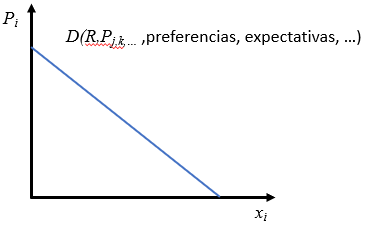
```

La *curva de demanda individual de un bien o un servicio* entonces, se puede definir como *la combinación de precios y cantidades de dicho bien o servicio tales que el consumidor optimiza su función objetivo por unidad de tiempo ceteris paribus*. Esto es, para cada precio el consumidor realiza un proceso de optimización interno por el que decide qué cantidad va a consumir. Otra forma de decir lo mismo es que la curva de demanda *indica la cantidad que está dispuesto a consumir un consumidor para cada precio (ceteris paribus)*. Una forma adicional de definir la demanda es *el precio que máximo que están dispuestos a pagar los consumidores por un determinada cantidad del bien (ceteris paribus)*. 

::: callout-tip
## ¡Cuidado!

Estrictamente hablando hay una incoherencia entre la representación de la @fig-fig21 y la forma habitual de representar funciones matemáticas. La variable endógena se ha representado en el eje de abscisas (horizontal), mientras que la exógena se encuentra en el de ordenadas (vertical). Esto ocasionará algún pequeño problema en el futuro, por lo que es conveniente ser conscientes de ello.
:::

:::: panel-tabset
## Resuelve {-}

Comprueba que la "curva" de la @fig-fig21 es en realidad una recta con ecuación $x_i=a-b P_i$, siendo $a$ y $b$ constantes positivas.

## Solución {-}

Efectivamente, se trata de una ecuación lineal con pendiente $-b$. Para un valor $P_i=0$ la cantidad es $x_i=a$. Por el contrario, cuando $x_i=0$, $P_i=a/b$. Por tanto, los cortes con los ejes de abcisas y ordenadas son $a$ y $a/b$, respectivamente.
:::

Analicemos ahora la dependencia de la curva de demanda de la renta disponible $R$. ¿Cómo responderá $x_i$ ante un aumento de $R$, *ceteris paribus*? La respuesta es que la cantidad aumenta para los bienes **normales** y se reduce para los **inferiores**. En efecto, llamaremos bienes normales a todos aquellos cuya demanda varía en el mismo sentido que la renta disponible, *ceteris paribus*, e inferiores a los que varían en sentido contrario. El caso de los bienes inferiores resulta menos evidente, hasta que el lector sea consciente de que un aumento de sueldo puede llevar a consumir menos de bienes de menos calidad (inferiores) y sustituirlos por bienes de más calidad o de marcas superiores (normales o de lujo).

El efecto sobre la curva de demanda de un aumento de renta para un bien normal es muy sencillo. Supongamos el precio $P_i^1$ para el que los consumidores dicen que comprarán $x_i^1$, como indica la @fig-fig22. Si aumenta la renta manteniéndose todo lo demás constante, también $P_i^1$, la nueva cantidad para un bien normal será mayor, $x_i^2$. Eso indica que el nuevo punto de coordenadas ($P_i^1$, $x_i^2$) no se encuentra sobre la curva inicial. Si se repite el razonamiento para cualquier precio tenemos que lo que se ha producido es un desplazamiento de toda la curva de demanda.

```{r fig-fig22, echo=FALSE, fig.cap='Efecto sobre la demanda de un bien normal de un incremento de renta disponible.', fig.align='center', out.width="40%"}
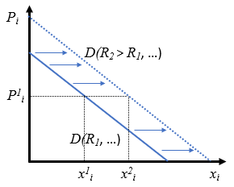
```

De lo anterior aprendemos algo que es en realidad una cuestión puramente geométrica: cuando cambia una variable que se encuentra en los ejes el consumidor selecciona otro punto que está en la misma curva (se desplaza a lo largo de la curva), mientras que si cambia una variable de la que depende la función de demanda, pero no se encuentra en los ejes (sino en el paréntesis), se desplaza toda la curva de demanda hacia la derecha o hacia la izquierda. En este caso, puesto que la demanda se ha desplazado hacia la derecha con más consumo para cualquier precio, diremos que *la demanda ha aumentado*.

La relación entre $P_{j,k,...}$ y la demanda es también muy sencilla, cuando sube el precio de un bien **sustitutivo** la demanda se desplaza a la derecha (aumenta). Esto sucede así porque el bien sustitutivo satisface la misma necesidad del consumidor, por lo que no va a consumir los dos bienes simultáneamente. Si se encarece uno de ellos se reducirá su demanda (por la pendiente negativa de su demanda), pero aumentará el consumo del sustitutivo. Lo contrario sucede con bienes **complementarios**, que son aquellos que se complementan y se tienen que consumir conjuntamente. En este caso si sube el precio de un bien complementario se reducirá el consumo de los dos bienes simultáneamente, desplazándose la demanda a la izquierda.

El efecto de las preferencias es claro, si un bien, por la razón que sea, es más deseado al margen de cualquier cuestión adicional, su demanda aumentará, se desplazará a la derecha. Una mejora de las expectativas sobre el futuro supondrá un incremento de la demanda actual, incluso aunque las expectativas no se conviertan en realidad en el futuro.

::: panel-tabset
## Resuelve {-}

Explica cómo variará la demanda de coches marca A en los siguientes casos, asumiendo que es un bien normal:

- Aumenta el precio de los coches marca A.
- Sube el IRPF.
- Bajan las cotizaciones sociales que pagan los trabajadores.
- Sube el precio de coches marca B.
- Sube el precio de la gasolina.
- Creemos que en el futuro van a subir los salarios por la bonanza económica.
- Se hace una campaña publicitaria muy fuerte.
- Aumentan las cuantías del seguro de desempleo.

## Solución {-}

Explica cómo variará la demanda de coches marca A en los siguientes casos, asumiendo que es un bien normal:

- Aumenta el precio de los coches marca A: se reduce la cantidad a lo largo de la misma curva de demanda.
- Sube el IRPF: cae la renta disponible y se desplaza la demanda hacia la izquierda.
- Bajan las cotizaciones sociales que pagan los trabajadores: aumenta la renta disponible y la demanda se desplaza a la derecha.
- Sube el precio de coches marca B: la demanda se desplaza a la derecha al ser la marca B un sustitutivo.
- Sube el precio de la gasolina: la demanda se desplaza a la izquierda por ser bienes complementarios.
- Creemos que en el futuro van a subir los salarios por la bonanza económica: se desplaza la demanda a la derecha por la mejora de expectativas.
- Se hace una campaña publicitaria muy fuerte: se desplaza a la derecha porque incitará a consumir más al margen del resto de consideraciones.
- Aumentan las cuantías del seguro de desempleo: se desplaza a la derecha si se trata de coches al alcance de los desempleados. Si no es así, no se producirá ningún cambio.
::::

Hasta aquí hemos hablado de demanda individual, de un solo consumidor. La demanda de mercado será la suma de las demandas individuales de todos los consumidores en el mercado. Gráficamente se puede construir como la suma horizontal de las demandas individuales. En este caso hay que añadir una variable a la lista de las exógenas, que es el número de consumidores. Si aumenta el número de consumidores la demanda aumentará.

:::: panel-tabset
## Resuelve {-}

Las funciones **Cobb-Douglas** son aquellas en las que todas las variables exógenas se encuentran elevadas a potencias y multiplicadas entre sí, así como multiplicadas por constantes. Un ejemplo de demanda Cobb-Douglas es $x_i=AP_i^aR^bP_j^cP_k^d$.

Si en un mercado hay 100 consumidores idénticos con función de demanda Cobb-Douglas $x_i=P_i^{-0,5}R^bP_j^cP_k^d$. ¿Cuál será la demanda de mercado? ¿Cuál será la nueva demanda si se añaden otros 50 consumidores? ¿Qué desplazamiento se ha producido?

## Solución {-}

La demanda de mercado será $x_i=100P_i^{-0,5}R^bP_j^cP_k^d$. Cuando se añaden 50 más será $x_i=150P_i^{-0,5}R^bP_j^cP_k^d$, lo que supone un desplazamiento a la derecha, puesto que para cualquier valor de las variables exógenas la demanda es mayor.

En realidad el factor que multiplica a la función individual actúa aquí como el número de demandantes, se podría decir que la demanda de mercado es $x_i=nP_i^{-0,5}R^bP_j^cP_k^d$, siendo $n$ el número de demandantes.
:::

\

:::: panel-tabset
## Resuelve {-}

Se ha recogido la información sobre demanda mensual de combustible en España entre 1987 y 2012 y se ha representado frente a su precio en la siguiente figura. La demanda no parece tener pendiente negativa, ¿puedes explicarlo?

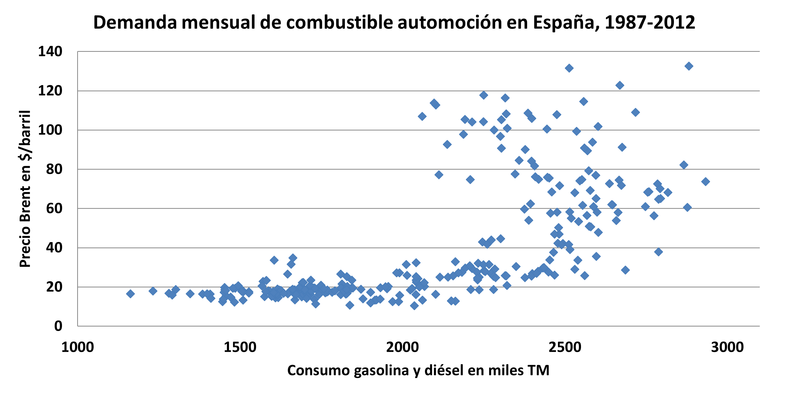

<!-- ```{r fig-fig23, echo=FALSE, fig.cap='Demanda de combustible automoción en España.', fig.align='center'} -->
<!--  -->
<!-- ``` -->

## Solución {-}

Este es un error muy común, pero muy sencillo de resolver, puesto que se puede despachar diciendo que no se cumple la cláusula *ceteris paribus*. Todas las variables de las que depende la demanda están cambiando a lo largo del período de la muestra, por lo que la interpolación no es la demanda como se ha definido anteriormente. 
:::

<!-- Para ejercicios ejemplos 2.5 y 2.7 del libro McGraw-Hill -->

### Oferta

Vista la explicación extendida de la función y curva de demanda, pasamos a definir más rápidamente y en términos análogos la función y curva de oferta de bienes y servicios. La *curva de oferta individual de un bien o un servicio* se define como *la combinación de precios y cantidades de dicho bien o servicio tales que el productor optimiza su función objetivo por unidad de tiempo, ceteris paribus*. En este caso la función objetivo será el beneficio, del que hablaremos extensamente en este libro, desde distinto puntos de vista. También se puede decir que *la curva de oferta indica la cantidad que a los empresarios les interesa producir para cada precio (ceteris paribus)*, o bien *el precio mínimo al que están dispuestos a ofrecer cada cantidad (ceteris paribus)*. La función de oferta del mercado se presenta en la @eq-oferta.

$$
x_i^O = O(P_i, P_{j,k,...}, P_{\text{factores}}, \text{tecnología}, \text{expectativas}, \text{nº oferentes}, \dots)
$$ {#eq-oferta}

La variable $x_i^O$ es ahora la cantidad ofertada por los empresarios del bien o servicio $i-$ésimo; $P_i$ y $P_{j,k,...}$ ya se han definido anteriormente; $P_{\text{factores}}$ son los precios de todos los factores de producción que se utilizan en la fabricación del bien o en la provisión del servicio. Los demás determinantes de la oferta hablan por sí mismos.

::: callout-tip
## Oferta individual y de mercado

La oferta individual tendrá la misma expresión suprimiendo el número de oferentes, y la oferta de mercado se generará como la suma horizontal de las ofertas individuales.
:::

La gran diferencia con la demanda es que precios elevados del bien ($P_i$) animan la producción, lo que implica que, *ceteris paribus*, la curva de oferta tiene siempre pendiente positiva, como en la @fig-fig24. Como límites podría ser vertical u horizontal, pero nunca con pendiente negativa. La función se desplazará hacia la derecha (aumenta la oferta) o hacia la izquierda (se reduce) siguiendo el mismo mecanismo que la demanda.

```{r fig-fig24, echo=FALSE, fig.cap='Curva de oferta de mercado.', fig.align='center', out.width="65%"}
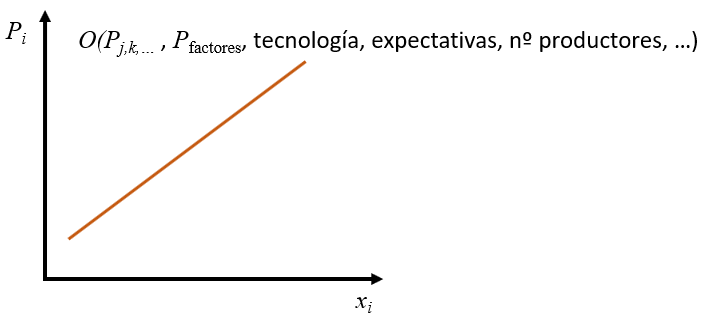
```

Es conveniente subrayar que $P_{j,k,...}$ no tienen por qué referirse a los mismos bienes que en la función de demanda. De esta forma podríamos hablar de **bienes o servicios sustitutivos y complementarios en la producción**, para distinguirlos de los mismos en la demanda. Los sustitutivos son aquellos que no se pueden producir conjuntamente, por lo que el empresario deberá elegir uno de ellos y rechazar el sustitutivo. Si sube el precio de un bien sustitutivo aumenta su oferta y se reduce la de los demás, debido a que precios elevados animan la producción. Esto implicaría una reducción de oferta o desplazamiento a la izquierda. Lo contrario sucedería con los bienes complementarios en la producción.

::: callout-important
## Importante

La consideración de bienes sustitutivos y complementarios tiene que hacerse con cuidado, y no es tan clara como en el consumo. Un consumidor que ve que sube el precio de un determinado bien puede instantáneamente decidir que va a dejar de consumirlo y pasar a consumir otra marca, por ejemplo. Sin embargo, el empresario no puede producir bienes de otra marca por razones obvias, pero es que además el cambio es más costoso y más lento, puesto que dejar de producir algo para producir otro bien puede implicar cambios de maquinaria, dependencias, contratación adicional, etc. Todos esos cambios conllevan necesariamente tiempo y esfuerzo que hacen que la oferta sea mucho más lenta en adaptarse a cualquier tipo de cambio.
:::

El efecto de los precios de factores de producción es bastante claro, cualquier encarecimiento de los factores de producción va a reducir la oferta. Mejoras en la tecnología o las expectativas sobre el futuro suponen incrementos de oferta. No debemos olvidar nunca que existen otras variables, representadas aquí por los puntos suspensivos, que pueden afectar a bienes y servicios específicos.

Resumiendo podemos decir que la oferta de mercado se desplazará a la derecha (aumetará) cuando se reduzcan los precios de los factores, aumenten los precios de los bienes complementarios en la producción, se reduzcan los precios de los bienes sustitutivos, mejore la tecnología o las expectativas sobre el futuro, cuando entren más empresas en el sector y cuando suceda en general cualquier evento que sea ventajoso para los empresarios.

:::: panel-tabset

## Resuelve {-}
Explica cómo variará la oferta de cereales:

- Aumenta el precio de los cereales.
- Sube el impuesto de sociedades.
- Bajan las cotizaciones sociales que pagan los empresarios por sus trabajadores.
- Suben las cotizaciones que pagan los trabajadores.
- Sube el precio del vino.
- Sube el precio del gasóil.
- Creemos que en el futuro van a subir los salarios por la bonanza económica.
- Aparece maquinaria más eficiente.
- Suben los intereses al que prestan los bancos.

## Solución {-}
Explica cómo variará la oferta de cereales:

- Aumenta el precio de los cereales: produce más pero manteniéndose en la misma curva de oferta.
- Sube el impuesto de sociedades: desanima la producción, por lo que la oferta se desplazará a la izquierda.
- Bajan las cotizaciones sociales que pagan los empresarios por sus trabajadores: es similar a una bajada de impuestos, anima la producción por lo que la oferta se desplaza a la derecha.
- Suben las cotizaciones que pagan los trabajadores: no afecta a la oferta, afecta a la demanda.
- Sube el precio del vino: es un bien sustitutivo en la producción, se reducirá la oferta de cereales.
- Sube el precio del gasóil: es un factor de producción, por lo que la oferta de cereales se desplazará a la izquierda.
- Creemos que en el futuro van a subir los salarios por la bonanza económica: es un factor de producción, por lo que desplazará la oferta a la izquierda. Pero las buenas expectativas llevarán a incrementar la oferta. El efecto neto dependerá de qué efecto es el dominante.
- Aparece maquinaria más eficiente: es una mejora tecnológica que desplazará la oferta a la derecha
- Suben los intereses al que prestan los bancos: es el coste del factor capital (financiero), será más costoso financiarse y supondrá una reducción de la oferta.
::::

\

:::: panel-tabset

## Resuelve {-}

En un mercado hay 100 empresarios idénticos con función de oferta **Cobb-Douglas** $x_i=P_i^{0,5}.$ ¿Cuál será la oferta de mercado? ¿Cuál será la nueva oferta si se añaden otras 50 empresas?

## Solución {-}

La oferta de mercado será $x_i=100P_i^{0,5}$. Cuando se añaden 50 más será $x_i=150P_i^{0,5}$, lo que supone un desplazamiento a la derecha, puesto que para cualquier valor de las variables exógenas la oferta es mayor.

En realidad el factor que multiplica a la función individual actúa aquí como el número de empresas, se podría decir que la oferta de mercado es $x_i=nP_i^{0,5}$, siendo $n$ el número de empresas.
:::

### Equilibrio de mercado

Llegados a este punto, ya podemos empezar a analizar cómo encajan los dos lados del mercado. El panel izquierdo de la figura @fig-fig25 representa la demanda y la oferta en los mismos ejes de coordenadas. 

```{r fig-fig25, echo=FALSE, fig.cap='Oferta y demanda (panel izquierdo), exceso de oferta (centro) y equilibrio (derecho).', fig.align='center', out.width="95%"}
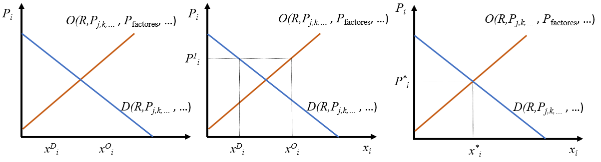
```

Nos podemos preguntar que sucedería si el precio fuera $P_i^1$ como se muestra en el panel central. En ese caso la cantidad que las empresas *quieren*, les *interesa* ofrecer es $x_i^O$, pero a los consumidores les *interesa* demandar tan solo $x_i^D$. Es importante remarcar que ambas curvas muestran lo que los agentes quieren hacer libremente, lo que les interesa hacer para cada nivel de precios.  Está claro que $P_i^1$ es muy alto provocando que los empresarios estén muy animados produciendo, mientras que los consumidores no están excesivamente incentivados. Eso quiere decir que $x_i^O-x_i^D$ es una cantidad que se va a producir pero no se va a poder vender. Es lo que se llama un exceso de oferta. Es un caso muy costoso para las empresas y con el que no estarán muy cómodas. Para que el lector se haga una idea, hay toda una disciplina que intenta optimizar el volumen de inventarios con el fin de mantener solo los que son estrictamente necesarios (**control o gestión de inventarios**). Esto les lleva a estar dispuestos a aceptar precios más bajos (se desplazan a lo largo de la oferta) con el fin de eliminar los excedentes. Si bajan los precios los consumidores estarán encantados y se animarán a comprar más, por lo que el exceso de oferta tiende a eliminarse mediante la bajada de precios.

El párrafo anterior pone de manifiesto la *mano invisible* del mercado, que quiere decir sencillamente que el precio es la variable que acaba ajustando el mercado. Es fácil imaginar una situación de exceso de demanda, en el que el precio es tan bajo que los consumidores desean comprar grandes cantidades del bien. Pero el problema es que los empresarios no están dispuestos as producir tanto. En ese caso los consumidores, o la parte que no logra comprar el producto, estarán dispuestos a pagar precios más altos y los empresarios estarán encantados de cobrárselos, a la vez que incrementarán la producción.

::: callout-important
## Importante

Es importante darse cuenta de que las curvas (y funciones) de oferta y demanda representan las combinaciones óptimas de precios y cantidades. Es decir, que para cualquier precio los consumidores y productores estarán **peor** tanto si eligen cantidades mayores como inferiores. Esto rompe la idea, por ejemplo, de que a los empresarios siempre les interesa producir (y vender) lo máximo posible.
:::

Ante todo lo anterior es evidente que existe un punto de **equilibrio**, que es el corte de las dos curvas, como se muestra en el panel derecho de la @fig-fig25. Si las curvas son como las que se muestran el equilibrio será único y estable, en el sentido de que si por alguna razón el mercado se sale del equilibrio, la *mano invisible* vuelve a conducirlo a él. Es decir, las acciones libres de todos los agentes conducen a esa situación de equilibrio en la que lo que los empresarios producen es lo que los consumidores desean.

::: callout-important
## Variables endógenas y exógenas

El modelo expuesto hasta el momento determina simultáneamente el precio y la cantidad que se intercambia en el mercado. Es decir, tanto el precio como la cantidad son variables *endógenas* para este modelo. Esto es importante, porque, al ser variables determinadas por el modelo, todos los agentes tienen que tomar los precios como variables dadas en sus funciones respectivas. Para el modelo son variables *endógenas*, pero el precio es una variable *exógena* para los agentes individuales, por eso está a la izquierda de la igualdad de las funciones de demanda y oferta. Las cantidades son siempre *endógenas*.
:::

### Variaciones del equilibrio

Ya tenemos todos los elementos para analizar cómo funcionan los mercados. La pregunta que nos tenemos que hacer a continuación es: asumiendo que partimos de un equilibrio y que el mercado tiende siempre a él, ¿qué sucederá cuando cambian las condiciones del mercado? Por ejemplo, si en el mercado de un bien normal aumenta la renta disponible de los consumidores, ¿cómo variarán el precio y la cantidad de equilibrio?

Como hemos visto ya, un incremento de renta desplaza la curva de demanda de bienes normales a la derecha como se muestra en la @fig-fig26. Esto hace que, para el precio inicial, se produzca un exceso de demanda que pondrá en marcha la *mano invisible* conduciendo a un equilibrio en el que tenemos mayores precios y cantidades producidas. Hay que hacer notar que si el incremento de renta es generalizado en la economía, lo que hemos dicho para un solo mercado sucederá en muchos mercados simultáneamente, por lo que podremos afirmar que a nivel global se va a producir **inflación** y **crecimiento** económico.

```{r fig-fig26, echo=FALSE, fig.cap='Variaciones del equilibrio del mercado de un bien normal cuando aumenta la renta disponible de los consumidores.', fig.align='center', out.width="40%"}
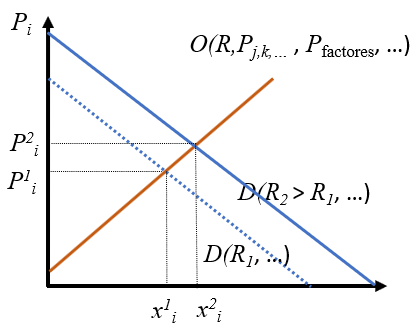
```

::: callout-tip
## Inflación y crecimiento

La inflación es el incremento generalizado de precios, los precios se *inflan*. Se suele medir por las tasas de variación interanuales del Índice de Precios al Consumo (IPC), que elabora el Instituto Nacional de Estadística (INE).

El crecimiento es la variación del Producto Interior Bruto en términos reales (índices de volumen), que también elabora el INE.
:::

::: callout-important
## Para no equivocarse

Resumiendo, y para ser rigurosos, el análisis consta siempre de tres pasos, partiendo de una situación de equilibrio:

1. Determinar a qué lado del mercado afecta la variable que cambia. En otros términos, determinar en qué paréntesis se encuentra la variable involucrada, en el de la oferta, en el de la demanda, en ambos o en ninguno. 
2. Determinar la dirección del cambio, si un aumento o una reducción, es decir, un desplazamiento a la derecha o hacia la izquierda.
3. Como consecuencia del desplazamiento de alguna curva, el equilibrio cambiará y la conclusión final será determinar en qué dirección varían tanto el precio como la cantidad.
:::

:::: panel-tabset

## Resuelve {-}

Analiza gráficamente los cambios de equilibrio en las siguientes situaciones:

- Se da una reducción de los precios de la energía. Analizar el efecto en cualquier mercado.
- Aumentan los impuestos sobre la renta de los consumidores en un mercado de un bien normal en que la oferta es completamente horizontal.
- Aparece un virus que produce una epidemia en los animales de granja. Analiza el efecto sobre el mercado del ganado vacuno. ¿Qué sucede con el mercado de hamburguesas?
- Se produce un incremento de precios de un bien sustitutivo en el consumo y la producción.
- Aumentan los salarios en un sector concreto.
- Mejora la gestión de las empresas a la vez que hay un incremento de la población.

## Solución {-}

- Se da una reducción de los precios de la energía. Analizar el efecto en cualquier mercado.

```{r echo=FALSE, out.width="35%", fig.align='center'}
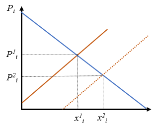
```

La energía entra en todos los procesos de producción como un factor de producción. Al abaratarse hace que la oferta se desplace a la derecha provocando que los precios de todos los bienes bajen y la producción aumente. Son dos efectos beneficiosos. Esto demuestra lo importante que resulta disponer de energía barata.

- Aumentan los impuestos sobre la renta de los consumidores en un mercado de un bien normal en que la oferta es completamente horizontal.

```{r echo=FALSE, fig.align='center', out.width="35%"}
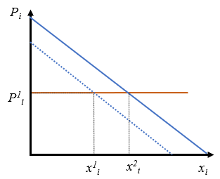
```

El incremento de impuestos desplaza la demanda a la izquierda y genera una reducción de cantidad sin cambiar el precio.

- Aparece un virus que produce una epidemia en los animales de granja. Analiza el efecto sobre el mercado del ganado vacuno. ¿Qué sucede con el mercado de hamburguesas?

```{r echo=FALSE, out.width="70%", fig.align='center'}
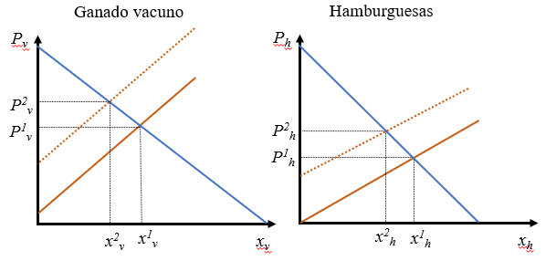
```

En el mercado de carne de vacuno (gráfico izquierdo), al desaparecer los animales se da una reducción de la oferta que incrementa la el precio y reduce la cantidad. Pero esta carne es una materia prima de las hamburguesas (un factor de producción), por lo que al encarecerse la carne se reducirá la oferta de hamburguesas, incrementando su precio y reduciendo la cantidad intercambiada (gráfico derecho).
 
- Se produce un incremento de precios de un bien sustitutivo en el consumo y la producción.

```{r echo=FALSE, fig.align='center', out.width="35%"}
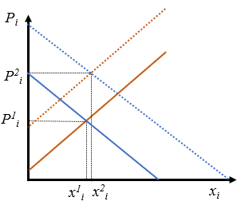
```

Es un cambio que incrementa la demanda y reduce la oferta a la vez, por lo que el precio subirá necesariamente por partida doble, pero la cantidad intercambiada no se puede determinar sin información adicional.

- Se reducen los salarios en un sector concreto.

```{r echo=FALSE, fig.align='center', out.width="35%"}

```

La reducción de salarios es una reducción del precio de un factor de producción. Hay que tener en cuenta que la reducción de salarios de los trabajadores en un sector, que será parte de su renta disponible, no implica una reducción de la demanda de ese bien, puesto que los consumidores del bien serán muchos más que los trabajadores en ese sector.

- Mejora la gestión de las empresas a la vez que hay un incremento de la población.

```{r echo=FALSE, fig.align='center', out.width="35%"}
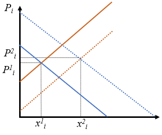
```

La mejora de la gestión de la empresas implica un desplazamiento de la oferta a la derecha, mientras que el incremento de población implica un incremento de demanda. al desplazarse las dos a la derecha se daría un incremento de la cantidad de muchos bienes y servicios, pero el precio quedaría indeterminado, depende del efecto dominante.

Se puede argumentar que el incremento de población podría significar un incremento adicional del número de empresas en todos los sectores, implicando un incremento adicional de la oferta. Pero las conclusiones son las mismas.
:::

::: panel-tabset

## Resuelve {-}

Analiza estas situaciones:

- ¿Cómo se puede explicar el descenso de algunos de los precios agrícolas a lo largo de las últimas décadas?
- Un gobierno bien intencionado propone subir el impuesto de sociedades a los ricos (las empresas) para repartir el exceso de recaudación entre los pobres consumidores, reduciéndoles el IRPF. ¿Te parece una buena medida? (Considera bienes normales).

## Solución {-}

- ¿Cómo se puede explicar el descenso de algunos de los precios agrícolas a lo largo de las últimas décadas?

A lo largo de dilatados periodos de tiempo las demandas y ofertas de todos los bienes y servicios se mueven sin parar, debido a que todas las variables exógenas de las que dependen están en continuo cambio. En particular la renta disponible, los precios de todos los bienes complementarios y sustitutivos, la población, etc. Sin embargo, este cambio se puede deber fundamentalmente a la mejora impresionante de la tecnología junto con mejoras en la eficiencia de la gestión, etc. que ha hecho que las ofertas de cualquier producto agrícola en origen se haya desplazado hacia la derecha de forma drástica.

- Un gobierno bien intencionado propone subir el impuesto de sociedades a los ricos (las empresas) para repartir el exceso de recaudación entre los pobres consumidores, reduciéndoles el IRPF. ¿Te parece una buena medida? (Considera bienes normales).

```{r echo=FALSE, fig.align='center', out.width="35%"}
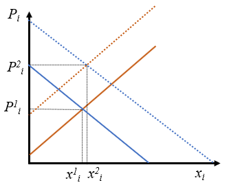
```

El incremento de impuestos a las empresas reduce la oferta (desplazamiento hacia la izquierda). La reducción del impuesto sobre la renta a los consumidores incrementa la demanda (desplazamiento a la derecha). De la conjunción de ambas se obtiene una subida de precios y una cantidad final indeterminada. 

Es una mala medida puesto que, aunque consigue desplazar renta de los empresarios a los consumidores, la producción no tiene por qué aumentar, pero los precios aumentarán por doble partida. Es decir, los pobres consumidores tendrán más renta, pero el poder adquisitivo de la misma se ha reducido. Medidas de este estilo deben pensarse muy bien, puesto que puede ser que el efecto sea más bien pernicioso.
:::

::: callout-tip

## Otra visión en la formación de precios de los mercados

La visión presentada aquí es, para muchos economistas excesivamente simplista, por los supuestos tan restrictivos de los que partimos, y porque en el mundo real a veces las cosas no son tan simples. Sin embargo, a pesar de su simplicidad, las conclusiones son válidas incluso en casos reales mucho más complejos. En definitiva lo que tiene en cuenta el modelo propuesto es cómo influye la escasez relativa de los bienes y servicios en la formación de los precios.

El siguiente vídeo muestra un ejemplo de cómo funcionan los mercados eléctricos occidentales, que son mercados llamados marginalistas y se parecen en muchos aspectos a lo explicado en este capítulo.

::: columns
::: {.column width="10%"}
:::
::: {.column width="80%"}

:::
::: {.column width="10%"}
:::
:::


<!-- [Este vídeo](https://www.youtube.com/watch?v=Rnv9boyfEDw&ab_channel=%C3%93scarVara){target="_blank"} muestra un ejemplo de cómo funcionan los mercados eléctricos occidentales. Es un caso muy diferente a la competencia perfecta. -->
:::

<!-- ::: panel-tabset -->
<!-- ## Resuelve {-} -->

<!-- Un economista asegura que el valor que tienen los bienes producidos por una empresa es objetivo y equivale al valor del trabajo incorporado en el mismo. ¿Qué le dirías? -->

<!-- ## Solución {-} -->

<!-- Ese economista solo está teniendo en cuenta el valor de un factor de producción, que es el trabajo. Pero lo más importante es que el valor de las cosas (en realidad hablamos de su precio) no solo depende de las consideraciones de oferta, sino también de la demanda. Dos bienes que tnegan los mismos costes de producción (la misma oferta) tendrán distintos precios en función de cuántos potenciales demandantes están interesados en él.  -->
<!-- ::: -->

## Mercados de factores

Hasta aquí todo lo dicho se refiere a los mercados de bienes y servicios. Vamos a tratar ahora el funcionamiento de los mercados de factores. Lo primero es volver al flujo circular de la renta de la @fig-fig2, para recordar que son las empresas las que están en la demanda de factores y los consumidores, familias u hogares las que ofrecen los factores de producción.

En realidad las decisiones de demanda de todos los bienes que consumen los hogares y la oferta de factores de producción forman parte de un proceso de decisión conjunto. Por ejemplo, un hogar que oferte únicamente trabajo a cambio de un salario tendrá que adaptar la demanda de bienes a la cantidad de trabajo que esté dispuesta a ofrecer. Si trabaja mucho y tiene muchos ingresos salariales podrá demandar muchos bienes y servicios. Por el contrario, no podrá tener altos niveles de consumo si su oferta de trabajo es muy baja. En efecto, podremos decir que para ese hogar la oferta de trabajo por un lado y las demandas de bienes por otro son dos caras de la misma moneda.

Lo mismo sucede con las empresas. La oferta de bienes y servicios y la demanda de factores de producción se deciden simultáneamente y están ligadas entre sí. Una empresa solo podrá ofrecer mucho producto en un mercado si está dispuesta a contratar muchos factores de producción.

La *curva de demanda de un factor de producción* se define como *la combinación de precios y cantidades de dicho factor tales que el empresario optimiza su función objetivo por unidad de tiempo ceteris paribus*. De modo general podríamos decir que la demanda de los factores que realizan las empresas se podría representar como la de la @fig-fig26bis, que se ha concretado para el caso del mercado de trabajo. La representación enfrenta cantidades de trabajo en unidades físicas (horas, días, personas, ...), representada por $L$, para cada nivel de salario por unidad, $w$, medido en unidades monetarias.

```{r fig-fig26bis, echo=FALSE, fig.cap='Oferta y demanda de un mercado de trabajo.', fig.align='center', out.width="65%"}
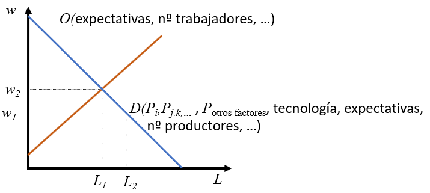
```

Las variables de las que depende la demanda de trabajo son, *grosso modo*, las mismas de las que dependía la oferta del bien, puesto que las empresas que hay detrás de ambas funciones son exactamente las mismas. En efecto, si hablamos del mercado de *donuts*, consideraremos el mercado de dicho bien en relación además con el mercado de factores necesarios para fabricarlos. Esto hace que las empresas en la demanda de factores y en la oferta del bien sean las mismas. No sucede lo mismo con los consumidores, puesto que los demandantes de *donuts* no tienen por qué ser los que ofrecen los factores de producción necesarios para fabricarlos. Seguramente, muchos de los trabajadores consumirán *donuts*, pero habrá muchos más consumidores que no trabajan en las fábricas de *donuts*. En este sentido, la demanda del bien no está ni mucho menos restringida por la oferta de trabajo en esas empresas concretas, sino que obedecerá a razones más amplias.

::: callout-important
## No olvidar

No se puede olvidar que en los mercados de factores las empresas demandan factores de producción y las familias los ofrecen (@fig-fig2).

Además, las mismas empresas que ofrecen un bien o servicio son las que demandan los factores de producción necesarios. Pero, obviamente, los consumidores del bien o servicio no son los que ofrecen todos los factores de producción necesarios.
:::

Con lo anterior en mente, podemos afirmar que los determinantes de la demanda de trabajo en un sector determinado vienen a ser los mismos que los de la oferta del bien:

- $P_i$, el precio del bien o servicio. Subidas del precio animan la producción y harán falta más factores de producción, por lo que la demanda de trabajo se desplazará a la derecha.
- $P_{j,k,\dots}$, precios de los demás bienes relacionados por el lado de la producción. Un incremento del precio $P_j$ de un bien final sustitutivo en la producción implica que la oferta se desvíe hacia ese bien, reduciendo la oferta del bien $i-$ésimo y la demanda de los factores de producción. Tanto la curva de oferta del bien como las curvas de demanda de factores se desplazarán a la izquierda.
- $P_{\text{otros factores}}$, precios de los demás factores. Naturalmente, el empresario tenderá a utilizar los factores más baratos, por lo que el incremento del precio de un factor sustitutivo redundará en un incremento de la demanda del factor que estemos considerando. Lo contrario sucede con factores complementarios. Si las máquinas son cada vez más baratas los empresarios tenderán a cambiar trabajo por máquinas, con lo que se producirá una reducción de la demanda de trabajo.
- El efecto de la tecnología será ambivalente. Una mejora de la tecnología supondrá una reducción de todas las demandas de factores que sean sustitutivos de la tecnología, mientras que supondrá un incremento de las demandas que sean complementarias.
- La mejora de expectativas y el incremento de empresarios redundarán en incrementos de las demandas de factores en general.
- ...: igual que comentamos en los demás casos, habrá otros determinantes de las demandas de factores de producción específicas de sectores específicos.

De forma análoga a la demanda, podemos definir la *curva de oferta de un factor de producción* como *la combinación de precios y cantidades de dicho factor tales que el consumidor optimiza su función objetivo por unidad de tiempo ceteris paribus*. Aquí hay que hacer dos matizaciones importantes que hacen que los determinantes de la ofertas de factores no se correspondan con las demandas de bienes y servicios: 

1. Los consumidores o demandantes de un bien no son los que ofrecen trabajo en ese sector.
2. Las decisiones de oferta de factores las llevan a cabo los consumidores teniendo en cuenta el nivel global de consumo que quieran alcanzar, pero no en función de las condiciones particulares de un solo mercado.
3. En el mercado de trabajo en particular el consumidor se enfrenta a la elección entre renta y ocio. Si decide trabajar muchas horas tendrá poco ocio y mucha renta y viceversa. Es, como siempre, un problema de elección.

Las variables exógenas, por tanto, quedan más diluidas que en el caso de la oferta de factores. De forma general podemos considerar las expectativas, el número de trabajadores y los puntos suspensivos.

:::: panel-tabset

## Resuelve {-}

Ilustra gráficamente una situación de desempleo en el mercado de trabajo.

## Solución {-}

```{r echo=FALSE, fig.align='center', out.width="35%"}
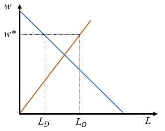
```

Para que haya desempleo se tiene que dar una situación de desequilibrio permanente en el que el salario se mantenga por encima del salario de equilibrio. En ese caso se produce un exceso de oferta que implica que la cantidad de trabajo ofrecida por las familias es superior a la cantidad de trabajo demandada por las empresas. El salario de **desequilibrio** será $w^*$ y la cantidad de trabajo $L_D$, *el lado corto del mercado*.

Para que esta situación de desempleo sea permanente, como sucede en el mundo real, tiene que haber circunstancias que impidan que el mercado se ajuste reduciendo los salarios, que es lo que sugeriría la *mano invisible*. Se suele hablar de rigideces del mercado laboral que motivan esta circunstancia, que en definitiva lo que implican es que este mercado NO es de competencia perfecta.
:::

En el siguiente mapa puedes ver los niveles de desempleo de diversos países y su evolución a lo largo del tiempo.

```{=html}
<iframe src="https://ourworldindata.org/grapher/unemployment-rate" loading="lazy" style="width: 100%; height: 600px; border: 0px none;"></iframe>
```

## La elasticidad

### Concepto general

Estrechamente relacionado con todo lo anterior la **elasticidad** es un concepto en economía cuya importancia es difícil de exagerar. Se puede definir como *la variación porcentual que experimenta una variable endógena cuando varía un 1% una variable exógena de la que depende (ceteris paribus)*. Por tanto, la elasticidad mide la intensidad con la que dependen las variables entre sí, pero es una dependencia medida en términos porcentuales. La derivada también mide dicha intensidad, pero tiene el inconveniente de que tiene unidades de medida. Así, la primera ventaja de utilizar es la ausencia de unidades. Dicha ventaja será evidente en el resto de la sección.

Supongamos una función que nos proporciona una relación de causalidad entre variables dada por $x_i=f(u_1,u_2,\dots,u_n)$, la elasticidad de la función respecto a la variable exógena $x_j$ se define como se indica en la @eq-elast, aplicando estrictamente la definición.

$$
E=\frac{\text{Variación porcentual de } x_i}{\text{Variación porcentual de }u_j}=\frac{\Delta x_i/x_i}{\Delta u_j/u_j}=\frac{\Delta x_i}{\Delta u_j}\frac{u_j}{x_i}
$$ {#eq-elast}

Se puede dar un paso más y hacer la variación de la variable exógena a cero, con lo que tendríamos una versión más refinada.

$$
E=\lim_{\Delta u_j \to 0} \frac{\Delta x_i}{\Delta u_j}\frac{u_j}{x_i} = \frac{\partial x_i}{\partial u_j}\frac{u_j}{x_i}
$$ {#eq-deriv}

Siempre que sea posible utilizaremos la @eq-deriv, pero, a menudo la información de la que se dispone en economía es escasa, por lo que en determinados casos nos veremos obligados a utilizar la @eq-elast. En realidad, en el caso discreto utilizaremos una versión un tanto más fina, para evitar el problema de que los incrementos porcentuales son distintos dependiendo de la dirección del cambio. En el caso discreto en el que solo tenemos dos puntos de la función utilizaremos la @eq-discreta, donde $(u_j^0, x_i^0)$ son las coordenadas del punto inicial, y $(u_j^1, x_i^1)$ son las finales.

$$
E=\frac{\Delta x_i}{\Delta u_j}\frac{(u_j^0+u_j^1)/2}{(x_i^0+x_i^1)/2}
$$ {#eq-discreta}

:::: callout-tip
## Escasez de información

Una variable endógena pasa de 10 a 20 cuando una exógena de la que depende pasa de 4 a 2. Si calculamos la elasticidad utilizando la @eq-elast tenemos que vale $\frac{(20-10)/10}{(2-4)/4}=-2$, que implica que por cada incremento del 1% de $u_j$, $x_i$ se reduce un 2%.

Si el cálculo lo hacemos con la misma ecuación pero invirtiendo el punto inicial y final, la elasticidad sería $\frac{(10-20)/20}{(4-2)/2}=-0,5$. Por tanto, para la misma función la misma aproximación nos da resultados radicalmente diferentes, dependiendo de qué punto consideremos inicial y final. Esto se debe a que los porcentajes no son simétricos. Pasar de 10 a 20 no es la misma variación porcentual que pasar de 20 a 10.

El problema desaparece cuando utilizamos la @eq-discreta, que daría una elasticidad de $\frac{20-10}{2-4}\frac{(2+4)/2}{(20+10)/2}=-1$.

Como se ve los resultados son muy dispares, pero son los inconvenientes de la escasez de información.
::::

### Elasticidades de demanda y de oferta

Ahora corresponde concretar el concepto general de elasticidad en las funciones que hemos definido en este capítulo, aunque se pueden utilizar en cualquier otra función. Las elasticidades que más se usan son las siguientes:

1. **Elasticidad precio de la demanda** o, sencillamente **elasticidad de demanda**: se calcula aplicando el concepto de elasticidad al precio de la función de demanda en la @eq-demanda, es decir $E_{P_i}=\frac{\partial x_i}{\partial P_i}\frac{P_i}{x_i}$. Esta elasticidad siempre es negativa, puesto que la pendiente de la curva de demanda siempre es negativa. A menudo se considera su valor absoluto entendiendo que en realidad siempre es negativa. Se suele hablar de **demandas elásticas** cuando su valor es mayor que 1 en valor absoluto e **inelástica** o **rígida** en caso contrario. La relevancia de este valor frontera se verá más adelante. El caso en el que la demanda sea totalmente insensible al precio, es decir, con elasticidad 0 se dirá que es **completamente inelástica** o **completamente rígida**. Cuando la sensibilidad es infinita, la elasticidad también lo es y diremos que la demanda es **completamente elástica**.
2. **Elasticidad renta de la demanda**: por definición será $E_R=\frac{\partial x_i}{\partial R}\frac{R}{x_i}$, y nos da la variación porcentual que experimenta la demanda cuando la renta varía un 1%. Los bienes serán normales cuando tengan elasticidad renta positiva y serán inferiores con elasticidades renta negativas.
3. **Elasticidades cruzadas de demanda**: $E_{P_j}=\frac{\partial x_i}{\partial P_j}\frac{P_j}{x_i}$. Estas elasticidades serán positivas para los bienes sustitutivos y negativas para los complementarios.
4. **Elasticidad precio de la oferta** o **elasticidad de oferta**: la definición matemática es igual que en el caso de la demanda ($E_{P_i}=\frac{\partial x_i}{\partial P_i}\frac{P_i}{x_i}$), pero el efecto se mide ahora sobre la oferta. Siempre será positiva puesto que las curvas de oferta siempre tienen pendiente positiva.

Naturalmente, se pueden calcular las elasticidades para las demás variables de las que dependen la demanda y la oferta, como son la tecnología, precios de factores, número de demandantes u oferentes, etc. También es conveniente recordar que se pueden calcular elasticidades de otras muchas funciones en economía y en otras disciplinas.

:::: panel-tabset

## Resuelve {-}

Sabemos que una función de demanda es tal que varía entre 10 y 15 cuando su precio pasa de 2 a 1, o bien la renta pasa de 3 a 1 o el precio de otro bien pasa de 1 a 2. Calcula las elasticidades precio, renta y cruzada de dicha demanda. ¿El bien es inferior o normal? ¿Es sustitutivo o complementario?

## Solución {-}

Puesto que no tenemos la función de demanda, sino solo dos puntos de la misma, tenemos que utilizar las ecuaciones discretas:

$$
\begin{array}{l}
E_{P_i}=\frac{\Delta x_i}{\Delta P_i}\frac{(P_i^0+P_i^1)/2}{(x_i^0+x_i^1)/2}=\frac{15-10}{1-2}\frac{(1+2)/2}{(15+10)/2}=-0,6 \\
E_{R}=\frac{\Delta x_i}{\Delta R}\frac{(R^0+R^1)/2}{(x_i^0+x_i^1)/2}=\frac{15-10}{1-3}\frac{(1+3)/2}{(15+10)/2}=-0,4  \\
E_{P_j}=\frac{\Delta x_i}{\Delta P_j}\frac{(P_j^0+P_j^1)/2}{(x_i^0+x_i^1)/2}=\frac{15-10}{2-1}\frac{(1+2)/2}{(15+10)/2}=0,6 
\end{array}
$$

El bien es inelástico porque la elasticidad precio es inferior a uno en valor absoluto, es inferior por tener elasticidad renta negativa y es sustitutivo del bien $j-$ésimo al ser la elasticidad cruzada positiva.
:::

### Elasticidades de demandas particulares

Vamos a considerar ahora el caso de una demanda lineal con pendiente finita. Para no complicar los cálculos vamos a prescindir de todas las variables con la excepción del precio, sería como considerar la curva de demanda, en lugar de toda la función. En ese caso, la ecuación de la demanda sería $x_i=a-b P_i$, siendo $a$ y $b$ constantes positivas, ver la @fig-fig27. En ese caso el cálculo de la elasticidad precio en valor absoluto es relativamente sencillo.

```{r fig-fig27, echo=FALSE, fig.cap='Una demanda lineal y su elasticidad precio.', fig.align='center', out.width="50%"}
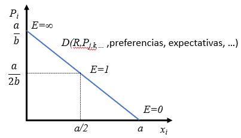
```

$$
E_{P_i}=\bigg | \frac{\partial x_i}{\partial P_i} \bigg | \frac{P_i}{x_i}=b\frac{(a-x_i)/b}{x_i}=\frac{a-x_i}{x_i}
$$

De esta forma tenemos que la elasticidad en el corte de la demanda con el eje de abscisas la elasticidad es 0 (porque $x_i=a$); en el punto intermedio entre ese punto y el origen de coordenadas es 1 ($x_i=a/2$) y en corte con el eje de ordenadas es infinito ($x_i=0$), como muestra la @fig-fig27. Es llamativo que en una función relativamente sencilla como es la lineal la elasticidad NO es constante, sino que toma todos los valores posibles, dependiendo del punto concreto en el que se mida. De hecho la demanda lineal tiene regiones en las que se comporta de forma inelástica ($E_{P_i} < 1$); otra en la que es elástica ($E_{P_i}>1$); y puntos concretos en los que es completamente elástica, inelástica y con elasticidad unitaria.

::: callout-important
## Importante

Recuerda que en la representación gráfica de las funciones de demanda y oferta se cambian los ejes de coordenadas, de forma que la variable exógena, el precio, se encuentra en el eje de ordenadas, mientras que la variable endógena, la cantidad, se representa en el eje de abcisas. Esto es importante a la hora de calcular las derivadas para las elasticidades y relacionarlas con su representación gráfica.
:::

:::: panel-tabset

## Resuelve {-}

¿Cuánto vale la elasticidad de una demanda vertical? ¿Y la de una demanda horizontal?

## Solución {-}

La demanda vertical tiene pendiente 0 ($\partial x_i / \partial P_i=0$) indicando que la demanda es completamente rígida. Es decir, es imposible cambiar la cantidad variando el precio. En ese caso la elasticidad será CERO en cualquier punto.

La demanda horizontal es el caso contrario, tiene pendiente infinito y su elasticidad será INFINITO. Es decir, es completamente elástica, una subida del precio por pequeña que sea reducirá la cantidad a cero, mientras que una reducción del mismo llevará a una cantidad infinita.
:::

Dado que el caso sencillo de demandas lineales tiene todo el rango de elasticidades posible, cabe entonces preguntarse si existe alguna función de demanda (que será no lineal) cuya elasticidad precio sea constante. Vamos a estudiar las funciones de demanda Cobb-Douglas como la de la @eq-demcobb.

$$
x_i=AP_i^aR^bP_j^cP_k^d
$$ {#eq-demcobb}

La elasticidad precio de la demanda será:

$$
E_{P_i}=\bigg | \frac{\partial x_i}{\partial P_i} \bigg | \frac{P_i}{x_i}=AaP_i^{a-1}R^bP_j^cP_k^d \frac{P_i}{AP_i^aR^bP_j^cP_k^d}=a
$$

Por tanto, en esta demanda la elasticidad es constante en todos sus puntos. La elasticidad renta será $b$ y las cruzadas $c$ y $d$, respectivamente.

:::: panel-tabset

## Resuelve {-}

¿Qué signos tienen todas las constantes de la demanda de la @eq-demcobb, teniendo en cuenta que el bien $j-$ésimo es sustitutivo de $x_i$ y el bien $k-$ésimo es complementario?

## Solución {-}

- La constante $A$ será siempre positiva para que la demanda sea positiva, es en realidad una "variable" en la que se puede incluir todo lo que no está explicítamente expresado en variables en la función, como el número de agentes. 
- $a$ será negativa, puesto que todas las demandas tienen pendiente negativa.
- $b$ será positiva para los bienes normales y negativa para los inferiores.
- $c$ será positiva al tratarse de un bien sustitutivo.
- $d$ será negativa por ser un bien complementario.
:::

:::: panel-tabset

## Resuelve {-}

Calcula la elasticidad precio de las siguientes ofertas, y di sin son Cobb-Douglas:

- $x_i=2P_i$.

- $x_i=10+2P_i$.

- $x_i=10P_i^{0,5}$.

## Solución {-}

- $x_i=2P_i$.

$$
E_{P_i}=\frac{\partial x_i}{\partial P_i} \frac{P_i}{x_i}=2\frac{x_i/2}{x_i}=1.
$$

La función es Cobb-Douglas y por tanto la elasticidad precio es el exponente del precio. Además, la función es también lineal.

- $x_i=10+2P_i$.

$$
E_{P_i}=\frac{\partial x_i}{\partial P_i} \frac{P_i}{x_i}=2 \frac{x_i-10}{2x_i}=\frac{x_i-10}{x_i}.
$$

La función no es Cobb-Douglas, de hecho es una función lineal. Esta función corta al eje de abcisas en $x_i=10$ y de ahí crece con pendiente 2. Para $x_i=10$ la elasticidad vale 0. A medida que la cantidad crece desde ese valor la elasticidad tiende a 1, por lo que se tratará siempre de una oferta inelástica.

- $x_i=10P_i^{0,5}$.

$$
E_{P_i}=\frac{\partial x_i}{\partial P_i} \frac{P_i}{x_i}=10 \times 0,5 P_i^{-0,5} \frac{P_i}{10P_i^{0,5}}=0,5.
$$

La función es Cobb-Douglas y por tanto la elasticidad precio es el exponente.
:::

::: callout-tip
## Las funciones de demanda y oferta Cobb-Douglas
Las funciones tipo Cobb-Douglas tienen además otras ventajas para el trabajo empírico. Considera la función de demanda empírica siguiente en la que $\epsilon$ es un ruido aleatorio, lo que implica que no toda la varianza de la demanda está explicada por las variables exógenas:

$$
x_i=AP_i^aR^bP_j^cP_k^d\epsilon
$$

Si en esta función tomamos logaritmos queda 

$$
\log x_i=\log A + a \log P_i +b \log R + c \log P_j + d \log P_k + \log \epsilon,
$$

o bien, 

$$
x_i^*=A^* + a P_i^* +b R^* + c P_j^* + d P_k^* + \epsilon^*,
$$

que es una función lineal en logaritmos. Esta última ecuación indica que la transformación logarítmica de una función Cobb-Douglas es lineal y el tratamiento estadístico es mucho más sencillo. Es decir, las elasticidades se pueden estimar a partir de esta forma lineal. Además, suele suceder que la distribución del ruido $\epsilon^*$ es más próximo a la distribución normal.
:::

## Aplicaciones

### Ingreso total y elasticidad

El **ingreso total** es la cantidad monetaria que percibe un empresario por las ventas que realiza su empresa. Su cálculo es muy sencillo, pues basta con multiplicar el precio por unidad de cada producto por la cantidad vendida de cada producto, es decir, $IT=P_i x_i$. A menudo los empresarios querrán saber cómo varía esta magnitud cuando cambian los precios de su producto. La cuestión no es trivial, puesto que sabemos que si el precio sube, *ceteris paribus*, la cantidad que van a demandar los clientes será inferior. De esta forma tenemos que las dos variables que conforman el ingreso total varían en sentido opuesto, haciendo, en principio, el resultado difícil de prever.

```{r fig-fig28, echo=FALSE, fig.cap='Una demanda lineal y el ingreso total.', fig.align='center', out.width="70%"}
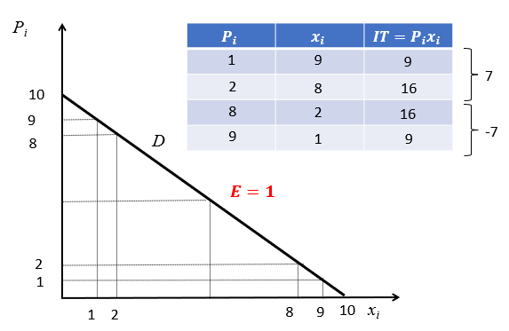
```

Vamos a analizar esta cuestión en una demanda lineal cuya ecuación es $x_i=10-P_i$, como la de la @fig-fig28. Supongamos que el precio se incrementa pasando de 1 a 2. En ese caso la cantidad pasaría de 9 a 8 unidades y el ingreso total de 9 a 16, por tanto aumentaría. Es fácil comprobar, además, que la elasticidad es inferior a la unidad en esos dos puntos. Supongamos ahora un caso en el que el precio aumenta también un euro, pero pasando de 8 a 9, en ese caso la cantidad se reduciría de 2 a 1 y el ingreso total se reduciría de 16 a 9. Nuevamente, se puede comprobar que en esos dos puntos la elasticidad es superior a la unidad.

En resumen, el mismo incremento en el precio provoca un incremento del ingreso total cuando la demanda es rígida (elasticidad inferior a la unidad) y una reducción cuando la demanda es elástica. En realidad, esto tiene su lógica, puesto que si la demanda es rígida implica que es insensible al precio, por lo que subir el precio va a cambiar poco la cantidad de forma que el ingreso subirá. Cuando la demanda es elástica la subida del precio va a provocar una caída tan grande de la cantidad que el producto de las dos acaba cayendo.

::: callout-tip
## Impuestos y elasticidad

Algo parecido al ingreso total sucede con los impuestos y la recaudación. Compruébalo:

::: columns
::: {.column width="10%"}
:::
::: {.column width="80%"}

:::
::: {.column width="10%"}
:::
:::

:::


:::: panel-tabset
## Resuelve {-}

¿Cómo varía el ingreso total en la demanda tipo *Cobb-Douglas* $x_i=aP_i^{-b}$ cuando aumenta el precio?

## Solución {-}

La pregunta se puede responder muy fácilmente, sabiendo que la elasticidad precio es $b$. Si $b<1$ la demanda es rígida y un incremento del precio provocará un incremento del ingreso total. Lo contrario sucede con $b>1$. Lo curioso es que si la elasticidad es uno, entonces el ingreso total es constante.

Otra forma de verlo es dándose cuenta de que el ingreso total es $IT=P_ix_i=aP_i^{1-b}$, de donde se tienen las mismas conclusiones que antes. En el caso de elasticidad unitaria el ingreso total es $a$.
:::

::: callout-tip
## La anécdota de los bienes Giffen y Veblen

Los bienes Giffen son bienes con elasticidad precio positiva. ¿Crees que existen? [En esta noticia](https://www.elmundo.es/elmundo/2013/09/02/economia/1378109612.html){target="_blank"} se dice que la patata es uno de esos bienes en España en una situación concreta. ¿Estás de acuerdo?

Los bienes Veblen son bienes exclusivos que atraen precisamente por su precio y el status que suponen exhibirlos en público o decir que se poseen. Se suele afirmar que atraen precisamente por el elevado precio que tienen con lo cual la demanda tiene elasticidad positiva. Pero no es cierto, puesto que si el precio fuera muy bajo, su demanda sería enorme y a medida que crece la cantidad deseada se reduce (elasticidad negativa).
:::

::: panel-tabset
## Resuelve {-}

Busca noticias sobre destrucción de cosechas. ¿Por qué destruyen las cosechas algunas veces los agricultores? ¿Tiene relación con la elasticidad de demanda?

## Solución {-}

La destrucción supone una reducción de la oferta de dichos bienes, por lo que su precio tenderá a subir. La subida del precio incrementará los ingresos de los productores si, y solo si, las demandas de productos agrícolas son inelásticas. Esto debe ser así, puesto que los agricultores recurren a esta estrategia en numerosas ocasiones.
:::

### Mercados intervenidos

Por simplicidad en este capítulo nos hemos centrado siempre de mercados en equilibrio y de competencia perfecta, pero las conclusiones a las que llegamos son generalizables para muchos mercados imperfectos y para situaciones de desequilibrio.

En muchos ocasiones hay autoridades con capacidad coactiva que *intervienen los mercados*, es decir, imponen restricciones en los mercados impidiendo que alcancen el equilibrio que surgiría de forma espontánea en el mercado. En general, todas las autoridades y economistas partidarios del libre mercado (normalmente liberales) estarán en contra de este tipo de acciones. Serán todos aquellos de corte socialdemócrata y más radicales los que ven la necesidad de regular e intervenir los mercados. Estas intervenciones pueden ser de muchos tipos, fijando precios mínimos y máximos, imponiendo cuotas de producción, estableciendo impuestos y subvenciones, desarrollando planes industriales para dirigir sectores en una determinada dirección, creando monopolios por ley, etc.

Como ilustración vamos a introducir brevemente el establecimiento de precios máximos y mínimos en los mercados. Imaginemos un mercado en equilibrio en el que el gobierno establece un precio máximo legal por el que no se puede intercambiar ese bien a precios superiores. Naturalmente, para que este precio límite tenga algún efecto tiene que establecerse por debajo del precio de equilibrio. Las razones pueden ser muy diversas, pero en general serán que se considera que los precios de equilibrio son abusivos beneficiando artificialmente a los productores y perjudicando a los demandantes. Dos casos reales son, por ejemplo, los precios máximos en los alquileres en determinadas zonas de grandes ciudades y los precios de la energía eléctrica al consumidor final en España (que ha dado lugar al déficit de tarifa). 

```{r fig-fig29, echo=FALSE, fig.cap='Establecimiento de precios máximos y mínimos.', fig.align='center', out.width="75%"}
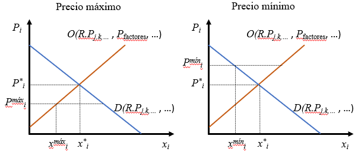
```

El panel izquierdo de la @fig-fig29 muestra el caso de un mercado en el que se establece un precio máximo ($P_i^{máx}$). En ese caso, el punto donde se situará el mercado viene dado por las coordenadas ($x_i^{máx}$, $P_i^{máx}$). Dado que el precio es muy bajo, la oferta es inferior a la de equilibrio y la demanda superior, esto hace que aparezca un exceso de demanda que el mercado no puede desechar por la restricción. Eso quiere decir que muchos demandantes se quedarán sin producto y de hecho estarán dispuestos a pagar precios superiores, que serán ilegales. Es muy importante que en realidad esta restricción está perjudicando a muchos demandantes, que son aquellos que se pretendía beneficiar. También perjudica a los productores, puesto que preferirían producir más y vender más caro, cosas que son posibles dadas las curvas de demanda y oferta. El problema aquí es que algunos demandantes tendrán el producto a precio muy bajo, pero hay otros que se ven perjudicados y, puesto que no se puede satisfacer toda la demanda, habrá que arbitrar un sistema de adjudicación del bien.

:::: panel-tabset

## Resuelve {-}

Dos economistas se enfrentan amargamente acerca de cómo abaratar los altos alquileres que se pagan en su ciudad. Uno de ellos opina que lo mejor es imponer precios máximos a los alquileres. El otro, sin embargo, dice que el problema es que habría que crear condiciones favorables para que sea posible construir más barato mediante la liberalización de suelo por parte de los ayuntamientos.

Comenta las ventajas e inconvenientes de ambas opciones.

## Solución {-}

```{r echo=FALSE, fig.align='center', out.width="70%"}
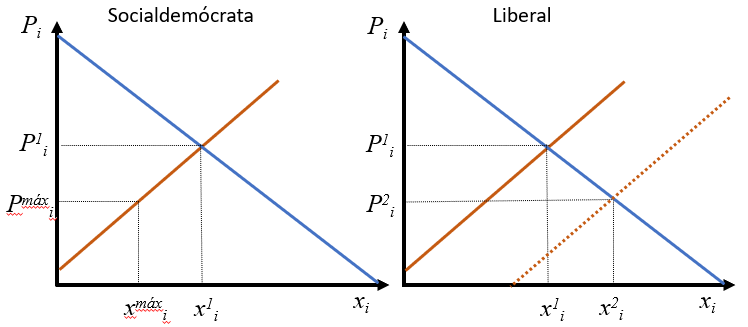
```

Partimos de la situación inicial de equilibrio ($x_i^1$, $P_i^1$), que se juzga insatisfactoria porque se considera que el precio es abusivo. La solución socialdemócrata nos lleva al punto ($x_i^{máx}$, $P_i^{máx}$) y la liberal a ($x^2$, $P_i^2$). El gráfico está hecho de forma que $P_i^{máx}=P_i^2$. 

El precio de las dos soluciones es el mismo, pero cuando se impone un precio máximo la cantidad de vivienda es inferior. Pero el mayor problema es que el mercado está en desequilibrio y hay una parte de los compradores que se quedan sin vivienda, aparte de que los constructores son conscientes de que hay más negocio que no pueden satisfacer por la restricción. 
:::

El razonamiento anterior se puede replicar exactamente igual para el establecimiento de precios mínimos por encima del precio de equilibrio (panel derecho de la @fig-fig29). El punto de *desequilibrio* será ($x_i^{mín}$, $P_i^{mín}$). En este caso, el desequilibrio consiste igualmente en que la cantidad que se intercambia en el mercado es inferior a la de equilibrio y se produce un exceso de oferta que el mercado no puede desechar por la restricción. El caso más típico es el salario mínimo interprofesional del mercado de trabajo.

Tanto en el caso de precios máximos como mínimos los propios agentes de ambos lados del mercado tienen incentivos a evadir la ley porque estarían mejor, y esto lleva a que, si la autoridad quiere de verdad mantener en el tiempo la restricción, tiene que imponer un sistemas férreo de control del mercado.

:::: panel-tabset

## Resuelve {-}

Ilustra gráficamente una situación de desempleo en el mercado de trabajo. ¿Qué sucedería si hubiera un incremento de población importante como consecuencia de la afluencia masiva de inmigración?

## Solución {-}

```{r echo=FALSE, fig.align='center', out.width="35%"}
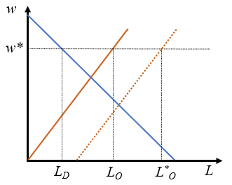
```

La situación inicial de desequilibrio es el punto ($w^*$, $L_D$) en el que existe un exceso de oferta de trabajo o desempleo dado por $L^O-L^D$. La afluencia de trabajadores incrementa la oferta de trabajo. Si el mercado funcionara sin restricciones se tendría más trabajo a un salario inferior de equilibrio. Pero, dada la restricción, el incremento de oferta hace que el nuevo punto de desequilibrio sea ($w^*$, $L_D^*$), que implica mantener el salario, pero incrementar el paro. Es decir, hay más trabajadores disponibles (o más población activa), pero más paro.
:::

### Excedente del consumidor y productor

Como ya vimos, la demanda *proporciona el precio máximo que el consumidor está dispuesto a pagar por una determinada cantidad de un bien*. Si por alguna razón el precio que efectivamente paga el consumidor fuera inferior al que está dispuesto a pagar obtendría un beneficio que se podría medir en términos monetarios y que llamaremos excedente.

Así, en la @fig-fig30, para la cantidad $x_i^0$, el **excedente del consumidor** será la diferencia entre el precio que indica la demanda para esa cantidad ($P_i^D$) y lo que efectivamente se paga ($P_i^1$, el excedente será $P_i^D-P_i^1$). Si el razonamiento se repite para todos los precios por encima del de equilibrio y los sumamos tenemos que el excedente se puede medir como la superficie por debajo de la demanda hasta el precio de mercado.

```{r fig-fig30, echo=FALSE, fig.cap='Excedente del consumidor y del productor.', fig.align='center', out.width="35%"}
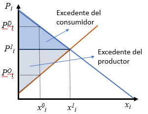
```

Un análisis similar se podría realizar sobre la oferta. La curva de oferta nos indicaría *el precio mínimo que están dispuestos a aceptar los productores para cada cantidad de producto*. Como todas las cantidades se cobran al precio de equilibrio, la superficie por encima de la curva de oferta hasta el precio de equilibrio será el **excedente del productor** (para la cantidad $x_i^0$ es $P_i^1-P_i^O$).
 
La suma de ambos excedentes se llama a veces el **beneficio social neto** o **excedente total**, y es fácil comprobar que es máximo para el precio de equilibrio. Cualquier otro precio conduciría a un excedente total inferior.

::: callout-important
## Importante

Las superficies en el plano ($x_i$, $P_i$) tiene unidades, son euros, puesto que la cantidad son unidades físicas y el precio es precio por unidad física. De aquí obtenemos que, como el excedente del consumidor es una superficie en ese plano, el excedente se está midiendo en euros.
:::

::: panel-tabset
## Resuelve {-}

¿Cómo varían los excedentes si aumenta la renta de los consumidores en mercados de bienes normales por una reducción del impuesto sobre la renta?

## Solución {-}

```{r echo=FALSE, fig.align='center', out.width="35%"}
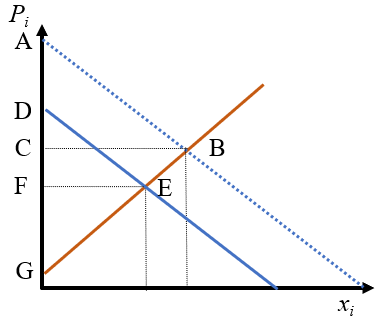
```

El excedente del consumidor pasa del triángulo DFE a ABC, es decir, aumenta. El excedente de los productores pasa de FEG a CBG, con lo cual también aumenta. Una lección interesante de esta cuestión es que un incremento de renta que beneficia directamente a los consumidores acaba beneficiando también a los productores por la conexión que produce el mercado entre todos los agentes. ¡La reducción de impuestos a un tipo de agentes beneficia a toda la sociedad! El único que se perjudicaría, sería el sector público al tener menos ingresos.
:::

::: panel-tabset
## Resuelve {-}

¿Cómo varían los excedentes si se establece un precio mínimo?

## Solución {-}

```{r echo=FALSE, fig.align='center', out.width="35%"}
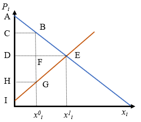
```

El excedente del consumidor pasa de ser el triángulo ADE al triángulo ABC, lo que implica un perjuicio para los consumidores por la reducción drástica de su excedente. Por el contrario, el excedente del productor pasa de DEI a BCIG, con lo cual se pierde el triángulo FEG, pero se gana BCDF. No es posible determinar en general si el excedente del productor aumenta o se reduce, pero lo que sí queda claro es que los productores arrebatan a los consumidores la superficie en BCDF. Conjuntamente, todo el excedente se reduce de AEI a ABGI, y el triángulo BGE se pierde.

Queda claro que el precio mínimo perjudica a la sociedad en su conjunto, pero los más perjudicados son los consumidores.
:::

## Cuestiones y problemas

### Cuestiones y problemas resueltos

:::: panel-tabset
##  {.unnumbered}
1. ¿Cómo afecta a un mercado de productos químicos la imposición de una ecotasa por unidad de producto que tienen que pagar los empresarios del sector por la contaminación que producen, y a la vez se produce una reducción generalizada de los salarios en el sector?

## Solución {.unnumbered}

La ecotasa hace que la oferta se desplace a la izquierda, la reducción de salarios desplaza la oferta hacia la derecha. No podemos saber nada sin información adicional.
:::

:::: panel-tabset
##  {.unnumbered}
2. ¿Cómo afecta al mercado del vino el programa de arranque de viñas de la Organización Común de Mercado (OCM) del vino de la Comisión Europea, además de una subida del salario de los trabajadores del sector?

## Solución {.unnumbered}

La OCM supone una reducción de la oferta de vino (desplazamiento de la curva hacia la izquierda), la subida del salario es de nuevo una reducción de oferta, por lo que sin duda los precios subirán y se comercializará menos vino.
:::

:::: panel-tabset
##  {.unnumbered}
3. ¿Qué quiere decir que la elasticidad precio de un bien es 0,68? Si en un mercado con esa elasticidad de demanda subieran los precios un 10%, ¿cuánto se reduciría la cantidad demandada?

## Solución {.unnumbered}

Un incremento del precio de un bien de un 1% genera una caída del consumo del bien en 0,68%. 6,8%.
:::

:::: panel-tabset
##  {.unnumbered}
4. Comenta la frase: “los coches son bienes Giffen porque entre el año pasado y este los precios han bajado y las ventas también”.

## Solución {.unnumbered}

Esa frase es falsa, puesto que no se cumple la hipótesis de ceteris paribus, debido a que estamos tomando datos empíricos de la vida real.
:::

:::: panel-tabset
##  {.unnumbered}
5. ¿Qué demanda te parece más rígida, la de la gasolina o la de ordenadores IBM? ¿Cómo es la elasticidad de telefonía de una marca concreta?

## Solución {.unnumbered}

La de la gasolina es más rígida, el consumo varía muy poco con las variaciones de precios. Si suben los precios de los ordenadores IBM la gente comprará menos IBM y más de otros ordenadores, pero la cantidad de ordenadores IBM que se comprarán será menor.
:::

:::: panel-tabset
##  {.unnumbered}
6. ¿Cómo varía la elasticidad de una función de demanda lineal medida horizontalmente a medida que se desplaza paralelamente hacia la derecha? ¿Cómo varía la elasticidad verticalmente?

## Solución {.unnumbered}

Partimos del punto donde la elasticidad vale la unidad en la demanda inicial (A en la figura). En el punto B (cantidad igual) la elasticidad pasa a la zona donde la elasticidad es mayor que 1, por lo que el paso de A a B supone un crecimiento de elasticidad. Con el mismo razonamiento se puede ver que el paso de A a C supone una reducción de la elasticidad.

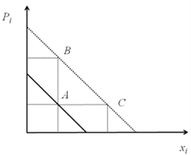{fig-align="center"}
:::

:::: panel-tabset
##  {.unnumbered}
7. ¿Cómo varía la elasticidad horizontalmente de una función de demanda lineal cuando pasa de $x_i=a-2bP_i$ a $x_i=a-bP_i$? ¿Cómo varía la elasticidad verticalmente?

## Solución {.unnumbered}

En este caso la demanda se desplaza como indica la figura. Si el punto A es nuevamente el punto medio, su elasticidad será 1. Pero ese será también el punto medio medido en vertical para la segunda demanda, por lo que la elasticidad en B también será 1 y en C será menor que 1.

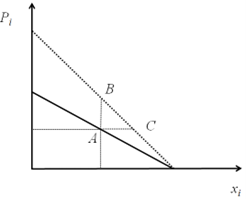{fig-align="center"}
:::

:::: panel-tabset
##  {.unnumbered}
8. La elasticidad precio de las demandas lineales depende del precio y/o la cantidad. ¿Se puede decir lo mismo de las curvas de oferta lineales? Examina el caso de $x_i=bP_i$  y $x_i=a+bP_i$. Calcula también la elasticidad de $x_i=bP_i^{0,8}$.

## Solución {.unnumbered}

La oferta $x_i=bP_i$ es tipo Cobb-Douglas con elasticidad unitaria.	La oferta $x_i=a+bP_i$ tiene elasticidad que varía con la cantidad, $E=\frac{\partial x_i}{\partial P_i} \frac{P_i}{x_i} =(b (x_i-a)/b)/x_i =(x_i-a)/x_i$. Para cantidades pequeñas la elasticidad tiende a infinito, y la elasticidad tiende a 1 a medida que la cantidad crece.
La oferta $x_i=bP_i^{0,8}$ es tipo Cobb-Douglas con elasticidad 0,8.

:::

:::: panel-tabset
##  {.unnumbered}
9. Si fueras un empresario, ¿preferirías una demanda infinitamente rígida o infinitamente elástica?

## Solución {.unnumbered}

Completamente rígida porque incrementos de precios no afectarían a la cantidad demandada y el ingreso total podría aumentar sin restricción.
:::

:::: panel-tabset
##  {.unnumbered}
10. ¿Cuál es la elasticidad de demanda de un mercado con 1.000 consumidores idénticos cuya función de demanda individual es $x_i=0,5P_i^{-0,1}R^{1,2}P_j^{0,3}P_k^{-0,8}$?

## Solución {.unnumbered}

La función de demanda de los 1.000 consumidores es la misma multiplicando por 1.000 la parte derecha de la ecuación. Como esto no afecta al exponente, la demanda tiene las mismas elasticidades que para un solo consumidor.
:::

:::: panel-tabset
##  {.unnumbered}
11. Si sabemos que un incremento de renta en un mercado de competencia perfecta no cambia los precios, ¿cuál es la elasticidad de demanda y oferta? ¿Y si no cambia la cantidad?

## Solución {.unnumbered}

La elasticidad de demanda puede ser cualquiera, pero la de oferta es infinito. Si no cambia la cantidad la elasticidad de oferta es 0.
:::

:::: panel-tabset
##  {.unnumbered}
12. Imagina  un mercado con funciones de demanda y oferta lineales. Se llama excedente del consumidor a la superficie triangular comprendida entre el precio de equilibrio y la curva de demanda. El excedente del productor es la superficie triangular por encima de la oferta hasta el precio de equilibrio. El excedente social es la suma de los dos excedentes. ¿Cómo varían los excedentes si se produce un incremento de la renta? ¿Y si se produce una reducción de oferta?

## Solución {.unnumbered}

Partiendo  de una situación inicial de equilibrio, tenemos que el excedente del consumidor es ABD y el del productor DBC. Si aumenta la demanda (gráfico izquierdo) el excedente del consumidor pasa a EFG, es decir, aumenta. El excedente del productor pasa a CFG y también aumenta. Por tanto un incremento de la demanda beneficia a todos.
Si se reduce la oferta (gráfico derecho) tenemos que ambos excedentes se reducen. Es decir, la reducción de la oferta perjudica a toda la sociedad.

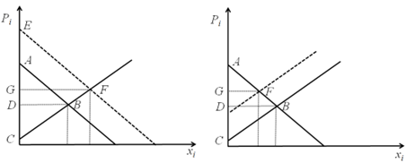{fig-align="center"}
:::

:::: panel-tabset
##  {.unnumbered}
13. ¿Cómo cambian los excedentes del consumidor, productor y social en un mercado intervenido en el que se establece un precio máximo? ¿Y si se establece un precio mínimo? Comenta la siguiente frase: “es deseable la existencia de un salario mínimo, dado que de esta forma se garantiza una renta mínima para todos los ciudadanos del país”.

## Solución {.unnumbered}

Partiendo de una situación inicial de equilibrio, tenemos que el excedente del consumidor es ABE y el del productor EBC. Si se establece un precio máximo al nivel del punto D (gráfico izquierdo) el excedente del consumidor pasa a AFGD, es decir, en general supondremos que aumenta. El excedente del productor pasa a DGC y se reduce. El precio máximo beneficia a los consumidores y perjudica a los productores. Pero hay la zona FBG se pierde, es decir, hay una pérdida de eficiencia respecto a la competencia perfecta.

Si se establece un precio mínimo al nivel de D (gráfico derecho) tenemos que el excedente del consumidor pasa a AFD y se reduce, mientras que el del productor pasa a DFGC y casi con seguridad aumenta. Es decir, el precio mínimo beneficia a los productores y perjudica a los consumidores. En cualquier hay una pérdida de eficiencia de FBG.

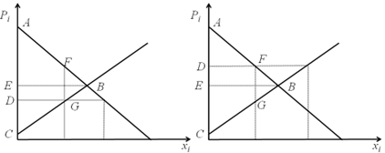{fig-align="center"}
:::

:::: panel-tabset
##  {.unnumbered}
14. ¿En cuál de los dos mercados oligopolísticos existe mayor concentración o poder de mercado utilizando el índice de Herfindahl?: a) 7 empresas con idéntica cuota de mercado que suman el 70% de la cuota de mercado más otra con el resto y b) 5 empresas con idéntica cuota de mercado.

## Solución {.unnumbered}

$$IH_a=7 \times 0,1^2+ 0,3^2=0,16$$
$$IH_b=5 \times 0,2^2=0,2.$$

En el segundo mercado hay mayor concentración.
:::

<!-- (@) Los precios de los productos informáticos descienden con mucha rapidez, pues la evolución de la técnica deja obsoleto en poco tiempo cualquier producto. Supongamos que la función de oferta de un tipo de ordenador es $x_i^O=1+2P_i$, mientras que su demanda es $10-P_i-A$, donde $A$ es el número de años que ha transcurrido desde que dicho ordenador apareció en el mercado. Representa gráficamente la curva de demanda para un ordenador que acaba de salir al mercado y calcula el precio y la cantidad de equilibrio. Representa gráficamente y calcula el precio y la cantidad cuando transcurren 10 años. -->

<!-- :::: panel-tabset -->
<!-- ##  {.unnumbered} -->
<!-- ## Solución {.unnumbered} -->

<!-- El precio de equilibrio es $P_i=(9-A)/3$ y la cantidad es $x_i=(21-2A)/3$, de modo que el precio y la cantidad se reducen a medida que aumentan los años. Esto se debe a que la demanda se va reduciendo paulatinamente. -->
<!-- ::: -->

:::: panel-tabset
##  {.unnumbered}
15. Explique el significado de la siguiente frase: “en un mercado en desequilibrio siempre domina el lado corto del mercado”. ¿Quién determina las cantidades que se intercambian en el mercado en esas condiciones?

## Solución {.unnumbered}

En el caso de un exceso de demanda (porque el precio es muy bajo) los consumidores quieren una cantidad muy grande, pero los productores producen mucho menos, por lo que se intercambiará en el mercado es la cantidad menor, la que producen los empresarios. En el caso de un exceso de oferta, el precio es tan alto que los empresarios producen más de lo que quieren los consumidores. Se intercambiará en el mercado la cantidad que quieren los consumidores. En ambos casos quien decide la cantidad es el menor de los dos, es decir “el lado corto”.
:::

:::: panel-tabset
##  {.unnumbered}
16. En el año 2000 surgió el escándalo conocido como las “vacas locas” que, básicamente, consistió en que una mala alimentación del ganado vacuno en GB provocó una crisis del sector por enfermedades del ganado que se podían transmitir a los humanos por el consumo. En consecuencia, se produjo un sacrificio masivo de ganado joven con el fin de evitar el contagio. En ese tiempo se produjo un incremento de los precios de las demás carnes, mientras que la de vacuno no se redujo. ¿Se corresponden estas observaciones con el funcionamiento normal del mercado, según lo explicado en el tema?

## Solución {.unnumbered}

El escándalo supone una reducción de la demanda de vacuno y mayor consumo de otras carnes y posiblemente otros tipos de alimentos. A la vez, el sacrificio del ganado vacuno supone una reducción de oferta del mismo. En resumen una reducción de demanda y oferta que lleva a que la cantidad de equilibrio se reduzca con un resultado incierto en los precios.

En el mercado de las demás carnes aumentaron las demandas, por lo que los precios aumentaron.
:::

:::: panel-tabset
##  {.unnumbered}
17. Demuestra que la función de ingresos totales para una función de demanda lineal tiene un máximo en el punto en que la elasticidad precio es exactamente la unidad.

## Solución {.unnumbered}

Una demanda lineal general será $x_i=a-bP_i$. El ingreso total será $IT=P_i x_i=(a-x_i)/b x_i=(ax_i-x_i^2)/b$. La maximización del ingreso se produce para $x_i=a/2$ y $P_i=a/(2b)$. La elasticidad de la demanda es $E=\bigg | \frac{\partial x_i}{\partial P_i} \bigg | \frac{P_i}{x_i}  = \frac{x_i-a}{x_i}$. Sustituyendo $x_i=a/2$ se obtiene que la elasticidad es 1.
:::

:::: panel-tabset
##  {.unnumbered}
18. ¿Crees que la elasticidad precio y renta del transporte público es igual en una ciudad grande que en una pequeña? ¿Dicha elasticidad ha sido la misma durante los últimos 30 años?

## Solución {.unnumbered}

En una ciudad grande la elasticidad es menor, la gente se ve más obligada a utilizarlo por problemas de congestión, coste, etc. La elasticidad se ha ido reduciendo a medida que las ciudades se han hecho más grandes y más complejas desde el punto de vista de la circulación.
:::

:::: panel-tabset
##  {.unnumbered}
19. *Problema avanzado:* Imagina un mercado con funciones de demanda y oferta lineales:

    a) ¿Cómo cambian las curvas y la solución de equilibrio cuando se introduce un impuesto indirecto, como el IVA?
    b) Si el impuesto es un 10% y el precio inicial de mercado es 100, ¿el precio final será 110? ¿Quién paga por tanto el impuesto?
    c) Identifica como superficies en el gráfico los excedentes de los consumidores, productores, social antes y después del impuesto, así como la recaudación.
    d) Responde a todas las preguntas anteriores con una demanda muy rígida y otra muy elástica. Repite con una oferta muy rígida y otra muy elástica.
    e)Si una vez que está establecido el impuesto se incrementa aún más, ¿Aumenta necesariamente la recaudación aumentando el IVA? Razona considerando las elasticidades de demanda y oferta.

## Solución {.unnumbered}

a) La consecuencia es que el precio que pagan los consumidores es diferente al que cobran los productores, la diferencia es precisamente el impuesto. El equilibrio pasa del punto B al F para los consumidores y G para los productores (F-G es el impuesto).

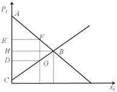{fig-align="center"}

b) El precio de mercado pasa de B a F, y el incremento es inferior a la cuantía del impuesto, que es F-G. El impuesto se reparte entre consumidores (F-B) y productores (B-G).
c) El excedente del consumidor se reduce de ABH a AFE. El excedente del productor se reduce de HBC a DGC. La recaudación es una parte de los excedentes iniciales EFGD. Pero hay una pérdida de excedentes que no se lleva nadie, FBG.
d) Si la demanda es completamente elástica el impuesto lo pagan totalmente los productores. Si la oferta es completamente elástica el impuesto lo pagan los consumidores. Por tanto, cuanto más elástica es la demanda más se perjudican los empresarios, cuanto más elástica es la oferta mayor es el prejuicio para los consumidores.
e) Si la demanda fuera muy elástica la recaudación podría caer. A los gobiernos les interesa subir impuestos indirectos de bienes con elasticidad pequeña.
:::

### Cuestiones y problemas propuestos

1. ¿Cómo afecta a un mercado de un bien normal una reducción de las cotizaciones sociales que pagan los empresarios por sus trabajadores y las que pagan los trabajadores simultáneamente?

2. Una empresa ha estimado que su función de demanda responde a la función $x_i=0,5P_i^{-0,1}R^{1,2}P_j^{0,3}P_k^{-0,8}$. ¿Cuánto valen todas las elasticidades de la demanda de ese bien? ¿Es el bien normal o inferior? ¿Cómo son los bienes j y k respecto al i? Si la empresa decide incrementar el precio del bien, ¿cuál será el efecto sobre el ingreso total?

3. Calcula la elasticidad de una función de oferta de un determinado producto sabiendo que la cantidad ofrecida pasa de 200 a 300 unidades cuando el precio pasa de 4 a 5 euros por unidad.

4. ¿Qué le sucede a la elasticidad de la demanda de juguetes cuando se acerca la Navidad?

5. Comenta la siguiente frase: “cuando aumenta la demanda suben los precios y la cantidad intercambiada, pero para que esto suceda los empresarios tienen que incrementar su oferta, lo que llevaría a reducciones del precio e incrementos de la cantidad”.

6. Si fueras ministro de economía y quieres aumentar la recaudación del Estado mediante un incremento de impuestos indirectos, ¿qué tipo de bienes y servicios crees que son idóneos para que el efecto sobre la recaudación sea más efectivo?

7. ¿Qué sucedería con la recaudación del impuesto sobre la renta si se sube el tipo impositivo a los ricos y para estos la elasticidad del impuesto respecto al tipo impositivo es superior a la unidad?

8. “Si destruimos la mitad de las reservas nacionales de un bien determinado, su precio se elevará tanto que la mitad restante será más valiosa, en términos económicos, que el total inicial. Por tanto, la asignatura de Gestión Empresarial nos impulsaría a proceder de este modo. Ello prueba hasta qué punto es absurda esta asignatura”.

## **Referencias** {-}

Academy Play (2023). Sistemas económicos explicados con vacas. [Archivo de vídeo]. Youtube. [Enlace](https://www.youtube.com/watch?v=aZJ1F-_kP7U&ab_channel=AcademiaPlay){target="_blank"}.

de Miguel, B., Baixauli, J.J. (2010), Empresa y Economía Industrial, Mc-Graw Hill.

El Mundo (2013). Las patatas, una excepción a la ley de demanda. Recuperado el 17 de mayo de 2023. [Enlace](https://www.elmundo.es/elmundo/2013/09/02/economia/1378109612.html){target="_blank"}.

Expansión (2023). Gasto público. Recuperado el 17 de mayo 2023.  [Enlace](https://datosmacro.expansion.com/estado/gasto){target="_blank"}.

Pedregal, D.J. (2011). Manual de Microeconomía. Todo lo imprescindible para entenderla. Ediciones Lulú. ISBN 978-1-4475-1725-2. [Enlace](https://www.lulu.com/es/shop/diego-jos%C3%A9-pedregal-tercero/microeconom%C3%ADa/paperback/product-16qw7j2n.html?page=1&pageSize=4){target="_blank"}.

Pedregal, D.J. (2011). Manual de Macroeconomía. Todo lo imprescindible para entenderla. Ediciones Lulú. ISBN 978-1-4477-1113-1. [Enlace](https://www.lulu.com/es/shop/diego-jos%C3%A9-pedregal-tercero/macroeconom%C3%ADa/paperback/product-12vngrz8.html?page=1&pageSize=4){target="_blank"}.

Pedregal, D.J.(2016). Economía para ingenieros, Ediciones Lulú. ISBN 978-1-326-73331-5. [Enlace](https://www.lulu.com/es/shop/diego-j-pedregal-tercero/econom%C3%ADa-para-ingenieros/paperback/product-14rgv4m5.html?q=pedregal&page=1&pageSize=4){target="_blank"}.

Pedregal, D.J. (2024). Mercados de energía [Archivo de vídeo]. Youtube. [Enlace](https://www.youtube.com/watch?v=wyIpASnY1YM){target="_blank"}.

Pedregal, D.J. (2024). Tres problemas económicos [Archivo de vídeo]. Youtube. [Enlace](https://www.youtube.com/watch?v=Ybk2P5DeulE){target="_blank"}.

Pedregal, D.J. (2024). Recaudación, impuestos y elasticidad [Archivo de vídeo]. Youtube. [Enlace](https://www.youtube.com/watch?v=aGaPKs71_I8){target="_blank"}.

Trapero, J.R., García, F.P., Pedregal, D.J. (2013). Dirección y Gestión Empresarial. Mcgraw-Hill. [Enlace](https://www.mheducation.es/direccion-y-gestion-empresarial-9788448190385-spain){target="_blank"}.

<!-- Vara, O. (2023). Europa interviene el precio de la electricidad. [Archivo de vídeo]. Youtube. [Enlace](https://www.youtube.com/watch?v=Rnv9boyfEDw&ab_channel=%C3%93scarVara){target="_blank"}. -->


<!-- ### Incidencia de los impuestos directos e indirectos -->

<!-- El estudio de las variaciones de los excedentes nos permite analizar la incidencia de los impuestos, es decir, quién paga efectivamente los impuestos. El tema no es tan evidente como puede parecer a simple vista, como demuestra este ejemplo sencillo: un impuesto especial a la banca hace que los bancos tengan que hacer una declaración adicional por dicho impuesto y tendrán que ingresar de su caja el importe correspondiente. Pero eso no quiere decir que ellos paguen todo el impuesto, puesto que pueden estar repercutiendo parte del mismo en los clientes, de forma que una parte lo pagan los clientes. Pero si suben los precios para repercutir el impuesto los bancos venderán menos, por lo que la incidencia global es complicada de analizar. Veámoslo. -->

<!-- #### Impuestos directos {.unnumbered} -->

<!-- El caso de los impuestos directos es relativamente sencillo, puesto que un incremento de los mismos llevará siempre a una reducción de los excedentes de consumidores y productores. La lección más interesante en este caso es que un impuesto a uno solo de los lados del mercado perjudica a todo el mundo. Solo beneficia al agente recaudador. -->

<!-- #### Impuestos indirectos {.unnumbered} -->


<!-- Subvenciones de 20 céntimos en litro de gasolina -->


<!-- ### Equilibrios simultános de mercado de bienes y factores con hoja excel? -->

