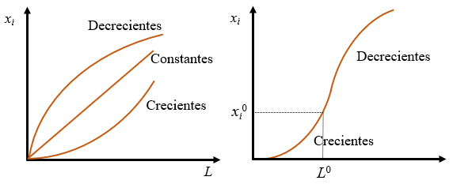
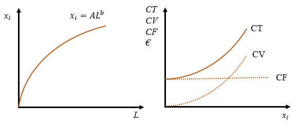
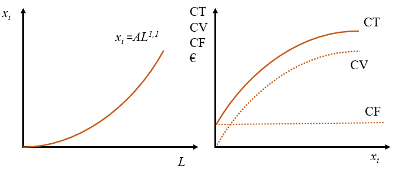
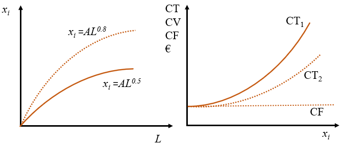

# Producción y costes {#sec-chap3}

La función de producción de la empresa consiste en crear bienes y servicios para satisfacer las necesidades de los clientes. Es un sistema que se alimenta de una serie de entradas, que son procesadas para generar unas salidas. En este libro nos vamos a mantener a un nivel general que nos permite englobar dentro del mismo esquema empresas tan dispares como una panadería de barrio o una central nuclear. 

## Objetivos de la dirección de la producción

Podemos destacar seis objetivos en la dirección de la producción (o **de operaciones**):

1. Reducción de costes para lograr mayor eficiencia.
2. Mejora de la calidad. En realidad este es un objetivo de toda la organización.
3. Aumento de flexibilidad, para poder adaptarse a los cambios continuos en el entorno, la demanda, etc. 
4. Cumplimiento de las entregas para mantener y aumentar la base de clientes.
5. Servicio al cliente. Cada vez con más frecuencia los bienes vienen acompañados de una serie de servicios adicionales que los hacen más atractivos.
6. Desde algunos años se ha añadido el cuidado del medio ambiente.

Aunque puede haber relaciones positivas entre estos objetivos, también hay conflictos. Basta con fijarse en el primero para ver que está en contradicción con todos los demás, puesto que un afán excesivo por reducir costes puede llevar a no cumplir con algunos de los demás.

La organización de la producción desde cero conlleva una serie de decisiones que podemos dividir en dos categorías:

1. **Estratégicas**: son aquellas decisiones con repercusión a largo plazo. Resultan cruciales para el futuro desarrollo de la empresa. Una mala elección de cualquiera de ellas puede hacerla inviable. Las principales son:

    - Decidir qué bienes o servicios se van a producir.
    - Tecnología que se va a usar.
    - Planificación de trabajo. Cantidad, competencias, organización.
    - Capacidad a largo plazo, relacionado estrechamente con el tamaño de la empresa.
    - Localización de la empresa.
    - En aquellos empresas que conllevan producción física, es muy importante seleccionar una buena distribución en planta.
2. **Tácticas**: son aquellas decisiones a corto plazo, por tanto más rutinarias y estructuradas. Si bien son importantes, pueden modificarse en el curso de la producción a medida que se detecten errores. Por su naturaleza se trata de multitud de decisiones en muchos ámbitos, como en la satisfacción de la demanda, el control de la planificación, flujo de materiales, etc. Hay dos ámbitos especialmente relevantes con un impacto importante en los costes:

    - **Cadena de suministro** que integra y sincroniza los  flujos  de  materiales,  los  servicios  y  la  información  que  se  producen  con  los  proveedores  y  con  los  clientes.
    - **Gestión de inventarios** mediante técnicas para calcular cuánto y cuándo pedir entradas de forma que no se produzcan *roturas de stock* ni haya costes excesivos de almacenamiento.

## La función de producción

Para conseguir los objetivos de la empresa, el empresario tiene que combinar toda una serie de factores de producción, además de organizar todas las áreas de la empresa (logística, recursos humanos, finanzas, etc.) y utilizar procesos, procedimientos, métodos y técnicas para que la producción se haga de forma **eficiente** y con **eficacia**. La eficacia es la capacidad de cumplir con la finalidad que se desea. La eficiencia implica además hacerlo con el uso mínimo de recursos posible y en general se mide a través de la **productividad** que es un cociente entre algún tipo de producto y recursos utilizados en su consecución (o, más en general como el cociente entre salidas y entradas).

En todo proceso productivo hay que tener en cuenta aspectos técnicos y económicos:

- Los aspectos **técnicos** tienen que ver con el hecho de que la producción supone la transformación física de entradas, que desaparecen como tales, en salidas. No siempre existe transformación física, como es el caso de las empresas de distribución. Una empresa que simplemente distribuya un producto también produce un servicio, se puede decir que también está transformando recursos para producir un servicio, es decir, también está produciendo. 
- De nada sirve conocer una forma novedosa de producir un producto nuevo si los aspectos **económicos** no acompañan. Podemos dividirlos en dos tipos:
  - El hecho de producir lleva ineludiblemente a incurrir en **costes de producción**. La compra de factores de producción y toda la organización de la empresa consume recursos. El empresario estará interesado en encontrar la combinación eficiente de factores que consiga el mayor nivel de producción para un nivel de coste dado, o bien el mínimo coste para un nivel de producción dado. Un producto que resulta excesivamente costoso será difícilmente comercializable, por muy importante que sea la necesidad que intenta satisfacer.
  - La **demanda** del producto es fundamental. Un producto que en la mente del empresario resuelve problemas cruciales de la Humanidad, pero que no sea percibido así por los potenciales clientes está condenado al fracaso, aunque se sepa cómo producirlo y se haga de forma eficiente. El empresario está irremisiblemente ligado a sus clientes e intentará que sean fieles, cosa que resulta muy complicado, porque la demanda puede ser muy caprichosa.

Matemáticamente, la función de producción se puede formular como la @eq-fp. Se puede definir como una relación entre la cantidad de un bien o servicio $x_i$ y los factores de producción necesarios para obtenerlo por unidad de tiempo. Se suele utilizar $K$ para designar el capital y $L$ como trabajo. Si la unidad de tiempo es lo suficientemente corta como para que algunos factores de producción no puedan cambiar, podremos distinguir entre **factores fijos**, aquellos que no pueden cambiar en el corto plazo, y **factores variables**, aquellos que sí pueden variar. 

$$
x_i = f(K, L, M, \dots)
$$ {#eq-fp}

::: callout-important
## Importante

Los factores fijos son necesarios en una determinada proporción y son independientes del nivel de producción, mientras que los variables dependen del nivel de producción. Si la producción es nula el coste fijo tiene una cantidad determinada, pero el coste variables será cero. Si se produce mucho el coste fijo será el mismo, pero el coste variables será muy grande.

Los costes fijos, sin embargo, pueden variar en el tiempo, porque la definición de coste fijo se hace respecto al nivel de producción.

A largo plazo, por definición, todos los factores son variables.
:::

:::: panel-tabset

## Resuelve {-}

Haz una enumeración de los factores de producción fijos y variables de Mercadona para un plazo de seis meses.

## Solución {-}

Factores variables: prácticamente el único factor variable son los productos que vende.

Factores fijos: energía, personal, alquileres o propiedad de edificios y otro inmovilizado, seguros, etc.

Aunque en este ejemplo el factor trabajo (personal contratado) se considera fijo, puesto que los sueldos se pagan independientemente de que se venda mucho o poco, en general se va a considerar un factor variable.
:::

No toda función matemática es una auténtica función de producción, puesto que tiene que ser al menos monótona creciente, es decir, cualquier aumento de cualquiera de los factores tiene que producir un aumento de producción o al menos tiene que dejar la producción sin variar, pero nunca puede provocar una disminución. Los factores, además, podrán ser sustitutivos unos de otros si luchan entre sí por hacerse un sitio en el proceso productivo, o complementarios si se tienen que utilizar conjuntamente. 

::: callout-tip
## Factores fijos y variables

Al hablar de funciones de producción abstractas se suelen considerar funciones con dos factores de producción: trabajo (representando a los factores variables) y capital (factores fijos).
:::

Un aspecto crucial de las funciones de producción es el concepto de **rendimiento a escala**, que indica la forma cómo varía la producción cuando cambia la escala de producción, cuando los factores de producción varían en una determinada proporción. Los rendimientos pueden ser **constantes**, **crecientes** o **decrecientes** cuando al incrementar todos los factores de producción simultáneamente en una proporción, la producción aumenta en la misma proporción, en una proporción mayor o menor, respectivamente. Si esa constante es 2 diremos que los rendimientos son constantes, crecientes o decrecientes cuando al duplicar todos los factores de producción simultáneamente la producción queda multiplicada por 2, más de 2 o menos de 2, respectivamente.

:::: panel-tabset
## Resuelve {-}

Calcula los rendimientos de las siguientes funciones de producción Cobb-Douglas utilizando su definición ($A$, $a$ y $b$ son constantes positivas):

- $x_i=f(L)=AL^{0,5}$.
- $x_i=f(L)=AL$.
- $x_i=f(L)=AL^{1,1}$.
- $x_i=f(L)=AL^a$.
- $x_i=f(L,K)=AL^aK^b$.

## Solución {-}

- $x_i=f(L)=AL^{0,5}$.

Si multiplicamos todos los factores de producción por una constante arbitraria $m>1$ tenemos

$$
f(mL)=A(mL)^{0,5}=m^{0,5}AL^{0,5}=m^{0,5}f(L),
$$
de donde se obtiene que los rendimientos son decrecientes. Si la constante es 2 tenemos que duplicando los factores de producción hacen crecer la producción en $\sqrt 2$ solamente.

- $x_i=f(L)=AL$.

Se trata de una función lineal (que además es Cobb-Douglas).

$$
f(mL)=A(mL)=mAL=mf(L).
$$

- $x_i=f(L)=AL^{1,1}$.

Tiene rendimientos crecientes, puesto que 

$$
f(mL)=A(mL)^{1,1}=m^{1,1}AL^{1,1}=m^{1,1}f(L)
$$

Duplicar los factores significa incrementar la producción en más del doble.

- $x_i=f(L)=AL^a$.

Este caso engloba como casos particulares a todos los anteriores.

$$
f(mL)=A(mL)^{a}=m^{a}AL^{a}=m^{a}f(L)
$$

La función tendrá rendimientos crecientes si $a>1$, constantes si $a=1$ y decrecientes si $a<1$.

- $x_i=f(L,K)=AL^aK^b$.

Este es un caso Cobb-Douglas con dos factores de producción.

$$
f(mL,mK)=A(mL)^{a}(mK)^b=m^{a+b}AL^{a}K^b=m^{a+b}f(L)
$$

Ahora los rendimientos serán crecientes si $a+b>1$, constantes si $a+b=1$ y decrecientes si $a+b<1$.
:::

::: columns
::: {.column width="10%"}
:::
::: {.column width="80%"}

:::
::: {.column width="10%"}
:::
:::

::: callout-important

## ¡Cuidado!

Los tipos de rendimiento se han definido para incrementos de factores. En el caso de reducciones el razonamiento se invierte (probar con constante $m<1$ en los casos anteriores). El lector debe asegurarse de entender la siguiente frase para estar seguro de que se entiende el concepto: *si al reducir todos los factores de producción a la mitad la producción se reduce a menos de la mitad (por ejemplo, a la cuarta parte) los rendimientos son CRECIENTES*. 

:::

El cálculo de los rendimientos de una función de producción se puede realizar utilizando la definición directamente o mediante el signo de la forma cuadrática en la @eq-fc, que en definitiva analiza la convexidad de la función de producción. Si $F<0$ los rendimientos serán decrecientes, $F=0$ será indicativo de que los rendimientos son constantes y $F>0$ implicará rendimientos crecientes.

$$
F = \left[ \begin{array}{cccc} K & L & M & \dots \end{array} \right]
    \left[ \begin{array}{cccc} 
      \frac{\partial ^2 f}{\partial K^2} & \frac{\partial ^2 f}{\partial K \partial L} &                \frac{\partial ^2 f}{\partial K \partial M} & \dots \\ 
      \frac{\partial ^2 f}{\partial L \partial K} & \frac{\partial ^2 f}{\partial L^2} &                \frac{\partial ^2 f}{\partial L \partial M} & \dots \\
      \frac{\partial ^2 f}{\partial M \partial K} & \frac{\partial ^2 f}{\partial M \partial L} &                \frac{\partial ^2 f}{\partial M^2} & \dots \\
      \vdots & \vdots & \vdots & \ddots
    \end{array} \right]
    \left[ \begin{array}{c} K \\ L \\ M \\ \vdots \end{array} \right]
$$ {#eq-fc}

:::: panel-tabset
## Resuelve {-}

Calcula los rendimientos de las siguientes funciones de producción utilizando la forma cuadrática de la @eq-fc ($A$, $a$ y $b$ son dos constantes positivas):

- $x_i=f(L)=AL^{0,5}$.
- $x_i=f(L)=AL$.
- $x_i=f(L)=AL^{1,1}$.
- $x_i=f(L)=AL^a$.
- $x_i=f(L,K)=AL^aK^b$.
- $x_i=f(L,K)=ln(LK + 1)$

## Solución {-}

- $x_i=f(L)=AL^{0,5}$.

Al tratarse de una función con un solo factor de producción el signo de la forma cuadrática es el mismo que de la segunda derivada de la función, por tanto:

$$
\frac{\partial f}{\partial L}=A0,5L^{-0,5}; \,\,\,\, \frac{\partial^2 f}{\partial L^2}=A0,5(-0,5)L^{-1,5}<0.
$$
Los rendimientos son decrecientes porque el signo de la forma cuadrática es negativo.

- $x_i=f(L)=AL$.

$$
\frac{\partial f}{\partial L}=A; \,\,\,\, \frac{\partial^2 f}{\partial L^2}=0.
$$
Rendimientos constantes.

- $x_i=f(L)=AL^{1,1}$.

$$
\frac{\partial f}{\partial L}=A1,1L^{0,1}; \,\,\,\, \frac{\partial^2 f}{\partial L^2}=A1,1(0,1)L^{-0,9}>0.
$$

Rendimientos crecientes.

- $x_i=f(L)=AL^a$.

$$
\frac{\partial f}{\partial L}=AaL^{a-1}; \,\,\,\, \frac{\partial^2 f}{\partial L^2}=Aa(a-1)L^{a-2}.
$$

El signo del hessiano es el mismo que el signo de $a-1$, por tanto, la función tendrá rendimientos crecientes si $a>1$, constantes si $a=1$ y decrecientes si $a<1$.

- $x_i=f(L,K)=AL^aK^b$.

Calculando las derivadas primeras y segundas:

$$
\begin{array}{ll}
\frac{\partial f}{\partial L}=AaL^{a-1}K^b & \frac{\partial^2 f}{\partial L^2}=Aa(a-1)L^{a-2}K^b \\
\frac{\partial f}{\partial K}=AbL^aK^{b-1} & \frac{\partial^2 f}{\partial K^2}=Ab(b-1)L^{a}K^{b-2} \\
\frac{\partial^2 f}{\partial K\partial L}=AabL^{a-1}K^{b-1} & \\
\end{array}
$$

La forma cuadrática es

$$
\begin{array}{rl}
F= & \left[ \begin{array}{cc} L & K \end{array} \right]
\left[ \begin{array}{cc} Aa(a-1)L^{a-2}K^b &  AabL^{a-1}K^{b-1} \\
        AabL^{a-1}K^{b-1} & Ab(b-1)L^{a}K^{b-2}\end{array} \right]
\left[ \begin{array}{c} L \\ K \end{array} \right]= \\
= &\left[ \begin{array}{c} Aa(a-1)L^{a-1}K^b+AabL^{a-1}K^{b} \\ AabL^{a}K^{b-1}+Ab(b-1)L^{a}K^{b-1} \end{array} \right]'
\left[ \begin{array}{c} L \\ K \end{array} \right]=\\
=& Aa(a-1)L^{a}K^b + 2AabL^{a}K^{b}+Ab(b-1)L^{a}K^{b}=\\
=& A[a^2-a+2ab+b^2-b]L^{a}K^{b}\\
=&A[(a+b)(a+b-1)]L^{a}K^b
\end{array}
$$

El signo depende del signo de $a+b-1$, de donde se obtiene que si $a+b=1$ los rendimientos son constantes, si $a+b<1$ los rendimientos son crecientes y si $a+b>1$ los rendimientos son crecientes. Como se ve el proceso es mucho más engorroso que aplicar directamente la definición.

- $x_i=f(L,K)=ln(LK + 1)$.


$$
\begin{array}{ll}
\frac{\partial f}{\partial L}=K/(LK+1) & \frac{\partial^2 f}{\partial L^2}=-K^2/(LK+1)^2 \\
\frac{\partial f}{\partial K}=L/(LK+1) & \frac{\partial^2 f}{\partial K^2}=-L^2/(LK+1)^2 \\
\frac{\partial^2 f}{\partial K\partial L}=1/(LK+1)^2 &\\
\end{array}
$$

Al tener todas las derivadas segundas el mismo divisor positivo, el signo de la forma cuadrática será el mismo que otra equivalente en la que se prescinde de todos los denominadores. Tenemos

$$
\begin{array}{rl}
F= & \left[ \begin{array}{cc} L & K \end{array} \right]
\left[ \begin{array}{cc} -K^2 &  1 \\
        1 & -L^2 \end{array} \right]
\left[ \begin{array}{c} L \\ K \end{array} \right]= \\
= &\left[ \begin{array}{cc} K-LK^2 & L-L^2K \end{array} \right]
\left[ \begin{array}{c} L \\ K \end{array} \right]=\\
=& 2(LK-L^2K^2)\\
\end{array}
$$

Se trata de una función de producción que presenta todos los tipos posibles de rendimientos, puesto que el signo de la forma cuadrática depende de los valores que tomen $L$ y $K$. Los rendimientos serán decrecientes si $KL>1$, serán constantes siempre que $KL=1$ y crecientes cuando $KL<1$.
:::

::: callout-tip
## Empresas de distribución

Las empresas de distribución tienen rendimientos a escala constantes, puesto que no tienen un proceso de producción propiamente dicho en el que se transformen materias primas en productos terminados. Simplemente venden lo que compran aplicando un margen comercial.
:::

En el panel izquierdo de la @fig-fig31 se representa tres funciones de producción con los distintos tipos de rendimientos. Se puede considerar que se trata de una función que depende de un solo factor o una función de producción con varios factores, pero el gráfico se realiza para determinados valores fijos de todos los demás factores. No debemos olvidar que las funciones de producción pueden tener distintos tipos de rendimiento por regiones. Por ejemplo, la función del panel derecho muestra rendimientos crecientes para valores $L<L^0$ y decrecientes para el resto.

```{r fig-fig31, echo=FALSE, fig.cap='Funciones de producción con distintos tipos de rendimientos.', fig.align='center', out.width="70%"}

```

::: panel-tabset

## Resuelve {-}

Identifica los factores de producción que son necesarios para producir conocimiento de gestión empresarial. ¿Qué tipo de rendimientos tiene?

## Solución {-}

Existen factores fijos que son los materiales que se utilizan, los profesores, las clases, etc. El factor fijo más importante sin duda es la capacidad que tiene cada uno para asimilar la materia.

El factor variable por excelencia es el tiempo dedicado al estudio. Cuando los conocimientos son muy pequeños cualquier hora dedicada al estudio da la impresión de añadir mucho conocimiento (rendimientos crecientes), pero a medida que sabemos más y más de una materia nos cuesta más añadir conocimiento adicional (rendimientos decrecientes).
:::

::: panel-tabset

## Resuelve {-}

¿Qué rendimientos tiene la función de producción $x_i=-L^3+9L^2+100L$?

## Solución {-}

Al tratarse de una función con un solo factor de producción, los rendimientos dependen del signo de la segunda derivada. Por tanto

$$
\begin{array}{l}
\frac{\partial x_i}{\partial L} = -3L^2+18L+100 \\
\frac{\partial^2 x_i}{\partial L^2} = -6L+18 \\
\end{array}
$$
Esta segunda derivada será positiva (rendimientos crecientes) para valores $L<3$ y será negativa (rendimientos decrecientes) para valores $L>3$. Su representación gráfica se parece al panel derecho de la @fig-fig31.
:::

::: callout-important
## Importante

Recuerda que las funciones de producción pueden tener todos los tipos de rendimiento simultáneamente dependiendo de la región en la que se midan. De hecho, solemos pensar que tienen un tramo de rendimientos crecientes cuando se utilizan poco los factores y que se van convirtiendo en decrecientes a medida que los utilizamos con mayor intensidad.
:::

## Los costes

Hasta aquí hemos tenido en cuenta solo las consideraciones técnicas asociadas a la producción. Los costes son la primera consideración económica que hay que tener en cuenta. La segunda será la demanda y se especificará en el siguiente capítulo.

Los costes van inexorablemente unidos a la producción. Si se quiere producir mucho, habrá que utilizar muchos factores y por tanto se incurrirá en costes elevados. Al margen de esta cuestión elemental, lo que es relevante es asegurarse de que para cualquier nivel de producción que se elija se utiliza una combinación de factores que proporciona el menor coste posible. Otra forma de verlo es que, elegido un nivel de coste dado se consiga el mayor nivel de producción posible.

Los costes pueden ser **fijos** y **variables**. Los costes fijos son aquellos asociados a los factores fijos a corto plazo y por tanto son costes que no varían con el nivel de producción. Por el contrario, los variables son aquellos que varían con el nivel de producción porque van asociados a los factores variables. Llamamos **coste total** al gasto en el que incurre la empresa al utilizar determinadas combinaciones de factores en su proceso de producción. Su formulación es elemental,

$$
CT=CF+CV=rK+wL+hM+\dots
$$

En la ecuación anterior $r$, $w$ y $h$ son los precios por unidad de los factores $K$, $L$ y $M$, respectivamente. De forma que $rK$ es el gasto en unidades monetarias de la empresa por utilizar el factor $K$ y así sucesivamente. A su vez, el coste total se divide en coste fijo y variable, que serán los gastos en todos los factores fijos y variables, respectivamente. Así, si $K$ es el único factor fijo tendremos que $CF=rK$ y $CV=wL+hM+\dots$.

A lo largo de este capítulo hemos visto dos funciones que dependen de las mismas variables exógenas, la función de producción y de coste total. Esto hace que la producción $x_i$ y el coste total $CT$ estén relacionados entre sí. Obviamente, dadas cantidades de todos los factores y los precios por unidad de todos ellos obtenemos automáticamente la producción y el coste total que les corresponde. 

Un aspecto importante en este punto es subrayar que vamos a suponer que los mercados de factores y de bienes y servicios son de competencia perfecta. Eso quiere decir que para el empresario individual todos los precios están dados, son datos que tiene que asumir como le vienen, tanto si le favorecen como si le perjudican.

Lo anterior nos lleva a preguntarnos si podemos explicitar la relación que hay entre las dos funciones y la respuesta es sí. El caso de un solo factor es inmediato, pero no sucede lo mismo cuando tenemos varios factores, en cuyo caso hace falta manipulaciones adicionales.

Supongamos una función de producción Cobb-Douglas con un factor de producción fijo $K$ y otro variable $L$, es decir, $x_i = K^a L^b$. Hay que hacer notar que, puesto que $K$ no puede variar, en realidad $K^a$ es una magnitud fija positiva que podemos llamar $A$, con lo que la función de producción es $x_i=A L^b$. La función de producción se puede reescribir como $x_i=AL^b$, conde $A$ es una constante positiva. La función de costes totales es $CT=rK+wL=CF+CV=CF+wL$, donde $CF$ es una magnitud fija independiente del nivel de producción. Si asumimos rendimientos decrecientes, por ejemplo, $b=0,5$, la función de costes totales se puede escribir como

$$
CT=CF+wL=CF+w A^{-2} x_i^{2}.
$$

Esta expresión no depende de los factores de producción, aunque sí de sus precios. Hemos hecho en realidad un cambio de variable, pasando de una relación entre coste total y cantidades de factores al coste total en función del nivel de producción. La @fig-fig32 representa la función de producción y las funciones de coste total, fijo y variable de este ejemplo.

```{r fig-fig32, echo=FALSE, fig.cap='Función de producción con rendimientos decrecientes y funciones de coste total, fijo y variable asociadas.', fig.align='center', out.width="70%"}

```

::: panel-tabset

## Resuelve {-}

Considera la función de producción $x_i=AL^{1,1}$, calcula y representa gráficamente las funciones de coste total, fijo y variable. ¿Qué sucede si aumenta el salario?

## Solución {-}

Considera la función de producción $x_i=AL^{1,1}$, calcula y representa gráficamente las funciones de coste total, fijo y variable. ¿Qué sucede si aumenta el salario?

La función tiene rendimientos crecientes, como indica la figura. Si aumenta el salario las curvas de costes tienen mayor pendiente. Es decir, para la misma cantidad de factor, el coste total es mayor.

$$
CT=CF+wL=CF+wA^{-1/1,1}x_i^{1/1,1}
$$

```{r echo=FALSE, fig.align='center', out.width="70%"}

```
:::

::: panel-tabset

## Resuelve {-}

Considera la función de producción $x_i=AL$, calcula y representa gráficamente las funciones de coste total, fijo y variable. 

## Solución {-}

$$
CT=CF+wL=CF+wx_i/A
$$

La función de producción es lineal y Cobb-Douglas y las funciones de costes son lineales también, pero no Cobb-Douglas.
:::

:::: panel-tabset
## Resuelve {-}

¿Qué efecto tendría una mejora de la tecnología en la función de producción $x_i=AL^{0,5}$ y los costes? 

## Solución {-}

La mejora tecnológica hace que con la misma cantidad de trabajo se produzca una cantidad superior de bienes y servicios. Esto hace que la función de producción se desplace hacia arriba manteniendo el origen de coordenadas fijo. Se puede simular considerando $x_i=AL^{0,8}$ la función de producción con mejor tecnología.

Los costes totales pasaría de ser $CT=CF+A^{-2}x_i^2$ a $CT=CF+A^{-1/0,8}x_i^{1/0,8}$. Los cambios se muestran en la figura. Se puede ver cómo la mayor producción va asociada a costes más bajos.


```{r echo=FALSE, fig.align='center', out.width="70%"}

```
:::

## Cuestiones y problemas

### Cuestiones y problemas resueltos

:::: panel-tabset
##  {.unnumbered}
1. Una empresa se dedica a la realización de zanjas y agujeros de todas clases en el pavimento de Ciudad Real. La tecnología utilizada es rudimentaria; cada agujero es perforado por un obrero auxiliado de un pico. Identifica los factores de producción. ¿Qué tipo de rendimientos tiene esta función de producción?

## Solución {.unnumbered}

Los factores de producción son los obreros y los picos. La función de producción tiene rendimientos constantes. Los factores son perfectamente complementarios, puesto que cada obrero necesita exactamente un pico.
:::

:::: panel-tabset
##  {.unnumbered}
2. Una empresa presta un servicio por 20€ por unidad. Sus costes vienen dados por $CT=0,1x_i^2+10x_i+5$. Calcula la cantidad que debe producir para maximizar el beneficio y los beneficios máximos.

## Solución {.unnumbered}

La función de beneficio es $\pi=IT-CT=P_i x_i-0,1x_i^2-10x_i-5$. Derivando e igualando a cero tenemos $0=P_i x_i-0,1x_i^2-10x_i-5$. Despejando de esta expresión la cantidad tenemos la función de oferta del bien. Sustituyendo el precio por 20 tenemos que la cantidad óptima es 50 unidades. Para esa cantidad los beneficios son 245.
:::

:::: panel-tabset
##  {.unnumbered}
3. La función de producción de una empresa en régimen de competencia perfecta es  $x_i=50L-L^2$. La curva de oferta en el mercado de trabajo es $L=5+0,75w$.

    a) ¿Qué tipo de rendimientos tiene la función de producción? Si el precio del bien que vende es de 2, calcula la demanda de trabajo y el salario y cantidad de trabajo de equilibrio.
    b) Si el precio del bien sube hasta 4, ¿qué ocurrirá con el salario de equilibrio y la cantidad de trabajo contratada? Representa gráficamente las dos situaciones.

## Solución {.unnumbered}

a) Calculando la segunda derivada de la función de producción tenemos que es negativa siempre, lo que implica que los rendimientos son decrecientes. La demanda de trabajo se calcula maximizando el beneficio $\pi=P_i x_i-wL=P_i (50L-L^2 )-wL$. $\partial \pi/\partial L=0=P_i (50-2L)-w$, de donde la demanda de trabajo será $L=25-w/(2P_i)$, que sustituyendo el precio del bien será $L=25-w/4$.	El equilibrio se obtendrá igualando la demanda a la oferta, $25-w/4=5+0,75w$. El equilibrio es $w=20$ y $L=20$.

b) Si el precio del bien se duplica la demanda de trabajo pasa a ser $L=25-w/8$, es decir, aumenta y el equilibrio es $w=22,85$ y $L=22,13$.
:::

:::: panel-tabset
##  {.unnumbered}
4. Demuestra que la curva de costes marginales es la función de oferta para un empresario en competencia perfecta. ¿Es el beneficio de un empresario constante a lo largo de la curva de oferta con pendiente positiva? ¿Cómo se relaciona el concepto de excedente del productor con la curva de oferta?

## Solución {.unnumbered}

La demanda de un solo productor en competencia perfecta es completamente elástica, es decir, puede vender todo lo que quiera al precio de mercado. A su vez el ingreso marginal es exactamente el precio de mercado. Si igualamos el ingreso marginal (o precio) al coste marginal para todos los precios posibles para maximizar el beneficio tenemos que las combinaciones de precios y cantidades que maximizan el beneficio para el productor lo da precisamente la curva de costes marginales.

Siempre que los costes crezcan más despacio que los ingresos cuando aumenta el precio de un bien los beneficios crecerán a medida que aumenta el precio. También aumenta el excedente del productor, por lo que hay una relación directa entre dicho excedente y beneficio.
:::

### Cuestiones y problemas propuestos

1. Calcula el tipo de rendimientos (crecientes, constantes o decrecientes a escala) de las siguientes funciones de producción:


  a) $x_i=f(K,L)=aK+bL$ ($a$ y $b$ son constantes positivas).
  b) Cobb-Douglas: $x_i=f(K,L)=AK^aL^b$ ($A$, $a$ y $b$ son constantes positivas).
  c) CES: $x_i=f(K,L)=[K^a+L^a]^{b/a}$ ($a$ y $b$ son constantes positivas).
  d) $x_i=f(K,L)=\sqrt{2KL+4K^2+6L^2}$.
  e) $x_i=f(K,L)=2KL+4K^2+6L^2$.
  f) $x_i=KL+M$.
  g) $x_i=-L^3+24L^2-L$.
  h) $x_i=K^a+L^b$.

2. Analiza los rendimientos de las siguientes funciones de producción y calcular los costes marginales (en función del nivel de producción):

  a) $x_i=L$; $x_i=\sqrt{L}$; $x_i=L^2$.
  b) $x_i=KL$; $x_i=\sqrt{KL}$; $x_i=(KL)^{1/3}$.
  c) $x_i=KLM$; $x_i=\sqrt{KLM}$; $x_i=(KLM)^{1/3}$; $x_i=(KLM)^{1/4}$.
  d) $x_i=ln(L)$; $x_i=ln(KL)$; $x_i=ln(KLM)$; $x_i=ln(L^2)$; $x_i=ln(K^2L^2)$.

## **Referencias** {-}

de Miguel, B., Baixauli, J.J. (2010), Empresa y Economía Industrial, Mc-Graw Hill.

Pedregal, D.J. (2011). Manual de Microeconomía. Todo lo imprescindible para entenderla. Ediciones Lulú. ISBN 978-1-4475-1725-2. [Enlace](https://www.lulu.com/es/shop/diego-jos%C3%A9-pedregal-tercero/microeconom%C3%ADa/paperback/product-16qw7j2n.html?page=1&pageSize=4){target="_blank"}.

Pedregal, D.J. (2011). Manual de Macroeconomía. Todo lo imprescindible para entenderla. Ediciones Lulú. ISBN 978-1-4477-1113-1. [Enlace](https://www.lulu.com/es/shop/diego-jos%C3%A9-pedregal-tercero/macroeconom%C3%ADa/paperback/product-12vngrz8.html?page=1&pageSize=4){target="_blank"}.

Pedregal, D.J.(2016). Economía para ingenieros, Ediciones Lulú. ISBN 978-1-326-73331-5. [Enlace](https://www.lulu.com/es/shop/diego-j-pedregal-tercero/econom%C3%ADa-para-ingenieros/paperback/product-14rgv4m5.html?q=pedregal&page=1&pageSize=4){target="_blank"}.

Pedregal, D.J. (2024). Las funciones de producción y sus rendimientos [Archivo de vídeo]. Youtube. [Enlace](https://www.youtube.com/watch?v=a6ohGwcamn0){target="_blank"}.

Trapero, J.R., García, F.P., Pedregal, D.J. (2013). Dirección y Gestión Empresarial. Mcgraw-Hill. [Enlace](https://www.mheducation.es/direccion-y-gestion-empresarial-9788448190385-spain){target="_blank"}.


