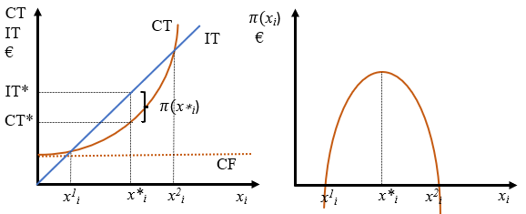
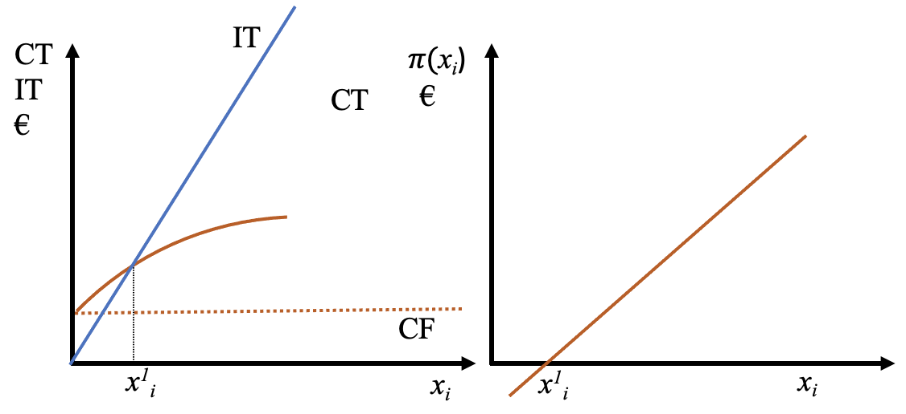
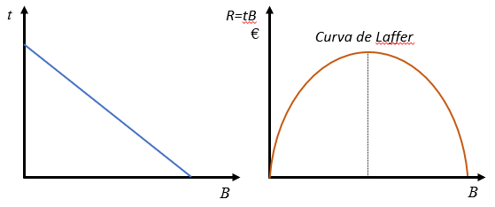
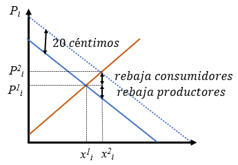

# Los objetivos de la empresa {#chap4}

Todos los agentes funcionan con una serie de **principios** que se consideran guías para conseguir la propia realización. Esa realización se materializa en la consecución de una serie de **objetivos**. Para las empresas se han hecho muchos intentos de sistematización de los objetivos y se han llegado a hacer muchas clasificaciones diferentes de los mismos. 

## Los principios

Los principios son las guías de largo plazo de la empresa. Podemos considerar que son cuatro, que estarán presentes a lo largo de este libro: **beneficio**, **equilibrio financiero**, **eficiencia** y **calidad**.

La búsqueda del *beneficio*, la diferencia entre ingresos y gastos, es fundamental para que cualquier empresa sea viable. Sin beneficios nadie tendrá interés en la empresa y se verá obligada a desaparecer. La búsqueda del beneficio ha sido duramente criticada en muchos ámbitos por asociarse con la explotación de obreros, codicia, y con un sinfín de ideas negativas. En efecto, la búsqueda enfermiza del beneficio únicamente y hasta sus últimas consecuencias es algo que acaba por destruir a la propia empresa, pues implica fijarse en un único principio.

En el [Capítulo -@sec-intro] se explicó brevemente la diferencia entre ingreso y cobro por un lado y la de gasto y pago, por otro. El *equilibrio financiero* se tratará con amplitud en el [Capítulo -@sec-chap5] e implica que a lo largo del tiempo esas magnitudes se van adaptando unas a otras de forma que no se produzcan situaciones comprometidas para la empresa. Las más típica sería la imposibilidad de hacer frente a deudas vencidas y la consiguiente **suspensión de pagos** o incluso **quiebra**, de prolongarse en el tiempo.

El tema de la *eficiencia* ya se ha mencionado repetidamente en capítulos anteriores y consiste, *grosso modo*, en alcanzar los objetivos con el mínimo uso de los recursos. Algunas medidas de eficiencia son la rentabilidad, que se estudiará en el [Capítulo -@sec-chap5], o la productividad, que se tratará más tarde en este capítulo.

La *calidad* es un principio que ha cobrado mucha importancia en los últimos años, convirtiéndose uno de los principales factores de competitividad. 

## Los objetivos de la empresa

Los objetivos son los fines concretos hacia los que se dirige la actividad de la empresa. Para que sean útiles tienen que ser:

- Mensurables: se tienen que poder medir de forma cuantitativa por periodos de tiempo determinados.
- Realizables: deben ser realistas y adaptados a la realidad interna de la empresa y el ambiente en el que se desenvuelve.
- Flexibles: deben ser tales que se puedan adaptar con facilidad al entorno cambiante en el que se desenvuelve la empresa.
- Comprensibles: tienen que ser fáciles de comunicar a todos los agentes que intervienen en la empresa a todos los niveles. En este sentido, una buena comunicación interna resulta fundamental.

Naturalmente, todos los objetivos de la empresa se sustentan en los principios anteriores. En la siguiente sección reduciremos todos los objetivos a la maximización del beneficio propio de una visión clásica, que nos permitirá perfilar mucho más ciertos resultados y llegar a conclusiones más cerradas. Como ya hemos dicho, sin beneficio no hay empresa, por lo que, aunque se marquen otros objetivos complementarios, el beneficio no puede faltar. También es verdad que la empresa maximizadora del beneficio es una simplificación respecto al mundo real.

Podemos clasificar los objetivos atendiendo a varios criterios:

1. Según el tipo de empresa:

    - Privadas: Maximizar beneficios.
    - Públicas: Mejorar el servicio prestado.

2. Según el alcance temporal:

    - Tácticos: a corto plazo.
    - Estratégicos: a medio y largo plazo.

3. Según los tipos de agentes en la misma empresa (**stakeholders**):

    - Los accionistas: maximizar el precio de la acción.
    - La dirección: producir al mínimo coste o maximizar la productividad con un mínimo de calidad. 
    - Los proveedores: querrán maximizar el precio de venta de sus materiales o aumentar las ventas. 
    - Los clientes: comprar máxima calidad al mínimo precio.
    - Los trabajadores: maximizar su sueldo, bienestar ….

4. Según su naturaleza:

    - Económica:
        - Maximizar beneficios.
        - Maximizar la rentabilidad (Beneficios/otras variables).
        - Crecimiento empresarial.
        - Aumento de la productividad.
    - Social:
        - Creación de empleo.
        - Recuperación de patrimonio (restauraciones, …).
        - Integración social de colectivos desfavorecidos.
        - Incremento del nivel de industrialización.
        - Formación de los trabajadores.
        - Conciliación vida laboral y familiar.

Algunos autores condensan todos los objetivos diciendo que la finalidad de las empresas es **LA CREACIÓN DE VALOR**. Creación que puede tener muchos sentidos y que debe ser para todos los agentes que participan en ella, incluyendo la sociedad en su conjunto.

## La maximización del beneficio

La economía clásica entiende la empresa como un agente que maximiza el beneficio. En el capítulo anterior se expuso que en el problema de producción había que tener una serie de consideraciones técnicas, que concretamos en la función de producción, y otras económicas, que eran las funciones de coste y la demanda. Las funciones de coste eficiente ya se analizaron allí, falta incluir la demanda. En efecto, hasta ahora hemos visto una empresa que tiene la capacidad técnica para producir eficientemente, con mínimo coste, algo. Pero esa empresa no tendrá éxito si los potenciales clientes piensan que el bien o servicio en cuestión no merece tanto la pena como para gastar su dinero en él. Es decir, la difícil misión de la empresa es producir algo eficientemente y **además conseguir venderlo**, es decir, que tenga demanda suficiente como para que el negocio sea rentable.

Afortunadamente, existe una función sencilla que condensa dentro de sí todas las consideraciones técnicas y económicas que hemos mencionado. Se trata de la **función de beneficio**,  que la vamos a definir como la diferencia entre el ingreso total y el coste total ^[En capítulos posteriores lo definiremos como ingresos menos gastos.]. La función de beneficio con un factor fijo $K$ y uno variable $L$ se puede expresar de muchas formas, como indica la @eq-beneficio.

$$
\begin{array}{rl}
\pi(x_i)=\pi(L)=& IT-CT=\\ =&P_i x_i - CF - wL =\\ =& P_i x_i - CT(x_i) =\\ =& P_i f(L) - CF - wL 
\end{array}
$$ {#eq-beneficio}

Tomemos para empezar la primera igualdad, que es la simple definición del beneficio $(\pi(x_i)=IT-CT)$. Si queremos obtener la cantidad de producción que maximiza dicha función, tendremos que calcular la condición de primer orden e igualarla a cero. Es decir, la derivada del beneficio respecto a la producción debe ser cero en el máximo. Eso implica que

$$
\frac{\partial \pi}{\partial x_i} = 0 = \frac{\partial IT}{\partial x_i} - \frac{\partial CT}{\partial x_i} = IM - CM = 0
$$

Esta igualdad implica que el ingreso marginal $IM$ tiene que ser igual al coste marginal $CM$. El **ingreso y coste marginales** indican en cuánto aumenta el ingreso o el coste total al aumentar la producción en una unidad. Si se produce una unidad más y se vende en un mercado de competencia perfecta en el que el empresario no puede influir en el precio de venta, el ingreso marginal será el precio de venta. El coste marginal, sin embargo, dependerá de los rendimientos de la función de producción. Pero en cualquier caso el empresario se encontrará en el óptimo si produce aquella cantidad en la que producir una unidad más le reporta tanto ingreso adicional como coste adicional tiene que soportar.

En efecto, imaginemos que $IM>CM$. En esa situación producir una unidad más generaría un ingreso adicional mayor que lo cuesta producir esa unidad, por lo que el beneficio aumentaría produciendo esa unidad. Eso quiere decir que el empresario no estaba en el máximo. La producción tendría que reducirse en caso contrario.

::: callout-important
## Importante

No debemos olvidar nunca que la condición de segundo orden de máximo implicará que $\partial ^ 2 \pi / \partial x_i ^ 2 < 0$. Esta condición se cumplirá *siempre que la función de producción tenga rendimientos decrecientes*. Por eso es tan importante comprobar siempre los rendimientos de la función de producción.
:::

::: callout-important
## Importante

La igualdad entre ingreso marginal y coste marginal como condición de maximización del beneficio es universal y sirve para cualquier tipo de mercado, no solo competencia perfecta. Sin embargo, cuando decimos que el ingreso marginal es el precio ya estamos asumiendo competencia perfecta, porque consideramos que las acciones individuales de la empresa no van a afectar a las condiciones del mercado en especial al precio de mercado. Esto no es así en el monopolio u otros mercados en los que el empresario tiene de hecho poder de mercado que le permite fijar el precio o salarios.
:::


### La oferta del bien

Tomando el beneficio en función de la producción $\pi(x_i) = P_i x_i - CT(x_i)$ de la @eq-beneficio, podemos inferir que las condiciones de óptimo implican que el precio tiene que igualar al coste marginal y los costes marginales tienen que ser crecientes con la producción, es decir,

$$
P_i = CM; \quad\quad \frac{\partial CM}{\partial x_i} < 0.
$$

Si se observan detenidamente estas dos expresiones vemos que la condición de primer orden nos da una combinación de precios y cantidades (puesto que $CM$ es función de la producción) tales que el empresario está maximizando el beneficio. Y además vemos que esa curva es creciente. Se trata de la **OFERTA** de la empresa. Por tanto, podemos decir claramente que la oferta del empresario es el resultado de la maximización del beneficio. Esto es lo que hace que si el empresario, dados los precios, decide producir más o menos de lo que indica su curva de costes marginales (su oferta) va a quedarse con un beneficio por debajo del óptimo.

:::: panel-tabset

## Resuelve {-}

Calcula la oferta del bien de una empresa cuya función de producción es $x_i=AL^{0,5}$. ¿Se cumplen las condiciones de máximo? ¿Tiene pendiente positiva? ¿Puedes calcular la elasticidad precio de esa oferta?

Representa gráficamente el ingreso y coste totales, así como el beneficio en función de la producción, y especifica dónde se produce el máximo del beneficio.

¿Qué sucedería con esa oferta si la función de producción pasa a ser $x_i=2A^{0,5}$? ¿Qué sucedería si pasa a ser $x_i=A^{0,8}$?

¿Cuál sería la oferta de mercado si en el mismo operaran 1000 empresas como la descrita más arriba? ¿Cuál es la elasticidad precio de la oferta de mercado?

## Solución {-}

Se trata de una función de producción Cobb-Douglas. El coste total es $CT=CF+wA^{-2}x_i^2,$ la función de beneficio escrita como función de la producción será $\pi(x_i)=P_ix_i-CF-wA^{-2}x_i^2$. Las condiciones de máximo son 

$$
\begin{array}{ll}
\frac{\partial \pi}{\partial x_i}=P_i-2wA^{-2}x_i=0 & \frac{\partial^2 \pi}{\partial x_i^2}=-2wA^{-2}<0
\end{array}
$$

La condición de primer orden implica que la oferta es $x_i=0,5A^{2}w^{-1}P_i$ y la segunda derivada negativa confirma que se está maximizando el beneficio. La curva de oferta tiene pendiente positiva y es además Cobb-Douglas, por lo que la elasticidad precio (respecto a $P_i$) es el exponente, 1. 

Vemos que además la posición en el plano de la curva de oferta depende del factor fijo (a través de la constante A) y del salario, como se ha supuesto desde el [Capítulo -@sec-intro]. En efecto, un incremento de los factores fijos (una inversión en capital, infraestructuras, mejorar la formación de los trabajadores, etc.) supone un desplazamiento a la derecha de la función de oferta. Lo mismo sucedería con una reducción del salario.

La curva de coste total (en el panel izquierdo de la figura) es la correspondiente a una función de producción con rendimientos decrecientes. El ingreso total obedece a la ecuación $IT=P_ix_i$ que es una recta partiendo del origen de coordenadas. El beneficio se puede ver gráficamente en la figura como la distancia vertical entre el ingreso total y el coste total (se ha representado aparte en el panel derecho de la figura). En los dos puntos de corte el beneficio es cero y entre esos dos puntos se da un beneficio positivo, que será máximo aproximadamente en $x_i^*$.

```{r echo=FALSE, fig.align='center', out.width="70%"}

```

Si la función de producción pasa a ser $x_i=2A^{0,5}$ o $x_i=A^{0,8}$ la oferta se desplazaría hacia la derecha. El primer caso se puede asimilar con un aumento de factores fijos, en el segundo como un incremento de productividad.

Si en el mercado operaran 1000 empresas como la descrita más arriba la oferta de mercado será la suma horizontal de las individuales, es decir, $x_i=500A^{2}w^{-1}P_i.$ Curiosamente, la oferta de mercado tiene la misma elasticidad que la oferta individual.
:::

### La demanda de factores

Si ahora tomamos la expresión del beneficio en función de los factores de producción de la @eq-beneficio, tenemos que $\pi(L) = P_i f(L) - CF - wL$. Si calculamos ahora la cantidad de trabajo que maximiza el beneficio tendremos que derivar respecto a $L$ e igualar a cero. 

$$
\frac{\partial \pi}{\partial L} = 0 = \frac{\partial IT}{\partial L} - \frac{\partial CT}{\partial L} = IM_L - CM_L = 0
$$

El ingreso y coste marginales quedan ahora definidos como las unidades monetarias en las que se incrementa el ingreso o coste total cuando se contrata una unidad adicional de trabajo. En el caso del coste marginal es evidente si el mercado de trabajo es de competencia perfecta, puesto que será exactamente el salario. No es tan evidente en el caso del ingreso marginal, puesto que depende de los rendimientos de la función de producción. En cualquier caso, las condiciones de óptimo serán

$$
P_i PM_L = P_i \frac{\partial f(L)}{\partial L} = w; \quad\quad \frac{\partial PM_L}{\partial L} < 0.
$$

$PM_L$ es la productividad marginal del trabajo, es decir, las unidades que crece la producción cuando se contrata una unidad adicional de trabajo. Al multiplicar esta magnitud por el precio por unidad tenemos el importe del $IM$, que debe ser exactamente igual al salario en el máximo, que es lo que cuesta contratar esa unidad de trabajo en un mercado de competencia perfecta. La condición de segundo orden implica que el producto marginal tiene que ser decreciente con la contratación de trabajo, cosa que sucede cuando la función de producción tiene rendimientos decrecientes.

::: callout-important
## Importante

Tanto la oferta del bien como la demanda de trabajo se obtienen de la maximización del beneficio, que depende crucialmente de la función de producción y sus rendimientos. Son en realidad la misma función, el empresario toma las dos decisiones a la vez y están relacionadas entre sí. De hecho, son la misma función, son dos caras de la misma moneda.
:::

:::: panel-tabset

## Resuelve {-}

Calcula la demanda de trabajo de una empresa cuya función de producción es $x_i=AL^{0,5}$. ¿Se cumplen las condiciones de máximo? ¿Tiene pendiente negativa? ¿Puedes calcular la elasticidad precio de esa demanda?

¿Cuál sería la demanda de trabajo de mercado si en el mismo operaran 1000 empresas con esa función de producción? ¿Cuál es su elasticidad?

## Solución {-}

En este caso hay que maximizar la función de beneficio escrita como función del trabajo, es decir, $\pi(L)=P_i AL^{0,5}-wL$. Las condiciones de óptimo son

$$
\begin{array}{ll}
\frac{\partial \pi}{\partial L}=P_iA0,5L^{-0,5}-w=0 & \frac{\partial^2 \pi}{\partial L^2}=-0,25P_iAL^{-1,5}<0
\end{array}
$$

La condición de primer orden implica que la demanda es $L=0,25A^2P_i^2w^{-2}$ y la segunda derivada negativa confirma que se está maximizando el beneficio. La curva de demanda de trabajo tiene pendiente negativa puesto que al incrementarse el salario se reduce la cantidad de trabajo que maximiza el beneficio y es además Cobb-Douglas, por lo que la elasticidad precio (en realidad respecto a $w$) es el exponente, -2. 

Vemos que además la posición en el plano de la curva de demanda depende del factor fijo (a través de la constante A) y del precio al que se vende el bien. En efecto, un incremento de los factores fijos (una inversión en capital, infraestructuras, mejorar la formación de los trabajadores, etc.) supone un desplazamiento a la derecha de la función de producción. Lo mismo sucedería con una reducción del salario.

Esta cuestión se podría haber contestado con la ayuda de la función de oferta que se calculó anteriormente, puesto que la oferta ya conlleva la optimización y la demanda de trabajo es en realidad la misma optimización. La oferta es $x_i=0,5A^{2}w^{-1}P_i$ y lo único que habría que hacer es sustituir la producción por la función de producción, es decir, $AL^{0,5}=0,5A^{2}w^{-1}P_i$. Despejando $L$ se llegaría a la demanda de trabajo.

La demanda de mercado con 1000 empresas como la descrita es $L=250A^2P_i^2w^{-2}$, que tiene la misma elasticidad que la demanda individual.
:::

:::: panel-tabset

## Resuelve {-}

Calcula la oferta del bien y la demanda de trabajo de una empresa cuya función de producción es $x_i=AL^{2}$. ¿Se cumplen las condiciones de máximo? ¿Tienen las pendientes esperadas? ¿Puedes calcular la elasticidad precio de esas funciones?

Representa gráficamente el ingreso y coste totales, así como el beneficio en función de la producción, y especifica dónde se produce el máximo del beneficio.

## Solución {-}

La función de beneficio será $\pi=P_ix_i-wA^{-0,5}x_i^{0,5}=P_iAL^2-CF-wL$. Las condiciones de óptimo para la oferta del bien y la demanda de trabajo son

$$
\begin{array}{ll}
\frac{\partial \pi}{\partial x_i}=P_i-0,5wA^{-0,5}x_i^{-0,5}=0 & \frac{\partial^2 \pi}{\partial x_i^2}=0,25wA^{-0,5}x_i^{-1,5}>0 \\
\frac{\partial \pi}{\partial L}=2P_iAL-w=0 & \frac{\partial^2 \pi}{\partial L^2}=2P_iA>0 \\
\end{array}
$$

El problema es que las segundas derivadas son positivas, lo que indica que las condiciones de primer orden dan mínimos del beneficio, no máximos. Además, las supuestas funciones de oferta del bien y demanda de trabajo que se obtienen de las condiciones de primer orden tendrían pendientes positivas y negativas, respectivamente. Todo esto es absurdo y surge de que la función de producción tiene rendimientos crecientes. Pero queda una pregunta, ¿cuáles son las funciones que estamos buscando, dónde se encuentra el máximo del beneficio? Puesto que la solución matemática no funciona, habrá que buscar la solución de otra forma, por ejemplo, gráficamente.

El ingreso y coste totales, así como el beneficio en función de la producción serían como en la figura.

```{r echo=FALSE, fig.align='center', out.width="70%"}

```

En la figura se ve que el beneficio es cero para la producción $x_i^1$. Para cantidades inferiores hay pérdidas y para cantidades superiores beneficios positivos. De hecho, cuanto mayor es la producción mayor es el beneficio, implicando que a la empresa le interesa producir todo lo que pueda, o dicho de otro modo, la oferta del bien y la demanda de trabajo se podrían visualizar como completamente rígidas (verticales en el máximo de capacidad). Las elasticidades son cero en ambos casos.
:::

::: columns
::: {.column width="10%"}
:::
::: {.column width="80%"}

:::
::: {.column width="10%"}
:::
:::

::: columns
::: {.column width="10%"}
:::
::: {.column width="80%"}

:::
::: {.column width="10%"}
:::
:::
## Equilibrios simultáneos en varios mercados

Esta es una sección avanzada que se puede omitir sin perder el sentido esencial de lo que queremos decir en lo que se refiere al comportamiento optimizador del empresario. Todo lo contemplado en este capítulo se refiere al comportamiento optimizador individual del empresario, sin tener en cuenta a los consumidores. En este caso, el empresario, asumiendo que vende su producto y demanda los factores de producción en mercados de competencia perfecta, tomará los precios de bienes y factores como datos fijos dados sobre los que no tiene ninguna influencia, puesto que los decide el mercado.

Cabe entonce plantearse la cuestión de cómo se ajustan los mercados de bienes y servicios simultáneamente cuando se tienen las demandas y ofertas de todos ellos. Esto dependerá de todo lo visto en este capítulo en lo que se refiere al empresario (es decir a la oferta del bien y demandas de factores), pero también habrá que tener en cuenta las actuaciones de los hogares (demanda del bien y oferta de factores productivos).

Supongamos el siguiente escenario:

- Un mercado de un bien ($x_i$) que se fabrica con una serie de factores de producción fijos y dos factores variables, $L$ y $M$. La función de producción es Cobb-Douglas $x_i=M^aL^b$. Asumimos siempre que los rendimientos son decrecientes.
- Los hogares demandan el bien con una función de demanda Cobb-Douglas $x_i=D_0 P_i ^ {\alpha}$, donde $\alpha$ es la elasticidad precio de la misma y, por tanto, será negativa.
- Los hogares ofrecen los factores de acuerdo a ofertas tipo Cobb-Douglas, es decir, $L=L_0 w^{0,8}$ y $M=M_0 r^{0,8}$, respectivamente, en los que $w$ y $r$ son los precios por unidad de los factores $L$ y $M$.

El empresario maximizará el beneficio, de donde se obtendrán su función de oferta del bien y sus demandas de factores. Estas tres funciones enfrentadas a las complementarias de los hogares darán lugar a tres equilibrios simultáneos en los tres mercados. Se trata de un modelo en el que hay seis variables endógenas (precios y cantidades) y el resto son variables exógenas.

Es importante darse cuenta de que los tres precios juegan su papel en los tres mercados, puesto que la oferta del bien depende de los precios de los factores y las demandas de factores dependen del precio de venta del bien. Es decir, se trata de equilibrios simultáneos con efectos de ida y vuelta.

El lector que todavía siga interesado en entender hasta la últimas consecuencias cómo funcionan los tres mercados simultáneamente puede utilizar la herramienta a la que se accede en el enlace siguiente.

[Enlace a la herramienta.](https://djpt999.shinyapps.io/shiny/){target="_blank"}

La herramienta consiste en paneles gráficos que identifican los equilibrios en los tres mercados, mediante la intersección de las curvas de demanda y oferta. Se consideran dos situaciones, una inicial en color negro y otra final de color rojo. En la zona izquierda existen controles deslizantes donde se pueden cambiar los valores de los parámetros exógenos de los que dependen las posiciones de las curvas, así como el resto de variables exógenas. Finalmente, en la parte superior se proporcionan los valores de los beneficios, los ingresos y costes totales en la posición inicial y final.

Esta herramienta nos permite una serie de posibles simulaciones. El lector puede realizar las simulaciones una a una con la herramienta e intentar explicar lo que se ve en la solución. Es decir, intentar explicar los movimientos de todas las curvas, así como los movimientos de las seis variables involucradas, tres precios y tres cantidades.

Aquí va una lista de posibles simulaciones:

1. Incremento de demanda del bien ($D_0$). ¿Qué sucede con todas las curvas y todos los precios y cantidades, además del ingreso total, coste total y beneficio? ¿Influye en los resultados el hecho de que dicha demanda tenga elasticidad inferior o superior a 1 ($\alpha$)?
2. Incremento de la Oferta de alguno de los factores, $M$ (coeficiente $M_0$), por ejemplo. Comprobar si el resultado depende de la elasticidad de demanda del bien.
3. Incremento de la productividad total ($A$ en la función de producción). Nuevamente comprobar con distintos valores de la elasticidad de demanda.
4. Elasticidad de uno de los factores, $M$ (coeficiente $M_0$), por ejemplo. ¿Depende el resultado de la elasticidad precio de la demanda?
5. Incremento simultáneo de demanda del bien ($D_0$), así como de la productividad total ($A$). ¿No es esto lo que está pasando desde el inicio de la Humanidad y desde la Revolución Industrial de forma acelerada?
6. Se pueden intentar otras simulaciones en las que cambien dos variables simultáneamente.

## Cuestiones y problemas

### Cuestiones y problemas resueltos

:::: panel-tabset
##  {.unnumbered}
1. Contesta a las siguientes preguntas:

    a) ¿Afectaría un impuesto de cuantía fija sobre los beneficios a la cantidad de producción maximizadora de los beneficios?
    b) ¿Y un impuesto sobre el beneficio?
    c) ¿Y un impuesto definido por unidad de producción?
    d) ¿Cómo  afecta al mercado una subida de cotizaciones sociales que la empresa paga por sus trabajadores?
    e) ¿Y una subida de las cotizaciones sociales que pagan los trabajadores por sí mismos?
    f) ¿Pueden afectar las medidas a) a d) al equilibrio de mercado y perjudicar a los demandantes de algún modo?

## Solución {.unnumbered}

a) Un impuesto de cuantía fija es un coste fijo que no afecta a la derivada del beneficio, por lo que las empresas no cambiarán en nada, solo se perjudicarán porque sus beneficios serán menores. Si esta medida supone que algunas empresas salgan del mercado, entonces se producirá una reducción de oferta.	Existen tasas y tributos municipales de cuantía fija, pero son de escasa entidad (IAE, contribución, impuestos de circulación, etc.).
b) Si el impuesto es sobre el beneficio, el nuevo beneficio será $\pi=[P_i x_i-wL-\dots](1-t)$, donde $t$ es el tipo impositivo. La maximización de este beneficio nos lleva de nuevo al mismo óptimo y no se produce ningún cambio en el mercado. Si salen empresas del mercado entonces se reduce la oferta. Los impuestos sobre la renta (de personas físicas o sociedades son de este tipo).
c) Si el impuesto es sobre la producción, el beneficio será $\pi=(P_i+t) x_i-wL-\dots$. Este cambio implica una reducción de la oferta. Los impuestos de estas características son muy raros.
d) La función de beneficios será $\pi=P_i x_i-w(1+t)L-\dots$. Si aumenta $t$ se reduce la oferta.
e) En este caso se reduce la renta disponible de los trabajadores, por lo que se reduce la demanda.
f) Estas medidas reducen la oferta o la demanda, y mirando en términos de excedentes de productor y consumidor, podemos concluir que todas ellas perjudican a todos, a los que los tienen que pagar y a los que no los tienen que pagar.
:::

:::: panel-tabset
##  {.unnumbered}
2. Durante el año 2022 se ha venido barajando un nuevo impuesto especial sobre los beneficios extraordinarios y de modo temporal a la banca. Los argumentos a favor del impuesto eran que "paguen los ricos" y en contra que "los bancos repercutirán los impuestos en los clientes, de forma que acabarán pagándolos los clientes". ¿Qué puedes decir sobre el tema, tiene algo que ver con la elasticidad de demanda de los productos bancarios?

## Solución {.unnumbered}

La primera observación es que es muy dudosa cualquier definición de beneficio extraordinario (¿cuántos son los beneficios ordinarios?).

Como hemos visto en el problema anterior, los impuestos sobre beneficios no afectan al comportamiento de las empresas, aunque reducirán la cuantía de los beneficios. Si los bancos quieren recuperar esa pérdida de beneficios tienen dos vías:

a) Reducir costes (podrían ser más eficientes, pero podría suponer despedir a trabajadores).

b) Repercutirlo en precios. Es poco probable que lo hicieran remunerando menos los depósitos (puesto que no hay margen al estar cercanos a cero), pero sí podrían subir las comisiones y gastos de gestión. En ese caso, efectivamente, el efecto final dependería de la elasticidad de demanda, puesto que estarían subiendo los precios de los productos financieros. Si la demanda es inelástica (cosa que parece ser así) los bancos podrán repercutir la subida de impuestos en los precios y los impuestos los acabarían pagando los clientes. Si la elasticidad es grande, el impuesto lo tendría que asumir necesariamente el banco.
:::

:::: panel-tabset
##  {.unnumbered}
3. La curva de Laffer relaciona el tipo impositivo de un determinado impuesto con su recaudación fiscal. Tiene forma de parábola invertida (ver figura), que implica que si el tipo impositivo es cero la recaudación es cero. Pero si el tipo impositivo es muy alto puede desanimar tanto la actividad económica que la recaudación vuelve a ser cero. Entre esos dos extremos la recaudación siempre es positiva, pero necesariamente tiene que tener al menos un tramo creciente y otro decreciente.

{fig-align="center"}

Lo interesante de esta curva es que si nos situamos en la parte izquierda y aumentamos el tipo impositivo la recaudación aumenta, pero si nos situamos muy a la derecha del máximo un incremento del tipo impositivo puede reducir la recaudación. ¿Qué implicaciones tiene esto con la elasticidad?

## Solución {.unnumbered}

Llamando $t$ al tipo impositivo y $B$ a la base imponible, la recaudación es $R=t \times B$. El problema es que siempre que crece $t$ se reduce $B$. Pero, efectivamente, el efecto sobre $R$ depende de la elasticidad. En efecto, en el tramo creciente de la curva de Laffer la elasticidad es menor que 1 en valor absoluto y en el tramo creciente mayor que 1.
:::

:::: panel-tabset
##  {.unnumbered}
4. Durante el año 2022 el gobierno ha mantenido una subvención de 20 céntimos de euro en la gasolina. Esto es una reacción a un rebrote de inflación muy importante y también a los efectos de la guerra Rusia-Ucrania.

## Solución {.unnumbered}

Hay que empezar diciendo que es una medida regresiva, es decir, beneficia más a los más ricos, que serán los que más usan el transporte privado.

El efecto de una subvención de 20 céntimos en "una situación normal" sería el que se ve en la figura. Supone un desplazamiento de la demanda a la derecha o hacia arriba de forma que la distancia entre las dos curvas es de 20 céntimos para cualquier cantidad de gasolina, que acaba incrementando los precios y la cantidad consumida de gasolina. Pero lo que se ve es que el nuevo precio NO es 20 céntimos más alto. Además en el segundo equilibrio ¡¡una parte de los 20 céntimos se lo llevan los empresarios!!. Esto es necesario subrayarlo, puesto que, aunque el gobierno pretenda beneficiar a los consumidores acaba beneficiando también a los productores.

{fig-align="center"}

Si la demanda fuera muy rígida y/o la oferta muy elástica, la medida acabaría beneficiando más a los empresarios que a los consumidores ¡¡a pesar de que son los consumidores los que se ahorran 20 céntimos cuando consumen gasolina!!

Hay que hacer un inciso, sin embargo, y es que la situación no se puede considerar "normal" debido a la inflación generalizada, la misma guerra, incertidumbre por el futuro, etc. que hace que seguramente la medida no desplace la demanda. En ese caso el equilibrio sigue siendo el inicial y los 20 céntimos se los embolsan totalmente los consumidores.
:::

### Cuestiones y problemas propuestos

1. En un mercado de competencia perfecta la función de producción conjunta de toda la industria es $x_i=L^{0,3}$. Calcula las funciones de oferta del bien y demanda de trabajo, así como sus elasticidades.

2. En un mercado de competencia perfecta la función de producción conjunta de toda la industria es $x_i=L^{1,1}$. Calcula las funciones de oferta del bien y demanda de trabajo.

3. En  general no es cierto que a las empresas les interese producir y vender todo lo que puedan. Representa las curvas de ingresos totales y costes totales frente a la producción para el caso de un supermercado, que lo único que hace es distribuir productos, sin transformarlos (considera que hay costes fijos y variables). ¿Cuál es la cantidad que maximiza el beneficio? ¿Puedes repetir la pregunta para un caso de una empresa con rendimientos crecientes y otra con rendimientos decrecientes?

## **Referencias** {-}

Cuervo, A., Vázquez, C.J. (2008), Introducción a la administración de empresas, Thomson Reuters-Civitas.

de Miguel, B., Baixauli, J.J. (2010), Empresa y Economía Industrial, Mc-Graw Hill.

Garrido, S., Romero, M. (2021), Fundamentos de gestión de empresas, Editorial Universitaria Ramón Areces.

Maynar, P. (2007), La economía de la empresa en el espacio de educación superior, Mc-Graw Hill, Madrid, España.

Pedregal, D.J. (2011). Manual de Microeconomía. Todo lo imprescindible para entenderla. Ediciones Lulú. ISBN 978-1-4475-1725-2. [Enlace](https://www.lulu.com/es/shop/diego-jos%C3%A9-pedregal-tercero/microeconom%C3%ADa/paperback/product-16qw7j2n.html?page=1&pageSize=4){target="_blank"}.

Pedregal, D.J. (2011). Manual de Macroeconomía. Todo lo imprescindible para entenderla. Ediciones Lulú. ISBN 978-1-4477-1113-1. [Enlace](https://www.lulu.com/es/shop/diego-jos%C3%A9-pedregal-tercero/macroeconom%C3%ADa/paperback/product-12vngrz8.html?page=1&pageSize=4){target="_blank"}.

Pedregal, D.J.(2016). Economía para ingenieros, Ediciones Lulú. ISBN 978-1-326-73331-5. [Enlace](https://www.lulu.com/es/shop/diego-j-pedregal-tercero/econom%C3%ADa-para-ingenieros/paperback/product-14rgv4m5.html?q=pedregal&page=1&pageSize=4){target="_blank"}.

Pedregal, D.J. (2023). Equilibrio simultáneo de mercados. [Aplicación shiny]. [Enlace](https://djpt999.shinyapps.io/shiny/){target="_blank"}.

Pedregal, D.J. (2024). Las decisiones de producción de las empresas [Archivo de vídeo]. Youtube. [Enlace](https://www.youtube.com/watch?v=mK_R-ouJm00){target="_blank"}.

Pedregal, D.J. (2024). ¿Maximizar o no maximizar beneficios? [Archivo de vídeo]. Youtube. [Enlace](https://www.youtube.com/watch?v=DREXluy92TA){target="_blank"}.

Trapero, J.R., García, F.P., Pedregal, D.J. (2013). Dirección y Gestión Empresarial. Mcgraw-Hill. [Enlace](https://www.mheducation.es/direccion-y-gestion-empresarial-9788448190385-spain){target="_blank"}.


