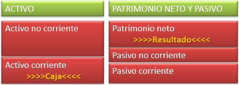
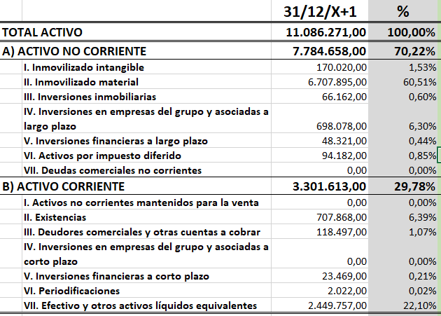
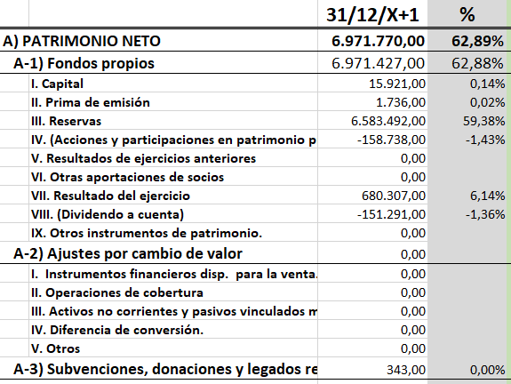
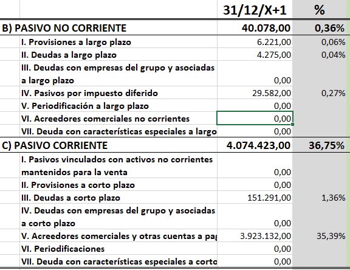
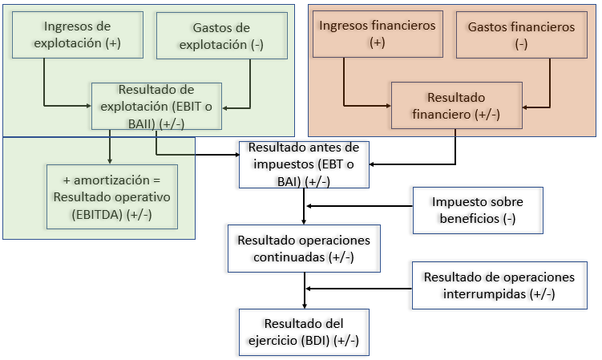
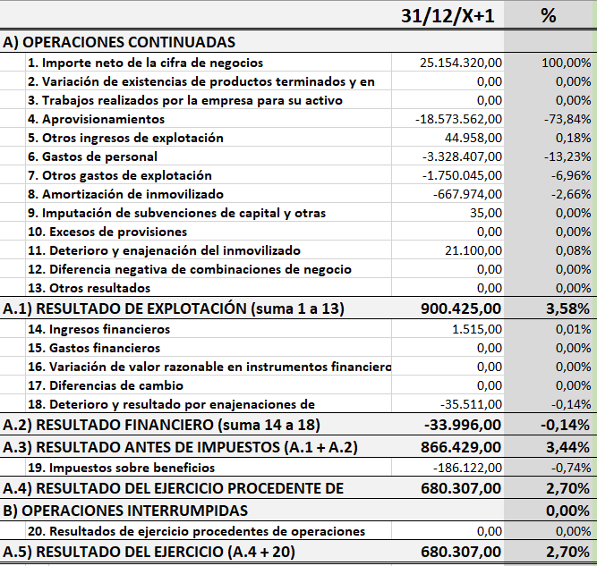
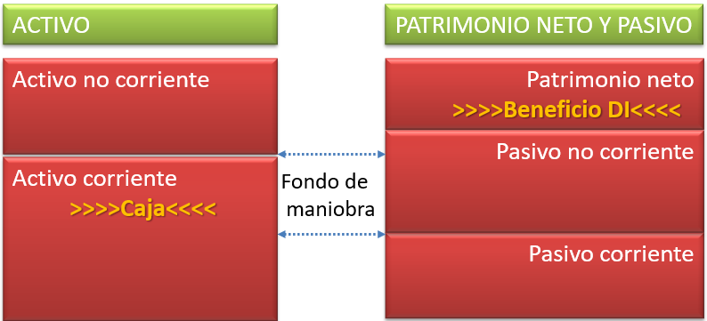
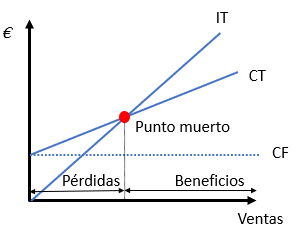
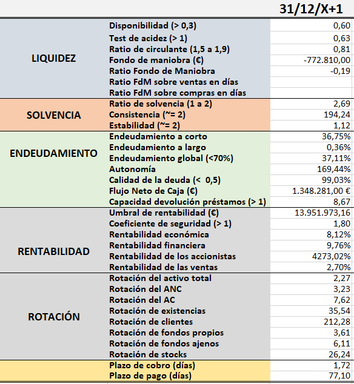

# Contabilidad financiera {#sec-chap5}

La **contabilidad** es un sistema de información sistemático de las empresas para conocer su situación **patrimonial**, **económica** y **financiera**, que servirá al propósito de facilitar la toma de decisiones. La contabilidad informa sobre la situación patrimonial, es decir, sobre la riqueza de la empresa. Además informa de la situación económica, es decir, si la empresa es capaz de generar beneficios o renta. Finalmente, informa sobre la situación financiera, que implica detectar si la gestión de los flujos monetarios es adecuada para evitar caer en suspensión de pagos e incluso quiebra.

Toda esta información sistematizada interesa a todos los agentes que intervienen en la empresa. Normalmente se habla de **contabilidad de gestión** o **de costes** a aquella que es interna cuyo objetivo es suministrar información detallada y fluida sobre la producción y los costes a los responsables de la gestión. Por otro lado existe la **contabilidad financiera** que es más de uso externo y va dirigida a los accionistas o propietarios actuales y potenciales, a los prestamistas, al Estado y a la sociedad en general.

El objeto de este capítulo es la contabilidad financiera.

## El plan general contable

El [Plan General Contable](https://www.boe.es/buscar/pdf/2007/BOE-A-2007-19884-consolidado.pdf){target="_blank"} (PGC a partir de ahora) es la ley que dicta cómo debe llevarse obligatoriamente la contabilidad en el seno de las empresas. Comprende un conjunto de principios y reglas estrictos necesarios para que la contabilidad cumpla con sus objetivos. Aunque hay una serie de principios que rigen en todo caso, existen planes sectoriales, para recoger adecuadamente las particularidades de ciertas empresas. Por ejemplo, empresas sin ánimo de lucro, compañías de transporte aéreo, inmobiliarias, de asistencia sanitaria, etc. Además, el PGC establece sistemas de diferente complejidad dependiendo del tamaño de las empresas. Así tenemos los modelos normales, abreviados y para PYMES.

::: callout-tip
## Auditorías

Las empresas se someten voluntaria u obligatoriamente a **auditorías**, que es un proceso de control interno o externo por el que se pretende analizar si la contabilidad refleja fielmente la situación patrimonial real de la empresa. En España las auditorías anuales son obligatorias para todas aquellas empresas que cumplen dos de las tres condiciones siguientes:

1.  Importe de la **cifra de negocios** (ventas) superior a 5.700.000€.
2.  Importe del **activo** (patrimonio bruto) superior a 2.850.000€.
3.  Más de 50 empleados.
:::

El PGC actual en España entró en vigor en 2008. Lo más destacable son los principios por los que se debe regir la contabilidad de toda empresa:

1.  **Empresa en funcionamiento**: la contabilidad ha de llevarse asumiendo que la empresa seguirá existiendo en el futuro.
2.  **Devengo**: los hechos económicos se registran en el momento en que se producen, con independencia del momento en el que se produce la contraprestación monetaria. De aquí surge la distinción entre *ingresos* y *cobros*, por un lado, y *gastos* y *pagos* por otro.
3.  **Uniformidad**: se deben mantener en el tiempo los criterios particulares que se adopten y aplicarse a todos los aspectos de la actividad empresarial, explicando en la memoria los cambios.
4.  **Prudencia**: obliga a contabilizar los beneficios cuando se realizan y las pérdidas cuando se conozcan. Es una posición conservadora, puesto obliga a la empresa a situarse siempre en la posición más desfavorable.
5.  **No compensación**: nunca pueden compensarse partidas de signo opuesto, se deben reflejar siempre todas las operaciones. No se pueden compensar partidas de activo con pasivo, ni ingresos con gastos.
6.  **Importancia relativa**: se admite la aplicación de criterios contables diferentes a los establecidos si esto provoca variaciones escasamente significativas que no alteran la imagen fiel de la empresa.

La contabilidad supone un marco tan preciso y estrecho, que, complementado con estos principios tan sumamente conservadores, llevarían a que, de respetarse escrupulosamente, habría pocas sorpresas en el mundo empresarial. La realidad económica es, por el contrario, tan compleja que en el fondo es realmente complicado encorsetarlos en un marco preciso.

La contabilidad tiene una serie de limitaciones de las que debemos ser conscientes para evitar ser ingenuos, dada la complejidad de la realidad económica. Por ejemplo:

-   La contabilidad solo incluye hechos valorables en dinero. Es muy difícil incluir objetivamente el valor de la calidad de los productos, la capacidad de la gerencia o del personal, etc.
-   El valor del dinero no es constante en el tiempo, con lo que al mezclar partidas de distintos ejercicios con distinto valor, se producen partidas heterogéneas difíciles de valorar estrictamente. Esta es una limitación que se resolverá en parte si se analizan las partidas como ratios económicos o financieros, que es lo que haremos a lo largo del capítulo.
-   El verdadero caballo de batalla de la contabilidad es que adolece de un problema endémico de valoración. Si la valoración se hace siempre a precios de adquisición, esos precios cambian a lo largo del tiempo, de forma que el valor actual de mercado de la empresa no es ni mucho menos lo que reflejan las cuentas. Se podría hacer la contabilidad a precios de mercado, pero aparte de incluir mucho ruido, la valoración de mercado es muy subjetiva, sobre todo cuando no se pretenden vender los activos. Esta es la razón por la que el PGC considera diez criterios distintos de valoración (coste histórico, valor razonable, valor neto realizable, valor actual, valor en uso, etc.).

::: callout-important
## Importante

No se puede olvidar que los estados contables solo reflejan partidas valorables en dinero, por lo que aspectos cualitativos son muy difíciles de valorar. El dinero cambia de valor en el tiempo, como veremos en más detalle en el próximo capítulo. Además, hay un sinfín de posibles valoraciones y desde luego la contabilidad no refleja el valor de mercado de la empresa. Si la empresa se liquida (se hace líquida, dinero) no se obtendrá el valor que indican las cuentas, por la situación del mercado en el momento de la venta, por la valoración adicional de los aspectos cualitativos, etc.
:::

## Las cuentas anuales

La contabilidad en el día a día se lleva con sistemas informáticos por el principio de doble partida, de forma que cada hecho económico tiene una cara y una cruz. Esto se realiza en un sistema complejo de cuentas que establece el PGC. Al contabilizar las dos caras de todas las transacciones el sistema general tienen que cuadrar. El PGC obliga que, al menos una vez al año, se cierren las cuentas, es decir, que se reseteen todas las cuentas y se vuelquen en lo que llamamos **las cuentas anuales**, que reflejan la situación en el momento del cierre y resúmenes de lo que ha pasado durante el ejercicio.

Las cuentas anuales que establece el PGC son cinco:

1.  **Balance de situación**: refleja el estado patrimonial global de una empresa en un momento dado, comparando dos masas patrimoniales diferenciadas, el **activo** y el **pasivo**.
2.  **Cuenta de resultados** o **cuenta de explotación** o **cuenta de pérdidas y ganancias**: recoge los ingresos y gastos de un ejercicio económico y calcula el beneficio por diferencia. Este beneficio es la renta neta.
3.  **Estado de cambios del patrimonio neto**: como su nombre indica, recoge los cambios en el patrimonio neto que, por definición, no afectan al beneficio. Esto se entenderá mejor cuando veamos qué es el patrimonio neto.
4.  **Estado de flujos de efectivo**: informa sobre las variaciones y movimientos de efectivo.
5.  **Memoria**: es un informe cualitativo detallado que explica los hechos relevantes sucedidos a lo largo del año y su impacto económico o financiero.

El balance y la cuenta de resultados son, con diferencia, las cuentas anuales más utilizadas en la práctica.

### El balance de situación

El balance es una foto estática de la situación patrimonial de la empresa. Engloba todo lo que la empresa es y lo que ha sucedido con anterioridad a la fecha de cierre. Tiene dos partes claramente diferenciadas:

1.  **Activo**: según la definición del PGC, el activo está constituido por todos los bienes, derechos y otros recursos controlados económicamente por la empresa, resultantes de sucesos pasados, de los que se espera que la empresa tenga beneficios o rendimientos económicos en el futuro y que se puedan valorar con fiabilidad. Refleja la **riqueza** de la empresa, el **patrimonio bruto**, lo que la empresa tiene o le deben terceros.

2.  **Patrimonio neto y pasivo**:

    -   **Patrimonio neto**: es la diferencia entre el activo y el pasivo, es decir, la diferencia entre el patrimonio bruto y las deudas que recaen sobre él. Es la financiación propia o la **autofinanciación**. Se puede ver como lo que es propio de la empresa o lo que debe la empresa a sus propietarios. En caso de liquidación, es lo que los propietarios tienen derecho a recibir de la empresa.
    -   **Pasivo**: está constituido por las distintas fuentes de financiación ajena que utiliza la empresa para llevar a cabo sus objetivos. Son las fuentes de financiación de terceros que la empresa les debe.

La Figura @fig-fig51 muestra el esquema general del balance que más tarde se extenderá. En él se ve que el PGC ordena los activos y pasivos empezando por el largo plazo (no corrientes) y acabando los de más corto plazo (corrientes). Además se han marcado algunas partidas cuya importancia se verá más tarde. Estas son la **caja** en el activo corriente por la que pasarán todos los **flujos de caja** y el **resultado del ejercicio** que refleja el **beneficio después de impuestos**, que, como veremos más tarde es el saldo de la cuenta de pérdidas y ganancias.

{#fig-fig51}

<!-- ```{r fig-fig51, echo=FALSE, fig.cap='Esquema general del balance de situación.', fig.align='center'} -->
<!--  -->
<!-- ``` -->

::: callout-important
## Balance y cuenta de resultados

El balance es una foto estática en un momento del tiempo y refleja el **patrimonio bruto** de la empresa, es decir, su **riqueza**. En el balance se reflejan las inversiones y desinversiones (activo), además de las fuentes de financiación (patrimonio neto y pasivo).

Hay que diferenciarlo radicalmente de la cuenta de pérdidas y ganancias que aglutina la **renta** de la empresa, que es una película dinámica de lo que ha sucedido durante un ejercicio, y que refleja los ingresos y gastos del mismo (¡¡*no los cobros y pagos, que en realidad son los flujos de caja*!!).

Aquí tienes una explicación en vivo del esquema general del balance de situación.

::: columns
::: {.column width="10%"}
:::
::: {.column width="80%"}

:::
::: {.column width="10%"}
:::
:::

Esta es una descripción detallada del balance.

::: columns
::: {.column width="10%"}
:::
::: {.column width="80%"}

:::
::: {.column width="10%"}
:::
:::

:::

::: callout-important
## Balance de situación

El patrimonio neto recoge el resultado neto (después de impuestos) del ejercicio, que es la renta neta del ejercicio. Estos son recursos que la empresa ha ganado con su esfuerzo y no se lo debe a nadie, de ahí que aparezca en el patrimonio neto. Podemos decir, por tanto, que el balance de situación también engloba (aunque de forma resumida a través de su saldo) a la cuenta de pérdidas y ganancias.
:::

::: panel-tabset
## Resuelve {-}

Presentar el balance ordenado de una empresa que tiene un edificio valorado en 150.000€ y maquinaria por valor de 50.000€ que adquirió con un préstamo de 25.000€. Dispone además de existencias por valor de 5.000€, tiene en caja 30.000€ y sus clientes le deben 10.000€.

## Solución {-}

| Activo       |         | PN y P       |         |
|:-------------|--------:|:-------------|--------:|
| Edificio     | 150.000 | PN           | 220.000 |
| Máquina      |  50.000 |              |         |
| Clientes     |  10.000 | Préstamos    |  25.000 |
| Existencias  |   5.000 |              |         |
| Caja         |  30.000 |              |         |
| **TOTAL ACTIVO** | **245.000** | **TOTAL PN y P** | **245.000** |
:::

#### El activo detallado según el PGC

#### Activo no corriente {.unnumbered}

El activo no corriente recogerá todos los bienes y derechos que la empresa tiene reconocidos en un momento del tiempo para un plazo mayor de un año, que es lo que se considera el largo plazo. Los componentes agregados se muestran en la @tbl-tab51 y se explican a continuación:

```{r tbl-tab51, echo=FALSE}
#| tbl-cap: Activo no corriente.

table51 = rbind("1. **Inmovilizado intangible**: desarrollo; concesiones; patentes, licencias, marcas y similares; fondo de comercio; aplicaciones informáticas; otro inmovilizado intangible.",
					"2. **Inmovilizado material**: terrenos y construcciones; instalaciones técnicas y otro inmovilizado material; inmovilizado en curso y anticipos.",
					"3. **Inversiones inmobiliarias**: terrenos; construcciones.",
					"4. **Inversiones en empresas del grupo y asociadas a largo plazo**: instrumentos de patrimonio; créditos a empresas; valores representativos de deuda; derivados; otros activos financieros.",
					"5. **Inversiones financieras a largo plazo**: instrumentos de patrimonio; créditos a terceros; valores representativos de deuda; derivados; otros activos financieros. ",
					"6. **Activos por impuesto diferido**.")
knitr::kable(
  head(table51, 6),
  booktabs = TRUE,
  align = "ll",
)
```

-   **Inmovilizado intangible** está constituido por todos aquellos activos que no tienen apariencia física, que son susceptibles de valoración económica y que no se pueden liquidar en un periodo inferior a un año. Entre ellos cabe destacar el **fondo de comercio**, que es todo aquello con valor inmaterial derivado de cuestiones como el valor de la clientela, la eficiencia, la organización, el crédito, el prestigio, la experiencia, etc. que le permiten obtener rentabilidades superiores a las esperadas por la simple suma de sus activos contables.
-   **Inmovilizado material** es todo aquello que la empresa posee a largo plazo que es tangible (se puede ver y tocar) y que se destina a la producción.
-   **Inversiones inmobiliarias** son inmuebles que se poseen para obtener rentas, plusvalías o ambas en lugar de para su uso en la producción o suministro de bienes y servicios o con fines administrativos o venta en el curso ordinario de las operaciones.
-   **Inversiones en empresas del grupo y asociadas a largo plazo** son las inversiones financieras a largo plazo en empresas del grupo o asociadas, cualquiera que sea su forma de instrumentación, con vencimiento superior a un año o sin vencimiento (como los instrumentos de patrimonio), cuando la empresa no tenga la intención de venderlos en el corto plazo. Un **grupo empresarial** es un conjunto de sociedades independientes jurídicamente entre sí, pero que se encuentran bajo un control o subordinación ejercido por una matriz o controlante y sometidas a una dirección unitaria.
-   **Inversiones financieras a largo plazo** son las mismas que las anteriores, pero cuando se refieren a activos de otras empresas ajenas al grupo.
-   **Activos por impuesto diferido** son son las cantidades de impuestos sobre la renta a recuperar en periodos futuros, normalmente debido a diferencias temporales deducibles o compensación de pérdidas de ejercicios anteriores.

::: callout-important
## Amortización acumulada del inmovilizado

Durante mucho tiempo fue tradición que se recogiera explicítamente la **amortización acumulada del inmovilizado** en los balances con signo negativo. Esta amortización era una indicación de lo obsoleto que podía estar el inmovilizado. En los balances actuales solo se refleja el importe neto. Esta sería la única partida que puede ser negativa en todo el activo.
:::

#### Activo corriente {.unnumbered}

El activo corriente recogerá todos los bienes y derechos que la empresa tiene reconocidos en un momento del tiempo para un plazo inferior a un año. La @tbl-tab52 muestra su estructura.

```{r tbl-tab52, echo=FALSE}
#| tbl-cap: Activo corriente.

table52 = rbind("1. **Activos no corrientes mantenidos para la venta**.",
					"2. **Existencias**: comerciales; materias primas y otros aprovisionamientos; productos en curso; productos terminados; subproductos, residuos y materiales recuperados; anticipos a proveedores.",
					"3. **Deudores comerciales y otras cuentas a cobrar**: clientes por ventas y prestaciones de servicios; clientes, empresas del grupo y asociadas; deudores varios; personal; activos por impuesto corriente; otros créditos con las Administraciones Públicas; accionistas (socios) por desembolsos exigidos. ",
					"4. **Inversiones en empresas del grupo y asociadas a corto plazo**: instrumentos de patrimonio; créditos a empresas; valores representativos de deuda; derivados; otros activos financieros.",
					"5. **Inversiones financieras a corto plazo**: instrumentos de patrimonio; créditos a empresas; valores representativos de deuda; derivados; otros activos financieros.",
					"6. **Periodificaciones a corto plazo**.",
					"7. **Efectivo y otros activos líquidos equivalentes**: tesorería; otros activos líquidos equivalentes.")
knitr::kable(
  head(table52, 7),
  booktabs = TRUE,
  align = "ll"
)
```

-   **Activos no corrientes mantenidos para la venta** son activos que ya no se utilizan en la producción y que se espera vender en un período inferior a un año.
-   **Existencias** representa el valor de las materias primas, productos semiterminados o terminados destinados a la producción o la venta. La inclusión en el balance de situación se realiza al cierre del ejercicio realizando un inventario de todas las existencias en almacenes.
-   **Deudores comerciales y otras cuentas a cobrar** son los importes que deben a la empresa por razones de la actividad comercial. Como se ve en los descriptores a la empresa le puede deber todo tipo de agentes, desde los clientes, sus propios trabajadores, sus accionistas, las administraciones públicas, otras empresas, etc.
-   **Inversiones en empresas del grupo y asociadas a corto plazo** e **inversiones financieras a corto plazo** son los mismos conceptos que se indicaron en el activo no corriente, solo que aquí se refieren a inversiones de menos de un año de duración.
-   **Periodificaciones a corto plazo** son gastos imputables al próximo ejercicio pero que se han pagado por adelantado. Se contemplan las periodifiaciones para que la imputación de los gastos se corresponda exactamente con el ejercicio al que se refiere.
-   **Efectivo y otros activos líquidos equivalentes** son los activos con disposición inmediata o menor a tres meses. Es la tesorería o caja con la que la empresa realiza sus pagos instantáneos.

::: callout-important
## El IVA no es un gasto ni un ingreso

Aunque pueda parecer mentira, las administraciones públicas pueden ser deudoras de las empresas privadas. En efecto, en la operación habitual de los impuestos y de las cotizaciones a la Seguridad Social es habitual que estas deban fondos a las empresas. El caso más habitual es el de *Hacienda Pública deudora por IVA soportado*, que indica el IVA que la empresa ha pagado y que la Hacienda Pública le tiene que devolver. Esto se debe a que **EL IVA NO ES UN GASTO**, puesto que el sujeto pasivo del IVA son los consumidores finales. Esto quiere decir que el beneficio de las empresas no se ven afectadas contablemente por el IVA aunque lo tienen que pagar. Es evidente que el IVA sí afectará a la empresa económicamente, puesto que el fisco obliga a las empresas a cobrar precios más altos que no ingresan totalmente, puesto que una parte es el impuesto. Al cobrar precios más altos venderán con más dificultad.

Todo lo anterior se puede repetir para el caso del cobro del IVA que realizan las empresas y que se ubicará en la partida de *Hacienda Pública acreedora por IVA repercutido* en el activo corriente del balance.

:::

La @fig-ejemploActivo recoge de forma resumida un ejemplo de activo de una empresa real.

[{#fig-ejemploActivo}](https://docs.google.com/spreadsheets/d/1yO3XQgBnm3zzXpbAwjq4VNDKFmTEowAH9lddd4HtE7Q/edit?usp=sharing){target="_blank"}

#### El patrimonio neto

La estructura del patrimonio neto se observa en la @tbl-tab53. El patrimonio neto es por definición la diferencia entre el patrimonio bruto (activo) y las deudas que recaen sobre él (pasivo). Es, por tanto, aquella parte de la empresa que es propiedad de sus dueños.

```{r tbl-tab53, echo=FALSE}
#| tbl-cap: Estructura del patrimonio neto.

table53 = rbind("**A-1. Fondos propios**.",
			    "  1. **Capital**: Escriturado, no exigido.",
			    "  2. **Prima de emisión**.",
			    "  3. **Reservas**: Legal y estatutarias, otras.",
			    "  4. **(Acciones y participaciones en patrimonio propias)**.",
					"  5. **Resultados de ejercicios anteriores**.",
					"  6. **Otras aportaciones de socios**.",
					"  7. **Resultado del ejercicio**.",
					"  8. **(Dividendo a cuenta)**.",
					"  9. **Otros instrumentos de patrimonio**.",
				"**A-2. Ajustes por cambio de valor**.",
				"  1. **Instrumentos financieros disponibles para la venta**.",
				"  2. **Operaciones de cobertura**.",
				"  3. **Otros**.",
				"**A-3. Subvenciones, donaciones y legados recibidos**.")
knitr::kable(
  head(table53, 15),
  booktabs = TRUE,
  align = "ll",
)
```

-   **Fondos propios** es estrictamente el patrimonio neto que no está sujeto a variaciones y que lo ha conseguido la empresa por aportación de los socios o por la actividad de la empresa.
-   **Capital** es la aportación directa de los socios. Tiene que estar totalmente escriturado, pero puede una parte estar pendiente de desembolso por parte de los propietarios.
-   **Prima de emisión** es el importe por encima o por debajo del valor de emisión de las acciones que se exige a los socios. A menudo refleja el privilegio de incorporarse a una empresa que ya está en funcionamiento.
-   **Reservas** son **BENEFICIOS NO DISTRIBUIDOS**. Por ley algunas empresas tienen que guardar una proporción de sus beneficios anuales en forma de **reservas legales**. Es habitual que las empresas se comprometan volunariamente en sus estatutos a reservar una porción adicional. Puede haber reservas adicionales en función de la situación general de la economía o particular de la empresa.
-   **Acciones y participaciones en patrimonio propias** son participaciones que posee la empresa de sí misma. La legislación vigente permite este hecho, pero debe incluirse en el patrimonio neto con signo negativo. Es decir, las acciones propias reducen el patrimonio neto.
-   **Resultados de ejercicios anteriores** refleja resultados que, o bien son negativos y se deben compensar con beneficios positivos futuros, o bien son remanentes positivos de otros ejercicios y no se han aplicado a ninguno de sus destinos habituales, que son la distribución a propietarios o reservas.
-   **Otras aportaciones de socios** que no son en forma de capital.
-   **Resultado del ejercicio** es el resultado neto de la empresa calculado mediante la diferencia entre ingresos y gastos corrientes. Entre los gastos corrientes se incluyen todos los impuestos y tasas. Se trata de un importe que la empresa considera suyo y es el resultado de movilizar todos los activos durante el ejercicio. Formalmente es el saldo de la cuenta de pérdidas y ganancias. Si el resultado es positivo se destinará por partes a reservas y dividendos a los propietarios. Si el resultado es negativo tienen que quedarse como tal dentro de la empresa en resultado de ejercicios anteriores una vez que se abra la contabilidad del ejercicio siguiente.
-   **Dividendo a cuenta** son los dividendos que reparte la empresa antes de que se hayan realizado. Es un hecho legal, pero tiene que contabilizarse con signo negativo reduciendo el patrimonio neto.
-   **Otros instrumentos de patrimonio**.
-   **Ajustes por cambio de valor** recogen las variaciones de valor experimentadas por los activos financieros que, con posterioridad al momento inicial, se valoran con la aplicación del criterio del valor razonable.
-   **Subvenciones, donaciones y legados recibidos** son aportaciones de terceros a la empresa y que no tiene que devolver. Las subvenciones a las que se refiere este apartado son las subvenciones de capital, es decir, las que tienen por finalidad la inversión en activos tangibles, normalmente a largo plazo. Hay que diferenciarlas de las *subvenciones de explotación* que se consideran ingresos corrientes y que se imputan a la cuenta de resultados (la comentaremos más abajo). A medida que el activo que se adquirió con la subvención se va amortizando el importe de la subvención se va reduciendo con cargo a la cuenta de resultados en la partida **imputación de subvenciones de inmovilizado no financiero y otras**, que se verá más abajo.

::: callout-important
## Quiebra

Como se puede observar, hay varias partidas que son negativas y otras que pueden serlo. Eso quiere decir que pueden existir casos en los que la parte negativa supere a la positiva resultando en un patrimonio neto negativo. Es decir, las pérdidas acumuladas durante años agotan las aportaciones de los socios, las reservas que puediera haber y todos los demás elementos del patrimonio neto. Es fácil imaginar que se trata de una situación muy grave para la empresa, de hecho la empresa estará en **quiebra** y significa, básicamente, que la empresa debe ser liquidada, es decir, se debe vender el activo y convertirlo en liquidez para pagar, por este orden, el pasivo y luego los propietarios. Si la empresa está efectivamente quebrada no habrá suficientes recursos para cubrir ni siquiera a los acreedores. Volveremos más tarde sobre esto.

::: columns
::: {.column width="10%"}
:::
::: {.column width="80%"}

:::
::: {.column width="10%"}
:::
:::

:::

La @fig-ejemploPatrimonio muestra un ejemplo de patrimonio neto de una empresa real.

[{#fig-ejemploPatrimonio}](https://docs.google.com/spreadsheets/d/1RlPtDftOZ5zYDTOzR-i1JGB0B9iSX7UoyPBVDPyuwDQ/edit?usp=sharing){target="_blank"}

#### El pasivo

El pasivo refleja lo que la empresa debe a terceros. La estructura del pasivo no corriente se ilustra en la @tbl-tab54.

```{r tbl-tab54, echo=FALSE}
#| tbl-cap: Pasivo no corriente.

table54 = rbind("1. **Provisiones a largo plazo**: obligaciones por prestaciones a largo plazo al personal; actuaciones medioambientales; provisión por reestructuración; otras provisiones.",           
                "2. **Deudas a largo plazo**: obligaciones y otros valores negociables; deudas con entidades de crédito; otras.",
					"3. **Deudas con empresas del grupo y asociadas a largo plazo**.",
					"4. **Pasivos por impuesto diferido**.")
knitr::kable(
  head(table54, 7),
  booktabs = TRUE,
  align = "ll",
)
```

-   **Provisiones a largo plazo** son fondos que se reservan para futuros pagos a los que la empresa tenga que hacer frente más adelante y de los que no conoce la cuantía exacta o el momento exacto en el que se producirán. Puede ser que toda la provisión o parte de la misma se recupere en el futuro. También puede suceder que resulte insuficiente por optimismo en la estimación inicial. Las provisiones se dotan con cargo al gasto de que se trate.
-   **Deudas a largo plazo** son los importes que la empresa debe a sus acreedores a plazos superiores al año. En cierto modo es la contrapartida de **las inversiones financieras a largo plazo** del activo. Las obligaciones y bonos son títulos de deuda privada que las empresas emiten y que, si logran colocar en el mercado, le permiten financiarse sin recurrir a los intermediarios financieros.
-   **Deudas con empresas del grupo y asociadas a largo plazo** son como los anteriores, pero contraidos con empresas del grupo o asociadas.
-   **Pasivos por impuesto diferido** es todo lo que la empresa debe a la Hacienda Pública por la gestión del impuesto sobre la renta.

El pasivo corriente tiene la estructura que se muestra en la @tbl-tab55 y a estas alturas no debería ofrecer ningún problema de interpretación, puesto que, o bien son conceptos análogos a los del pasivo no corriente, o bien son contrapartidas de otras de activo. La @fig-ejemploPasivo muestra un ejemplo de pasivo de una empresa real.

```{r tbl-tab55, echo=FALSE}
#| tbl-cap: Pasivo corriente.

table55 = rbind("1. **Pasivos vinculados con activos no corrientes mantenidos para la venta**.",
					"2. **Provisiones a corto plazo**.",
					"3. **Deudas a corto plazo**: obligaciones y otros valores negociables; deudas con entidades de crédito; derivados financieros; otras.",
					"4. **Deudas con empresas del grupo y asociadas a corto plazo**: deudas con empresas del grupo y asociadas; desembolsos exigidos sobre acciones.",
					"5. **Acreedores comerciales y otras cuentas a pagar**: proveedores; proveedores empresas del grupo y asociadas; acreedores varios; personal (remuneraciones pendientes de pago); pasivos por impuesto corriente; otras deudas con las AAPP; anticipos de clientes.",
					"6. **Periodificaciones**.")
knitr::kable(
  head(table55, 7),
  booktabs = TRUE,
  align = "ll",
)
```

[{#fig-ejemploPasivo}](https://docs.google.com/spreadsheets/d/1RlPtDftOZ5zYDTOzR-i1JGB0B9iSX7UoyPBVDPyuwDQ/edit?usp=sharing){target="_blank"}

### La cuenta de pérdidas y ganancias

::: columns
::: {.column width="10%"}
:::
::: {.column width="80%"}

:::
::: {.column width="10%"}
:::
:::

La **cuenta de pérdidas y ganancias** o **cuenta de explotación** o **cuenta de resultados** es otro estado contable anual de suma importancia para conocer el estado de una empresa. Tiene un contenido dinámico y refleja de forma ordenada y sistemática los ingresos y gastos corrientes de un ejercicio económico. Naturalmente, los ingresos se reflejan con signo positivo y los gastos con signo negativo. El saldo, es decir, la diferencia entre ingresos y gastos es el **beneficio después de impuestos** o el **resultado del ejercicio**. Es muy importante distinguir la diferencia entre ingresos y gastos por un lado, e inversiones y desinversiones por otro. La diferencia es crucial, puesto que todos los ingresos y gastos se reflejan en la cuenta de resultados, mientras que las inversiones y desinversiones van directamente al balance de situación. El esquema se presenta en la @tbl-tab56.

```{r tbl-tab56, echo=FALSE}
#| tbl-cap: La cuenta de pérdidas y ganancias.

table56 = rbind(" **A)	OPERACIONES CONTINUADAS**",
        "1. **Importe neto de la cifra de negocios**: ventas; prestaciones de servicio.",
				"2. **Variación de existencias de productos terminados y en curso de fabricación**.",
				"3. **Trabajos realizados por la empresa para su activo**.",
				"4. **Aprovisionamientos**: consumo de mercaderías; consumos de materias primas y otras materias consumibles; trabajos realizados por otras empresas; deterioro de mercaderías, materias primas y otros aprovisionamientos.",
				"5. **Otros ingresos de explotación**: ingresos accesorios y otros de gestión corriente; subvenciones de explotación incorporadas al resultado del ejercicio.",
				"6. **Gastos de personal**: sueldos, salarios y asimilados; cargas sociales; provisiones.",
				"7. **Otros gastos de explotación**: servicios exteriores; tributos; pérdidas, deterioro y variación de provisiones por operaciones comerciales; otros gastos de gestión corriente.",
					"8. **Amortización del inmovilizado**.",
					"9. Imputación de subvenciones de inmovilizado no financiero y otras.",
					"10. **Excesos de provisiones**.",
					"11. **Deterioro y resultado por enajenaciones del inmovilizado**: deterioros y pérdidas; resultados por enajenaciones y otras.",
				" **A-1) RESULTADO DE EXPLOTACIÓN} (1 + 2 + 3 + 4 + 5 + 6 + 7 + 8 + 9 + 10 + 11)**",
				"12. **Ingresos financieros**: de participaciones en instrumentos de patrimonio (en empresa del grupo y asociadas; en terceros); de valores negociables y otros instrumentos financieros (de empresas del grupo y asociadas; de terceros).",
					"13. **Gastos financieros**: por deudas con empresas del grupo y asociadas; por deudas con terceros; por actualización de provisiones.",
					"14. **Variación de valor razonable en instrumentos financieros**: cartera de negociación y otros; imputación al resultado del ejercicio por activos financieros disponibles para la venta.",
					"15. **Diferencias de cambio**.",
					"16. **Deterioro y resultado por enajenaciones de instrumentos financieros**: deterioros y pérdidas; resultados por enajenaciones y otras.",
				"**A-2) RESULTADO FINANCIERO} (12 + 13 + 14 + 15 + 16)**",
        "**A-3) RESULTADO ANTES DE IMPUESTOS} (A-1 + A-2)**",
        "17. **Impuestos sobre beneficios**.",
        "**A-4) RESULTADO DEL EJERCICIO PROCEDENTE DE OPERACIONES CONTINUADAS (A-3 + 17)**",
        "**B)	OPERACIONES INTERRUMPIDAS**.",
        "18. **Resultado del ejercicio procedente de operaciones interrumpidas neto de impuestos**.",
        "**A-5) RESULTADO DEL EJERCICIO} (A-4 + 18)**")
knitr::kable(
  head(table56, nrow(table56)),
  booktabs = TRUE,
  align = "ll",
)
```

La cuenta se divide en dos grandes apartados (ver esquema en la @fig-fig52): A) operaciones continuadas que son las operaciones corrientes de la empresa a las que se se supone que la empresa está dedicada indefinidamente, y B) operaciones interrumpidas que son aquellas de las que la empresa tiene intención de desprenderse en un periodo breve de tiempo. Las operaciones interrumpidas solo se reflejan de forma resumida en la cuenta de resultados neta de impuestos.

```{r fig-fig52, echo=FALSE, fig.cap='Esquema de la cuenta de pérdidas y ganancias. En verde se marca la parte de explotación y en rojo la financiera.', fig.align='center', out.width="90%"}

```

Las operaciones continuadas se dividen a su vez en dos grandes apartados: a) la parte de explotación que se acaba sintetizando en el **resultado de explotación** (o **EBIT** según las siglas en inglés, *Earnings before interests and taxes*) que es la diferencia entre ingresos y gastos de explotación (epígrafe A-1), y b) la parte financiera que se resume en el **resultado financiero** como la diferencia entre ingresos y gastos financieros.

Otro saldo de la parte de explotación que a menudo se considera es el beneficio operativo (o **EBITDA**, *Earnings before interests, taxes, depreciation and amortization*) que es el EBIT más la amortización. Es un indicador que muestra el beneficio de una empresa antes de restar los intereses que la empresa paga por la deuda, el impuesto sobre la renta y la amortización de los activos. Es una medida bruta para ver cuánto está ganando o perdiendo la empresa en el núcleo del negocio.

La parte financiera refleja los rendimientos de los activos y pasivos financieros que se encuentran en el balance de situación. Serán normalmente comisiones, intereses, dividendos, diferencias entre el valor de venta y compra de activos, etc.

Las partidas más importantes de la cuenta son:

-   La partida inicial de toda cuenta de pérdidas y ganancias es el **importe neto de la cifra de negocio** que es sencillamente la facturación global de la empresa. Normalmente esta será una cantidad considerable, puesto que muchos otras partidas van a tener signo negativo.
-   La contrapartida de las ventas por el lado del los gastos son las compras o **aprovisionamientos**.
-   La **variación de existencias** es una partida de ajuste y de hecho es la diferencia entre los valores de las existencias de dos balances consecutivos. Recordemos que las existencias que aparecen en el balance se contabilizan realizando un inventario al cierre del ejercicio. Pues bien, la variación de existencias es la diferencia entre las existencias finales e iniciales de un año.
-   Los **trabajos de la empresa para su activo** son los importes de la construcción que realiza la empresa de su propio inmovilizado, en lugar de adquirirlo a otra empresa.
-   Dentro de **otros ingresos de explotación** cabe destacar las **subvenciones de explotación**, que son las que van destinadas a facilitar la explotación de un determinado bien o servicio. Van ligadas al nivel de producción, de forma que cuanto más se produce mayor subvención se recibe.
-   Los **gastos de personal** son todos los gastos que origina la contratación de personal, incluyendo las cotizaciones a la seguridad social que paga la empresa por sus empleados (**cargas sociales**).
-   Entre los **otros gastos de explotación** hay que destacar los **tributos**, que son todos los impuestos y tasas que no son el impuesto directo sobre la renta y que normalmente cobran administraciones públicas distintas al Estado.
-   Una partida de gasto que a menudo cuesta entender es la **amortización de inmovilizado**, que no hay que confundir con la *amortización ACUMULADA del inmovilizado* (que se ubica en el activo no corriente con signo negativo). Esta partida es un *gasto que no se paga*, es decir, un gasto que no genera ningún flujo de caja. Dicho de otro modo, la contrapartida no es una salida de caja, sino precisamente la *amortización acumulada del inmovilizado* o simplemente una reducción del valor del inmovilizado.
-   La **imputación de subvenciones de inmovilizado no financiero y otras** refleja la reducción del importe de las subvenciones de capital a medida que los activos que se adquirieron con ellas se van amortizando. Se reduciría el importe de la subvención en el patrimonio neto con cargo a esta cuenta.
-   Los *exceso de provisiones* son reversiones de las provisiones que se calcularon en exceso.
-   **Deterioro y resultado por enajenaciones del inmovilizado** son las diferencias de valor por el deterioro extraordinario del inmovilizado (no amortizaciones) o por la venta. Cuando se vende un elemento de inmovilizado se puede hacer por un valor superior o inferior al valor de adquisión, en cuyo caso esta partida será positiva o negativa, respectivamente.
-   Las partidas de la parte financiera siempre diferencian entre empresas del grupo y terceros. La **Variación de valor razonable en instrumentos financieros** refleja los cambios de valor de instrumentos financieros que se encuentran en el activo, cuando no se contempla su venta. Las **diferencias de cambio** tienen su origen en la compra o venta de activos denominados en moneda extranjera.

:::: callout-important
## Amortizaciones

El concepto de amortizaciones es difícil de asimilarlo como un *gasto que no se paga*. Para entenderlo correctamente, se puede ver de dos formas:

1. Puesto que los beneficios suelen salir de la empresa, el hecho de considerar las amortizaciones del inmovilizado como gasto permite que una parte del valor de dicho inmovilizado se quede dentro de la empresa cada año para poder hacer frente en el futuro a la reposición de dicho inmovilizado.
2. Contabilizar la inversión en inmovilizado en la cuenta de resultados (considerarlo erróneamente como un gasto corriente) implicaría obtener reducciones de resultados muy importantes en los años en que se acometen dichas inversiones. Las amortizaciones es una forma de imputar a cada ejercicio como gasto corriente una parte del inmovilizado, que de hecho se puede tomar como el desgaste del mismo, de forma que se consigue una distribución de los beneficios más suave a lo largo del tiempo.

::: columns
::: {.column width="10%"}
:::
::: {.column width="80%"}

:::
::: {.column width="10%"}
:::
:::

:::

::: panel-tabset
## Resuelve {-}

En un determinado ejercicio una empresa ha realizado ventas por valor de 60.000€, ha comprado materias primas por valor de 30.000€, ha pagado a sus trabajadores 10.000€. Además ha reducido la deuda que tenía en 10.000€ y ha pagado 3.000€ de intereses. Las existencias al final del ejercicio tenían un valor de 8.000€ y las iniciales eran de 5.000€. La amortización del inmovilizado fue de 12.000€. Finalmente, ha pagado un 20% de impuesto de sociedades. Elabora la cuenta de pérdidas y ganancias del ejercicio.

## Solución {-}

La cuenta de pérdidas y ganancias será:

| Concepto                 |         |
|:-------------------------|--------:|
| Ventas                   |  60.000 |
| Variación de existencias |   3.000 |
| Compras                  | -30.000 |
| Sueldos y salarios       | -10.000 |
| Amortización             | -12.000 |
| Pago intereses           |  -3.000 |
| **BAI**                      |   **8.000** |
| Impuesto sociedades      |  -1.600 |
| **Resultado**                |   **6.400** |
:::

La @fig-ejemploResultado muestra la cuenta de resultados de una empresa real.

[{#fig-ejemploResultado}](https://docs.google.com/spreadsheets/d/15FYmIL_X_FcBJsqT1LVMSU9MSyHzPFAZ2yo9p-FOzM4/edit?usp=sharing){target="_blank"}

### Las otras cuentas anuales

#### Estado de cambios del patrimonio neto. {.unnumbered}

Este estado presenta un desglose de las variaciones que ha experimentado esa partida a lo largo del ejercicio. No pretendemos hacer aquí un análisis detallado como en los casos anteriores, el lector interesado puede consultar el propio [PGC, página 106 y siguientes](https://www.boe.es/buscar/pdf/2007/BOE-A-2007-19884-consolidado.pdf){target="_blank"}. Consta de dos partes:

1.  **Estado de ingresos y gastos reconocidos**, que recoge los cambios que se deben al resultado que aparece en la cuenta de pérdidas y ganancias, los ingresos y gastos que se imputan directamente al patrimonio neto, y las transferencias realizadas a la cuenta de pérdidas y ganancias.
2.  **Estado total de cambios en el patrimonio neto**, que informa de todos los cambios habidos en el patrimonio neto debidos al saldo total de ingresos y gastos reconocidos y las variaciones debidas a las operaciones con los socios.

#### Estado de flujos de efectivo. {.unnumbered}

El **estado de flujos de efectivo** es obligatorio solo para las empresas que deben presentar los modelos normales de cuentas anuales e informa de las variaciones netas de efectivo y otros activos líquidos entre dos ejercicios contables, expresando su origen y utilización durante el ejercicio y clasificando sus movimientos por actividades. Este estado es en realidad una lista exhaustiva de los flujos de caja en la empresa, que suele ser un aspecto que genera cierta confusión. Ese es el objeto de la @tbl-tab57, en la que se indican todos las partidas que constituyen los flujos de caja y el signo con el que habría que corregir el resultado del ejercicio para poder calcular el flujo de caja global de la empresa. <!-- Por ejemplo, partiendo del resultado del ejercicio las amortizaciones de inmovilizado habría que sumarlas para llegar al flujo de caja. -->

```{r tbl-tab57, echo=FALSE}
#| tbl-cap: Estado de flujos de efectivo.

table57 = rbind("**A) FLUJOS DE EFECTIVO DE LAS ACTIVIDADES DE EXPLOTACIÓN**",
"**1. Resultado del ejercicio antes de impuestos**.",
"**2. Ajustes del resultado**: amortización del inmovilizado (+); correcciones valorativas por deterioro (+/-); variación de provisiones (+/-); imputación de subvenciones (-); resultados por bajas y enajenaciones del inmovilizado (+/-); resultados por bajas y enajenaciones de instrumentos financieros (+/-); ingresos financieros (-); gastos financieros (+); diferencias de cambio (+/-); variación de valor razonable en instrumentos financieros (+/-); otros ingresos y gastos (-/+).",
"**3. Cambios en el capital corriente**: existencias (+/-); deudores y otras cuentas a cobrar (+/-); otros activos corrientes (+/-); acreedores y otras cuentas a pagar (+/-); otros pasivos corrientes (+/-); otros activos y pasivos no corrientes (+/-).",
"**4. Otros flujos de efectivo de las actividades de explotación**: pagos de intereses (-); cobros de dividendos (+); cobros de intereses (+); cobros (pagos) por impuesto sobre beneficios(+/-); otros pagos (cobros) (-/+).",
"**5. Flujos de efectivo de las actividades de explotación (1+2+3+4)**",
"**B) FLUJOS DE EFECTIVO DE LAS ACTIVIDADES DE INVERSIÓN**",
"**6. Pagos por inversiones (-)**: empresas del grupo y asociadas; inmovilizado intangible; inmovilizado material; inversiones inmobiliarias; otros activos financieros; activos no corrientes mantenidos para venta; otros activos.",
"**7. Cobros por desinversiones (+)**: empresas del grupo y asociadas; inmovilizado intangible; inmovilizado material; inversiones inmobiliarias; otros activos financieros;activos no corrientes mantenidos para venta; otros activos.",
"**8. Flujos de efectivo de las actividades de inversión (7-6)**",
"**C) FLUJOS DE EFECTIVO DE LAS ACTIVIDADES DE FINANCIACIÓN**",
"**9. Cobros y pagos por instrumentos de patrimonio**: emisión de instrumentos de patrimonio (+); amortización de instrumentos de patrimonio (-); adquisición de instrumentos de patrimonio propio (-); enajenación de instrumentos de patrimonio propio (+); subvenciones, donaciones y legados recibidos (+).",
"**10. Cobros y pagos por instrumentos de pasivo financiero**: a) **Emisión**: obligaciones y otros valores negociables (+); deudas con entidades de crédito (+); deudas con empresas del grupo y asociadas (+); otras deudas (+). b) **Devolución y amortización de**: obligaciones y otros valores negociables (-); deudas con entidades de crédito (-); deudas con empresas del grupo y asociadas (-); otras deudas (-).",
"**11. Pagos por dividendos y remuneraciones de otros instrumentos de patrimonio**: dividendos (-); remuneración de otros instrumentos de patrimonio (-).",
"**12. Flujos de efectivo de las actividades de financiación (9+10+11)**",
"**D) EFECTO DE LAS VARIACIONES DE LOS TIPOS DE CAMBIO**",
"**E) AUMENTO/DISMINUCIÓN NETA DEL EFECTIVO O EQUIVALENTES (5+8+12+D)**")
knitr::kable(
  head(table57, nrow(table57)),
  booktabs = TRUE,
  align = "ll",
)
```

Como se ve en la tabla, los flujos de caja provienen de distintas fuentes, de actividades de explotación, inversión y financiación. En cada parte simplemente se compensan los flujos positivos con los negativos. El apartado A) merece especial mención, puesto que parte del beneficio antes de impuestos y se hacen las correcciones pertinentes para pasar del mismo al flujo de caja. Es decir, en el apartado A) se compendian todas las operaciones que hay que realizar para pasar del beneficio al flujo de caja.

::: callout-important
## Beneficio y flujos de caja

Es crucial diferenciar bien el beneficio de los flujos de caja. El beneficio es la diferencia de ingresos y gastos. Los flujos de caja son la diferencia entre cobros y pagos. Hay ingresos y gastos que generan flujos de caja y otros que no. El lector debe entender las siguientes frases antes de continuar:

- Las ventas pagadas al contado son ingresos que generan flujos de caja.
- Las amortizaciones son gastos que no generan flujos de caja.
- La inversión en maquinaria genera un flujo de caja, pero no es un gasto (de hecho es inversión).
- El pago de intereses de la deuda es un gasto y genera flujos de caja.
- La devolución del principal de un préstamo genera un flujo de caja, pero no un gasto.
- Las provisiones son gastos que no generan flujos de caja.
- El pago de IVA es un flujo de caja, pero no es un gasto.
- ...

::: columns
::: {.column width="10%"}
:::
::: {.column width="80%"}

:::
::: {.column width="10%"}
:::
:::

:::

::: panel-tabset
## Resuelve {-}

Una empresa tiene un beneficio después de impuestos de 100. Calcula el flujo de caja del ejercicio si las amortizaciones fueron de 30, se compró una máquina por 300, se pagaron intereses por 20 y se amortizó un préstamo de 100.

## Solución {-}

El beneficio compendia todos los ingresos y gastos, tanto si son flujos de caja como si no lo son. Por tanto, si partiendo del beneficio queremos calcular el flujo de caja, tendremos que quitar todas las operaciones que estén contabilizadas en el beneficio, pero que no sean flujos de caja. Además habrá que añadir todo aquello que sea flujo de caja y no esté incluido en el beneficio.

Así tenemos que la amortización está incluida en el beneficio (restando), pero no es un flujo de caja, por lo que habrá que sumarlo. La inversión en la máquina conlleva un flujo de caja negativo, y no está incluido en el beneficio. Lo mismo le ocurre a la amortización del préstamo. El pago de intereses en realidad ya está contabilizado en el beneficio y además son flujos de caja, por lo que no habrá que considerarlos.

Resumiendo el flujo de caja neto será $100+30-300-100=-270$.
:::

#### Memoria. {.unnumbered}

La **memoria** comenta, completa y amplia la información cuantitativa contenida en las demás cuentas anuales, para dar una imagen fiel de la situación de la empresa. La @tbl-tab59 muestra los 25 puntos en los que se estructura.

```{r tbl-tab59, echo=FALSE}
#| tbl-cap: La memoria.

table59 = rbind(c("1. Actividad de la empresa", "14. Provisiones y contingencia"),
					c("2. Bases de presentación de las cuentas anuales", "15.  Información sobre medio ambiente"),
					c("3. Aplicación de resultados", "16.  Retribuciones a largo plazo al personal"),
					c("4. Normas de registro y aplicación", "17. Transacciones con pagos basados en"),
					c("5. Inmovilizado material",  	        "    instrumentos de patrimonio"),
					c("6. Inversiones inmobiliarias", "18.  Subvenciones, donaciones y legados"),
					c("7. Inmovilizado intangible", "19.  Combinaciones de negocios"),
					c("8. Arrendamientos y otras operaciones de naturaleza similar", "20.  Negocios conjuntos"),
				  c("9. Instrumentos financieros", "21. Activos no corrientes mantenidos para la venta"),
					c("10. Existencias", "y operaciones interrumpidas"),
					c("11. Moneda extranjera", "22.  Hechos posteriores al cierre"),
					c("12. Situación fiscal", "23.  Operaciones con partes vinculadas"),
					c("13. Ingresos y Gastos", "24.  Otra información"),
					c(" ", "25. Información segmentada"))
knitr::kable(
  head(table59, nrow(table59)),
  booktabs = TRUE,
  align = "ll",
)
```

## Contabilidad por partida doble

Aunque ya está implícito en muchas de las cosas que ya se han dicho, todas las operaciones que realiza una empresa tienen una cara y una cruz, una partida y una contrapartida. Ejemplos evidentes son las ventas, por ejemplo, que son un ingreso (en la cuenta de pérdidas y ganancias) y la contrapartida es que el importe entra en caja (activo corriente).

Esta cuestión es muy útil puesto que al contabilizar todas las operaciones por dos veces la contabilidad tiene que cuadrar. Evidentemente la contabilidad en el día a día, con miles de operaciones, no se imputa en el balance, sino en un sistema complejo de cuentas divididas en capítulos que solo se vuelca de forma agregada en las cuentas anuales cuando se cierra la contabilidad. Sin embargo, a nivel conceptual, sí es útil tener mentalmente el balance siempre en equilibrio, porque todo lo que suceda y lo modifique incrementará o reducirá el activo o el pasivo del mismo y, para que esté en equilibrio, la contrapartida tiene que ser de tal naturaleza que se compense el hecho anterior para que continúe en equilibrio. 

El sistema de cuentas del PGC se divide en cuentas por capítulos, que para simplificar, podemos dividir precisamente en las grandes masas patrimoniales en las que se divide el balance de situación, es decir, cuentas de activo, pasivo, patrimonio neto y gastos e ingresos. Todas y cada una de las cuentas tiene un debe y un haber. El debe siempre se representa a la derecha (como el activo) y el haber a la izquierda (pasivo y patrimonio neto). Cualquier incremento de una cuenta de activo y gastos implica un apunte en el debe, mientras que una reducción de la misma implica un apunto en el haber. Las demás cuentas (patrimonio neto, pasivo e ingresos) operan en sentido contrario, es decir, un incremento de las mismas supone un incremento del haber, mientras que una reducción se apuntará en el debe. De esta forma, cualquier operación conlleva uno o varios apuntes en el debe o haber de distintas cuentas, de forma que la suma de todos los debe tiene que coincidir con la suma de todos los apuntes en el haber.

Un ejemplo sencillo sería la inversión en maquinaria, el importe aparecería en el inmovilizado material (activo no corriente, apunte en el debe) y la contrapartida es una salida de caja (activo corriente, apunte en el haber). Estaríamos sumando y restando el mismo importe en el activo del balance, o sumando en el debe y haber de dos cuentas de activo.

::: callout-important
## Doble partida

::: columns
::: {.column width="15%"}
:::
::: {.column width="70%"}

:::
::: {.column width="15%"}
:::
:::

- Un incremento de activo tiene que tener como contrapartida un incremento del pasivo, del patrimonio neto o de gasto. También se puede compensar con una reducción de otra partida de activo. Esto equivale a decir que cualquier apunte en el debe de las cuentas de activo se tiene que compensar con uno o varios apuntes en el haber de otras cuentas.
- Un incremento de pasivo, del patrimonio neto o un ingreso tiene como contrapartida un incremento del activo o una reducción de otra partida del pasivo, patrimonio neto o un gasto. Es lo mismo que decir que cualquier apunte en el haber de las cuentas de pasivo, patrimonio neto o ingresos se tiene que compensar con otros apuntes en el debe de otras cuentas.
- Un ingreso (apunte en haber) implica como contrapartidas aumentos de activo, o reducciones de patrimonio neto o pasivo, es decir, un apunte o varios en el debe de otras cuentas.
- Un gasto (apunte en debe) implica como contrapartidas reducciones de activo, o aumentos de patrimonio neto o pasivo, es decir, un apunte o varios en el haber de otras cuentas.
:::

::: panel-tabset
## Resuelve {-}

Indica qué cuentas del balance y/o la cuenta de resultados se modifican con las siguientes operaciones:

- Ventas al contado.
- Ventas a crédito.
- Compras a crédito.
- Inversión en maquinaria al contado.
- Inversión en maquinaria a crédito.
- Cobro de intereses.
- Venta de acciones de otra empresa.
- Recibo de subvención de capital.
- Dotación de amortizaciones.
- Pago de IVA.
- Pago de impuesto de sociedades.
- Pago de nóminas.

## Solución {-}

En lo que sigue se utiliza las siguientes abreviaturas: CR (cuenta de resultados); ANC (activo no corriente); AC (activo corriente); PNC (pasivo no corriente); PC (pasivo corriente); PN (patrimonio neto).

| | Debe | Haber |
|:-------------|-----------:|-----------:|
| Ventas al contado: | Caja (AC) | Ingreso (CR) |
| Ventas a crédito: | Clientes (AC) | ingreso (CR) |
| Compras a crédito: | Gasto (CR) | Acreedores comerciales (PC) |
| Inversión en maquinaria al contado: | Inmovilizado material (ANC) | Caja (AC) |
| Inversión en maquinaria a crédito: | Inmovilizado material (ANC) | Préstamo (PNC) |
| Cobro de intereses: | Caja (AC) | Ingreso (CR) |
| Venta de acciones de otra empresa: | Caja (AC) | Inversiones (AC o ANC) |
| Recibo de subvención de capital:| Caja (AC) | Subvenciones (PN)  |
| Dotación de amortizaciones: | Gasto (CR) | Amortización Acumulada (ANC) |
| Pago de IVA: | Hacienda Pública deudora por IVA soportado (AC) | Caja (AC) |
| Pago de impuesto de sociedades: | Gasto (CR) | Caja (AC) |
| Pago de nóminas: | Gasto (CR) | Caja (AC) |

Como se ve, hay operaciones que afectan a la cuenta de pérdidas y ganancias y no necesariamente afectan a la caja.

En la venta de las acciones de otra empresa hay que hacer la puntualización de que los importes de compra y venta no coincidirán, por lo que habrá un beneficio o pérdida neta que será la diferencia entre el valor de venta y el de compra. Esa diferencia habrá que contabilizarla como un ingreso o gasto como resultado de enajenación de activos financieros en la cuenta de pérdidas y ganancias con la contrapartida de caja.
:::

::: panel-tabset
## Contabiliza las siguientes operaciones

- Una empresa A compró acciones de otra empresa B por valor de 10.000€ con la ayuda de un préstamo de 3.000€ a tres meses. Las vendió a los tres meses por 12.000€, devolvió el préstamo y pagó 200€ de intereses.

- Compra de materias primas por importe de 80.000€. El comprador corre con los gastos de transporte (9.000€) y del seguro (1.000€), así como con el IVA (21%) de todos estos conceptos. Paga el 50% al contado el otro 50% a los 90 días.

- Imposición a plazo fijo de 10.000€ y vencimiento a 6 meses. El tipo de interés pactado es del 4% semestral y en el momento de su pago el banco realiza una retención del 20% de los rendimientos (a cuenta del impuesto de sociedades).

- Compra de un camión por importe de 50.000€ (IVA del 21%), para lo que utiliza una subvención oficial por importe de 30.000€, financiando el resto a 6 meses (se pagan 2.000€ de intereses cuando vence el préstamo). Contabilizar a final de año la amortización del camión, teniendo en cuenta que la vida útil es de cinco años. Contabilizar también la disminución de subvención a final de año.

- Se incrementan las reservas con cargo al beneficio en 10.000€ para invertir en un edificio por valor de 100.000€. El resto se financiará con ampliación de capital de 20.000€ y el resto con una hipoteca.

- Los gastos de personal son 50.000€ distribuidos de la siguiente manera: sueldos 40.000€; aportación a la Seguridad Social a cuenta de la empresa 4.000€; retenciones por el IRPF 5.000€ y aportaciones a los trabajadores a la Seguridad Social 1.000€.

- Las existencias de productos terminados en almacén a comienzos del ejercicio ascendían a 75.000€ y al cierre del mismo a 60.000€. 

- La empresa liquida el IVA. El IVA soportado es de 5.000€ y el repercutido de 1.500€.

## Solución {-}
- Una empresa A compró acciones de otra empresa B por valor de 10.000€ con la ayuda de un préstamo de 3.000€ a tres meses. Las vendió a los tres meses por 12.000€, devolvió el préstamo y pagó 200€ de intereses.

En el momento de la compra:

| | Debe | Haber |
|:------------------------|-:|-:|
| Inversiones financ. temp. (AC) | 10.000 | |
| Préstamo (PC) | |  3.000 |
| Caja (AC)  | | 7.000 | 

A los tres meses:

| | Debe | Haber |
|:------------------------|-:|-:|
| Inversiones financ. temp. (AC) | | 10.000 |
| Préstamo (PC) | 3.000 | |
| Intereses financ. (CR) | 200 | |
| Resultado enajenación (CR) | | 2.000 |
| Caja (AC)     | 12.000-3.000-200 | |

- Compra de materias primas por importe de 80.000€. El comprador corre con los gastos de transporte (9.000€) y del seguro (1.000€), así como con el IVA (21%) de todos estos conceptos. Paga el 50% al contado el otro 50% a los 90 días.

En el momento de la compra:

| | Debe | Haber |
|:------------------------|-:|-:|
| HP deudora IVA soportado (AC) | 18.900 | | 
| Compras, transporte y seguro (CR) | 90.000 | | 
| Acreedores comerc. (PC) | | 54.450 | 
| Caja (AC) | | 54.450 |

A los 90 días:

| | Debe | Haber |
|:------------------------|-:|-:|
| Acreedores comerciales (PC) | 54.450 | |
| Caja (AC) | | 54.450 | 

- Imposición a plazo fijo de 10.000€ y vencimiento a 6 meses. El tipo de interés pactado es del 4% semestral y en el momento de su pago el banco realiza una retención del 20% de los rendimientos (a cuenta del impuesto de sociedades).

En el momento de la contratación:

| | Debe | Haber |
|:------------------------|-:|-:|
| Inv. financ. temp. (AC) | 10.000 | |
| Caja (AC) | | 10.000|

A los 6 meses:

| | Debe | Haber |
|:------------------------|-:|-:|
| Inversiones financ. temp. (AC) | | 10.000 |
| Ingresos financ. (CR) | | 400 |
| HP deudora (AC) | 80 | |
| Caja (AC) | 10.000+400-80 |  |

- Compra de un camión por importe de 50.000€ (IVA del 21%), para lo que utiliza una subvención oficial por importe de 30.000€, financiando el resto a 6 meses (se pagan 2.000€ de intereses cuando vence el préstamo). Contabilizar a final de año la amortización del camión, teniendo en cuenta que la vida útil es de cinco años. Contabilizar también la disminución de subvención a final de año.

| | Debe | Haber |
|:------------------------|-:|-:|
| Inmovilizado material (ANC) | 50.000 | | 
| Subvención cap. (PN) | | 30.000 |
| Deudas con entidades de c. (PNC) | | 30.500 |
| HP deudora por IVA soportado (AC) | 10.500 | |

Cuando vence el préstamo:

| | Debe | Haber |
|:------------------------|-:|-:|
| Caja (AC) | | 32.500 |
| Deudas con entidades de c. (PNC) | 30.500 | | 
| Intereses (CR) | 2.000 | | 

A final de año:

| | Debe | Haber |
|:------------------------|-:|-:|
| Amort. Acum. Inomv. Material (AC) | | 10.000 |
| Amortización (CR) | 10.000 | | 
| Subvención (PN) | 6.000 | | 
| Imputación de subvención a resultado (CR) | | 6.000 |

- Se incrementan las reservas con cargo al beneficio en 10.000€ para invertir en un edificio por valor de 100.000€. El resto se financiará con una ampliación de capital de 20.000€ y el resto con una hipoteca. El IVA fue del 10%.

| | Debe | Haber |
|:------------------------|-:|-:|
| Reservas (PN) | | 10.000 |
| Capital (PN) | | 20.000 |
| Deudas con entidades de c. (PNC) | | 80.000 |
| HP deudora por IVA soportado (AC) | 10.000 | |
| Inmovilizado material (ANC) | 100.000 | |

- Los gastos de personal son 50.000€ distribuidos de la siguiente manera: sueldos 40.000€; aportación a la Seguridad Social a cuenta de la empresa 4.000€; retenciones por el IRPF 5.000€ y aportaciones a los trabajadores a la Seguridad Social 1.000€.

| | Debe | Haber |
|:------------------------|-:|-:|
| Caja (AC) | | 40.000 |
| Gastos de personal (CR) | 50.000 | | 
| SS acreedora (PC) | | 4.000+1.000 |
| HP acreedora por IRPF (PC) | | 5.000 |

- Las existencias de productos terminados en almacén a comienzos del ejercicio ascendían a 75.000€ y al cierre del mismo a 60.000€. 

| | Debe | Haber |
|:------------------------|-:|-:|
| Existencias (AC) | 60.000 | 75.000 |
| Variación existencias (CR) | 15000 | |

- La empresa liquida el IVA. El IVA soportado es de 5.000€ y el repercutido de 1.500€.

| | Debe | Haber |
|:------------------------|-:|-:|
| HP deudora por IVA soportado (AC) | | 5.000 |
| HP acreedora por IVA repercutido (PC) | 1.500 | | 
| Caja (AC) | 3.500 | | 
:::

## Análisis económico y financiero

Todo lo expuesto anteriormente va dirigido al análisis económico y financiero de las empresas. Puesto que el activo refleja las inversiones de la empresa (a corto y largo plazo), mientras que el pasivo son las fuentes de financiación, es de sentido común suponer que tiene que existir una correlación entre unos y otros. En efecto, lo habitual es que las inversiones a largo plazo se financien con fuentes de financiación a largo plazo (patrimonio neto y pasivo no corriente) y los activos a corto plazo con fuentes a corto (pasivo corriente). Una empresa sufrirá mucho si pretende financiar la inversión en un edificio que va a permanecer en la empresa durante mucho tiempo con préstamos anuales, puesto que tendrá que renovar y negociar con las entidades financieras repetidamente el préstamo. Por regla general, tampoco lo consentirán dichas entidades.

Por tanto, la empresa estará equilibrada financieramente cuando exista una correspondencia entre los dos lados del balance, como indica la @fig-fig53. Hay una anotación que hacer, que consiste en que el equilibrio real implica que una parte del activo corriente se financie con pasivo no corriente. La empresa funcionará con más tranquilidad si tiene este colchón financiero que da margen para poder sobrevivir a los desfases entre cobros y pagos. Este colchón financiero se suele llamar **fondo de maniobra**, sobre el que volveremos más tarde. Lo habitual, para que una empresa esté en equilibrio financiero es que tenga un fondo de maniobra positivo, como en la @fig-fig53.

```{r fig-fig53, echo=FALSE, fig.cap='Equilibrio financiero de la empresa.', fig.align='center', out.width="70%"}

```

En general nos interesará ver la evolución económica y financiera de una empresa en el tiempo (análisis horizontal), a la vez que comparar unas partidas con otras dentro del balance de situación (análisis vertical) y además de comparar empresas entre sí. La comparación en el tiempo puede estar distorsionada por fenómenos como la inflación y en general el cambio de valor del dinero en el tiempo. Las comparaciones entre empresas es difícil, puesto que, aunque comparemos empresas operando en el mismo sector, cuestiones como el tamaño pueden distorsionar la comparación decisivamente. Por estas razones se suelen utilizar medidas sin unidades a través de ratios entre distintas partidas.

Existe una cantidad ingente de ratios, a veces inconsistentes entre sí. Diferentes personas utilizan diferentes definiciones de algunos ratios y a veces el mismo ratio se llama de diferente forma por diferentes personas. Para racionalizar esta cuestión nos vamos a centrar en los más importantes, en torno a cuatro conceptos muy importantes, **rentabilidad**, **liquidez**, **solvencia** y **endeudamiento**.

::: callout-tip
## Empresas de nueva creación

El fondo de maniobra juega un papel importante en las empresas de nueva creación, puesto que a todo el monto de la inversión inicial habrá que añadir un importe adicional para tener en cuenta que los ingresos pueden tardar en producirse varios meses. Ese monto adicional es el fondo de maniobra y va a permitir a la empresa sobrevivir durante un tiempo sin problemas aunque no se produzca ningún ingreso.
:::

### Ratios económicos

Una empresa es funcional económicamente si produce beneficios después de remunerar todos los factores de producción y pagar todos los impuestos. En realidad, los beneficios son la remuneración al capital invertido por los propietarios de la empresa. Los resultados económicos se va a medir a través de ratios en los que se relaciona alguna medida de resultado obtenido frente al esfuerzo realizado. Esto es lo que se conoce como **rentabilidad**. Obviamente, cuanto mayor sea cualquiera de esos ratios, mayor es el éxito económico de la empresa. Los ratios más usados son:

-   **Rentabilidad económica** o **ROA** (*Return on Assets*): EBIT o BAII sobre el activo total $(ROA=BAII/A)$. Mide la rentabilidad de los activos. Al utilizar en el numerador el BAII no tenemos en cuenta la forma en que se financian los activos. A veces también se llama **ROI** (*Return on Investment*).
-   **Rentabilidad financiera** o **ROE** (*Return on Equity*): rentabilidad obtenida por los propietarios de la empresa o rentabilidad del patrimonio neto, se calcula como $ROE=BDI/PN$.
-   **Margen o rentabilidad sobre ventas** (RV): rentabilidad obtenida de cada venta, se calcula como $RV=BAII/V$.

Hay otra cuestión muy importante que no se refleja en un ratio, que es el **punto muerto** o **punto de equilibrio** o **umbral de rentabilidad**. Se define como el volumen de ventas que hace el beneficio exactamente igual a cero, es decir, que compensa exactamente los costes fijos y variables de la producción, conceptos que se introdujeron en el [Capítulo -@sec-chap3]. Si asumimos una empresa con un determinado nivel de costes fijos (CF) y variables (CV), el coste total será la suma de ambos (CT=CF+CV). El ingreso total (IT) es el producto del precio por unidad por las unidades vendidas.

La @fig-fig54 representa gráficamente en unos ejes tanto el CT como el IT frente a las unidades vendidas o las ventas (recuerda las figuras del [Capítulo -@sec-chap3]). El punto muerto divide las ventas en dos zonas, la izquierda en la que habrá pérdidas y la derecha en la que habrá beneficios. Cuanto más a la izquierda las pérdidas son mayores, cuanto más a la derecha los beneficios son más grandes. El punto muerto, por tanto, proporciona al empresario una visión del volumen de ventas que debe alcanzar como mínimo para tener beneficios. Por ejemplo, si el punto muerto de un concesionario de coches son 100 coches al año, quiere decir que si en junio ya han vendido los 100, seguramente será un año de cuantiosos beneficios.

{#fig-fig54}

<!-- ```{r fig-fig54, echo=FALSE, fig.cap='Representación del punto muerto.', fig.align='center'} -->
<!--  -->
<!-- ``` -->

### Ratios financieros

Como ya se dijo, el equilibrio financiero de la empresa consiste en ver si hay una correspondencia adecuada entre los plazos de activos y pasivos. La **liquidez** de una empresa es la capacidad que tiene de hacer frente a sus deudas a corto plazo. La **solvencia** es la capacidad que tiene de hacer frente a todas sus deudas a corto y largo. El **endeudamiento** o **apalancamiento** es el nivel de deudas sobre el patrimonio neto o sobre el total del balance. Para cada uno de estos existe un conjunto de ratios, los más improtantes son:

-   **Liquidez**: aparte del **fondo de maniobra** (FM) que es una medida de liquidez, tenemos el **ratio de circulante** (RC), que no es más que el propio FM en forma de ratio, es decir, $RC=AC/PC$. Si este ratio es inferior a la unidad (o $FM<0$) quiere decir que la empresa está en **suspensión de pagos** técnica. Tendrá problemas para pagar a sus acreedores a corto plazo. Otro ratio de liquidez muy utilizado es el **test de acidez** que consiste en considerar solo disponible más deudores en el numerador, es decir, $TA=(\text{disponible}+\text{deudores})/PC$. En general la empresa debe tener liquidez suficiente, pero un exceso de liquidez puede significar también estar manteniendo recursos ociosos con los que conseguir alguna rentabilidad adicional. Esto sucede claramente cuando el test de acidez es superior a la unidad.
-   **Solvencia**: el ratio más utilizado es el **ratio de solvencia** o **garantía**, que consiste en dividir el activo entre el pasivo ($RS=A/P$). De esta forma se ve si el activo tiene valor suficiente para poder pagar a todos los acreedores. Si este ratio es inferior a la unidad la empresa está en **quiebra** y significa el final de la misma. Normalmente se consideran valores adecuados por encima de 1,2 e inferiores a 2.
-   **Endeudamiento**: se suele analizar viendo el porcentaje de los recursos ajenos sobre los propios o sobre el total del balance. Podemos calcularlo a corto plazo $(REC=PC/(P+PN))$, a largo plazo $(REL=PNC/(P+PN))$ o total $(RET=P/(P+PN))$.

Es importante diferenciar correctamente liquidez y solvencia. Puesto que la liquidez es un problema de financiación a corto plazo puede suceder que la empresa tenga más que recursos suficientes para hacer frente a todas sus obligaciones de pago, pero no tiene líquido una pequeña cantidad para hacer frente a un pago concreto. Si es así, es simplemente un problema pasajero puntual que se puede arreglar fácilmente y con el que las entidades financieras serán condescendientes. A menudo sucede, sin embargo, que las empresas tienden a ocultar las situaciones de suspensión de pagos y cuando lo reconocen públicamente es que no es solo una situación pasajera, sino una quiebra, que es algo mucho más grave.

::: callout-tip
## Quiebra

El cálculo de la situación de quiebra es muy complicado partiendo de los balances. Esto se debe a que si efectivamente se produce la quiebra, la empresa hay que liquidarla con rapidez y es una situación de extrema debilidad, por lo que los activos se venden a precios muy inferiores a los correspondientes a una situación normal, lo que acaba agravando la situación. Estrictamente hablando, una empresa quebrada no podrá pagar a todos sus acreedores, por lo que los propietarios perderán todo el capital aportado, en el caso de responsabilidad limitada. El tema es más grave todavía en el caso de responsabilidad ilimitada, puesto que los propietarios pueden perder su patrimonio personal.
:::

### Otros ratios

Existe una infinidad de ratios adicionales con distintas utilidades. Los más habituales son los **ratios de rotación**, que consisten en dividir las ventas por otras partidas del balance. Así, por ejemplo, podemos tener la **rotación de activos**, de **existencias**, de **materias primas**, de **clientes**, de **fondos propios**, etc. Todos esos ratios reflejan el número de veces que las ventas contienen a las partidas que se consideran en el denominador.

Otros ratios de interés son el **periodos medio de cobro**, que es el número de días que en media tarda la empresa en cobrar a sus clientes ($PMC=365\times \text{clientes}/\text{ventas}$), y el **periodo medio de pago**, que es el tiempo que se tarda en pagar a acreedores $(PMC=365\times \text{proveedores}/\text{compras})$.

Un último apunte interesante es que el ROA se puede descomponer en el producto de dos factores, el margen sobre ventas y la rotación del activo. Esto implica que una rentabilidad alta se puede conseguir por un margen amplio de beneficio sobre cada venta aunque haya pocas ventas o bien por un volumen de ventas enorme, aunque el margen sobre ventas sea pequeño. Naturalmente, si los dos son grandes el ROA lo será también. LA @fig-ejemploRatios muestra los ratios para la empresa real que se ha utilizado de ejemplo a lo largo del capítulo.

$$
ROA = \frac{BAII}{A}=\frac{BAII}{V}\frac{V}{A}
$$

[{#fig-ejemploRatios}](https://docs.google.com/spreadsheets/d/1OujqcTm5wBl2w_foKq3vB4eg9zybBWMBLLDwh-NjQUM/edit?usp=sharing){target="_blank"}

::: callout-tip
## Otro ejemplo

```{r echo=FALSE}
xfun::embed_file('empresa2.xlsx', text = "En este enlace puedes consultar otro caso de una empresa real interesante. Saca tus propias conclusiones.")
```

```{r echo=FALSE}
xfun::embed_file('empresa3.xlsx', text = "En este enlace hay otro ejemplo.")
```
:::

## Cuestiones y problemas

### Cuestiones y problemas resueltos

:::: panel-tabset
## 
1. Construye el balance de una empresa con la siguiente información: efectivo en cuenta corriente 25.000; oficinas 100.000; solar 50.000; furgoneta 50.000; ordenadores e impresoras 10.000; existencias en almacén 5.200. Parte de las oficinas ha sido financiada con un préstamo a largo plazo por valor de 25.000 concedido por una entidad financiera. El IVA cobrado por las ventas fue de 3.000 y el pagado por las compras de 1.000.

## Solución

| Activo       |         | PN y P       |         |
|:---------------------|-:|-:|:------------------------------|
| **No corriente**     |  |   | **Patrimonio Neto**           |
| Construcciones       | 100.000 | 213.200 | PN           |
| Terrenos             |  50.000 |         | **Pasivo no corriente**             |
| Elementos de transporte     |  50.000 |  25.000 | Deudas a largo plazo    |
| Equipos informáticos  |   10.000 |              |         |
| **Corriente**         |   |              |         |
| Existencias  |   5.200 |              |         |
| HP deudora por IVA soportado | 1.000 | 3.000 | HP por IVA repercutido |
| Caja  |   25.000 |              |         |
| **TOTAL ACTIVO** | **241.200** | **241.200** | **TOTAL PN y P** |
:::

:::: panel-tabset
## 
2. Los gastos e ingresos de una empresa durante el último ejercicio han sido: compra de mercaderías por 20.000 (solo se ha pagado el 20%); consumo eléctrico por 150; gastos financieros por 500; ventas por 25.000 (solo se ha cobrado el 30%); sueldos de personal por 2.000. Si el tipo impositivo del impuesto sobre beneficios es del 35% y el IVA del 21%, calcula y comenta el resultado de explotación y el beneficio obtenido por la entidad después de impuestos.

## Solución

La cuenta de resultados se puede resumir en los siguientes conceptos:

* Resultados de explotación=Ingresos de explotación-Gastos de explotación=
25.000-20.000-2.000-150=2.850	
* Resultado financiero=Ingresos financieros-Gastos financieros=-500
* Resultado antes de impuestos =2.850-500=2.350
* Beneficio neto=Resultado antes de impuestos-Impuesto sobre sociedades=2.350-822,5=1.527,5
:::

:::: panel-tabset
## 
3. Además, se sabe que el balance de situación del último ejercicio de la empresa anterior presenta la siguiente información patrimonial. Calcula la rentabilidad económica y financiera de la empresa antes y después de impuestos.

| Activo       |         | PN y P       |         |
|:---------------------|-:|:------------------------------|-:|
| Inmovilizado material | 10.000 | 11.500 | Patrimonio Neto |
| Inmovilizado intangible | 2.000 | 2.000 | Deudas a largo plazo |
| Activo corriente | 3.000 | 1.500 | Deudas a corto plazo |
| **TOTAL ACTIVO** | **15.000** | **15.000** | **TOTAL PN Y PASIVO ** |

## Solución

* Rentabilidad económica antes de impuestos= BAI/AT*100 = 2.350/15.000=15,7%	
* Rentabilidad económica después de impuestos (ROA)= BDI/AT*100 = 1.527,5/15.000=10,18%
* Rentabilidad financiera antes de impuestos = BAI/PN*100 = 2.350/11.500=20,4%
* Rentabilidad financiera después de impuestos (ROE)= BDP/PN*100 = 1.527,5/11.500=13,3%
:::

:::: panel-tabset
## 
4. Una empresa presenta la siguiente información para los ejercicios X y X+1. Calcula el ROA, ROE y el apalancamiento de la empresa.

| **Concepto**       | X+1 | X |
|:-|-:|-:|
| Resultado de explotación (RE) | 4.452 | 5.200 |
| Gastos financieros (GF) | 1.100 | 1.500 |
| Activo total (AT) | 53.000 | 53.000 |
| Pasivo | 26.000 |29.800 |
| Tipo impositivo | 35% | 35% |

## Solución

|        | X+1 | X |
|:-|-:|-:|
| BDI=$0,65 \times (RE-GF)$ | 2.179,125 | 2.405 |
| Patrimonio Neto= AT-Pasivo |23.200 | 27.000 |
| ROA=BDI / AT | 4,11% | 4,54% |
| ROE=BDI / PN | 9,39% | 8,91% |
| Pasivo / PN | 128,45% | 96,30% |
| Pasivo / AT | 56,23% | 49,06% |
:::

<!-- (@) UCLM, S.A., es una empresa dedicada a la construcción y explotación turística de apartamentos en Urano. De su balance y cuenta de resultados se deduce que su financiación total, que es de 100 millones de € se encuentra formada por un 60% de capitales propios, integrados por 60.000 acciones, y por un 40% de fondos ajenos, a los que paga un interés del 14 por 100. Este año, sus activos han generado un beneficio de 25 millones de € y, tras reservar el importe correspondiente para pagar el impuesto sobre la renta de las sociedades, que tiene un tipo del 35%, ha abonado el 70% del resto en forma de dividendos, reteniendo el 30% restante para autofinanciación en forma de reservas. Se desea saber la rentabilidad financiera de esta empresa y la rentabilidad bursátil por dividendos obtenida por un accionista de la misma que ha adquirido en bolsa acciones con una cotización de 950€ cada una (Nota: La rentabilidad bursátil es el ratio de los dividendos entre el capital bursátil, dicho capital se calcula como el producto de la cotización de cada acción por el número de acciones que tiene emitidas.). -->

<!-- :::: panel-tabset -->
<!-- ##  -->
<!-- ## Solución -->

<!-- * Resultado explotación= 25.000.000€	 -->
<!-- * BAI= RE – gastos financieros= 25.000.000-40.000.000*0,14= 19.400.000 -->
<!-- * BDI=0,65*19.400.000=12.610.000	 -->
<!-- * Recursos propios (PN)= 100.000.000*0,6= 60.000.000	 -->
<!-- * Rentabilidad financiera (ROE)= BDI/(PN)=21,02%	 -->
<!-- * Dividendos= BDI*0,7= 8.827.000 	 -->
<!-- * Capital bursátil= 950*60.000	 -->
<!-- * Rentabilidad bursátil= Dividendos/Capital Bursátil= 15,49% -->
<!-- ::: -->

:::: panel-tabset
## 
5. En algunas ocasiones, nos encontramos que el objetivo a determinar por una empresa es aumentar los beneficios. Obviamente, una empresa que aumente sus beneficios es interesante. Sin embargo, ¿puede una empresa que aumente sus beneficios disminuir su rentabilidad? En caso afirmativo, ¿qué es más importante el beneficio o la rentabilidad? Para responder a esta pregunta analizar los siguientes casos:

* Una empresa con un capital social de 1.000 millones de € dividido en un millón de acciones, que ha obtenido un beneficio de 2.000 millones ¿Cuáles han sido sus beneficios por acción, y por cada € de capital social? ¿Qué beneficio le corresponde a quien tiene 100 acciones?
* Supongamos que la misma empresa emitió otro millón de acciones e invirtió los fondos obtenidos (1.000 millones) en activos que produjeron un beneficio de 1.000 millones. ¿Cuáles son los efectos de esta operación sobre el beneficio total, sobre el beneficio por acción, y sobre el beneficio del propietario de 100 acciones?

## Solución

* Beneficios por acción= 2.000.000.000€ / 1.000.000 acciones= 2.000 por acción.
Beneficios por capital social invertido= 2.000.000.000 /1.000.000.000=€.	
A quien tiene 100 acciones le corresponden 200.000 de beneficio.

* El beneficio total= 3.000 millones.
Beneficio por acción= 3.000.000.000 / 2.000.000 acciones= 1.500 /acción.
Beneficio por capital social invertido= 3.000.000.000 / 2.000.000.000=1,5.	
A quien tiene 100 acciones le corresponden 150.000 de beneficio.
:::

:::: panel-tabset
## 
6. Una empresa con un activo de 200 millones financiado en un 70% por capitales propios y en un 30% por capitales ajenos, consiguió un volumen de producción y ventas de 100 millones, lo que le reportó un beneficio, antes de deducir las cargas financieras, de 80 millones, que dedicó a pagar los intereses de la financiación ajena, que son del 12%, a pagar el impuesto sobre el beneficio neto, que tiene un tipo de gravamen del 35%, a repartir dividendos aplicando un coeficiente de reparto del 50% de los beneficios líquidos y a autofinanciación. Se desea conocer:

* El resultado de explotación.
* ROA y ROE.
* Su rentabilidad bursátil por dividendos sabiendo que tiene 140.000 acciones, cada una de las cuales cotiza en bolsa a 900 (la rentabilidad bursátil es el ratio de los dividendos entre el capital bursátil, dicho capital se calcula como el producto de la cotización de cada acción por el número de acciones que tiene emitidas).

## Solución

* RE= 80.000.000
* BAI= 80.000.000 – 0,12*60.000.000= 72.800.000
BDI= 0,65*72.800.000= 47.320.000
ROA= 47.320 / 200.000= 23,66%
ROE= 47.320 / 140.000= 33,8%
* Dividendos= 0,5*47.320.000= 23.660.000
Capital bursátil= 140.000*900= 126.000.000
Rentabilidad bursátil= 23.660 / 126.000= 18,78%
:::

:::: panel-tabset
## 
7. Una empresa tiene unas ventas de 112.500.000 y una rotación del activo de 1,5. La empresa está financiada por unos recursos ajenos cuyo coste es del 7% anual. Esto hace que la empresa soporte unos costes financieros totales de 3.150.000. En el año X la rentabilidad financiera ha sido del 14%, lo que ha hecho que los directivos de esta compañía se planteen nuevas inversiones para elevar la rentabilidad en 5 puntos en el año X+1.  ¿Cuál es la Rentabilidad Económica antes de realizar las nuevas inversiones?

## Solución

* ROA= BDI / Activo Total
* Activo= Ventas / rotación activo= 112.500.000 / 1,5= 75.000.000
* Recursos ajenos * 0,07= 3.150.000. Recursos ajenos= 45.000.000
* ROE= 0,14= BDI / PN. BDI= 0,14 * 30.000.000= 4.200.000
* ROA= BDI / Activo Total= 4.200.000 / 75.000.000= 9,8% 
:::

:::: panel-tabset
## 
8. Los balances y cuentas de resultados que aparecen en el enlace archivo Excel "balances1.xlsx" corresponden a dos empresas reales (empresa A en columnas C y D y empresa B en F y G) en dos momentos del tiempo. Calcula los ratios de liquidez, solvencia, rentabilidad y endeudamiento y compara ambas empresas y comenta la evolución de las empresas entre esas fechas. Puedes también introducir los valores en la plantilla “Balances.xlsx” (en las hojas de balances y cuentas de resultados resumidas) y comprobar que tus cálculos son correctos.

```{r echo=FALSE}
xfun::embed_file('balances1.xlsx', text = "Enlace a balances1.xlsx.")
```

```{r echo=FALSE}
xfun::embed_file('Balances.xlsx', text = "Enlace a Balances.xlsx.")
```

## Solución

```{r echo=FALSE}
xfun::embed_file('balances1sol.xlsx', text = "Solución con Balances.xlsx")
```
:::

(@) Realiza la contabilización de las siguientes operaciones.

::: panel-tabset
## 

- La empresa recibe el alquiler de un local por importe de 10.000€. Además paga una campaña de publicidad de 5.000€ (+ 21% de IVA) y se compra combustible por 3.000€ (+21% IVA). Un consultor contratado se le paga 2.000€ (+21% IVA). Se pagan impuestos municipales por 3.500€.

- El beneficio del ejercicio ha sido de 20.000€. Se reparte de la siguiente forma, 10% a reservas y el resto a dividendos.

- Se amplían las reservas por 10.000€ para financiar la compra de un edificio que costará 25.000€. Como el edificio es nuevo se tiene que pagar IVA (10%). Se ha solicitado un préstamo de 5.000€ para la misma operación y el resto se paga al contado. Los gastos de notario e impuestos por la transmisión son 1.000€.

<!-- - Descontamos una letra de cambio de 2.000€ y el banco nos cobra unos gastos financieros de 80€. El cliente paga finalmente la letra de cambio a los tres meses. -->

- Se hace una ampliación de capital por 10.000€ con una prima de emisión de 1.000€. Con dicha ampliación se financia parte de la compra de una máquina cuya inversión es de 15.000€.

- Venta por importe de 40.000€. El comprador corre con los gastos de transporte (2.000€) y del seguro (500€), que se abonan a terceras empresas. El IVA de la operación es del 21%. El cliente paga 20% al contado y el resto a tres meses. 

- La empresa presta servicios de asesoramiento a otra empresa del sector. La factura asciende a 28.500€ (+21% IVA). 

## Solución

- La empresa recibe el alquiler de un local por importe de 10.000€. Además paga una campaña de publicidad de 5.000€ (+21% de IVA) y se compra combustible por 3.000€ (+21% IVA). Un consultor contratado se le paga 2.000€ (+21% IVA). Se pagan impuestos municipales por 3.500€.

| Concepto | Debe | Haber |
|:------------|-:|-:|
| Arrendamientos (CR) | | 10.000 |
| Caja (AC) | 10.000 |  |
| Gastos publicidad (CR) | 5.000  |  |
| IVA soportado (AC) | 1.050 |  |
| Caja (AC) | | 6.050 |
| Compra combustible (CR) | 3.000 |  |
| IVA soportado (AC) | 630  |  |
| Caja (AC) | | 3.630 |
| Gastos externos (CR) | 2.000 | |
| IVA soportado (AC) | 420  |  |
| Caja (AC) |  | 2.420 |
| Tributos (CR) | 3.500 | |
| Caja (AC) |  | 3.500 |

- El beneficio del ejercicio ha sido de 20.000€. Se reparte de la siguiente forma, 10% a reservas y el resto a dividendos.

| Concepto | Debe | Haber |
|:------------|-:|-:|
| Resultado del ejercicio (CR/PN) | 20.000 |  |
| Reservas (PN) | | 2.000 |
| Caja (AC) | | 18.000 |

- Se amplían las reservas por 10.000€ para financiar la compra de un edificio que costará 25.000€. Como el edificio es nuevo se tiene que pagar IVA (10%). Se ha solicitado un préstamo de 5.000€ para la misma operación y el resto se paga al contado. Los gastos de notario e impuestos por la transmisión son 1.000€.

| Concepto | Debe | Haber |
|:------------|-:|-:|
| Resultado del ejercicio (CR/PN) | 10.000 |  |
| Reservas (PN) | | 10.000 |
| Inmovilizado material (ANC) | 25.000 |  |
| IVA soportado (AC) | 2.500 |  |
| Deudas con entidades de crédito (PNC) | | 5.000 |
| Gastos de notario e impuestos (CR) | 1.000 |  |
| Caja (AC) | 23.500 |  |

<!-- - Descontamos una letra de cambio de 2.000€ y el banco nos cobra unos gastos financieros de 80€. El cliente paga finalmente la letra de cambio a los tres meses. -->

<!-- | Concepto | Debe | Haber | -->
<!-- |:------------|-:|-:| -->
<!-- | Descuento letra (AC) | 2.000 |  | -->
<!-- | Clientes (AC) |  | 2.000 | -->
<!-- | Gastos financieros (CR) | 80 |  | -->
<!-- | Caja (AC) | 1.920 | | -->

- Se hace una ampliación de capital por 10.000€ con una prima de emisión de 1.000€. Con dicha ampliación se financia parte de la compra de una máquina cuya inversión es de 15.000€.

| Concepto | Debe | Haber |
|:------------|-:|-:|
| Capital (PN) | | 10.000 | 
| Prima emisión (PN) | | 1.000 |
| Inmovilizado material (ANC) | 15.000 | | 
| Caja (AC) | 11.000 | 15.000 |

- Venta por importe de 40.000€. El comprador corre con los gastos de transporte (2.000€) y del seguro (500€), que se abonan a terceras empresas. El IVA de la operación es del 21%. El cliente paga 20% al contado y el resto a tres meses. 

| Concepto | Debe | Haber |
|:------------|-:|-:|
| Ventas (CR) | | 40.000 | 
| HP IVA repercutido (PC) | | 8.400 |
| Clientes (AC) | 38.720 | | 
| Caja (AC) | | 9.680 |

- La empresa presta servicios de asesoramiento a otra empresa del sector. La factura asciende a 28.500€ (+21% IVA). 

| Concepto | Debe | Haber |
|:------------|-:|-:|
| Servicios externos (CR) | | 28.500 | 
| HP IVA repercutido (PC) | | 5.985 |
| Caja (AC) | 34.485 | |
:::

### Cuestiones y problemas propuestos

1. Indica en qué masa patrimonial del balance o la cuenta de resultados incluirías las siguientes partidas:

| **Concepto** | **Concepto** |
|:-|:-|
|     1.Mobiliario |     21.Amortización acumulada del inmovilizado material |
|     2.Proveedores |     22.Ingresos financieros |
|     3.Clientes |     23.Devoluciones sobre ventas |
|     4.Deudas con entidades de crédito |     24.Descuentos sobre ventas |
|     5.Mercaderías |     25.Resultado del ejercicio |
|     6.Bancos |     26.Dividendos a cuenta |
|     7.Caja |     27.Reservas |
|     8.Existencias |     28.Construcciones |
|     9.Ventas |     29.Edificios |
|     10.Sueldos y salarios |     30.Gastos financieros |
|     11.Otros gastos de personal |     31.Inversiones financieras temporales |
|     12.Compra de mercaderías |     32.Gastos de publicidad |
|     13.Elementos de transporte |     33.Préstamos a corto plazo |
|     14.Efectos a pagar |     34.Hacienda Pública deudora |
|     15.Efectos a cobrar |     35.Hacienda Pública acreedora |
|     16.Equipos informáticos |     36.Subvenciones |
|     17.Terrenos |     37.Patentes |
|     18.Impuesto sobre sociedades |     38.Licencias software |
|     19.Otros ingresos de explotación |     39.Hipotecas de inmuebles |
|     20.Amortizaciones |     40.Camiones |

2. Realiza el balance de una empresa recién constituida, sabiendo que cuenta con las siguientes partidas: gastos de constitución, 500; maquinaria, 2.500; capital social, 10.000; caja, 750; patentes, 5.000; gastos de primer establecimiento, 1.250.

3. Presenta ordenadamente el balance de la siguiente empresa y calcula todos los ratios que puedas con la información suministrada:

| **Concepto** | | **Concepto** | |
|:-|-:|:-|-:|
| Acreedores comerciales | 2.000 | Reservas | 10.200 |
| Capital | 6.000 | Clientes | 3.000 |
| Terrenos | 3.000 | Deudores efectos descontados | 2.000 |
| Maquinaria | 10.000 | Productos terminados | 8.900 |
| Materias primas | 4.600 | Tesorería | 1.000 |
| Acreedores a largo plazo | 3.600 | Deudas con entidades corto plazo | 700 |
| Amortización Acumulada IM | 6.000 |  | |

4. Presenta ordenadamente el balance de la siguiente empresa y calcula todos los ratios que puedas con la información suministrada:

| **Concepto** | | **Concepto** | |
|:-|-:|:-|-:|
| Mercaderías | 9.000 | Bancos | 8.500 |
| Mobiliario | 5.400 | Proveedores comerciales | 5.000 |
| Capital | 100.000 | Clientes | 6.000 |
| Reservas legales | 10.000 | Deudores | 5.000 |
| Elementos de transporte | 33.000 | Deudas con entidades crédito a corto plazo | 4.000 |
| Proveedores a largo plazo | 7.000 | Proveedores efectos comerciales a pagar | 3.400 |
| Construcciones | 54.000 | Deudas a largo plazo  | 8.000 |
| Propiedad industrial | 25.000 | Acreedores por prestación de servicios  | 1.000 |

5. Presenta ordenadamente la cuenta de Pérdidas y Ganancias de la siguiente empresa que ha registrado estos ingresos y gastos durante el ejercicio corriente y calcula los resultados parciales (EBITDA, EBIT, resultado financiero, etc.): 

| **Concepto** | | **Concepto** | |
|:-|-:|:-|-:|
| Ventas brutas | 50.000 | Tributos municipales | 700 |
| Sueldos y salarios | 10.200 | Impuesto de sociedades | 35% |
| Cargas sociales | 2.200 | Otros ingresos de explotación | 1.500 |
| Subvenciones de explotación | 2.000 | Existencias iniciales | 400 |
| Préstamo concedido por banco | 20.000 | Existencias finales | 3.600 |
| Ingresos financieros | 500 | Compra de mercaderías | 8.000 |
| Gastos financieros | 300 | Subvenciones de capital | 10.000 |
| Deterioro por enajenación de instrumentos financieros | 700 | Amortizaciones | 5.000 |
| Resultados de operaciones interrumpidas | -2.500 | Devoluciones de ventas | 750 |
| Compra de inmovilizado | 10.000 | Descuentos sobre ventas | 4.000 |
| Suministro energía eléctrica | 1.100 | Deterioro de mercaderías | 600 |
| Resultado venta inmueble | 2.000 | Alquileres (pagados) | 900 |

--------------------------------------------------

6. Presenta ordenadamente el balance y la cuenta de Pérdidas y Ganancias de la siguiente empresa y calcula todos los ratios que sea posible, comentando los resultados. Considera un impuesto de sociedades del 35%.

| **Concepto** | | **Concepto** | |
|:-|-:|:-|-:|
| Terrenos | 150.000 | Efectos a pagar | 1.200 |
| Caja | 12.000 | Efectos a cobrar | 1.500 |
| Deudas a largo plazo | 90.000 | Acciones propias | 2.100 |
| Deudas a corto plazo | 50.000 | Créditos a empresas del grupo a corto plazo | 13.000 |
| Seguridad Social Acreedora | 5.000 | Intereses de créditos a empresas | 900 |
| Cargas sociales | 10.000 | Acreedores comerciales | 5.000 |
| Compras | 26.000 | Reserva voluntaria | 5.500 |
| Deudores | 12.500 | Ingresos financieros | 950 |
| Ventas producto X | 35.000 | Otros gastos financieros | 500 |
| Ventas producto Y | 45.000 | Pérdidas otros ejercicios | 3.600 |
| Maquinaria | 16.000 | Inversiones financieras permanentes | 2.400 |
| Edificios | 100.000 | Bancos | 3.200 |
| Reserva legal | 20.000 | Impuesto de Bienes Inmuebles | 990 |
| Capital | 70.000 | Hacienda Pública Deudora por IVA | 1.700 |
| Inversiones financieras temporales | 12.000 | Sueldos y salarios | 10.200 |
| Gastos de publicidad | 5.000 | Amortización Acumulada del IM (incluye la actual) | 20.000 |
| Existencias iniciales | 13.500 | Subvenciones de capital | 50.000 |
| Existencias finales | 9.500 | Subvenciones de explotación | 13.000 |
| Patentes | 12.300 | Prima de emisión | 20.000 |

(@) Los balances y cuentas de resultados que aparecen en el archivo Excel "balances2.xlsm" corresponden a una empresa de Castilla-La Mancha. Analiza la empresa y saca conclusiones.

```{r echo=FALSE}
xfun::embed_file('balances2.xlsm', text = "Enlace a balances2.xlsx.")
```

<!-- 7. Una empresa industrial ha adquirido unos equipos para la inyección de plásticos por un valor de 70.000€ Se estima que su valor residual se situará en 10.000€ una vez transcurrido su vida útil, que será de 5 años. Calcula la cuota de amortización anual atendiendo a los criterios lineal o de cuotas fijas, de los números dígitos crecientes y de los números dígitos decrecientes. -->

## **Referencias** {.unnumbered}

BOE (2007). Plan General Contable. [Enlace](https://www.boe.es/buscar/pdf/2007/BOE-A-2007-19884-consolidado.pdf){target="_blank"}.

de Miguel, B., Baixauli, J.J. (2010), Empresa y Economía Industrial, Mc-Graw Hill.

Pedregal, D.J. (2023). Cómo se hacen los asientos contables [Archivo de vídeo]. Youtube. [Enlace](https://www.youtube.com/watch?v=VUq1qavZmqE){target="_blank"}.

Pedregal, D.J. (2024). Descripción del balance de situación [Archivo de vídeo]. Youtube. [Enlace](https://www.youtube.com/watch?v=gB2x-zUbYus){target="_blank"}.

Pedregal, D.J. (2024). El balance de situación de las empresas [Archivo de vídeo]. Youtube. [Enlace](https://www.youtube.com/watch?v=YGUVbbPHthg){target="_blank"}.

Pedregal, D.J. (2024). La cuenta de resultados [Archivo de vídeo]. Youtube. [Enlace](https://www.youtube.com/watch?v=VYek1LmqG-U){target="_blank"}.

Pedregal, D.J. (2024). La peculiaridad de las amortizaciones y provisiones [Archivo de vídeo]. Youtube. [Enlace](https://www.youtube.com/watch?v=MfNdOuidMcI){target="_blank"}.

Pedregal, D.J. (2024). ¿Y el IVA qué? [Archivo de vídeo]. Youtube. [Enlace](https://www.youtube.com/watch?v=-1JmOEfNbqE){target="_blank"}.

Pedregal, D.J. (2024). ¿Qué significa que una empresa esté quebrada? [Archivo de vídeo]. Youtube. [Enlace](https://www.youtube.com/watch?v=nMU32Efsa04){target="_blank"}.

Trapero, J.R., García, F.P., Pedregal, D.J. (2013). Dirección y Gestión Empresarial. Mcgraw-Hill. [Enlace](https://www.mheducation.es/direccion-y-gestion-empresarial-9788448190385-spain){target="_blank"}.

