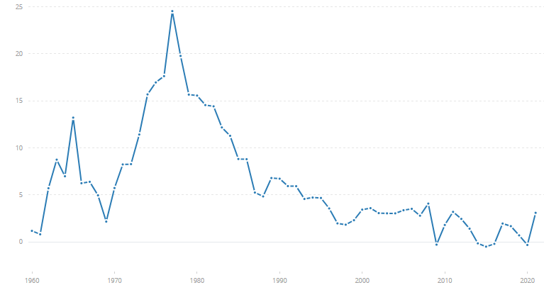
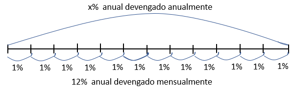
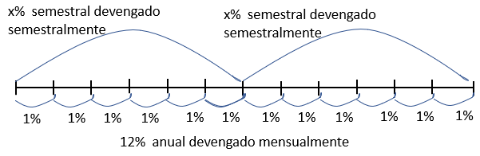
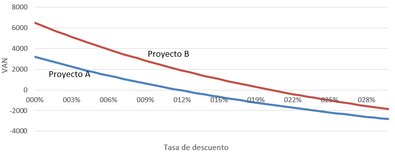

# Análisis de inversiones y financiación {#sec-chap6}

Las necesidades de financiación de la empresa son continuas. A menudo se suele pensar que solo hace falta recurrir a la financiación de las entidades financieras cuando se van a realizar inversiones a largo plazo que requieran grandes cantidades de recursos. Así es en general para las familias, pero no es, ni mucho menos, la forma de actuar de las empresas.

En efecto, las empresas están continuamente acudiendo a las entidades financieras por necesidades corrientes de financiación. La explicación es muy sencilla, los tiempos en que se producen los cobros y los pagos son muy diferentes y a veces imprevisibles. Algunos ejemplos son las ventas estacionales, compras de campaña, compras imprevistas, ampliaciones y recesiones de negocio, etc. La financiación permite a las empresas cubrir los desfases entre esos momentos de tiempo que van en su contra.

En este capítulo se presentan conceptos básicos sobre finanzas y se analizan los criterios más importantes sobre los que basar las decisiones de inversión.

## Introducción

Como ya se dijo en capítulos anteriores, invertir significa renunciar a consumo presente a cambio de mayores posibilidades de consumo futuro. La renuncia al consumo actual permite adquirir algún activo real o financiero con el que la rentabilidad esperada haya hecho merecer la pena la renuncia.

El dinero cambia de valor en el tiempo, y esto es un hecho que complica cualquier inversión. Ese cambio de valor se debe a muchos factores. Los principales son:

- La **preferencia intertemporal** del dinero, que significa simplemente que los humanos preferimos una cantidad de dinero hoy a la misma cantidad en el futuro, aunque sea inmediato. Es una cualidad psicológica inherente a toda persona, aunque la percepción puede variar sustancialmente de unas a otras. Dicho de otro modo, el dinero tiene fecha. 
- El **riesgo** y la **incertidumbre**. El hecho de que el rendimiento se produzca en el futuro hace que las expectativas se cumplan, no se cumplan o se cumplan solo parcialmente. Solemos hablar de riesgo cuando hay posibilidad de establecer alguna cuantificación del resultado en términos de probabilidades. Una situación de incertidumbre se da cuando no es posible ningún cálculo. Las personas con espíritu emprendedor están dispuestas a jugar con el riesgo, nunca con la incertidumbre. Eso es lo que sucede cuando los inversores huyen de aquellos países en los que los gobiernos cambian arbitrariamente las leyes, en los que las instituciones no son de fiar, etc.  

Naturalmente, cuanto mayor sea el riesgo, mayor será la rentabilidad que se le va a exigir a una inversión para que alguien se anime a llevarla a cabo. La percepción sobre el riesgo y la incertidumbre es subjetiva y puede haber unas diferencias importantes entre personas, hasta tal punto que hay personas con una gran **aversión** al riesgo y no invertirían nunca o necesitarían una compensación tan grande que hacen cualquier inversión inviable.

El riesgo tiene muchas caras, y por cada una de ellas el inversor exigirá una **prima**, es decir, un incremento de la rentabilidad extra para compensar por el riesgo en que se incurre. Algunos ejemplos son los siguientes:

- Riesgo de **inflación**, de subida generalizada de los precios. En un ambiente de inflación el dinero que recibiremos en el futuro tendrá menor poder adquisitivo que el presente.
- Riesgo de **tipo de cambio** si la inversión se realiza en moneda diferente a la que se utiliza normalmente. Un encarecimiento de la divisa beneficiará la inversión, porque el retorno en divisas significará un incremento extra de rentabilidad en la moneda nacional.
- Riesgo **país** o **región**, la misma inversión en distintos países tienen riesgos muy diferentes.
- Riesgo del **sector**.
- Etc.

::: callout-tip
## La inflación en España

La figura siguiente muestra la inflación anual en España desde 1960. El máximo se dio en 1977 en medio de una crisis económica muy intensa en un momento de profundas transformaciones políticas, económicas y sociales, espoleadas además por una fuerte crisis del petróleo. [En este enlace](https://www.ine.es/calcula){taget="_blank"} puedes calcular el incremento del coste de la vida entre dos fechas de tu elección.

[{#fig-caption61}](https://datos.bancomundial.org/indicador/FP.CPI.TOTL.ZG?contextual=default&end=2021&locations=ES&start=1960&view=chart){target="_blank"}
:::

## Conceptos preliminares

### Capitalización

El **tipo de interés nominal** o **rentabilidad nominal** es el monto adicional que tiene que recibir el inversor para vencer la inflación, la preferencia intertemporal y su propia apreciación del riesgo en el que incurre al invertir.

Si una persona invierte una cantidad de dinero $c_0$ a un tipo de interés $i$ anual (en tantos por uno), la cantidad que tiene pasado el año será el capital que invirtió más los intereses, que se obtienen multiplicando el interés por dicho capital ($i\times c_0$). Por tanto, el capital inicial se ha convertido en una cantidad superior, que será $c_1=c_0+i\times c_0=c_0(1+i)$.

Si el capital se mantiene un año adicional podemos distinguir dos casos:

- **Interés simple**: el capital se mantiene constante, es decir, los intereses del segundo año vuelven a ser $i\times c_0$, de forma que $c_2=c_1+i\times c_0=c_0(1+2i)$.
- **Interés compuesto**: el interés se añade al capital y produce a su vez intereses en los periodos siguientes, es decir, $c_2=c_1(1+i)=c_0(1+i)^2$.

Si el capital se mantiene durante $n$ años el valor final del capital o su valor de **capitalización** será $c_n=c_0(1+ni)$ para interés simple y $c_n=c_0(1+i)^n$ en el caso de interés compuesto.

::: panel-tabset
## Resuelve {-}

¿A qué tipo de interés de capitalización compuesto equivale un 5% de capitalización simple?

## Solución {-}

La solución viene de resolver la siguiente ecuación para $x$, $(1+x)^n=1+n \times 0,05$, de donde $x=(1+n\times 0,05)^{(1/n)}-1$ y la solución depende de $n$, el horizonte temporal. En cualquier caso $x<0.05$ y tiende a 0 a medida que $n$ crece.
:::

Se puede hablar de tipo de interés **real** o **en términos reales** ($r$) si al tipo de interés nominal se le descuenta la tasa anual de inflación ($g$). También se puede ver de la forma inversa, es decir, que el interés nominal tiene un componente real al que hay que sumar la inflación. Lo más inmediato sería asumir que $i=r+g$, pero no es estrictamente correcto. El valor de un capital al año teniendo en cuenta que la inflación afecta tanto al capital como a los intereses recibidos sería $c_1=c_0+rc_0+gc_0+grc_0=c_0(1+r)(1+g)$. De aquí se deduce que la fórmula exacta para pasar de tipo de interés nominal a real es $(1+i)=(1+r)(1+g)$.

<!-- (ref:caption61) [](https://www.inflation.eu/es/tasas-de-inflacion/espana/inflacion-historica/ipc-inflacion-espana.aspx){target="_blank"} -->

<!-- ```{r fig61, echo=FALSE, fig.cap = '(ref:caption61)'} -->
<!--  -->
<!-- ``` -->

:::: panel-tabset

## Resuelve {-}

Calcula el tipo de interés real para una inversión de dos años en la que el tipo de interés nominal es del 5% y la inflación de 2%. ¿Y si la inflación del primer año fue del 2% y en el segundo año del 5%?

## Solución {-}

$$
(1+0,05)^2=(1+0,02)^2(1+r)^2 \quad \Rightarrow \quad r=1,05/1,02-1=2,94\%
$$

Aquí se ve que el tipo de interés real no es la simple diferencia entre el interés nominal y la tasa de inflación.

$$
1,05^2=1,02 \times 1,05 \times (1+r)^2 \quad \Rightarrow \quad r=\sqrt{1,05^2/(1,02 \times 1,05)}=1,45\%
$$
:::

::: callout-tip
## Euribor

[En este enlace](https://www.euribor-rates.eu/es/graficos-del-euribor/){target="_blank"} o [en este otro](https://sdw.ecb.europa.eu/quickview.do?SERIES_KEY=143.FM.M.U2.EUR.RT.MM.EURIBOR3MD_.HSTA){target="_blank"} puedes encontrar el tipo de interés interbancario conocido como Euribor, que es el tipo de interés al que los bancos europeos se prestan entre sí. El Euribor a un año es además el tipo de interés al que se encuentran referenciadas muchas de las hipotecas a tipo variable en España. 

Teniendo en cuenta la inflación anterior ¿te puedes hacer una idea de cómo son los tipos de interés reales actualmente? Lo puedes comprobar en [este mapa](https://www.indexmundi.com/es/datos/indicadores/FR.INR.RINR){target="_blank"} o compararlos por países [en este enlace](https://www.indexmundi.com/es/datos/indicadores/FR.INR.RINR/compare?country=gb#country=us:gb){target="_blank"}.
:::

### Descuento

Todos los cálculos anteriores son sobre capitalización, es decir, calcular el valor final de un capital dado. Sin embargo, lo habitual es realizar la operación contraria, es decir, **descontar** un capital futuro a una determinada **tasa de descuento**. Descontar, por tanto, significa calcular el valor actual a día de hoy de un capital futuro. Dicho descuento se tiene que hacer a una tasa de descuento, que equivale al interés en los casos anteriores. El descuento en realidad es muy fácil de calcular, puesto que no es más que despejar el capital inicial de las ecuaciones anteriores. Así, el valor actual de un capital futuro $c_n$ descontado a una tasa $i$ durante $n$ años será $c_0=c_n/(1+i)^n$.

Aunque resulta un poco contraintuitivo, el descuento tiene mucho sentido porque sirve para hacernos una idea del valor de determinado capital en el futuro *porque lo comparamos con unidades monetarias de hoy*. Todos conocemos el valor de un euro hoy, sabemos cuántas cosas se pueden comprar con él, pero es muy difícil saber cuánto vale el mismo euro en cualquier momento futuro.

Estos cálculos tropiezan con la dificultad de considerar una tasa de descuento apropiada. A nivel abstracto, una buena tasa de descuento tiene que incluir al menos:

- **Rentabilidad mínima exigida a la inversión**. Esta es relativamente sencilla de estimar, puesto que es la rentabilidad de activos financieros que se consideren libres de riesgo. Aunque estrictamente hablando no puede haber ningún activo libre de riesgo completamente,  tradicionalmente se suele considerar la deuda soberana de los países desarrollados. Esta afirmación quizá necesite de matizaciones desde las últimas turbulencias financieras que hicieron quebrar países enteros.
- **Riesgo**. La tasa de descuento tiene que aumentar por la prima de riesgo que tiene que considerar la particularidades de la inversión en lo que se refiere a sector, país, región, tipos de cambio, etc.
- **Inflación**. La inflación esperada puede introducirse en la tasa de descuento en forma de prima o también pueden usarse tasas de descuento libres de inflación.

Dadas las dificultades de cálculo de la tasa de descuento a menudo lo que los inversores hacen es realizar los cálculos para un conjunto amplio de tasas de descuento o considerar sistemáticamente tasas de descuento muy elevadas que les llevará a tomar decisiones conservadoras.

:::: panel-tabset

## Resuelve {-}

Me conceden un préstamo de 5.000€ al 5% anual durante un año para financiar un proyecto que va a producir 5.600€ el año que viene. ¿Es un proyecto interesante?

## Solución {-}

Esto se puede ver de tres formas:

1. Averiguar cuánto valen los 5.000€ de hoy dentro de un año: $c_1=5.000 \times 1,05=5.250$. Como es inferior a 5.600€ que voy a obtener con el proyecto el proyecto es rentable.
2. Averiguar cuánto vale hoy los 5.600€ del año que viene: $c_0=5.600/1,05=5.333,33$. Como es superior al capital que invierto es rentable.
3. Calcular la rentabilidad del proyecto: $5.600=5.000(1+i)$, de donde $i=12\%$. Como la rentabilidad es superior al coste del capital ($5\%$) la inversión es rentable.
:::

### Valores actuales y finales de una renta

Otra cuestión que aparece continuamente en finanzas es la necesidad de calcular el valor actual de una corriente de dinero (que más adelante llamaremos **flujos de caja**) que se recibe periódicamente durante una serie de años. 

::: callout-important
## Importante

Esto es algo radicalmente distinto a lo anterior, puesto que en este caso hay varios flujos de caja, mientras que en todos los casos vistos hasta ahora se trataba de un flujo de caja aislado. Es importante además darse cuenta de que todos los flujos se reciben al final del periodo, es decir, en el momento actual no hay flujo de caja.
:::

Supongamos que alguien recibe $c$ unidades monetarias al final de los siguientes $n$ años. Considerando una tasa de descuento $i$ tenemos que dicho valor es sencillamente la suma de los valores actualizados de esa renta para cada uno de los periodos, es decir,

$$
\begin{array}{c}
A_{n \rceil i}=\frac{c}{(1+i)}+\frac{c}{(1+i)^2}+\dots+\frac{c}{(1+i)^n}= \\
=c\left[ \frac{(1+i)^{-1}-(1+i)^{-1}(1+i)^{-n}}{1-(1+i)^{-1}}   \right] = c\left[ \frac{1-(1+i)^{-n}}{i} \right] = c a_{n \rceil i}.
\end{array}
$$

En la expresión anterior se ha utilizado la fórmula para la suma de los $n$ primeros términos de una progresión geométrica de razón $(1+i)^{-1}$. Podemos definir $a_{n \rceil i}$ como el valor actual de una unidad de renta recibida durante $n$ años a una tasa de descuento $i$.

De igual forma podemos calcular el valor de capitalización final de una renta recibida repetidamente durante $n$ años. En este caso el cálculo es muy sencillo, puesto que basta con calcular el valor de capitalización de $A_{n \rceil i}$, es decir dicho valor final será $S_{n \rceil i}= A_{n \rceil i}(1+i)^n$. En resumen, podemos decir que recibir una renta todos los años de $c$ unidades monetarias es equivalente a recibir $A_{n \rceil i}$ hoy o $S_{n \rceil i}$ dentro de $n$ años. 

::: callout-important
## Importante

Decir que recibir dos cantidades monetarias en distintos momentos del tiempo son equivalentes se refiere a una equivalencia puramente matemática en la que no se tiene en cuenta ningún otro factor que en la vida real puede hacer que sea preferida una opción sobre otras. Simplemente basta con recordar que los individuos tienen una aversión al riesgo diferente y puede llevarles a preferir recibir el capital cuanto antes.
:::

:::: panel-tabset

## Resuelve {-}

- Calcula el valor actual y final de una renta de 10.000€ durante 10 años a una tasa de descuento del 5%. 
- ¿Cuál es el valor actual de 1€ de renta a una tasa de descuento $i$ percibida durante infinitos periodos?

## Solución {-}

Valor actual:

$$
A_{10 \rceil 0,05}=10.000 a_{10 \rceil 0,05}=10.000\frac{1-1,05^{-10}}{0,05}=77.217,35.
$$

Valor final:

$$
S_{10 \rceil 0,05}=A_{10 \rceil 0,05}\times 1,05^{10} = 77.217,35 \times 1,05^{10}=125.778,90.
$$

Como era de esperar los 100.000€ que se reciben durante los 10 años valen menos si los valoramos a día de hoy y más si los valoramos dentro de 10 años.

El valor actual de c€ de renta a una tasa de descuento $i$ percibida durante infinitos periodos es

$$
A_{\infty \rceil i}=c\times a_{\infty \rceil i}=c \frac{1-(1+i)^{-\infty}}{i}=\frac{c}{i}.
$$

A pesar de estar recibiendo infinitos euros, el peso de los denominadores en la actualización es tan grande a medida que pasa el tiempo que el valor actual es finito.
:::

La formulación anterior puede generalizarse cuando la renta y las tasas de descuento cambian en el tiempo, la fórmula sería

$$
A_{n \rceil i}=\frac{c_1}{(1+i_1)}+\frac{c_2}{(1+i_1)(1+i_2)}+\dots+\frac{c_n}{\prod_{j=1}^n(1+i_j)}
$$

::: panel-tabset
## Resuelve {-}

Calcula el valor actual de 10€ de renta recibidos en tres periodos con tasas de descuento del 1%, 2% y 3%.

## Solución {-}

$$
A_{n \rceil i_t}=\frac{10}{1,01}+\frac{10}{1,01 \times 1,02}+\frac{10}{1,01 \times 1,02 \times 1,03}=29,03.
$$
:::

### Tipos de interés nominales y efectivos

::: columns
::: {.column width="10%"}
:::
::: {.column width="80%"}

:::
::: {.column width="10%"}
:::
:::


A menudo los tipos de interés o **rentabilidades** o **costes de capital** se refieren a un periodo de tiempo, normalmente un año, pero se capitalizan varias veces durante ese periodo. Esto genera cierto grado de dificultad en la comprensión de lo que realmente está sucediendo. Es por eso que se calculan los tipos efectivos, que son tasas anuales devengadas anualmente. El tipo efectivo es perfectamente comprensible y comparable con cualquier otro. La forma de realizar el cálculo es plantear una ecuación en la que las dos capitalizaciones coinciden. Siempre utilizaremos interés compuesto.

Supongamos un tipo de interés del $12\%$ anual que se devenga mensualmente, la pregunta que nos hacemos es ¿a qué tipo de interés anual devengado anualmente equivale?. La @fig-fig63 muestra el caso en el que se realiza una capitalización 12 veces al año, una por mes. 


{#fig-fig63}

<!-- ```{r fig-fig63, echo=FALSE, fig.cap = 'Capitalización mensual de tipo de interés anual.', fig.align='center'} -->
<!--  -->
<!-- ``` -->

En la parte superior se indica que el tipo de interés incógnita es para todo el año, de forma que 1€ capitalizado a ese tipo de interés se convertiría en $(1+x)$ al final del año. En la parte inferior se indica que el interés que se va a devengar mensualmente es del 1% (12% entre doce meses), pero como los intereses de cada mes generan intereses adicionales en los meses posteriores, el euro inicial se convierte en $(1+0,01)^{12}$ a final del año. El tipo de interés efectivo, por tanto saldrá de resolver la ecuación

$$
(1+x)=\left( 1+\frac{0,12}{12} \right) ^{12},
$$

cuya solución es $12,68\%$, superior al $12\%$ inicial debido a que el interés es compuesto, es decir, los intereses de cada mes se añaden al capital y generan intereses en los meses posteriores. La conclusión es que da igual recibir una rentabilidad del $12\%$ anual devengado mensualmente o un $12,68\%$ anual devengado anualmente.

La @fig-fig64 muestra un caso diferente, puesto que la incógnita ahora es un tipo de interés semestral devengado semestralmente (dos veces al año). En ese caso la ecuación es $(1+x)^2 = (1+0,12/12)^{12}$, cuya solución es $6,15\%$.

{#fig-fig64}

<!-- ```{r fig-fig64, echo=FALSE, fig.cap = 'Capitalización mensual de tipo de interés semestral.', fig.align='center'} -->
<!--  -->
<!-- ``` -->

::: callout-tip
## TIN y TAE

Estos cálculos tiene una relación directa con el cálculo de la Tasa Anual Equivalente (TAE) de un producto financiero, a partir de la Tasa de Interés Nominal (TIN). La TAE es la rentabilidad anual devengada anualmente incluyendo todos los costes adicionales que conlleva el producto (comisiones, gastos de gestión, etc.). Una parte de las diferencias entre TIN y TAE es la capitalización repetida a lo largo del año, aunque hay otros factores adicionales, que son los costes añadidos. Si miras la publicidad de muchos activos y pasivos financieros encontrarás estos dos términos.
:::

:::: panel-tabset

## Resuelve {-}

- ¿A qué tipo de interés anual devengado semestralmente equivale un $6\%$ anual devengado anualmente?

- ¿A qué tipo de interés semestral devengado trimestralmente equivale un $6\%$ mensual devengado mensualmente?

## Solución {-}

$$
\left( 1+\frac{x}{2} \right) ^2=(1+0,06) \quad \Rightarrow \quad x=5,91\%.
$$

El tipo de interés semestral devengado trimestralmente al que equivale un $6\%$ mensual devengado mensualmente es

$$
\left( 1+\frac{x}{2} \right) ^4=(1+0,06)^{12} \quad \Rightarrow \quad x=38,2\%.
$$
:::

::: callout-important
## ¡Cuidado con las inversiones inferiores al año!

::: columns
::: {.column width="15%"}
:::
::: {.column width="70%"}

:::
::: {.column width="15%"}
:::
:::

:::

### Sistemas de amortización de deuda

En el mundo financiero existen ingentes tipos de activos/pasivos financieros, y cada uno de ellos puede tener distintas formas de amortización. Esta consiste en ir reduciendo el capital y abonando intereses a medida que se van cumpliendo los plazos de vencimiento. Los activos financieros se caracterizan por tener un **valor nominal** o **principal**, **interés** y **plazo**, y estos tres valores exclusivamente son los que determinan las amortizaciones de cada periodo, conocida como **cuota**. En todos los casos el capital pendiente en cada periodo siempre se calcula como el capital vivo en el periodo anterior menos la amortización del periodo. Los intereses siempre se calculan sobre el capital pendiente.

Tres son las formas más habituales de amortización:

- **Sistema americano** o **al tirón**: el capital está vivo durante toda la vida del activo y se amortiza completamente en el último vencimiento. Como el capital es constante, los intereses también lo serán. Tendrá cuotas constantes con la excepción de la última que será muy grande respecto a las demás. Es habitual en títulos de deuda privada y pública (letras, bonos, obligaciones, etc.).
- **Sistema alemán**: la cantidad de capital que se amortiza es fija en cada periodo. Al reducirse el capital los intereses también se reducen, dando lugar a una cuota decreciente. Raramente se utiliza en España.
- **Sistema francés**: se hace un cálculo para que la cuota sea constante a lo largo de todo el préstamo. Al obligar a tener una cuota constante y un capital decreciente por las amortizaciones, los intereses son decrecientes y la amortización de capital creciente. Es el sistema típico de préstamos al consumo o hipotecas. 

El cálculo de la cuota ($\alpha$) en el sistema francés es muy sencillo, basta con dividir el principal entre el valor actual de 1€ de renta recibido durante la duración del préstamo, $\alpha=c_0/a_{n \rceil i}$. El razonamiento para llegar a tal resultado es sencillo, puesto que si despejamos el principal $c_0=\alpha a_{n \rceil i}$, vemos que la cuota es precisamente la renta futura recibida todos los periodos a la que equivale el principal del préstamo como valor actual. Dicho de otro modo, el banco concede un préstamo hoy por valor de $c_0$ y recibe una renta futura que actualizada a día de hoy coincide exactamente con el importe que presta.

::: callout-tip
## Cuotas constantes

El sistema francés resulta muy conveniente para préstamos al consumo o hipotecas, y de hecho es el más común, porque al ser las cuotas constantes, el prestatario se puede hacer una idea bastante clara del esfuerzo que le costará devolver el préstamo. El problema es que a menudo los préstamos se hacen a tipo variable, con lo que la cuota se suele recalcular todos los años en función de la variación de los tipos de interés. No siempre los prestatarios son conscientes de este hecho.
:::

:::: panel-tabset

## Resuelve {-}

- Calcula la tabla de amortización de un préstamo de 9.000€ a tres años a un interés del 1% anual por el método americano, alemán y francés. 

- Si en el caso americano se produce una amortización anticipada de 500€ al finalizar el segundo periodo, ¿cómo se modifica la tabla del préstamo?

## Solución {-}

Sistema americano:

| Periodo | Capital pendiente | Interés | Capital amortizado | Cuota |
|-:|-:|-:|-:|-:|
| 1 | 9.000 | 90 | 0 | 90 |
| 2 | 9.000 | 90 | 0 | 90 |
| 3 | 9.000 | 90 | 9.000 | 9.090 |

La amortización constante del sistema alemán es $9.000/3=3.000$. La tabla es

| Periodo | Capital pendiente | Interés | Capital amortizado | Cuota |
|-:|-:|-:|-:|-:|
| 1 | 9.000 | 90 | 3.000 | 3.090 |
| 2 | 6.000 | 60 | 3.000 | 3.060 |
| 3 | 3.000 | 30 | 3.000 | 3.030 |

La cuota fija del sistema francés es $\alpha=c_0/a_{3 \rceil 0,01}=3.060,2$. Los intereses se calculan sobre el capital pendiente y la amortización de capital de cada año se calcula como la diferencia entre la cuota y el interés. La tabla es

| Periodo | Capital pendiente | Interés | Capital amortizado | Cuota |
|-:|-:|-:|-:|-:|
| 1 | 9.000,0 | 90,0 | 2.970,2 | 3.060,2 |
| 2 | 6.029,8 | 60,3 | 2,999,9 | 3.060,2 |
| 3 | 3.029,9 | 30,3 | 3.029,9 | 3.060,2 |
  
Si en el caso americano se produce una amortización anticipada de 500€ al finalizar el segundo periodo, la tabla sería la siguiente

| Periodo | Capital pendiente | Interés | Capital amortizado | Cuota |
|-:|-:|-:|-:|-:|
| 1 | 9.000 | 90 | 0 | 90 |
| 2 | 9.000 | 90 | 500 | 590 |
| 3 | 8.500 | 85 | 8.500 | 8.585 |
:::

## Los flujos de caja

La evaluación siempre se realiza en términos monetarios, por lo que un componente imprescindible son los flujos de caja que, como su nombre indica, son los cobros y pagos en sentido estricto que genera el proyecto a lo largo de su vida. Naturalmente unos flujos serán positivos y otros negativos. Es importante ser conscientes de que los proyectos se evalúan sobre los flujos de caja (cobros y pagos) y no sobre el beneficio (ingresos y gastos).

Tan importante como los flujos de caja en sí es su distribución a lo largo del tiempo. Los flujos suelen distribuirse de forma irregular, por lo que se suelen agrupar en periodos más largos con el fin de hacerlos más manejables.

Para calcular adecuadamente los flujos de caja deben tenerse en cuenta todas las consideraciones hechas en el capítulo anterior sobre los mismos. En particular, se debe tener en cuenta que los activos que componen el inmovilizado deben amortizarse paulatinamente todos los años, y esa amortización no forma parte de los flujos de caja, pero sí es un gasto corriente.

Consideremos $I$ la inversión en el activo, $n$ el número de años de la vida del activo, $A_j$ la amortización del año $j-$ésimo y $v_0$ el valor residual. La amortización anual se puede calcular de muchas formas:

- **Cuotas fijas**: todos los años se amortiza el mismo importe, es decir, $A_j=(I-v_0)/n$.
- **Números dígitos crecientes**: cada año se amortiza un importe proporcional creciente, $A_j=(I-v_0) / \sum_{i=1}^n i \times j$.
- **Números dígitos decrecientes**: es igual que el anterior pero decreciente, $A_j=(I-v_0) /\sum_{i=1}^n i \times (n-j+1)$.

::: panel-tabset
## Resuelve {-}

Una máquina tiene una vida útil de 3 años, cuesta 200€ y tiene un valor residual de 20€. Calcula la tabla de amortización con cuotas constantes, dígitos crecientes y decrecientes.

## Solución {-}

| Periodo | Constante | Creciente | Decreciente |
|-:|-:|-:|-:|-:|
| **1** | 60 | 30 | 90 |
| **2** | 60 | 60 | 60 |
| **3** | 60 | 90 | 30 |
:::

::: callout-important
## Amortización de inmovilizado y amortización financiera

No se debe confundir la amortización del inmovilizado considerada en esta sección con la amortización de activos financieros vista anteriormente. La amortización del inmovilizado se puede realizar por cuotas constantes, números dígitos crecientes o decrecientes. La amortización de activos financieros se puede realizar por el sistema americano, alemán o francés.
:::

## Evaluación de inversiones

La evaluación de inversiones consiste en valorar si merece la pena acometer una inversión o es mejor desecharla, pero también puede ser útil para elegir entre distintos proyectos excluyentes. Se puede realizar la valoración hacia el futuro, una inversión que se piensa acometer o bien para valorar un proyecto ya vencido. Una tercera posibilidad es **monitorizar** o **controlar** un proyecto en curso para comparar la ejecución con lo proyectado y tomar las medidas para reconducirlo hacia el objetivo. 

Los proyectos de inversión están condicionados al menos por tres determinantes que han ido saliendo a lo largo de estas páginas. Se trata del **plazo**, el **riesgo** y los **flujos de caja**. Cualquier otro elemento relevante del proyecto se tiene que traducir en uno de estos tres para poder llevar a cabo la evaluación. 

La dificultad más importante en la evaluación de proyectos es que se trata de algo que va a suceder en el futuro, de forma que puede estar condicionado por múltiples factores impredecibles. Se puede pensar en turbulencias financieras o pandemias para entender de qué estamos hablando. Esto hace que, además de considerar el riesgo del proyecto explícitamente y reflejarlo en la tasa de descuento, los flujos de caja se conocen con distintos grados de incertidumbre, aunque puede variar mucho de unos proyectos a otros.

El concepto de proyecto de inversión en este contexto es muy amplio, puede referirse a la amortización de un título de deuda o a la compra de una cadena de montaje para una industria pesada. En el primer caso los flujos se conocen con exactitud y se supone que el riesgo es pequeño. En el segundo caso el éxito de la evaluación depende crucialmente de la experiencia de quien va a emprender la inversión.

En definitiva, la valoración de los proyectos va depender de las hipótesis sobre el futuro de aspectos estrictos del proyecto, pero también del ambiente económico local y general. No es lo mismo emprender un negocio cuando la economía está en pleno proceso de expansión que cuando está en recesión. Por todo ello, en la vida real se suele realizar **análisis de sensibilidad**, **de riesgos** o se plantean distintas hipótesis correspondientes con escenarios más optimistas o más pesimistas.

La situación típica consiste, por tanto, en tener un conjunto de flujos de caja esperados distribuidos en el tiempo. Además habremos hecho una evaluación del riesgo, de la rentabilidad mínima esperada y de todo aquello que sea relevante para el proyecto. Todos estos aspectos tendrán su materialización en la tasa de descuento que se vaya a considerar. 

En la @tbl-tab61 se muestran los flujos de caja de dos inversiones para las que nos interesará ver cuál de ellas es realizable y cuál es preferible.

```{r tbl-tab61, echo=FALSE}
#| tbl-cap: Flujos de caja de dos proyectos de inversión.

table61 = rbind(fc = rbind(c(-1500, 400, 400, 400, 400, 400, 400),
               c(-1000, 300, 300, 300, 300, 300, 300)))
colnames(table61) = c("**0**", "**1**", "**2**", "**3**", "**4**", "**5**", "**6**")
rownames(table61) = c("**Proyecto A:**", "**Proyecto B:**")
knitr::kable(
  head(table61, nrow(table61)),
  booktabs = TRUE,
  align = "cc",
)
```

Dado este volumen de información lo único que resta es utilizar los criterios de evaluación de inversiones, que en realidad son muchos. Los principales se presentan a continuación.

### Periodo de recuperación (*pay-back* o *pay-off*)

Es el tiempo que tarda en recuperarse la inversión inicial. Normalmente todos los proyectos tendrán un desembolso inicial importante, no necesariamente único, que se irá recuperando a medida que la inversión vaya produciendo sus retornos. El criterio se puede utilizar con flujos actualizados o no. Evidentemente, el proyecto con menor plazo de recuperación se considerará mejor.

::: panel-tabset
## Resuelve {-}

Calcula el periodo de recuperación sin y con descuento al 5% de los proyectos de la @tbl-tab61.

## Solución {-}

Para calcular el periodo de recuperación del proyecto A tenemos que ver cuándo se recuperan los 1.500€ de inversión. Cuando han pasado tres años ya se han recuperado 1.200€, por lo que los 300€ restantes se recuperarán a lo largo del año siguiente. Si suponemos una distribución uniforme de los flujos a lo largo del año, tenemos que el plazo de recuperación será de $3+3/4$ años, es decir, 3 años y 9 meses.

Para el proyecto B tenemos $3+100/3$, es decir, 3 años y 3 meses. Este proyecto es mejor que el A por tener un plazo de recuperación inferior.

Los flujos de caja actualizados al 5% son

|  | 0 | 1 | 2 | 3 | 4 | 5 | 6|
|:-:|-:|-:|-:|-:|-:|-:|-:|
| **A:** | -1.500 | 380,95 | 362,81 | 345,53 | 329,08 | 313,41 | 298,49 |
| **B:** | -1.000 | 285,71 | 272,11 | 259,15 | 246,81 | 235,06 | 223,86 |

El plazo de recuperación con descuento del proyecto A es $4+(231,79/313,41)$, que es aproximadamente cuatro años y 9 meses. Para el proyecto B es $3+(63,78/246,81)$, aproximadamente 3 años y cuatro meses. Es mejor el proyecto B.
:::

### Valor Actualizado Neto (VAN)

Es la suma de todos los flujos de caja actualizados por la tasa de descuento. Si el valor es superior o igual a cero el proyecto será realizable y se abandonará en caso contrario. Cuanto mayor es el VAN mejor es el proyecto, se elegirá el que mayor VAN tenga.

Las fórmulas de VAN son distintas dependiendo de los supuestos. La fórmula más general se corresponde con el caso poco usual en el que se asuman distintas tasas de descuento $(k_i, i=1,2,\dots,n)$:

$$
VAN=-c_0+\frac{c_1}{(1+k_1)}+\frac{c_2}{(1+k_1)(1+k_2)}+\dots+\frac{c_n}{\prod_{l=1}^n(1+k_l)}.
$$

El caso más habitual es considerar que la tasa de descuento es contante, es decir,

$$
VAN(k)=-c_0+\frac{c_1}{(1+k)}+\frac{c_2}{(1+k)^2}+\dots+\frac{c_n}{(1+k)^n}.
$$

Puede haber casos particulares en los que se asuma que los flujos de caja son constantes, en ese caso el cálculo se simplifica mucho, $VAN(k)=-c_0+c a_{n \rceil k}$.

::: panel-tabset
## Resuelve {-}

Calcula el VAN al 5% de los proyectos de la @tbl-tab61.

## Solución {-}

$$
VAN_A(5\%)=-1.500+\frac{400}{1,05}+\frac{400}{1,05^2}+\dots +\frac{400}{1,05^6}=530,28.
$$

Dado que los flujos son constantes, también se podría calcular como $VAN_A(5\%)=-1.500 + 400 \times a_{6 \rceil 0,05}=530,28$. De la misma forma $VAN_B(5\%)=-1.000 + 300 \times a_{6 \rceil 0,05}=522,71$. Es mejor el proyecto A, pero hay que tener cuidado porque el volumen de la inversión inicial es un 50% más elevada. 
:::

::: callout-tip
## Coste de oportunidad de nuevo
La actualización se utiliza mucho en cualquier cálculo económico, considera de nuevo el cálculo del coste de oportunidad de estudiar una carrera.

::: columns
::: {.column width="10%"}
:::
::: {.column width="80%"}

:::
::: {.column width="10%"}
:::
:::

:::

### Tasa Interna de Rentabilidad (TIR)

La Tasa Interna de Rentabilidad se define como la tasa de descuento que hace el VAN igual a cero. Se calcula como la solución de la siguiente ecuación

$$
0=-c_0+\frac{c_1}{(1+TIR)}+\frac{c_2}{(1+TIR)^2}+\dots+\frac{c_n}{(1+TIR)^n}.
$$

El cálculo se simplifica cuando los flujos de caja son constantes, puesto que la ecuación ahora sería $0=-c_0+c a_{n \rceil TIR}$.

Si todos los desembolsos se concentran en el desembolso inicial, realizar la inversión sería equivalente a invertir el desembolso inicial en un activo financiero que se amortizara al tirón con una rentabilidad igual a la TIR.

La ecuación de la TIR puede ser tremendamente complicada de resolver, al tratarse de una ecuación de grado $n$, con $n$ soluciones. El caso más sencillo se da cuando hay un único flujo negativo y la suma de todos los flujos es positiva, porque en ese caso la solución es única. Pero puede haber casos más complejos en los que de hecho haya varias soluciones. En estos casos la TIR resulta de poca utilidad.

::: panel-tabset
## Resuelve {-}

Calcula la TIR de los proyectos de la @tbl-tab61.

## Solución {-}

$$
0=-1.500+\frac{400}{(1+TIR_A)}+\frac{400}{(1+TIR_A)^2}+\dots +\frac{400}{(1+TIR_A)^6}.
$$

La solución es $TIR_A=15,34\%$. Aprovechando que los flujos son constantes, también se podría calculado resolviendo la ecuación $0=-1.500+400a_{6 \rceil TIR}$.

Para el proyecto B, $0=-1.000+300a_{6 \rceil TIR}$, que da una TIR de $19,91\%$. Es mejor el proyecto B considerando la TIR.
:::

::: panel-tabset

## Resuelve {-}

Calcula la TIR de un proyecto de inversión con una inversión inicial $c_0$ y flujos constantes y de horizonte temporal infinito. ¿Te llama la atención el resultado?

## Solución {-}

La ecuación será

$$
0 = -c_0+c a_{\infty\rceil TIR}=-c_0+c/TIR  \quad \Rightarrow \quad TIR=c/c_0
$$
Resulta curioso que teniendo periodo infinito la TIR sea finita.
:::

::: panel-tabset
## Resuelve {-}

Una empresa está considerando invertir en una máquina por valor de 100€ con un valor residual de 10€ y una vida útil de tres años. Se estima que producirá 50€ al año y generará unos pagos de 10€ anuales. El impuesto sobre la renta es del 25%. Considera la amortización constante. Calcula el plazo de recuperación, el VAN al 10% y la TIR.

Considera una segunda opción consistente en financiar la mitad de la inversión con un préstamo al 4% amortizado por el método americano.

## Solución {-}

La tabla conteniendo toda la información del problema es la siguiente:

| Periodo | Inversión | Cobros-Pagos | Dígitos | BAI | Impuesto | Flujo |
|-:|-:|-:|-:|-:|-:|-:|
| **0** | -100 |    |    |    |      | -100 |
| **1** |      | 40 | 30 | 10 | -2,5 | 37,5 |
| **2** |      | 40 | 30 | 10 | -2,5 | 37,5 |
| **3** | 10   | 40 | 30 | 10 | -2,5 | 47,5 |

El beneficio se calcula como los cobros menos pagos menos la amortización. El flujo de caja es la inversión inicial más el valor residual (que se asume que se recupera al final de la vida del activo), más cobros menos pagos, menos el impuesto.

El plazo de recuperación sin descuento es $2 + 25 / 47,5$, que es aproximadamente dos años y medio.
$$
VAN(10\%)=-100+\frac{37,5}{1,1}+\frac{37,5}{1,1^2}+\frac{47,5}{1,1^3}=0,77
$$

La TIR es 10,42%. El proyecto es rentable con muy poco margen, puesto que el VAN es a penas positivo y la TIR supera en muy poco a la tasa de descuento.

Si consideramos el préstamo, la tabla cambiaría de la siguiente forma:

| Periodo | Préstamo | Intereses | BAI | Impuesto | Flujo |
|-:|-:|-:|-:|-:|-:|
| **0** |  50 |    |   |    | -50 | 
| **1** |     | -2 | 8 | -2 | 36 | 
| **2** |     | -2 | 8 | -2 | 36 | 
| **3** | -50 | -2 | 8 | -2 | -4 | 

En este caso el plazo de recuperación es $1+14/36$, un año y casi cinco meses. El VAN es 9,47 y la TIR es 24,62%. El endeudamiento ha actuado como "palanca" de la inversión, incrementando la rentabilidad. Esto es así porque el coste de la financiación es inferior a la rentabilidad del proyecto sin financiación ajena.
:::

::: callout-important
## Interpretación correcta de la TIR

La ecuación que nos da la TIR se puede re-escribir como

$$
c_0(1+TIR)^n=c_1(1+TIR)^{n-1}+c_2(1+TIR)^{n-2}+\dots+c_{n-1}(1+TIR)+c_n
$$

El lado izquierdo de la ecuación es el valor final de la inversión inicial a una tasa TIR durante $n$ años. El lado derecho es el valor final de la re-inversión de todos los flujos de caja a la misma tasa TIR. Es decir, la interpretación correcta de la TIR es como la rentabilidad de los lujos de caja asumiendo que todos se reinvierten a la tasa TIR.

En la vida real los flujos de caja no se reinvierten porque se destinan a otros fines o no se pueden reinvertir a la tasa TIR, dado que las rentabilidades van cambiando a lo largo del tiempo. En ese caso, si se pretende calcular la rentabilidad del proyecto sin reinversión a la que equivale un interés fijo compuesto, la ecuación a resolver sería diferente, en particular,

$$
c_0(1+TIR)^n=c_1+c_2+\dots+c_{n-1}+c_n,
$$

que es lo mismo que calcular el tipo de interés compuesto al que equivale la suma de los flujos de caja.

Imaginemos que queremos calcular el interés compuesto al que equivale la compra de un bono al 10% a cinco años. Esto equivale a comparar la compra del bono frente a introducir el importe de la inversión inicial en una cuenta corriente. La rentabilidad es, obviamente, el 10%, pero el tipo de interés compuesto al que equivale se calcula resolviendo $(1+i)^5=1+5 \times 0.1$, que da $i=8,45\%$. A medida que crece el número de años la rentabilidad tiende a 0, por ejemplo, con 20 periodos tendríamos que $i=5,64\%$.

A veces las cosas pueden parecer complicadas. Mira este vídeo:

::: columns
::: {.column width="15%"}
:::
::: {.column width="70%"}

:::
::: {.column width="15%"}
:::
:::

:::

::: callout-tip
## Resuelve

Una empresa está considerando invertir en una máquina por valor de 100€ con un valor residual de 10€ y una vida útil de tres años. Se estima que producirá 50€ al año y generará unos pagos de 10€ anuales. El impuesto sobre la renta es del 25%. Considera la amortización constante. Calcula el plazo de recuperación, el VAN al 10% y la TIR.

Considera una segunda opción consistente en financiar la mitad de la inversión con un préstamo al 4% amortizado por el método americano.

\vspace{1em}

## Solución

La tabla conteniendo toda la información del problema es la siguiente:


<!-- ```{r tbl-ttt1, echo=FALSE} -->
<!-- #| tbl-cap: Flujos de caja de dos proyectos de inversión. -->

<!-- tt1 = rbind(c("**0**", "-100", " ", " ", " ", " ", "-100"), -->
<!--             c("**1**", " ", "40", "30", "10", "-2,5", "37,5"), -->
<!--             c("**2**", " ", "40", "30", "10", "-2,5", "37,5"), -->
<!--             c("**3**", "10", "40", "30", "10", "-2,5", "47,5") -->
<!-- ) -->
<!-- colnames(tt1) = c("Periodo", "Inversión", "Cobros-Pagos", "Dígitos", "BAI", "Impuesto", "Flujo") -->
<!-- knitr::kable(tt1, align = "crrrrrr", -->
<!-- ) -->
<!-- ``` -->


| Periodo | Inversión | Cobros-Pagos | Dígitos | BAI | Impuesto | Flujo |
|-:|-:|-:|-:|-:|-:|-:|
| **0** | -100 |    |    |    |      | -100 |
| **1** |      | 40 | 30 | 10 | -2,5 | 37,5 |
| **2** |      | 40 | 30 | 10 | -2,5 | 37,5 |
| **3** | 10   | 40 | 30 | 10 | -2,5 | 47,5 |

El beneficio se calcula como los cobros menos pagos menos la amortización. El flujo de caja es la inversión inicial más el valor residual (que se asume que se recupera al final de la vida del activo), más cobros menos pagos, menos el impuesto.

El plazo de recuperación sin descuento es $2 + 25 / 47,5$, que es aproximadamente dos años y medio.
$$
VAN(10\%)=-100+\frac{37,5}{1,1}+\frac{37,5}{1,1^2}+\frac{47,5}{1,1^3}=0,77
$$

La TIR es 10,42%. El proyecto es rentable con muy poco margen, puesto que el VAN es a penas positivo y la TIR supera en muy poco a la tasa de descuento.

Si consideramos el préstamo, la tabla cambiaría de la siguiente forma:

| Periodo | Préstamo | Intereses | BAI | Impuesto | Flujo |
|-:|-:|-:|-:|-:|-:|
| **0** |  50 |    |   |    | -50 | 
| **1** |     | -2 | 8 | -2 | 36 | 
| **2** |     | -2 | 8 | -2 | 36 | 
| **3** | -50 | -2 | 8 | -2 | -4 | 

En este caso el plazo de recuperación es $1+14/36$, un año y casi cinco meses. El VAN es 9,47 y la TIR es 24,62%. El endeudamiento ha actuado como "palanca" de la inversión, incrementando la rentabilidad. Esto es así porque el coste de la financiación es inferior a la rentabilidad del proyecto sin financiación ajena.
:::

::: callout-tip

## Resuelve

Calcula la TIR de un proyecto de inversión con una inversión inicial $c_0$ y flujos constantes y de horizonte temporal infinito. ¿Te llama la atención el resultado?

\vspace{1em}

## Solución

La ecuación será

$$
0 = -c_0+c a_{\infty\rceil TIR}=-c_0+c/TIR  \quad \Rightarrow \quad TIR=c/c_0
$$
Resulta curioso que teniendo periodo infinito la TIR sea finita.
:::

### Análisis de sensibilidad

El análisis de sensibilidad consiste en perturbar algunas variables claves del análisis y observar cómo varían las variables respuesta. Por ejemplo, cómo varían el plazo de recuperación, el VAN o la TIR cuando los flujos de caja son superiores o inferiores en un 10%, etc. Un análisis exhaustivo de sensibilidad en un proyecto real tiene muchas ramificaciones. En el esquema sencillo que seguimos aquí se puede hacer un análisis rápido calculando el VAN para un continuo de tasas de descuento. Si para tasas de descuento elevadas el VAN es positivo será una señal ineludible de que el proyecto es muy bueno. Por el contrario, si para tasas de descuento pequeñas el VAN es negativo implica que el proyecto hay que abandonarlo o modificarlo sustancialmente.

Si se realiza una representación gráfica del VAN frente a la tasa de descuento se obtiene la @fig-fig65. Cuando la tasa de descuento es cero el VAN es la suma de los flujos de caja sin descontar. Cuando la tasa de descuento es muy grande el VAN tiende al flujo inicial. El corte de las curvas con el eje horizontal es precisamente la TIR del proyecto por definición. El corte de ambas curvas se suele llamar *intersección de Fisher* y marca la tasa de descuento para la que los proyectos son indiferentes. Valores superiores de la tasa de descuento hará que el proyecto B sea mejor desde el punto de vista del VAN, mientras que tasas inferiores harán preferible el A. 

```{r fig-fig65, echo=FALSE, fig.cap = 'VAN para dos proyectos de inversión.', out.width="70%", fig.align='center'}
fc = cbind(c(-1500, 400, 400, 400, 400, 400, 400),
               c(-1000, 300, 300, 300, 300, 300, 300))
k = seq(0, 40, 0.5)
vanA = rep(0, length(k))
vanB = vanA
for (t in 0 : 6){
    den = 1 / (1 + k / 100) ^ t
    vanA = vanA + fc[t + 1, 1] * den
    vanB = vanB + fc[t + 1, 2] * den
}
plot(k, vanA, type = "l", ylab = "VAN", xlab = "Tasa de descuento")
lines(k, vanB, col="red", lty = 2)
lines(k, rep(0, length(k)), col="grey", lty = 2)
legend(30, 800, legend=c("Proyecto A", "Proyecto B"),
       col=c("black", "red"), lty=1:2, cex=0.8)
```

La intersección de Fisher se puede calcular hallando la TIR de un proyecto que es la diferencia de los flujos de caja de ambos proyectos. La tasa sería la solución de la ecuación

$$
0=-500+100a_{6 \rceil TIR}=-500+100 \left[ \frac{1-(1+TIR)^{-6}}{TIR} \right],
$$

que da una intersección de Fisher (TIR) de $5,47\%$.

Todo lo anterior pone de manifiesto que la selección de proyectos no es sencilla, puesto que según la TIR el proyecto preferido es el B, mientras que el VAN no es concluyente al depender de la tasa de descuento. El conflicto viene de que se están comparando dos criterios que miden dos cosas distintas. Mientras que el VAN es una medida absoluta con unidades (euros del presente), la TIR es una medida de rentabilidad relativa que tiene en cuenta el esfuerzo realizado por la inversión inicial.

Si el volumen de recursos empleados en la inversión fuera similar la TIR sería una buena guía, aunque el VAN también valdría puesto que una de las curvas estaría siempre por encima de la otra, es decir, el VAN sería mejor para uno de los proyectos con independencia de la tasa de descuento. Si se tiene muy claro que el valor de la tasa de descuento el VAN sería la guía a seguir. Si ninguna de esas posibilidades es clara, no queda más remedio que incluir criterios adicionales, entre ellos el volumen de inversión total. Hay que tener en cuenta que en el proyecto A la inversión inicial es un $50\%$ superior a la del B. Una inversión de 1€ con una TIR del $500\%$ convertiría la inversión en 6€, pero es una inversión ridícula desde cualquier punto de vista.

## Cálculo de rentabilidades y costes de activos financieros

El cálculo de la TIR proporciona una ecuación que se usa repetidamente en finanzas para el cálculo de rentabilidades y coste de cualquier activo y pasivo financiero. De igual forma se puede utilizar para calcular las TAE. La ventaja es su generalidad, puesto que depende de los flujos de caja, que pueden ser tan irregulares como se quiera.

Imaginemos que queremos calcular la rentabilidad de un bono de deuda pública de 6.000€ de nominal con un interés del 2% anual a 5 años (los bonos se amortizan al tirón o por el sistema americano). La ecuación depende de los flujos de caja descontados por la rentabilidad que queremos calcular, 

$$
0=-6.000+\frac{120}{(1+i)}+\frac{120}{(1+i)^2}+\frac{120}{(1+i)^3}+\frac{120}{(1+i)^4}+\frac{6.120}{(1+i)^5}.
$$

Naturalmente la solución de esta ecuación es $i=2\%$. Pero ahora podemos plantearnos casos más cercanos a la realidad. Por ejemplo, supongamos que la gestión la hace alguien que cobra una comisión inicial del $1\%$ del nominal. ¿Cuál será la rentabilidad teniendo en cuenta la comisión? Habría que plantear la misma ecuación con un flujo inicial de $-6.060$, que arrojaría una rentabilidad de $1,79\%$. Si la comisión se cargara en el último periodo, en lugar de hacerlo en el primero, el flujo de caja inicial vuelve a ser $6.000$€ y el final sería $6.060$€, que daría una rentabilidad del $1,81\%$, algo mayor porque se ha reducido un flujo de caja lejos en el tiempo del periodo inicial.

Se puede también calcular la rentabilidad real $r$ asumiendo, por ejemplo, una tasa de inflación constante $g$. La ecuación sería,

$$
\begin{array}{rl}
0=&-6.000+\frac{120}{(1+r)(1+g)}+\frac{120}{(1+i)^2(1+g)^2}+\frac{120}{(1+i)^3(1+g)^3} \\
  & +\frac{120}{(1+i)^4(1+g)^4}+\frac{6.120}{(1+i)^5(1+g)^5}.
  \end{array}
$$

Este cálculo sería equivalente a deflactar los flujos de caja por la inflación. También se podría hallar partiendo de la solución del nominal como $(1+0,02)=(1+r)(1+g)$. Pero la ecuación general nos permite incorporar todo tipo de variaciones en los flujos de caja.

Si el bono se puede vender en el mercado secundario al principio del tercer año por su valor nominal, la rentabilidad para el comprador se podrá hallar resolviendo la ecuación

$$
0=-6.000+\frac{120}{(1+i)}+\frac{120}{(1+i)^2}+\frac{6.120}{(1+i)^3}.
$$

La rentabilidad para el vendedor sería, sin embargo,

$$
0=-6.000+\frac{120}{(1+i)}+\frac{6.120}{(1+i)^2}.
$$

En ambos casos, la rentabilidad es del $2\%$. Pero ¿qué sucede si solo se puede vender por $5.500$€? Las ecuaciones para comprador y vendedor serían ahora, respectivamente,

$$
\begin{array}{c}
0=-5.500+\frac{120}{(1+i)}+\frac{120}{(1+i)^2}+\frac{6.120}{(1+i)^3}\\
0=-6.000+\frac{120}{(1+i)}+\frac{5.620}{(1+i)^2}
\end{array}
$$

La rentabilidad para el comprador es de $4,72\%$, y para el vendedor de $-2.21\%$. Es decir, *cuando baja el precio de los bonos aumenta su rentabilidad para el potencial comprador y viceversa*, algo que es bien conocido en el mundo de las finanzas.

:::: panel-tabset

## Resuelve {-}

Calcula los flujos de caja de un préstamo de 9.000€ a tres años a un interés del 1% anual por el método americano, alemán y francés. Calcula el coste de financiación de cada uno los métodos.

Si en el caso americano se produce una amortización anticipada de 500€ al finalizar el segundo periodo, ¿cuál es el nuevo coste del préstamo?

## Solución {-}

Este ejemplo ya se vio anteriormente. Los flujos de caja son el capital que se recibe inicialmente y las cuotas que se devuelven durante la vida del préstamo.

| Sistema | 0 | 1 | 2 | 3 |
|-:|-:|-:|-:|-:|
| **Americano:** | 9.000 | -90 | -90 | -9.090 |
| **Alemán:** | 9.000 | -3.090 | -3.060 | -3.030 |
| **Francés:** | 9.000 | -3.060,2 | -3.060,2 | -3.060,2 |

Si se plantean las ecuaciones pertinentes se obtiene un coste de capital en todos ellos del 1%. Es decir, a pesar de que el monto de intereses es bastante diferente en todos ellos, su distribución en el tiempo es tal que hace que el coste sea el mismo en todos los casos.

Si en el caso americano se produce una amortización anticipada de 500€ al finalizar el segundo periodo, el nuevo coste se calcula a continuación.

Los flujos de caja en este caso son 9.000 / -90 / -590 / -8.585. El coste es de la financiación sigue siendo del 1%. Es decir, da igual el sistema de amortización que se siga, siempre que los intereses se calculen sobre el capital vivo, el coste de la financiación será el mismo. Esta regularidad se rompe cuando existen gastos o ingresos adicionales que no entran en la tabla de amortización del préstamo, pero sí en los flujos de caja, como comisiones y otros gastos.
:::

::: callout-important
## Cuestiones para pensar

Aquí tienes una serie de retos en forma de vídeo para ver si has asimilado el contenido del tema.

::: columns
::: {.column width="15%"}
:::
::: {.column width="70%"}

:::
::: {.column width="15%"}
:::
:::

::: columns
::: {.column width="15%"}
:::
::: {.column width="70%"}

:::
::: {.column width="15%"}
:::
:::


::: columns
::: {.column width="15%"}
:::
::: {.column width="70%"}

:::
::: {.column width="15%"}
:::
:::

:::

## Cuestiones y problemas

### Cuestiones y problemas resueltos

::: panel-tabset
##
1. Una persona recibe una pensión anual de 1.000 durante 10 años. Calcular el valor actual y el valor final de esa renta, suponiendo que el interés es un 12%.

## Solución

$a_{10\rceil0,12}=\frac{1-1,12^{-10}}{0,12}=5,65$

Valor actual: $A_{10\rceil 0,12}=1.000a_{10\rceil0,12}=5.650,2$

Valor final: $S_{10\rceil 0,12}=A_{10\rceil 0,12} \times 1,12^{10}=17.548,7$
:::

::: panel-tabset
##
2. Si recibiremos un premio de 1.000 dentro de un año y el tipo de interés nominal hoy es del 4% y la inflación del 1,8%, calcular el poder adquisitivo del premio a día de hoy.

## Solución

El equivalente del premio a día de hoy es 1.000 * (1 + 0,018) / (1 + 0,04) = 978,85

Otra forma es calcular el tipo de interés real y actualizar los 1.000 a ese tipo
(1 + interés nominal) = (1 + interés real) (1 + inflación)

(1 + 0,04) = (1 + interés real) (1 + 0,018)	interés real = 2,1611%

Valor hoy de los 1.000 será 1.000 / (1 + 0,021611) = 978,85
:::

::: panel-tabset
##
3. Una persona aporta 2.700 a un fondo de inversiones en una determinada fecha. Al año y medio cierra la cuenta y recibe 2.760. ¿Cuál es la rentabilidad anual de esa inversión?

Otra persona aportó 1.800 al mismo fondo en la misma fecha y 150 cada uno de los seis últimos meses del año y medio (desde el mes 12 al 17; aportó 2.700 en total). También recibió 2.760 al año y medio cuando rescató el fondo. ¿Qué rentabilidad tuvo este segundo inversor?

## Solución

Para la primera persona tenemos: $0=-2.700+\frac{2.700}{(1+i)^{1,5}}$, de donde $i=1,48\%$.

Para la segunda tenemos: 

$$
\begin{array}{rl}
0= -1.800-&\frac{150}{(1+j)^{12/12}}-\frac{150}{(1+j)^{13/12}}-\frac{150}{(1+j)^{14/12}}-\frac{150}{(1+j)^{15/12}}-\frac{150}{(1+j)^{16/12}}- \\
& -\frac{150}{(1+j)^{17/12}}+\frac{2.760}{(1+j)^{1,5}}
\end{array}
$$

De aquí se obtiene $j=2,02\%$.

La rentabilidad anualizada del segundo inversor es mayor porque reciben el mismo importe final, pero el dinero ha estado menos tiempo invertido.
:::

::: panel-tabset
##
4. Una empresa solicita un préstamo de 100.000 a 5 años al 2% en cuotas trimestrales. Existe una comisión de apertura y de cancelación del 1%. En la cuarta cuota se cancela completamente el préstamo.

    a) Elabora la tabla de amortización del préstamo si se utiliza el sistema americano.
    b) Plantea la ecuación con la que calcularías la tasa trimestral equivalente del préstamo sin comisiones y con comisiones. ¿Cómo calcularías la TAE (o el coste efectivo anual)?
    c) ¿Cuál sería el coste anual si se amortizara en la quinta cuota?

## Solución

a) Tabla de amortización, teniendo en cuenta que el tipo de interés para cada periodo (trimestre) es 2%/4=0,5%:

| Trimestres | Pendiente | Interés | Amortización | Cuota |
|-:|-:|-:|-:|-:|
| 1 | 100.000 | 500 | 0 | 500 | 
| 2 | 100.000 | 500 | 0 | 500 | 
| 3 | 100.000 | 500 | 0 | 500 | 
| 4 | 100.000 | 500 | 100.000 | 100.500 | 

b) El coste trimestral sin comisión es:

$$
0=100.000-\frac{500}{(1+i)}-\frac{500}{(1+i)^2}-\frac{500}{(1+i)^3}-\frac{100.500}{(1+i)^4}
$$
De esta ecuación se obtiene $i=0,5\%=2\%/4$.

La TAE se puede calcular de dos formas:

$$
    0=100.000-\frac{500}{(1+i_A)^{1/4}}-\frac{500}{(1+i_A)^{2/4}}-\frac{500}{(1+i_A)^{3/4}}-\frac{100.500}{(1+i_A)^{4/4}}
$$
O pasando la rentabilidad trimestral devengada trimestralmente $i$ a una tasa anual devengada anualmente con la igualdad $(1+0,005)^4=(1+i_A)$.
    
En ambos casos se obtiene que $i_A=2,02\%$.

Cuando se consideran las comisiones el procedimiento es el mismo, solo que el flujo de caja inicial es $100.000 \times 0,99$ y el final $-100.000 \times 1,01-500$. El coste trimestral con comisiones es 1%, y el anual es 4,07%. Como se ve, el coste se duplica con la introducción de comisiones.

c) Si el préstamo se amortizara en la quinta cuota y NO se consideran las comisiones, el coste es el mismo que antes. Es decir, da igual la forma de amortización del préstamo, puesto que, sin comisiones el coste va a ser siempre el mismo. Sin embargo, la situación cambia cuando se consideran las comisiones, la ecuación es

$$
\begin{array}{rl}
0=100.000 \times 0,99-&\frac{500}{(1+i_A)^{1/4}}-\frac{500}{(1+i_A)^{2/4}}-\frac{500}{(1+i_A)^{3/4}}-\frac{500}{(1+i_A)^{4/4}}- \\
& -\frac{100 \times 1,01 + 500}{(1+i_A)^{5/4}}
\end{array}
$$

La TAE ahora es 3,66%. El coste se ha reducido algo respecto a la amortización en cuatro cuotas (4,07%) porque el plazo es algo mayor.
:::

::: panel-tabset
##
5. Repite el problema anterior asumiendo una amortización por el método alemán.

## Solución

a) Tabla de amortización, teniendo en cuenta que el tipo de interés para cada periodo (trimestre) es 2%/4=0,5%:

| Trimestres | Pendiente | Interés | Amortización | Cuota |
|-:|-:|-:|-:|-:|
| 1 | 100.000 | 500 | 5.000 | 5.500 | 
| 2 |  95.000 | 475 | 5.000 | 5.475 | 
| 3 |  90.000 | 450 | 5.000 | 5.450 | 
| 4 |  85.000 | 425 | 85.000 | 85.425 | 

b) A pesar de que los flujos de caja son muy diferentes a los del sistema americano, el coste trimestral y anual sin comisiones son los mismos. La ecuación en trimestres es

$$
0=100.000-\frac{5.500}{(1+i)^{1}}-\frac{5.475}{(1+i)^{2}}-\frac{5.450}{(1+i)^{3}}-\frac{85.425}{(1+i)^{4}}
$$
De esta ecuación se obtiene $i=0,5\%=2\%/4$.

La TAE es:

$$
0=100.000-\frac{5.500}{(1+i_A)^{1/4}}-\frac{5.475}{(1+i_A)^{2/4}}-\frac{5.450}{(1+i_A)^{3/4}}-\frac{85.425}{(1+i_A)^{4/4}}
$$    
En ambos casos se obtiene que $i_A=2,02\%$.

Cuando se consideran las comisiones el procedimiento es el mismo, solo que el flujo de caja inicial es $100.000 \times 0,99$ y el final $-85.000 \times 1,01-425$. El coste trimestral con comisiones es 1%, y el anual es 4,07%, igual que en el caso americano.

c) Si el préstamo se amortizara en la quinta cuota el capital pendiente en esa último periodo será 80.000, que generarán unos intereses de 400. La ecuación para calcular la TAE con comisión será

$$
\begin{array}{rl}
0=100.000 \times 0,99-&\frac{5.500}{(1+i_A)^{1/4}}-\frac{5.475}{(1+i_A)^{2/4}}-\frac{5.450}{(1+i_A)^{3/4}}-\frac{5.425}{(1+i_A)^{4/4}}-\\
&-\frac{80.400+80.000 \times 0,01}{(1+i_A)^{5/4}}
\end{array}
$$

La TAE es 3,66% igual que en el sistema americano.

Aunque los resultados salen igual en el sistema americano y alemán no se debe inferir que siempre será así. De hecho si se repite el problema teniendo en cuenta solo la comisión de apertura se podrá comprobar que el sistema alemán es más caro.
:::

::: panel-tabset
##
6. Observa la siguiente tabla de amortización de un préstamo en cuotas semestrales a un 4% anual, en el que la amortización de capital es arbitraria. ¿Puedes decir sin hacer ningún cálculo cuál será la el coste semestral (devengado semestralmente)?

| Pendiente | Intereses | Amortización | Cuota |
|-:|-:|-:|-:|
| 100.000 | 2.000 | 50.000 | 52.000 |
| 50.000 | 1.000 | 25.000 | 26.000 | 
| 25.000 | 500 | 10.000 | 10.500 |
| 15.000 | 300 | 14.000 | 14.300 |
| 1.000 | 20 | 1.000 | 1.020 |

## Solución

Es un 2%, puesto que en cada cuota se está pagando el tipo de interés que le corresponde.
:::

::: panel-tabset
##
7. Un famoso delantero de fútbol acaba de firmar un contrato de 15.000.000; 3.000.000 al año durante 5 años (comienza a cobrar dentro de un año). Un defensa menos famoso firmó uno de 14.000.000 en cinco años, 4.000.000 ahora y 2.000.000 durante 5 años.

    a) ¿Cuál es el mejor pagado si el tipo de interés es del 10%?
    b) ¿Depende la respuesta del tipo de interés?

## Solución

$$
VAN_{\text{delantero}}=\frac{3}{1,1}+\frac{3}{1,1^2}+\frac{3}{1,1^3}+\frac{3}{1,1^4}+\frac{3}{1,1^5}=11.372
$$

$$
VAN_{\text{defensa}}=4+\frac{2}{1,1}+\frac{2}{1,1^2}+\frac{2}{1,1^3}+\frac{2}{1,1^4}+\frac{2}{1,1^5}=11.581
$$

La respuesta depende del tipo de interés. Se puede calcular el tipo de interés para el que los dos proyectos son equivalentes igualando las dos expresiones del VAN anteriores considerando como incógnita el tipo de interés. Aprovechando que los flujos de caja son constantes la ecuación es

$$
3 \times a_{5 \rceil i} = 4 + 2 \times a_{5 \rceil i}
$$

La solución es 7,93%. Para intereses inferiores el contrato del delantero es mejor y pero para intereses superiores será peor.
:::

::: panel-tabset
##
8. Considera un préstamo que se amortiza por el sistema alemán de 24.000, al 4% anual devengado mensualmente durante 20 años.

    a) Realiza la tabla de amortización para los CUATRO primeros meses.
    b) Sin hacer ningún cálculo contesta a las siguientes preguntas: si en la cuota 100 se amortiza todo el capital pendiente en ese momento, ¿cuál ha sido el coste de la financiación? ¿cómo será dicho coste si se amortiza en la 200 en lugar de en la 100?

## Solución

| Plazo | Cuota | Capital pendiente | Intereses | Amortización parcial |
|-:|-:|-:|-:|-:|
| 1	180,00 | 24.000,00 | 80,00 | 100,00 |
| 2	179,67 | 23.900,00 | 79,67 | 100,00 |
| 3	179,33 | 23.800,00 | 79,33 | 100,00 |
| 4	179,00 | 23.700,00 | 79,00 | 100,00 |

Puesto que no existen comisiones ni ningún tipo de gasto aparte de los intereses, la TAE será siempre la misma, es decir, $(1+TAE)=(1+0.04/12)^{12}$. $TAE=4,07\%$. Si existieran gastos adicionales, la TAE cambiaría con la amortización anticipada y estaría tanto más cerca de $4,07\%$ cuanto más tarde se realice dicha amortización.
:::

::: panel-tabset
##
9. Calcula la rentabilidad libre de impuestos de la siguiente inversión, teniendo en cuenta que el tipo impositivo sobre la renta es del 20%: se compran acciones a 5 cada una y se venden 1.000 días después a 7. Se han tenido que pagar 0,1 por acción en concepto de comisiones a la compra y 0,2 en la venta y se ha recibido 0,5 por acción en concepto de dividendos a la hora de vender. El impuesto sobre la renta se imputa al beneficio bruto.

## Solución

$$
	0=-5-0,1+\frac{7-0,2+0,5-0,2 \times (2-0,2+0,5-0,1)}{(1+i)^{1000/365}}
$$

La solución es $i=11,43\%$.
:::

::: panel-tabset
##
10. Una empresa solicita 50.000.000 a una entidad financiera para realizar un proyecto de inversión. Se la conceden a 10 años, un 10% de interés anual pagadero semestralmente, comisiones de apertura y cancelación del 1%. La empresa tiene la intención de cancelar parcialmente la hipoteca al finalizar el primer año y reducir el plazo a un año más, de forma que la duración real de la hipoteca sea de dos años.

    a) Calcula la cuota de amortización del préstamo indicando claramente cómo lo haces. 
    b) ¿Qué cantidad tiene que amortizar al final del primer año para que la cuota que paga en el segundo año sea aproximadamente de 12.000.000?
    c) Realiza la tabla de amortización del préstamo teniendo en cuenta la amortización anticipada
    d) ¿Cuál es la TAE anual de este préstamo, teniendo en cuenta la amortización anticipada?

## Solución

a) Cuota=$50.000 / a_{20 \rceil 0,05} = 4.012,13$.

b) En el período 3 el capital pendiente sería 46.900,13.

| Plazo | Capital pendiente | Intereses | Cuota | Amortización |
|-:|-:|-:|-:|-:|
| 1 | 50.000,00 | 2.500,00 | 4012,13 | 1.512,13 | 
| 2 | 48.487,87 | 2.424,39 | 4012,13 | 1.587,74 | 
| 3 | 46.900,13 | |  | 

La cantidad extra que se debe amortizar para que quede en ese periodo una cuota de 12.000 se calcula como $12.000=\frac{46.900,13-x}{a_{2 \rceil 0,05}}$. De aquí $x=46.900,13-12.000 \times 1,85=24.587,2$.

c) 

| Plazo | Capital pendiente | Intereses | Cuota | Amortización |
|-:|-:|-:|-:|-:|
| 1 | 50.000,00 | 2.500,00 | 4012,13 | 1.512,13 | 
| 2 | 48.487,87 | 2.424,39 | 4012,13 + 24.587,2 | 1.587,74 + 24.587,2 | 
| 3 | 22.312,93 | 1.115,65 | 12.000 | 10.884,36 | 
| 4 | 11.428,57 | 571,43 | 12.000 | 11.428,57 | 

d) El coste anual será

$$
0=50.000 \times 0,99-\frac{4.012,13}{(1+r)^{0,5}} -\frac{4.012,13+24.578,2 \times  1,01}{(1+r)^1} -\frac{12.000}{(1+r)^{1,5}} -\frac{12.000}{(1+r)^2}
$$

La solución es $11,51%$.
:::

::: panel-tabset
##
11. Un proveedor de ordenadores cobra a sus clientes 1.000 por cada ordenador marca ACME si los clientes pagan al mes, mientras que hace un descuento de 10% si le pagan al contado. Calcula el coste anual del crédito comercial de este comerciante minorista.

## Solución

En realidad lo que sucede es que el proveedor presta 900€ a sus clientes por cada ordenador y los clientes le devuelven 1.000 al mes. Los intereses son 100 sobre un capital de 900. La rentabilidad mensual es, por tanto, 100/900= 11,11%, y la anual es $(1,1111^{12}-1) \times 100=254\%$.

No obstante este cálculo es engañoso, puesto que si solo hay una operación al año el coste anual será 11,11%, mientras que si hay múltiples operaciones, habría que considerar el coste anual mediante un proyecto de inversión en el que se colocan todos los flujos de caja en su período de tiempo. En cualquier caso el coste anual será muy inferior al 254%.
:::

::: panel-tabset
##
12. Una empresa se enfrenta a la compra de una máquina por 3.000 que generará los pagos menos cobros operativos 1.000 / 1.000 / 1.200 / 1.200 / 1.500. El valor residual es 750. Sin realizar ningún cálculo responde a las siguientes preguntas: ¿qué método de amortización dará el VAN mayor, el de números dígitos crecientes o decrecientes? ¿Es igual tu respuesta si consideramos un impuesto del 30% sobre el beneficio? Tasa de descuento del 5%.

## Solución

El método de amortización no influye, porque no hay impuestos. El flujo de caja es directamente la diferencia de cobros y pagos, con independencia del método de amortización de la máquina.

Si los impuestos fueran del 30% el sistema más beneficioso es el de dígitos decrecientes, porque los beneficios al principio del proyecto son menores (al haber más amortización), con lo que se paga menos impuestos y los flujos de caja son mayores al principio. La curva del VAN en función de la tasa de descuento con amortización según dígitos decrecientes está siempre por encima.

| | | | | | |
|:-|-:|:-|-:|:-|-:|
| VAN(crecientes)= | 1.694,12 | TIR(creciente)= | 20,51% | Recuperación: | 3,48 | 
| VAN(decreciente)= | 1.732.10 | TIR(decreciente)= | 21,48% | Recuperación: | 3,24 | 

Ejemplo de tabla con dígitos crecientes

| t | Flujos de caja | Dígitos | Valor residual | Cobros - Pagos | BAI | Impuesto | 
|-:|-:|-:|-:|-:|
| 0 | -3.000 | -3.000 | -3.000 | -3.000 | 
| 1 | 745 | 150 | 1.000 | 850 | 255 | 
| 2 | 790 | 300 | 1.000 | 700 | 210 | 
| 3 | 975 | 450 | 1.200 | 750 | 225 | 
| 4 | 1.020 | 600 | 1.200 | 600 | 180 | 
| 5 | 2.025 | 750 | 750 | 1.500 | 750 | 225 | 
:::

::: panel-tabset
##
13. Calcula la duración de un proyecto de inversión que tiene un VAN de 6.000 a una tasa de descuento del 10%, una inversión inicial de 4.000 y unos flujos de caja anuales de 1.000. ¿Cuál es la TIR del proyecto?

## Solución

$$
6.000=-4.000+1.000 \times a_{n \rceil 0,1}
$$

La solución es infinitos periodos. La TIR es $1.000/4.000= 25\%$.
:::

::: panel-tabset
##
14. Una empresa se plantea invertir 100.000.000 en instalaciones. La planta tiene una vida de 6 años, recuperándose el 10% del valor de las instalaciones (utilizar amortización por números dígitos crecientes). Los impuestos son el 40% sobre los beneficios y el coste de capital el 13% (tasa de descuento). Calcular el VAN, TIR y el plazo de recuperación asumiendo que los cobros y pagos anuales (en millones) son:

| Año | Cobros | Pagos |
|-:|-:|-:|
| 1 | 60 | 30 | 
| 2 | 65 | 30 | 
| 3 | 70 | 45 | 
| 4 | 80 | 50 | 
| 5 | 90 | 50 | 
| 6 | 100 | 60 | 

```{r echo=FALSE}
xfun::embed_file('evalInversiones.xlsx', text = "Se recomienda solucionarlo con un libro Excel (puedes usar el de este enlace.)")
```

En la página principal debes introducir la tasa de descuento y la duración de cada proyecto (en este caso solo uno). Los flujos de caja para cada proyecto se introducen en las hojas correspondientes, usando todas las columnas que consideres oportunas y la potencia que ofrece una hoja de cálculo. Se recomienda hacer uso extenso de fórmulas y funciones típicas de Excel.

## Solución

```{r echo=FALSE}
xfun::embed_file('problema6-14.xlsx', text = "Enlace a solución.")
```

En la hoja "Principal" tienes los resultados de VAN, TIR y plazo de recuperación. En la hoja "Proyecto 1" tienes la tabla con la que se calculan los flujos de caja. Las fórmulas en las celdas dicen cómo calcular los flujos de caja correctamente.
:::

::: panel-tabset
##
15. Una empresa desea incorporar maquinaria nueva a sus instalaciones. Dicha maquinaria cuesta 100.000. La mitad de la maquinaria se financiará mediante un préstamo por el que se hipoteca un edificio por valor de 50.000.000. La financiación es a 2 años, al 4% de interés anual pagadero semestralmente con cuotas alemanas y con comisiones de apertura y cancelación del 1%.

* Calcula la cuota y la tabla de amortización del préstamo hipotecario.

La maquinaria en cuestión tiene un período de vida de 4 años con un valor residual de 10.000.

* Realizar la tabla de amortización de la maquinaria mediante el método de los números índices crecientes.

Sabiendo que la empresa se encuentra gravada con un 35% por el impuesto de sociedades y que del proyecto de inversión se derivan los siguientes cobros y pagos operativos anuales:

| Año| 1 | 2 | 3 | 4 | 
|-:|-:|-:|-:|-:|
| Cobros | 36.000 | 36.000 | 36.000 | 36.000 | 
| Pagos | 5.000 | 0 | 5.000 | 0 | 

* Calcula el flujo de caja en cada año.

* Evalúa y di si resulta rentable el proyecto. 

## Solución

```{r echo=FALSE}
xfun::embed_file('problema6-15.xlsx', text = "Enlace a solución.")
```

En las dos primeras hojas se encuentran todos los cálculos.
:::

::: panel-tabset
##
16. Una empresa se encuentra en plena expansión. Estima vender 1.000 unidades el primer año de operación y crecer en un 10% el segundo, el resto hasta los 8 años estima que crecerá al 2% anual. Para ello la empresa debe invertir 300.000 en maquinaria a la que se estima una vida útil de cinco años, aunque contablemente se deprecia en diez años con valor residual de 30.000. A los cinco años la vende por su valor residual y compra otra nueva igual. Se estima que la segunda máquina se podrá vender al final de la vida del proyecto por el 200.000.

El producto se venderá a 200 por unidad durante los tres primeros años, para luego estabilizarse en un 15% superior. Los costes de fabricación son de 80 por unidad y los costes fijos de 50.000 anuales los tres primeros años y, a partir del cuarto, a 46.000.

La rentabilidad exigida a la inversión es del 12%. El impuesto de sociedades es del 30%.

Estudiar la viabilidad del proyecto sin financiación ajena y con la financiación ajena por la que se le concede el 60% del importe de la primera máquina a 5 años, al 5% anual pagado mensualmente, con comisión de apertura y cancelación del 1%.

## Solución

```{r echo=FALSE}
xfun::embed_file('problema6-16.xlsx', text = "Enlace a solución.")
```

En las dos primeras hojas se encuentran todos los cálculos. En la hoja "Francés" se encuentran los datos del préstamo.
:::

::: panel-tabset
##
17. Sea un proyecto de inversión que requiere un desembolso inicial de 10.000 y que genera los siguientes flujos de caja: 2.000, 3.000, 4.000, 3.000. La rentabilidad requerida en ausencia de inflación sería un 5% anual, pero la tasa de inflación anual acumulativa es del 6%. Se desea determinar:

    a) El VAN de la inversión.
    b) Si la inversión es, o no, recomendable, según este criterio.
    c) ¿Podríamos saber si el valor de la TIR es mayor o menor que el 11,3%?

## Solución

La rentabilidad requerida incluyendo la inflación será $i=(1,051,06-1)\times 100=11,3\%$.	
$$
VAN=-10.000+\frac{2.000}{1,113}+\frac{3.000}{1,113^2} +\frac{4.000}{1,113^3} +\frac{3.000}{1,113^4} =-925,15.
$$

La inversión no es realizable al ser el VAN negativo.

La TIR es menor que 11,3% porque el VAN sale negativo para esa tasa de descuento.
:::

::: panel-tabset
##
18. Cierta inversión requiere un desembolso inicial de 7.500 y 1.000 de flujos durante los 10 años siguientes. ¿Para qué tipos de descuento es recomendable o deja de serlo? Compara el resultado obtenido con el que obtendrías utilizando la siguiente información: El VAN para un tipo de descuento igual a 3% es 1.030,20 y para un tipo de descuento igual a 7% es -476,42.

## Solución


$$
0=-7.500+1.000\times a_{10\rceil TIR}=-7.500+1.000 \frac{1-(1+TIR)^{-10}}{TIR}.
$$

$TIR = 5,60%.$

La TIR aproximada será $TIR=0,03+(1.030,2 \times 0,04)/(1.030,2+476,42)=5,67\%$.
:::

::: panel-tabset
##
19. La adquisición por unos determinados equipos por una empresa industrial supone un desembolso inicial de 9.500. Se estima que generará en los 3 años de duración de su vida útil unos flujos netos de caja anuales de 5.000, 2.000 y 5.000, respectivamente. Existe una tasa de inflación del 2% anual acumulativa y la rentabilidad que se requiere en ausencia de inflación es del 7%. Calcula el VAN, la TIR, la TIR real y la TIR real si la inflación no fuera constante, es decir, si fuera del 1%, 1,5% y 2% para cada uno de los años.

## Solución

$$
VAN=-9.500+\frac{5.000}{1,07 \times 1,02}+\frac{2.000}{1,07^2 \times 1,02^2} +\frac{5.000}{1,07^3 \times 1,02^3}=606,39.
$$

$$
0=-9.500+\frac{5.000}{TIR}+\frac{2.000}{TIR^2} +\frac{5.000}{TIR^3}.
$$

$TIR=12,73\%.$

Para calcular la TIR en términos reales

$$
0=-9.500+\frac{5.000}{(1+TIR_R) \times 1,02}+\frac{2.000}{(1+TIR_R)^2 \times 1,02^2} +\frac{5.000}{(1+TIR_R)^3 \times 1,02^3}.
$$

$TIR_R=10,52\%$.

Esta TIR es equivalente a actualizar los flujos de caja por la inflación y calcular la TIR con la ecuación habitual. También se podría calcular la TIR nominal con la ecuación habitual y utilizar la ecuación siguiente para calcular la real: $(1+TIR)=(1+TIR_R)(1+g).

* Ninguna de esas ecuaciones nos sirve para responder a la última pregunta, que es necesario acudir a la ecuación original de la TIR, es decir,

$$
\begin{array}{rl}
0=-9.500+&\frac{5.000}{(1+TIR_R) \times 1,01}+\frac{2.000}{(1+TIR_R)^2 \times 1,01 \times 1,015} +\\ & +\frac{5.000}{(1+TIR_R)^3 \times 1,01 \times 1,015 \times 1,02}.
\end{array}
$$

$TIR_R=11,24\%$
:::

::: panel-tabset
##
20. La empresa RISK, S.A. va a realizar una inversión en bienes de equipo cuyo valor de adquisición es de 10.000 La amortización está prevista en 4 años con un valor residual igual a 2.000 y es calculada de forma lineal. La empresa dispone de dos opciones en cuanto a la forma de materializar la inversión: A) Para cada uno de los 4 años que dura la inversión se obtienen unos cobros de explotación anuales de 7.000 y unos pagos de explotación anuales de 3.000; B) Cobros de 4.000 / 5.000 / 7.000 / 7.000 y pagos de 1.000 / 1.000 / 2.000 / 1.000

Teniendo en cuenta que el coste del capital es del 8% y que el tipo impositivo del impuesto sobre sociedades es del 35%, determinar cuál es la opción más aconsejable según los criterios del VAN y de la TIR.

## Solución

La cuota de amortización de activo por el método lineal es $A=(10.000-2.000)/4=2.000$.

La tabla para la opción A es

| t | Flujos de caja | Inversión inicial | Valor residual | Amortización | Cobros - pagos	 | BAI | Impuesto | 
|-:|-:|-:|-:|-:|-:|-:|-:|
| 0 | -10.000 | 10.000 | |  |  | 0 | 0 | 
| 1 | 3.300   | | | 2.000 | |  4.000 | 2.000 | 700 | 
| 2 | 3.300   | | | 2.000 | |  4.000 | 2.000 | 700 | 
| 3 | 3.300   | | | 2.000 | |  4.000 | 2.000 | 700 | 
| 4 | 5.300   | | 2.000 | 2.000 | 4.000 | 2.000 | 700 | 

El VAN es 2.400€ y por tanto es una inversión realizable, la TIR es 17,56%.	

Para el caso B tenemos

| t | Flujos de caja | Inversión inicial | Valor residual | Amortización | Cobros - pagos	 | BAI | Impuesto | 
|-:|-:|-:|-:|-:|-:|-:|-:|
| 0 | -10.000 | 10.000 | |  |  | 0 | 0 | 
| 1 | 2.650   | | | 2.000 | |  3.000 | 1.000 | 350 | 
| 2 | 3.300   | | | 2.000 | |  4.000 | 2.000 | 700 | 
| 3 | 3.950   | | | 2.000 | |  5.000 | 3.000 | 1050 | 
| 4 | 6.600   | | 2.000 | 2.000 | 6.000 | 4.000 | 1.400 | 

Con un VAN de 3.269,76 y una TIR de 19,86%. Este proyecto es superior al anterior. Además sucede así para cualquier valor de la tasa de descuento, como indica la figura.

{fig-align="center"}
:::

::: panel-tabset
##
21. Juan Gómez está pensando en comprarse un piso en Ciudad Real. Para comprarse el piso de sus sueños necesita pedir un préstamo de 60.000. Después de buscar entre diferentes entidades bancarias ha seleccionado dos bancos con las ofertas más competitivas. El banco A le ofrece los 60.000 que necesita durante dos años, cobrándole un 5% anual en intereses. Por otro lado, el banco B le cobra unos intereses anuales del 3% y, además una comisión de apertura del 5%. 

* Se desea saber cuál es el crédito que tiene menor coste.
* Calcula la tabla de amortización del préstamo más barato.

## Solución

Calculamos las cuotas de amortización en los dos casos, $\alpha_A=60.000/a_{2 \rceil 0,05} =32.268,29$ y $\alpha_B=60.000/a_{2 \rceil 0,03} =31.356,65$.

La TAE del préstamo A se calculará como $0=60.000-32.268,29/(1+k_A)-32.268,29/(1+k_A )^2$ . Naturalmente la TAE es del 5%.

En el caso B, $0=60.000 \times 0,95-31.356,65/(1+k_B)-31.356,65/(1+k_B)^2$ . El coste ahora es 5,7%. Aunque el tipo de interés es menor, la TAE es mayor, B es una hipoteca más cara.

La tabla de amortización de la más barata es:

| Plazo | Cuota | Capital pendiente | Intereses | Amortización parcial |
|-:|-:|-:|-:|
| 1 | 32.268,29 | 60.000,00 | 3.000,00 | 29.268,29 | 
| 2 ! 32.268,29 | 30.731,71 | 1.536,59 | 30.731,71 | 
:::

::: panel-tabset
##
22. Dado un cliente que acude a una oficina bancaria para solicitar un crédito a cuatro años por 57.000.000 para comprarse un modesto apartamento en el cinturón de una capital de provincia. El director de la oficina tiene orden de aplicar una TAE del 20% en este tipo de créditos, y de utilizar el sistema de cuotas constantes. Se desea conocer:
* La cuota constante que deberá pagar el cliente si las cuotas son anuales.
* El cuadro de amortización del préstamo.

## Solución

La cuota es $\alpha=57.000/a_{4 \rceil 0,2}=22.018,48$.

| Plazo | Cuota | Capital pendiente | Intereses | Amortización parcial |
|-:|-:|-:|-:|
| 1 | 22.018,48 | 57.000,00 | 11.400,00 | 10.618,48 | 
| 2 | 22.018,48 | 46.381,52 | 9.276,30 | 12.742,18 | 
| 3 | 22.018,48 | 33.639,34 | 6.727,87 | 15.290,61 | 
| 4 | 22.018,48 | 18.348,73 | 3.669,75 | 18.348,73 | 
:::

::: panel-tabset
##
23. Si en una entidad financiera se efectúa un depósito de 1,5 millones de euros al 10% anual:

    a) ¿Qué capital se tendrá en 2 años si los intereses se devengan anualmente? 
    b) ¿Y si se devengan semestralmente?
    c) ¿Cuál será el tipo de interés efectivo anual en el segundo caso? 

## Solución

a) $C_2=1.500.000 \times (1+0,1)^2=1.815.000$.
b) $C_2=1.500.000 \times (1+0,1/2)^4=1.823.000$.
c) $(1+0,1/2)^4=(1+i)^2$, $i=10,25\%$.
:::

### Cuestiones y problemas propuestos

1. ¿Prefieres tener 100€ hoy o 130€ dentro de 5 años? ¿Y si los intereses fueran del 5%? ¿Qué interés anual hacen las dos cantidades equivalentes?

2. Calcula el valor futuro de los siguientes montantes a un 5% anual devengado anualmente y trimestralmente (compáralos y saca conclusiones):

    a) Valor de 10.000€ de hoy dentro de 2 años.
    b) Valor de 10.000€ de hoy dentro de 9 meses.
    c) Valor dentro de 2 años de 10.000€ recibidos el año que viene.
    d) Valor de dentro de 1 año y 9 meses de 10.000€ recibidos dentro de 5 meses.
    e) Valor de dentro de 2 años de 1.000€ recibidos hoy y 9.000€ recibidos dentro de 9 meses.
    f) Valor de dentro de 4 años de 1.000€ recibidos durante 3 años (al principio de cada año).

3. ¿Cuánto hay que invertir hoy en una cuenta al 5% anual pagadero trimestralmente para tener 10.000€ dentro de 10 años?

4. ¿Qué montante tendré dentro de 5 años y 2 trimestres si invierto hoy 1.000€ al 5% anual devengado trimestralmente? ¿Y si el interés es anual devengado anualmente? ¿Cuál es mayor?

5. ¿Qué interés anual se ha obtenido si un capital se ha incrementado de 15.000€ a 25.000€ en 5 años? ¿Y si los intereses se devengan trimestralmente? ¿Y si se devengan mensualmente?

6. Si se invirtieron 25.000€ hace 5 años y 2 meses y hoy se tienen 50.000€ ¿qué rentabilidad anual devengada mensualmente se ha obtenido?

7. Calcula cuánto tiempo tiene que pasar para que cualquier capital se duplique si el tipo de interés es del 4% y del 16%.

8. Calcula:

    a) ¿A qué tipo de interés anual devengado anualmente corresponde un interés del 5% anual devengado mensualmente?
    b) ¿A qué tipo de interés mensual devengado mensualmente equivale un interés del 5% anual devengado mensualmente? 
    c) ¿A qué tipo de interés semestral devengado mensualmente equivale un interés del 12% anual devengado mensualmente? 
    d) ¿A qué tipo de interés semestral devengado trimestralmente equivale un 12% anual devengado semestralmente?

9. Si invertimos 100€ en una imposición a plazo fijo al 4% anual ¿cuál será el valor neto de la inversión después de 5 años teniendo en cuenta que Hacienda nos cobra un 20% de impuestos sobre los intereses? Si la inflación estimada es del 2,4% anual, ¿en qué porcentaje ha crecido la inversión en términos reales?

10. Se compra una máquina a crédito por 5.000€ a amortizar en 4 años con un interés del 12%. Construir el cuadro de amortización del préstamo por el método francés, alemán y americano.

11. Un cliente pide a una entidad financiera un préstamo hipotecario de 5.000.000€, a 3 años, al 3% de interés anual pagadero en tres veces al año. Al final del primer año se modificaron los intereses, que se incrementan hasta un 6%. Al acabar el segundo año el cliente realizó una amortización parcial anticipada de 1.000.000€ sin comisión de cancelación.

    a)	Elaborar la tabla de amortización si se modifica el plazo.
    b)	Elaborar la tabla de amortización si se modifica la cuota.
12. Calcula:

    a)	El tipo efectivo anual de un depósito a seis meses al 6% anual, capital e intereses pasan a una cuenta al 2% anual con intereses pagaderos mensualmente durante año y medio. 
    b)	El tipo efectivo anual REAL si la inflación el primer año fue de un 2% y el segundo de un 3%

13. Realiza los cálculos anteriores asumiendo que SOLO el capital (no los intereses) pasa de una cuenta a otra.

14.	Considera una remesa de bonos a 10 años del estado español con un nominal de 1.000€ y un interés del 5%. 

    a)	Calcula su rentabilidad nominal.
    b)	Calcula su rentabilidad real si la inflación es del 2%.
    c)	Calcula la rentabilidad de la remesa si alguien la compra en el mercado secundario a un precio de 950€ cuando faltan cinco años para llegar al vencimiento.
    d)	Calcula la rentabilidad si solo faltan 3 años.
    e)	Calcula la rentabilidad cuando faltan cinco años para el vencimiento, pero los intereses se pagan semestralmente.

15. Considera un préstamo que va a realizar un banco de 100.000€ a 10 años al 7% anual pagadero anualmente. Completa la tabla siguiente respondiendo a las preguntas a) a d) y compara todos los resultados obtenidos explicando a qué se deben las diferencias en el coste de cada caso. Puedes resolverlo utilizando una hoja de cálculo.

| | | Cuotas anuales | Cuotas mensuales |
|:-|:-|:-|:-|
| Sin comisión | Francés | | |
| | Alemán | | |
| | Americano | | |
| Con comisión | Francés | | |
| | Alemán | | |
| |	Americano | | |

a) Plantea la ecuación y calcula el coste anual del préstamo por el método francés, alemán y americano.
b) Plantea la ecuación y calcula el coste por los tres métodos si existe una comisión de apertura del 2%.
c) Plantea la ecuación y calcula el coste anual sin comisión si el préstamo se pagara mensualmente.
d) Plantea la ecuación y calcula el coste anual con comisión si el préstamo se pagara mensualmente.

--------------------------------------------

16. Un proyecto de inversión consiste en un desembolso inicial de 50.000€ y unos flujos netos de caja de 20.000, 20.000 y 25.000 durante 3 años. Estimamos que la tasa de descuento es del 10%. Contesta a las siguientes preguntas:

    a)	Determina el VAN y compáralo para la tasa de descuento es el 15% (se puede hacer un gráfico continuo con Excel). 
    b)	Determina la TIR.
    c)	Calcula la TIR descontando la inflación si estimamos que la inflación es del 1% en los tres años.
    d)	Calcula la TIR si la inflación fuera 1%, 1,5% y 2%, respectivamente.

17. Analizar la conveniencia de dos proyectos de inversión (consistentes en la compra de sendas máquinas), sabiendo que la tasa de descuento adecuada es el 10%. El proyecto A tiene una inversión inicial de -1.000 y unos beneficios después de impuestos desde el primer ejercicio de 260 / 240 / 200 / 160 / 100. El proyecto B exige una inversión inicial de -1.700 y produce unos beneficios después de impuestos de 340 durante 5 años. Utilizar método de amortización lineal o cuotas fijas, teniendo en cuenta que el valor residual en ambas máquinas es 0.

18. Una empresa va a comprar una máquina por valor de 800. Se supone que se depreciará en 5 años y su valor residual será de 500, aunque se vende por 400. Aparte de esta compra, el proyecto de inversión conlleva unos pagos operativos de 180 todos los años y unos cobros de 400. Existe un impuesto del 15% y la tasa de descuento es del 5%.

    a)	Evalúa el proyecto y di si es realizable.
    b)	Compara los resultados asumiendo que la mitad de la inversión se va a financiar con un préstamo solicitado a un banco a cuatro años con un interés del 8% anual en cuotas anuales.
    c)	¿Es mejor utilizar financiación ajena o no? 

## **Referencias** {-}

Banco Mundial (2023). Inflación, precios al consumidor. Recuperado el 18 de mayo de 2023. [Enlace](https://datos.bancomundial.org/indicador/FP.CPI.TOTL.ZG?contextual=default&end=2021&locations=ES&start=1960&view=chart){target="_blank"}.

Cuervo, A., Vázquez, C.J. (2008), Introducción a la administración de empresas, Thomson Reuters-Civitas.

de Miguel, B., Baixauli, J.J. (2010), Empresa y Economía Industrial, Mc-Graw Hill.

Garrido, S., Romero, M. (2021), Fundamentos de gestión de empresas, Editorial Universitaria Ramón Areces.

INE (2023). ¿Quiere actualizar una renta? Recuperado el 18 de mayo de 2023. [Enlace](https://www.ine.es/calcula){target="_blank"}.

Maynar, P. (2007), La economía de la empresa en el espacio de educación superior, Mc-Graw Hill, Madrid, España.

Pedregal, D.J. (2023). Cuidado con las tasas de rentabilidad efectiva anual [Archivo de vídeo]. Youtube. [Enlace](https://www.youtube.com/watch?v=jb7_n0H0sRg){target="_blank"}.

Pedregal, D.J. (2023). Flujos de caja diferentes, rentabilidades iguales ¿y ahora qué? [Archivo de vídeo]. Youtube. [Enlace](https://www.youtube.com/watch?v=endA1y_Q_Qo){target="_blank"}.

Pedregal, D.J. (2023). Calcular el coste de la financiación [Archivo de vídeo]. Youtube. [Enlace](https://www.youtube.com/watch?v=MKdMFUZmfkA){target="_blank"}.

Pedregal, D.J. (2023). Precios y rentabilidades de bonos [Archivo de vídeo]. Youtube. [Enlace](https://www.youtube.com/watch?v=XMNBdaCjKXg){target="_blank"}.

Pedregal, D.J. (2023). ¡Ojo con el apalancamiento! [Archivo de vídeo]. Youtube. [Enlace]( https://www.youtube.com/watch?v=SxDdCPfQVSI){target="_blank"}.

Pedregal, D.J. (2024). Calcular el tipo efectivo a partir del nominal no es tan difícil [Archivo de vídeo]. Youtube. [Enlace](https://www.youtube.com/watch?v=WO1TVTqBTLo){target="_blank"}.

Pedregal, D.J. (2024). A vueltas con el coste de estudiar [Archivo de vídeo]. Youtube. [Enlace](https://www.youtube.com/watch?v=xovTl7VJXuI){target="_blank"}.

Trapero, J.R., García, F.P., Pedregal, D.J. (2013). Dirección y Gestión Empresarial. Mcgraw-Hill. [Enlace](https://www.mheducation.es/direccion-y-gestion-empresarial-9788448190385-spain){target="_blank"}.


