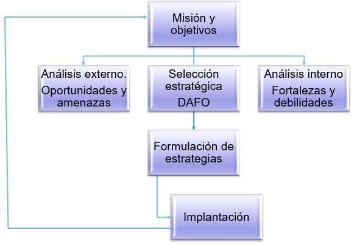
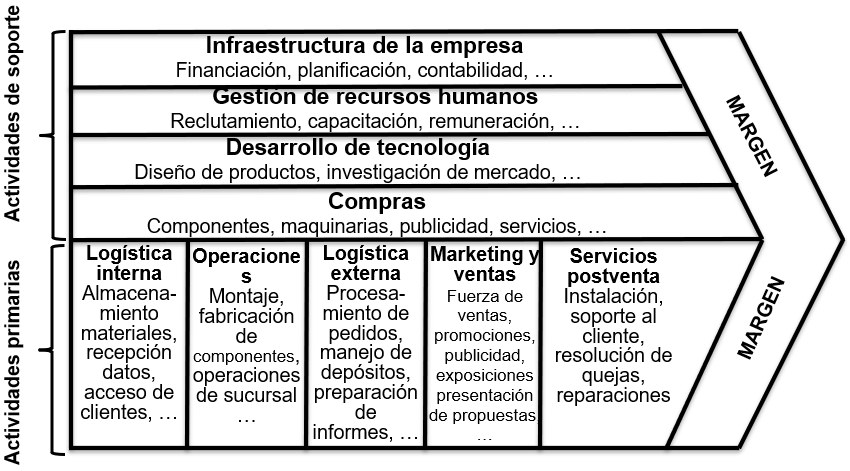
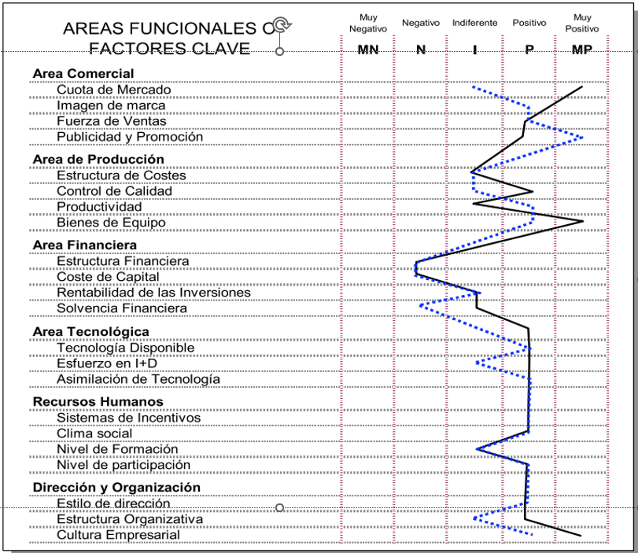
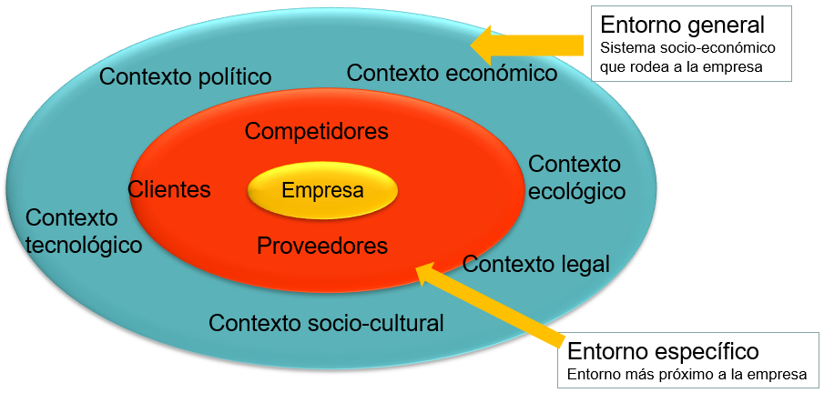
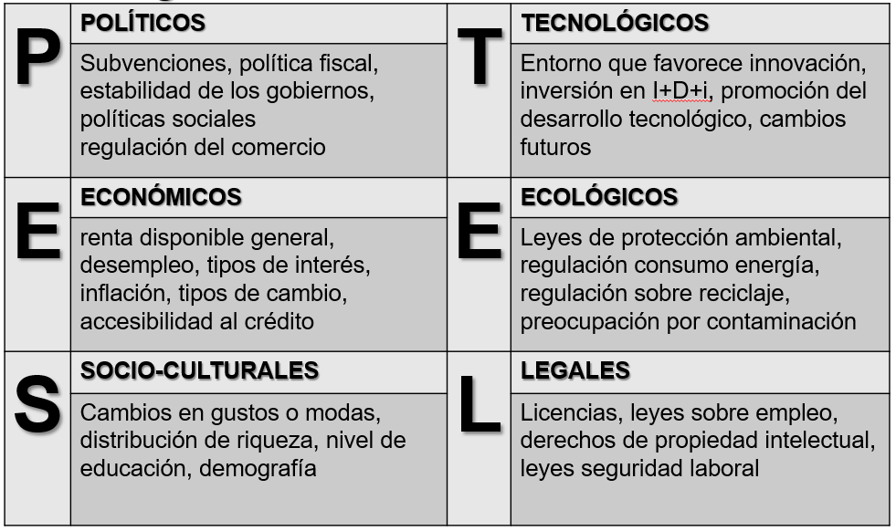
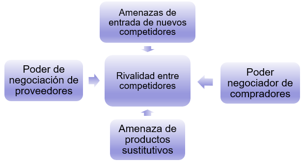
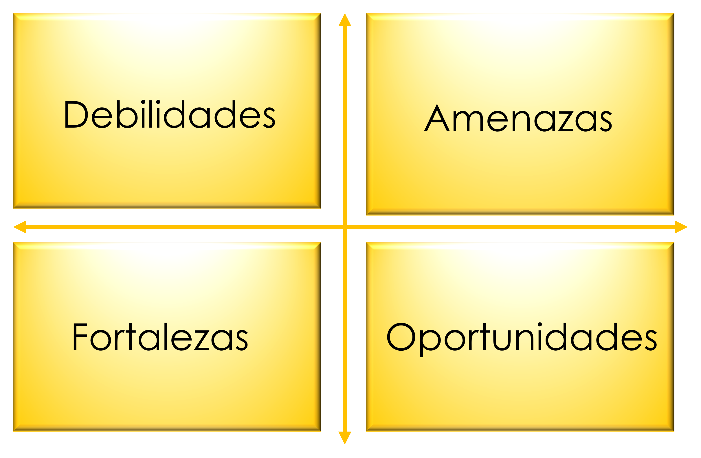
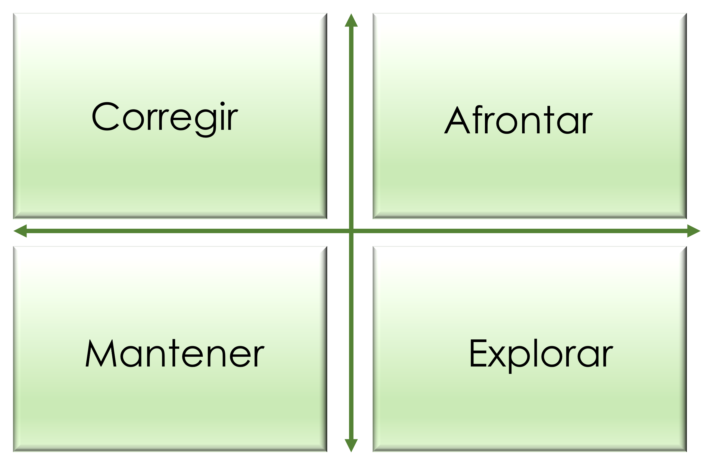

# Análisis interno y externo de la empresa {#chap7}

Los dos siguientes capítulos versarán sobre estrategia empresarial, que es una disciplina que se ha ido desarrollando desde mediados del siglo XX. Se puede decir que hay un enfoque tradicional, en el que se da una planificación racional con un análisis sistemático de las posibilidades de desarrollo así como del entorno con el fin de conseguir los objetivos. Pero es evidente que este enfoque tradicional choca de frente con muchas experiencias empresariales exitosas que han carecido de tal sistematización en el análisis. Esto hace mucho más fascinante el tema de la estrategia empresarial, puesto que es una mezcla de análisis de la realidad, talento personal y oportunidad en la toma de decisiones.

El entorno cambiante en el que se desarrollan las empresas, cada vez a mayor velocidad, obliga a las mismas a tratar de dar respuestas a qué factores son los determinantes para desempeñar con eficacia y eficiencia sus funciones, o simplemente sobrevivir. 

La definición clásica del concepto de **estrategia** se debe a Andrews (1965), que lo definió como el patrón de los principales objetivos, propósitos o metas y las políticas y planes esenciales para lograrlos, establecidos de tal manera que definan en qué clase de negocio la empresa está o quiere estar y qué clase de empresa es o quiere ser. La estrategia comprende todo un conjunto de actividades a largo plazo.

Es evidente que un aspecto fundamental de la estrategia es la relación de la empresa con su entorno, de forma que aquella es determinada por este, pero que a la vez la empresa también determina al propio entorno. En este esfuerzo nada sencillo por sobrevivir o imponerse al ambiente reinante la empresa acaba mejorando en muchos aspectos, por ejemplo, siendo más competitiva, hecho que se suele reflejar en una mayor rentabilidad.

El esquema general de la planificación estratégica se puede resumir según el esquema de la @fig-fig71. En primer lugar habrá que concretar la misión, visión y objetivos de la empresa. Se continuará con un análisis interno y externo pormenorizado que se concretará en la matriz de debilidades, amenazas, fortalezas y oportunidades (DAFO), que dará una visión general de las posibilidades que tiene un negocio de prosperar. Pasada positivamente esta fase se formularán estrategias para conseguir los objetivos. Finalmente se concretará todo en un plan y calendario de implantación

```{r fig-fig71, fig.cap="Esquema de planificación estratégica.", echo=FALSE, fig.align='center', out.width="60%"}

```

El presente capítulo se dedicará a las primeras fases del análisis estratégico, dejando para el siguiente los tipos de estrategias concretos, así como su implantación.

## Misión y visión

El primer paso en análisis estratégico es la definición de la **misión** y la **visión**. La misión define la identidad, la razón de ser por la que se justifica la existencia de la empresa desde un punto de vista muy general. Puesto que es la propia identidad de la empresa, es conveniente que sea conocida por todos los grupos de interés que participan en la misma (*stakeholders*). La misión, a pesar de ser muy general, debe ser específica de cada empresa puesto que sirve para definirla individualmente y distinguirla de las demás, incluso las del mismo sector de actividad.

En general, la misión se suele definir delimitando el campo de actividad de la empresa, identificando las capacidades esenciales que la hacen singular y especificando los valores, creencias y filosofía en los que se basa la cultura de la empresa. No es fácil definir la misión, puesto que se deben evitar tanto misiones muy amplias que de hecho no definen la especificidad de la empresa, como misiones muy estrechas que puedan comprometer el futuro desarrollo de la misma.

Por si fuera poco la misión tiene además que acomodarse a los intereses de los grupos de interés de la empresa, que a menudo pueden tener objetivos diferentes e incluso conflictos entre ellos. Ejemplos típicos de conflictos son  para los accionistas el crecimiento a largo plazo de la empresa produce rentabilidades pequeñas a corto, los accionistas pueden desear reducciones de costes que lleve a la expulsión de trabajadores, etc.

::: callout-tip
## Misión de Google

*"Organizar la información del mundo para que resulte universalmente accesible y útil"*. 
:::

::: panel-tabset
## Resuelve {-}

Busca la misión de Amazon.

## Solución {-}

Busca la misión de Amazon.

*“Nos esforzamos por ofrecer a nuestros clientes los precios más bajos posibles, la mejor selección disponible y la mayor comodidad”*.
:::

<!-- Ejemplos de misión: -->
<!-- La misión de la Unidad de Negocios de Alta Velocidad (AVE) de RENFE es proporcionar un servicio integral de transporte, que satisfaga las necesidades y expectativas de los clientes y del conjunto de personas que trabajan en Alta Velocidad para alcanzar la rentabilidad, el liderazgo en el mercado y la estima social. -->
<!-- Misión de Iberdrola: Queremos ser la Compañía Energética Global preferida por nuestro compromiso con la creación de valor, la calidad de vida, la seguridad de las personas y del suministro, el cuidado del medio ambiente y la orientación al cliente. -->

Muchos autores consideran conveniente acompañar la exposición de la misión con la visión, que viene a responder a las preguntas de ¿cómo seremos, cómo deberíamos ser y qué queremos ser en el futuro? La visión es una declaración formal de lo que la empresa trata de lograr, evitando un enunciado grandilocuente que dé la impresión de ser algo ilusorio e inalcanzable. La visión tiene el mismo propósito que la misión, pero centrada en el futuro. Para que sea efectiva tiene que incorporar la idea de triunfo, tiene que ser estable en el tiempo y ha de merecer el esfuerzo y el compromiso del personal.

A menudo es corriente que se enuncien otros objetivos estratégicos en la exposición de la misión respondiendo a la pregunta de cómo llegar a lo que queremos ser. Si no se quiere caer en la indefinición, estos deben ser medibles, específicos, realistas, desafiantes y fijos en el tiempo.

::: callout-tip
## Visión de Google

*“Ser el más prestigioso motor de búsqueda y el más importante del mundo, además de ser un servicio gratuito, fácil de utilizar que presente resultados relevantes en una fracción de segundo”*. [Aquí](https://economipedia.com/definiciones/mision-y-vision-de-google.html){target="_blank"} puedes consultar más sobre la misión y visión de Google.
:::

::: panel-tabset
## Resuelve {-}

Busca la visión de Amazon.

## Solución {-}

Busca la visión de Amazon.

*“Ser la compañía más centrada en el cliente del mundo, donde nuestros clientes pueden encontrar y descubrir cualquier cosa que deseen comprar en línea”*. [Aquí](https://economipedia.com/definiciones/mision-y-vision-de-amazon.html.){target="_blank"} puedes buscar más información sobre la misión y visión de Amazon.
:::

::: callout-tip
## Más misiones y visiones

[En este enlace](https://economipedia.com/?s=visi%C3%B3n+y+misi%C3%B3n){target="_blank"} puedes encontrar más misiones y visiones interesantes.
:::

<!-- Ejemplo de visión: -->
<!-- La visión de Jazztel es “Jazztel será el operador alternativo líder del mercado de telecomunicaciones”. Las metas principales son a) alcanzar el 6% del mercado de telecomunicaciones fijas en España, b) conseguir unas ventas superiores a 1.000 millones de euros, c) lograr un resultado neto por encima de los 50 millones de euros. -->

<!-- Naturalmente uno de los objetivos ineludibles es la maximización de la ganancia del accionista. Pero, ¿debe ser este el único objetivo? Problemas: -->
<!-- Corto plazo (p.ej. no habría I+D) -->
<!-- Filosofía corporativa -->
<!-- Estrategia y ética -->
<!-- Responsabilidad Social en la empresa -->

## Análisis interno

El análisis interno pretende evaluar de forma realista las fortalezas y debilidades de la organización en relación con sus competidores para desarrollar su actividad de forma competitiva. Para ello existen diversas herramientas complementarias, entre las que destacan la **cadena de valor**, el **benchmarking**, el **perfil estratégico** y la **matriz crecimiento-cuota de mercado**, el **análisis de recursos y capacidades**, el análisis de brechas (**GAP**), análisis **VRIO** (valor, rareza, imitabilidad, organización), evaluación de la capacidad organizacional (**OCAT**), etc.

### Cadena de valor

Una de las herramientas más populares es la cadena de valor propuesta por Michael Porter (no confundir con *cadena de suministro*), que considera a la empresa como un proceso secuencial de actividades para crear valor. El valor se puede medir de forma empírica como la cantidad que están dispuestos a pagar los clientes por el producto o servicio. Las actividades están destinadas a satisfacer las necesidades de los clientes y son de dos tipos. Las primarias son aquellas relacionadas directamente con la producción y son la logística interna y externa, producción, marketing y ventas y servicios del producto (ver @fig-figFlecha). Las actividades de apoyo o soporte sustentan las actividades primarias y son las compras, el desarrollo de tecnología, la gestión de recursos humanos y la gestión de las infraestructuras.

```{r fig-figFlecha, fig.cap="Cadena de valor. Fuente: Porter, M.E. (1985), Competitive advantage :Creating and sustaining superior performance. Free Press, New York.", echo=FALSE, fig.align='center', out.width="80%"}

```

Cada actividad de la cadena de valor se puede dividir en categorías y subcategorías tanto cuanto se considere oportuno hasta llegar a actividades elementales adecuadas para el análisis de la situación concreta de cada empresa.

Sobre la cadena de valor cabe hacer dos puntualizaciones:

- Además de la cadena de valor, la empresa tiene que tener en cuenta que esta forma parte de un sistema de valor más amplio en el que es fundamental la relación con clientes y proveedores. Por ello es aconsejable analizar la cadena completa, incluyendo las cadenas de proveedores y clientes.
- Como es evidente todas las actividades están relacionadas entre sí, esto hace que la ventaja competitiva dependa no solo de lo eficientemente que se desempeñen todas las actividades descritas de la cadena de valor de modo individual, sino también de las relaciones entre ellas. Estas relaciones pueden ser fuentes de nuevas ventajas competitivas o de pérdidas de competitividad.

::: callout-tip
## Cadena de valor de Starbucks

[En este enlace](https://www.beetrack.com/es/blog/cadena-de-valor-starbucks){target="_blank"} puedes encontrar un análisis de la cadena de valor de Starbucks.
:::

### Perfil estratégico

El perfil estratégico de la empresa es otra herramienta útil para detectar las fortalezas y debilidades de la empresa frente a la competencia. Se trata de elaborar una lista de variables para las áreas funcionales de la empresa, darles una valoración lo más objetivamente posible a la empresa y la competencia (normalmente en una escala Likert con cinco posibilidades) e interpretar el perfil. Normalmente se representa con una línea continua y la competencia con línea discontinua, como en la @fig-figEstra.

```{r fig-figEstra, fig.cap="Perfil estratégico de la empresa.", echo=FALSE, fig.align='center', out.width="70%"}

```

<!-- **Benchmarking** -->

<!-- El benchmarking ("referencia" en inglés) pretende un análisis de las mejores prácticas llevadas a cabo por empresas competidoras. Tuvo su origen  -->

<!-- …  -->


<!-- Benchmarking: -->

<!-- ```{r tab70, echo=FALSE} -->
<!-- tab70 = rbind(c("Organización de la fabricación", "Fuji"), -->
<!--                 c("Gestión de la calidad", "Toyota"), -->
<!--                 c("Facturación e ingresos", "American express"), -->
<!--                 c("I+D del producto", "ATT"), -->
<!--                 c("Marketing", "Procter and Gamble"), -->
<!--                 c("Aplicación de la estrategia", "Texas Instruments"), -->
<!--                 c("Sistema informático", "John Deere"),  -->
<!--                 c("Plano de fábricas", "Ford")) -->
<!-- colnames(tab70) = c("áreas de actividad (Xerox)", "Empresas") -->
<!-- knitr::kable( -->
<!--   head(tab70, nrow(tab70)), -->
<!--   booktabs = TRUE, -->
<!--   align = "cc", -->
<!--   caption = 'Benchmarking.' -->
<!-- ) -->
<!-- ``` -->

<!-- Matriz crecimiento-couta de mercado -->

<!-- ```{r figBCG, fig.cap="Matriz crecimiento-cuota de mercado.", echo=FALSE, fig.align='center', out.width="60%"} -->
<!-- knitr::include_graphics("figBCG.png") -->
<!-- ``` -->

## Análisis externo

Es evidente que el éxito de la empresa depende de las debilidades y fortalezas propias, pero también va a depender del ambiente exterior en el que se desenvuelve. La misma empresa en un ambiente adverso producirá resultados inferiores sin ninguna duda. Por tanto, el análisis externo también es de gran importancia. En la @fig-fig719 se muestra la distinción entre el **entorno general**, que es todo aquello que afecta a la empresa de forma global y el **entorno específico** que tienen que ver con el sector industrial en el que desarrolla su actividad y las fuerzas competitivas a las que está sometida.

```{r fig-fig719, fig.cap="Esquema de ambiente externo.", echo=FALSE, fig.align='center', out.width="70%"}

```

### Entorno general

Para el entorno general se suele utilizar el **análisis PESTEL**, que es un acrónimo para el contexto político, económico, socio-cultural, tecnológico, ecológico y legal. En la @fig-fig720 se muestran ejemplos de aspectos a estudiar dentro de cada apartado.

```{r fig-fig720, fig.cap="Esquema de ambiente externo.", echo=FALSE, fig.align='center', out.width="70%"}

```

Dado un caso concreto, se puede realizar un perfil estratégico similar al del análisis interno de la @fig-figEstra en el que se puntúa una lista de ítems dentro de cada uno de los contextos.

::: callout-tip
## Ejemplos

En [este enlace](https://blog.hubspot.es/marketing/crear-analisis-pestel#:~:text=Ejemplos%20de%20factores%20tecnol%C3%B3gicos%20de,la%20nube%2C%20CRM%20o%20ERP.){target="_blank"} puedes encontrar ejemplos de análisis PESTEL.
:::
<!-- Aquí hay más información sobre análisis PESTEL: https://www.iebschool.com/blog/que-es-analisis-pestel-digital-business/ -->

### Entorno específico

El análisis del entorno específico pretende determinar las amenazas y oportunidades a las que está sometida una empresa concreta. Aquí juegan un papel determinante las empresas competidoras que ofrecen bienes o servicios sustitutivos perfectos o imperfectos. Por ello es de suma importancia delimitar y analizar de la competencia mediante una sencilla tabla como se muestra en la @tbl-tab71. Es evidente que esta tabla va a mostrar rápidamente el contexto económico en el que se desenvuelve la empresa.

```{r tbl-tab71, echo=FALSE}
#| tbl-cap: Análisis de la competencia.

table71 = matrix(" ", 4, 5)
colnames(table71) = c("Ingresos", "Cuota de mercado", "ROA", "Inversión en I+D+i", "Grupo empresarial")
rownames(table71) = c("**Mi empresa:**", "**Competidor 1:**", "**Competidor 2:**", "...")
knitr::kable(
  head(table71, nrow(table71)),
  booktabs = TRUE,
  align = "cc",
)
```

Otra herramienta muy utilizada es el **modelo de las cinco fuerzas de Porter**, representada esquemáticamente en la @fig-figPorter.

```{r fig-figPorter, fig.cap="Esquema de las cinco fuerzas de Porter.", echo=FALSE, fig.align='center', out.width="60%"}

```

Las cinco fuerzas son:

- **Rivalidad entre competidores**. Esta rivalidad será mayor cuando, en principio, más empresas hay en el sector, aunque la competencia puede ser feroz también en caso de oligopolios; cuando el ritmo de crecimiento de toda la industria es lento; cuando hay barreras de salida (activos especializados, costes fijos de salida, relaciones estratégicas, restricciones legales, etc.); cuando el producto se puede diferenciar muy poco; etc.
- **Amenazas de entrada de nuevos competidores**. Esta amenaza será mayor cuanto más fácil sea poner en marcha estrategias para echar a los nuevos competidores y cuanto mayores sean las barreras de entrada en el sector (inversiones grandes necesarias para establecerse, legales, propiedad industrial o intelectual, empresas con ventaja competitiva ya consolidada, canales exclusivos de distribución, economías de escala, curva de aprendizaje muy empinada, etc.).
- **Poder negociador de compradores**. Este poder es menor cuando hay muchos compradores con porción pequeña del mercado; los compradores tienen pocas opciones (productos diferenciados, costes elevados de cambio de proveedor, los compradores no se pueden integrar hacia atrás, etc.); cuando los compradores están segmentados (información sobre el precio dispersa, discriminación de precios, etc.), etc.
- **Amenazas de productos sustitutivos**. Menor cuando menor es la elasticidad cruzada de la demanda; los costes de cambio de producto son bajos; etc.
- **Poder negociador de proveedores**. Menor cuando vendedores no concentrados; muchas alternativas posibles (muchos sustitutos, costes bajos de cambio de proveedor, proveedor no se puede integrar hacia adelante); vendedores no pueden diferenciar por segmentos (información de precios disponible y barata, no es posible discriminación de precios, etc.), etc.

Este modelo ha recibido una serie de críticas, puesto que da una visión estática del sector industrial y no tiene en cuenta la velocidad de los cambios, no tiene en cuenta los bienes complementarios, no tiene en cuenta otros agentes aparte de proveedores y clientes, no todas las fuerzas tienen la misma importancia, y explica la rentabilidad solo en función de las cinco fuerzas y estas serán las mismas para todas las empresas del sector, cuando en realidad la rentabilidad tiene otros factores diferenciadores.

::: callout-tip
## Ejemplos

En [este enlace](https://www.thepowermba.com/es/blog/las-5-fuerzas-de-porter){target="_blank"} puedes encontrar ejemplos famosos de aplicación de las cinco fuerzas de Porter.
:::
<!-- Ejemplos: -->
<!-- Las compañías cafeteras compiten indirectamente con las de té y bebidas refrescantes. Transporte aéreo y AVE Madrid-Barcelona. Agencias de viajes frente reserva on-line. -->

<!-- pilotos de aviones como proveedores de mano de obra. -->

<!-- Empresas clientes como Ford, General Motors han utilizado la amenaza de fabricar las partes por sí mismos en vez de comprarlas. En la industria alimentaria grandes empresas han reducido la dependencia de fabricantes de envases metálicos al fabricarlos ellos mismos. -->

<!-- La apuesta de Iberdrola por Brasil tiene fundamento. Según las previsiones del grupo, la demanda eléctrica en América Latina registrará un aumento entre 2008 y 2035 del 65% frente al 15% de EEUU y el 17% de Europa, mercados ya maduros -->

## Análisis DAFO-CAME

La matriz DAFO (debilidades, amenazas, fortalezas y oportunidades, ver @fig-figDAFO) proporciona una síntesis del análisis interno que analizaba las fortalezas y debilidades y del externo encargado de determinar las amenazas y oportunidades en una única herramienta que nos permite de un vistazo evaluar la situación estratégica de la empresa. 

```{r fig-figDAFO, fig.cap="Matriz DAFO.", echo=FALSE, fig.align='center', out.width="40%"}

```

El análisis CAME es una metodología que se basa en los datos obtenidos del análisis DAFO para llevar a cabo un plan estratégico. El nombre CAME es un acrónimo de las acciones aplicables: corregir, adaptar, mantener y explotar.

El análisis CAME también puede expresarse gráficamente con la ayuda de una matriz $2\times2$ (ver @fig-figCAME), con los cuadrantes que se corresponden a un tipo de estrategia y están condicionadas por los datos recogidos en el análisis DAFO.

```{r fig-figCAME, fig.cap="Matriz CAME.", echo=FALSE, fig.align='center', out.width="40%"}

```

Acciones en el análisis CAME:

  - Corregir: aborda las debilidades internas. Se implementan planes de acción para reforzar estructuras y estrategias internas.
  - Afrontar: enfrenta las amenazas externas. Se estudian los peligros y se aplican medidas para evitar que una amenaza se convierta en una debilidad.
  - Mantener: protege las fortalezas internas. Se busca mantener una posición privilegiada en el mercado.
  - Explorar: aprovecha las oportunidades externas. Diseña estrategias para aprovechar al máximo las oportunidades.

Las estrategias que se derivan del análisis CAME son las siguientes:

  - **Estrategia ofensiva**: combina las **fortalezas** y **oportunidades** de la empresa o negocio. Es recomendable para aquellas empresas que tienen un elemento diferenciador muy competitivo y enfrentan poca competencia en el mercado.
  - **Estrategia defensiva**: se basa en mantener las **fortalezas** y enfrentar las **amenazas** de la empresa o negocio para mantener su posición de liderazgo.
  - **Estrategia de reorientación**: relevante para combatir situaciones de debilidad de la empresa. Si aún es posible evitar un fracaso, esta estrategia se enfoca en explorar **oportunidades** de negocio que ayuden a corregir las **debilidades** de la empresa.
  - **Estrategia de supervivencia**: apropiada para empresas en sectores cada vez más debilitados y que necesitan mantenerse a flote. Aquí es necesario buscar soluciones que corrijan las **debilidades** de la empresa mientras se enfrentan las **amenazas** externas.


<!-- La matriz DAFO en sí solo proporciona un listado de factores internos y externos que afectan a la posición competitiva de la empresa, pero su utilidad está en que nos sirve para comenzar a plantear opciones estratégicas que aprovechen las fortalezas y las oportunidades, a la vez que protejan de las amenazas y tratar corrijan las debilidades. De la combinación de los factores internos con los externos se puede obtener una matriz como la de la @tbl-tab72, en la que se pueden ver distintos tipos de estrategias. -->

<!-- ```{r tbl-tab72, echo=FALSE} -->
<!-- #| tbl-cap: Opciones estratégicas. -->

<!-- table72 = rbind(c("OFENSIVAS", "REORIENTACIÓN"), -->
<!--                 c("DEFENSIVAS", "SUPERVIVENCIA")) -->
<!-- colnames(table72) = c("Fortalezas", "Debilidades") -->
<!-- rownames(table72) = c("**Oportunidades**", "**Amenazas**") -->
<!-- knitr::kable( -->
<!--   head(table72, nrow(table72)), -->
<!--   booktabs = TRUE, -->
<!--   align = "cc", -->
<!-- ) -->
<!-- ``` -->

<!-- Así, las estrategias ofensivas surgirán para utilizar las fortalezas para aprovechar las oportunidades. Serán necesarias estrategias de reorientación para aprovechar las oportunidades pero superando las debilidades. Las estrategias defensivas serán necesarias para resistir las amenazas aprovechando las fortalezas. Finalmente, las estrategias de supervivencia son el único remedio para intentar reducir las debilidades internas y evitar las amenazas al mismo tiempo. -->

::: callout-tip
## Análisis DAFO de Amazon y otros

En [este enlace](https://modelo-canvas.com/analisis-foda-amazon/){target="_blank"} puedes consultar un análisis DAFO de Amazon, y en [este otro](https://coggle.it/diagram/YzLfmUCwZkiU3Um8/t/caso-amazon){target="_blank"} tienes un análisis combinado DAFO-CAME. [Aquí](https://blog.hubspot.es/sales/como-hacer-analisis-dafo){target="_blank"} tienes otros ejemplos.
:::

<!-- DAFO Amazon: -->

<!-- # ```{r figAmazon, fig.cap="Matriz DAFO de Amazon.", echo=FALSE, fig.align='center', out.width="60%"} -->
<!-- # knitr::include_graphics("figAmazon") -->
<!-- ``` -->

## **Referencias** {-}

Andrews, K. A. (1965). Business Policy: Text and Cases. Homewood: Irwin.

Coggle (2024). Diagrama DAFO-CAME de Amazon. Recuperado el 20 de mayo de 2024. [Enlace](https://www.coggle.it/diagram/YzLfmUCwZkiU3Um8/t/caso-amazon){target="_blank"}.

Dispatchtrack (2023). Cadena de valor de Starbucks. Recuperado el 18 de mayo de 2023. [Enlace](https://www.beetrack.com/es/blog/cadena-de-valor-starbucks){target="_blank"}.

Economipedia (2023). Resultados de visión y misión. Recuperado el 18 de mayo de 2023. [Enlace](https://economipedia.com/?s=visi%C3%B3n+y+misi%C3%B3n){target="_blank"}.

Guerras Martín, L.A.  y Navas, J.E. (2022), La dirección estratégica de la empresa. Teoría y aplicaciones, 6ª edición, Thomson Reuters.

Hubspot (2023). Análisis PESTEL: qué es, cómo se hace y ejemplos útiles. Recuperado el 18 de mayo de 2023. [Enlace](https://blog.hubspot.es/marketing/crear-analisis-pestel#:~:text=Ejemplos%20de%20factores%20tecnol%C3%B3gicos%20de,la%20nube%2C%20CRM%20o%20ERP.){target="_blank"}.

Hubspot (2023). ¿Cómo se hace un análisis DAFO? Recuperado el 18 de mayo de 2023. [Enlace](https://blog.hubspot.es/sales/como-hacer-analisis-dafo){target="_blank"}.

Modelo Canvas (2023). Análisis DAFO de Amazon. Recuperado el 18 de mayo de 2023. [Enlace](https://modelo-canvas.com/analisis-foda-amazon/){target="_blank"}.

Porter, M. (1982). Estrategia competitiva. México: C.E.C.S.A.

Porter, M.E. (1985), Competitive advantage: Creating and sustaining superior performance. Free Press, New York.

The Power Business School (2023). 5 fuerzas de Porter: análisis de las fuerzas competitivas de una empresa. [Enlace](https://www.thepowermba.com/es/blog/las-5-fuerzas-de-porter){target="_blank"}.

Trapero, J.R., García, F.P., Pedregal, D.J. (2013), Dirección y Gestión Empresarial. Mcgraw-Hill. [Enlace](https://www.mheducation.es/direccion-y-gestion-empresarial-9788448190385-spain){target="_blank"}.

