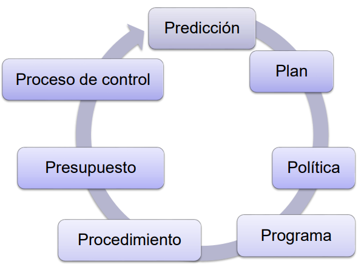
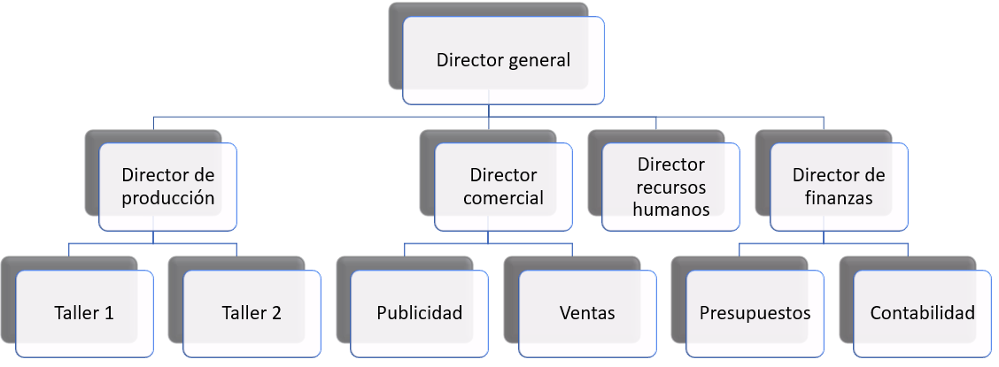
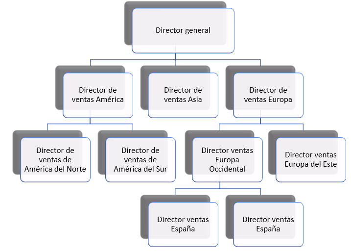
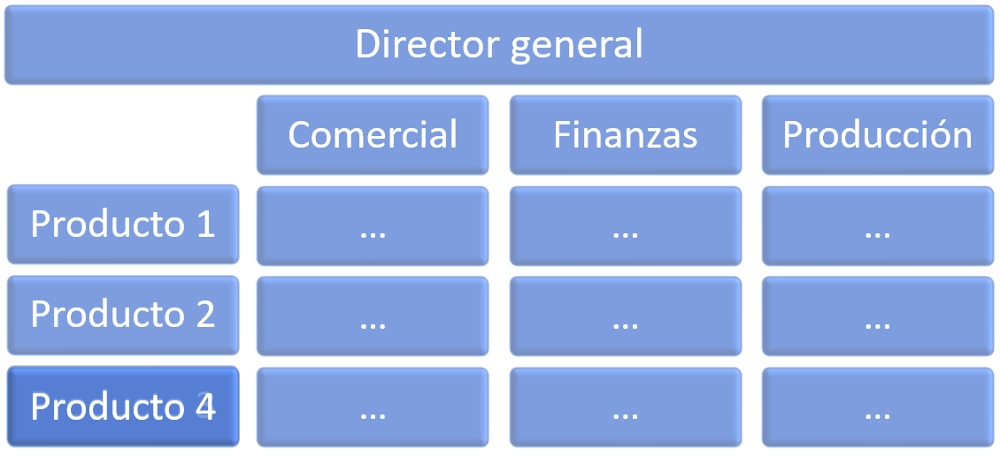

# Planificación, organización, ejecución y control {#chap9}

La dirección de la empresa es un subsistema de suma importancia, puesto que es del que dependen los demás. El resultado final en gran medida será responsabilidad del mismo, puesto que los problemas que surjan en el transcurso de la actividad de la empresa, incluso los que no se deben directamente a la dirección, deben ser corregidos adecuadamente por esta en un tiempo que permita desviarse lo mínimo de los objetivos trazados.

Según la definición clásica, directivo es quien realiza tareas por medio de otras personas. Se puede planificar, orientar, controlar, contratar, delegar, asignar, organizar, motivar, exigir disciplina o hacer a diario cualquier otra cosa que hacen los directivos, pero independientemente de la actividad realizada, se estará trabajando con el propósito final de alcanzar un objetivo.

Hay algunos autores que desglosan la labor de dirección en las "7 Ps del *management*", representadas en la @fig-fig90. 

```{r fig-fig90, fig.cap="Las siete P's de la gestión.", echo=FALSE, fig.align='center', out.width="50%"}

```

- **Predicción**: proyección o explotación de datos o de información actual para estimar el valor futuro más probable de una magnitud económica o el estado del sistema. También se conoce como pronóstico.
- **Planificación**: estudio y fijación de objetivos y metas, tanto referentes al sistema total como a cada subsistema, aspecto, función y unidad organizativa, incluyendo los cursos de acción que los desarrollan a largo (estratégica) y a corto plazo (táctica). 
- **Política**: respuesta concreta o guía para pensar y decidir respecto de una situación dada o a un problema específico, de forma que permita obtener la solución prevista.
- **Programación**: análisis operativo a corto y medio plazo para llevar a cabo una adecuada asignación de recursos y la aplicación de los consiguientes sistemas de solución de los objetivos planificados
- **Procedimiento**: conjunto de normas, instrucciones y recomendaciones obligatorias que sirven de guía para la acción o para llevar a cabo las actividades que logran los objetivos.
- **Presupuesto**: cuantificación financiera y adaptación temporal de los planes y programas elaborados, de forma que permita una adecuada asignación de responsabilidades a las unidades de actuación y facilite el control de los objetivos.
- **Control**: proceso de observación y medida a través de la comparación sistemática de los objetivos previstos con los resultados obtenidos. También es la capacidad de dominio o de regulación del sistema para alcanzar dichos objetivos.

Otra forma, en el fondo similar, de abordar el tema es considerar cuatro funciones de la dirección, que son las que aparecen en el título del capítulo: 

- **Planificación**: ya se ha definido anteriormente. Es un aspecto que ya se ha tratado en los capítulos anteriores sobre dirección estratégica.
- **Organización**: consiste en diseñar estructura interna de la empresa y la relación entre sus partes. Se concreta en organigramas que pueden ser de mucho tipos, pero que suelen tener estructura jerárquica.
- **Ejecución**: llevar a cabo el plan establecido y alcanzar los objetivos planeados. Es posiblemente una de las tareas más complicadas, y exige grandes dosis de cualidades de muchos tipos en los gerentes. Un buen directivo debe ser capaz de gobernar la armonía, liberar talento humano, mirar a la realidad con objetividad, tener una mente abierta y dejarse interrogar por la realidad, tener un carácter sobrio que se crece con la adversidad, tener una buena dosis de fuerza de voluntad, balancear razón y corazón, etc.
- **Control**: comprobar que se cumple la planificación, mediante la medida de los resultados y comparación con los esperados.

Este último será el esquema que vamos a seguir en este capítulo, teniendo en cuenta que la planificación ya ha sido tratada en capítulos anteriores.

## Organización

Es evidente que los objetivos y metas propuestos por la planificación no se van a conseguir si no hay un orden en todos los elementos de la empresa. La organización consiste en dividir el trabajo para poder coordinar las distintas tareas dentro de una estructura. Es necesario fraccionar el trabajo para coordinarlas.

Podemos distinguir entre estructura formal e informal. La formal es la explícita que intencionadamente se refleja en un organigrama, como veremos en el resto de esta sección. Por el contrario, la informa surge espontáneamente por la interacciones entre individuos o grupos que no se han planificado pero que son inevitables, para bien o para mal. Es evidente que la existencia de buenas relaciones y compenetración entre todos los trabajadores y con los directivos es fundamental para conseguir los objetivos de la empresa, además de incrementar el compromiso individual y colectivo con la misma.

La estructura organizativa formal puede de ser de muchos tipos, suele ser jerárquica, aunque más recientemente se están utilizando otros tipos de estructuras más flexibles (como en forma de trébol, federal, en red, etc.). Algunos tipos se describen brevemente a continuación.

### Estructura funcional {-}

La estructura se realiza agrupando actividades afines dando lugar a los departamentos típicos, como finanzas, personal, marketing, etc. Resulta muy apropiada para pequeñas y medianas empresas con un solo producto o servicio. ES la más habitual entre las empresas reales. 

```{r fig-fig91, fig.cap="Ejemplo de estructura funcional.", echo=FALSE, fig.align='center', out.width="100%"}

```

### Estructura por resultados {-}

Se establece en función de productos, procesos, mercados, áreas geográficas, o cualquier otro criterio que pueda tener sentido en cada caso concreto. En la @fig-fig92 se muestra un ejemplo por áreas geográficas, se deja al lector imaginar los otros casos.

```{r fig-fig92, fig.cap="Ejemplo de estructura por áreas geográficas.", echo=FALSE, fig.align='center', out.width="80%"}

```

### Estructura matricial {-}

Es una combinación de los dos anteriores (función y resultados) con el fin de superar las dificultades que presentan cada uno por separado cuando se aplican a grandes empresas. Se puede mirar a la estructura por filas (resultados) o columnas (funciones). La @fig-fig93 muestra un ejemplo.

```{r fig-fig93, fig.cap="Ejemplo de estructura matricial.", echo=FALSE, fig.align='center', out.width="60%"}

```

## Ejecución

Uno de los retos más importantes de los directivos es la ejecución de todo aquello que se ha planeado y que tiene que realizarse a través de una estructura determinada. Se trata de llevar en el día a día la empresa hacia el fin para el que se creó, y esta es puede llegar a ser una labor muy exigente, para la que solo algunas personas están dotadas.

Es evidente que una de las cualidades del directivo es tener capacidad de liderazgo, es decir, que los subordinados asuman de forma natural que su superior tienen efectivamente capacidad de llevar a la empresa hacia sus fines y que además es capaz de hacerlo de una forma armónica con todos los equipos que dirige. Se ha distinguido normalmente tres estilos de liderazgo:

- **Autoritario**: las decisiones se toman sin tener en cuenta la opinión de sus subordinados, esperando que estos acaten su mando.
- **Democrático**: se pide la opinión de los subordinados con el fin de hacerles participar en las decisiones.
- ***Laissez faire*** (dejar hacer): se dan muy pocas indicaciones a los subordinados, dejando que sean ellos los que toman de hecho las decisiones.

No es evidente que haya un estilo de liderazgo que vaya a ser superior a todos los demás, puesto que en gran medida dependerá de circunstancias materiales concretas y la personalidad y motivación tanto del líder y de los subordinados. 

Es unánime la creencia de que las personas no solo trabajan por dinero. Las motivaciones pueden ser muy variadas y normalmente se basan en necesidades, como pone de manifiesto la pirámide de Maslow, que distingue cinco tipos de necesidades, en orden ascendente de importancia:

- **Fisiológicas**: necesidades básicas mínimas para poder desarrollar una vida con dignidad, se refieren a la alimentación, vestido, vivienda, salud, etc. Un salario suficiente cumpliría esta necesidad. Cuando estas necesidades están satisfechas satisfactoriamente se pasa a pensar en las demás.
- **Seguridad y estabilidad**: mantener lo que se posee. En el terreno empresarial se podría concretar en el mantenimiento del empleo.
- **Pertenencia y aceptación**: Pertenencia a grupos, comunidades, etc. 
- **Estima y reputación**: sentirse aceptado y respetado por los demás.
- **Autorrealización**: desarrollo continuo de capacidades, etc.

## Control

El función de control consiste en asegurar que todo discurre según el plan establecido. Por tanto, el control exige la existencia de la fase previa de planificación. Sirve, en general, para medir desviaciones respecto al plan, implementar las correcciones necesarias e incluso a fijar nuevas metas para solventar las debilidades detectadas.

El proceso de control en sí conlleva una serie de fases que son la medición, comparación con el plan, detección de desviaciones, interpretación de la información y establecimiento de medidas correctoras.

Los controles se pueden ser de muchos tipos: internos y externos (auditorías), directo e indirecto, parciales y globales, etc. Otra clasificación interesante es la que los divide en predictivo (se predicen los problemas antes de que sucedan), en tiempo real (se miden las variaciones en el momento de producirse) o históricos (se detectan después de producirse). 

De las herramientas que existen para el control destaca el **cuadro de mando integral** (CMI, *balanced scorecard* en inglés) desarrollado por Kaplan y Norton en 1992, que sirve para monitorizar en tiempo real los parámetros de la empresa para disponer de una imagen real de lo situación de la misma. La contribución de estos autores parte de reconocer que hasta el momento los sistemas de control se basaban en indicadores financieros provenientes de los balances de situación y cuentas de resultados. Pero se olvida sistemáticamente el impacto en la ventaja competitiva de las empresas de los activos intangibles, como la calidad de los clientes, las capacidades de los empleados, etc.

El CMI sugiere que veamos la organización desde cuatro perspectivas que están relacionadas entre sí:

- **Innovación/Aprendizaje**: se identifica con las acciones que debe emprender la empresa para mejorar y crecer a largo plazo.
- **Interna **: se centra en los procesos internos que producen mayor satisfacción del cliente y mayor consecución de los objetivos propios de la empresa. 
- **Del cliente**: se mide a través de indicadores que midan el grado de relación con los clientes, como la retención de clientes, satisfacción de clientes y rentabilidad de clientes
- **Financiera**: mediante indicadores que muestren dónde se puede maximizar el valor y el crecimiento.

Formalmente el CMI se basa en métricas globales o KPIs (*key performance indicator*), entre 15 y 20 suficientemente relevantes para poder dar una visión global y real de la empresa, y que además se puedan medir con cierta frecuencia, de forma que puedan dar una visión en tiempo real. Los directivos deben analizar con sumo cuidado qué indicadores incluir en el CMI para que sean realmente útiles.

## **Referencias** {-}

Trapero, J.R., García, F.P., Pedregal, D.J. (2013), Dirección y Gestión Empresarial. Mcgraw-Hill. [Enlace](https://www.mheducation.es/direccion-y-gestion-empresarial-9788448190385-spain){target="_blank"}.


