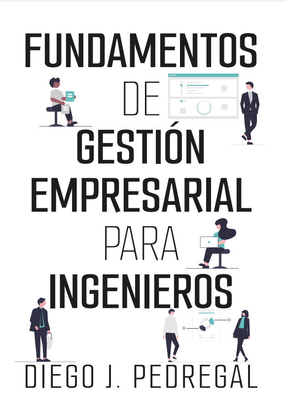

::: {.column-margin}
[{}](https://www.amazon.es/Fundamentos-gesti%C3%B3n-empresarial-para-ingenieros/dp/B0CR4G84FN/ref=sr_1_26?__mk_es_ES=%C3%85M%C3%85%C5%BD%C3%95%C3%91&crid=373O5G2IPJN4J&keywords=pedregal&qid=1704368462&sprefix=pedregal%2Caps%2C108&sr=8-26){target="_blank"}
:::

# Prólogo {.unnumbered}

<!-- ```{r, column="margin", } -->
<!--  -->
<!-- ``` -->

Este libro es la síntesis de muchos años de clases de la asignatura Gestión Empresarial en la Escuela Técnica Superior de Ingeniería Industrial de Ciudad Real (UCLM). La idea es ofrecer a los estudiantes un material unificado y condensado en un solo lugar que se corresponda exactamente con lo exigido en la asignatura, con el fin de que los estudiantes no se dispersen entre una multitud de materiales y recursos. Qué duda cabe que lo ideal a nivel universitario es la utilización de diversas fuentes, autores, lecturas, recursos en general. El problema es que el mundo actual se diluye en una dispersión endémica y en especial la juventud necesita concentrar las fuerzas en lo que realmente es importante para su futuro.

El libro en formato papel puede ser preferible para aquellos que deseen trabajar a fondo los temas y se puede adquirir [aquí](https://www.amazon.es/Fundamentos-gesti%C3%B3n-empresarial-para-ingenieros/dp/B0CR4G84FN/ref=sr_1_26?__mk_es_ES=%C3%85M%C3%85%C5%BD%C3%95%C3%91&crid=373O5G2IPJN4J&keywords=pedregal&qid=1704368462&sprefix=pedregal%2Caps%2C108&sr=8-26){target="_blank"} y se apoya también en los materiales de mi canal de YouTube ([DiegoJPT](https://www.youtube.com/@diegoJPT){target="_blank"}). No obstante, el formato electrónico lo hace atractivo para la mentalidad de la juventud actual, además de que permite un abanico de posibilidades que los libros físicos no dan y permite corregir erratas y modificar y enriquecer el contenido en tiempo real.

Naturalmente, el formato tampoco está reñido con la utilización de lecturas complementarias o todo lo que cualquier docente considere oportuno.

He intentado introducir temas de actualidad, así como ejercicios con soluciones que ilustren las explicaciones. Existen recuadros de color verde que indican puntos interesantes con lo que se está explicando y otros recuadros de color rojo que normalmente subrayan aspectos importantes que suelen ser fuentes de confusión.

El libro es un tributo a mis estudiantes, para que puedan aprovechar su tiempo joven en una formación que les seguirá el resto de sus días.

Por supuesto, estoy deseando que me lleguen todo tipo de comentarios (en cualquier sentido) sobre cómo mejorar el libro. Quien esté interesado basta sencillamente con enviar un correo.

¡Que tengáis un feliz aprendizaje!

El autor.


